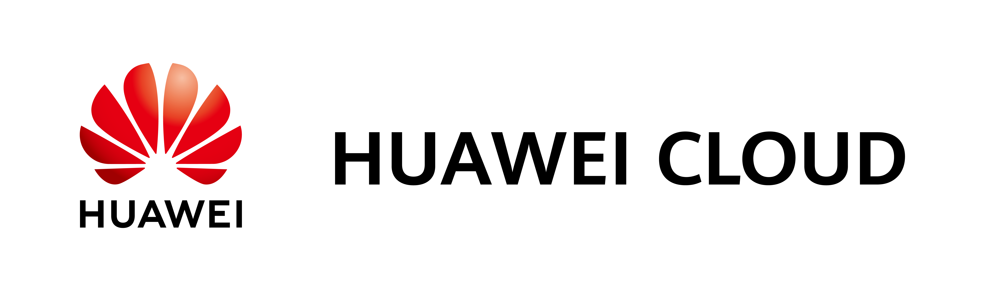
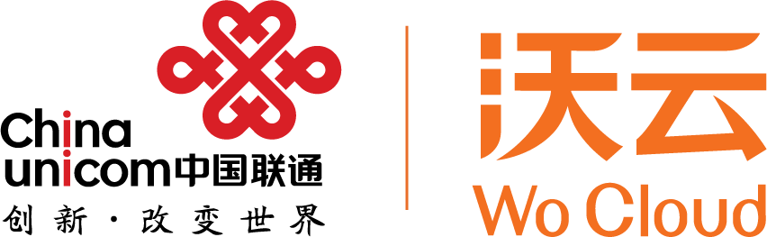
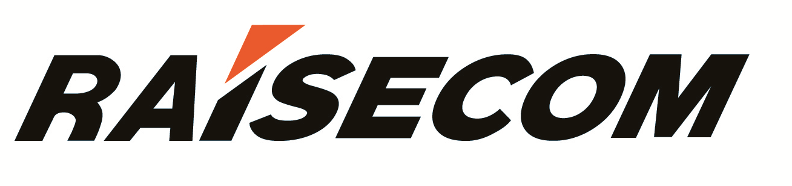
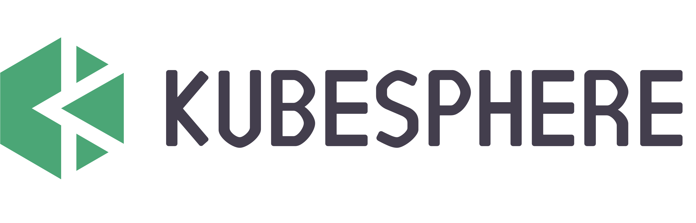

# KubeEdge Adopters

KubeEdge is used by many companies. If you are using KubeEdge in your organization, please feel free to add your company logo to the list!

 &nbsp; &nbsp;
 &nbsp; &nbsp;
 &nbsp; &nbsp;
 &nbsp; &nbsp; &nbsp;  
 &nbsp; &nbsp; &nbsp;
 &nbsp; &nbsp; &nbsp;
 &nbsp; &nbsp; &nbsp;  
&nbsp; &nbsp; &nbsp;
&nbsp; &nbsp; &nbsp;  

## Success Stories

### Raisecom Technology CO.,Ltd.

#### Challenge

It is an important demand for the manufactory of Raisecom Technology to ensure the industrial production safety. Traditional workers’ production safety was detected manually, which was slow and inefficient. The situation that workers did not obey the safety requirements still happened, and it could be ignored sometimes, which could generate great safety risks and affect the production efficiency of the factory.

#### Solution

An industrial intelligent monitoring application with AI algorithms was developed to replace the manual method. An intelligent application alone was not enough and new problems arose such as the deployment and management of the intelligent edge application and the collaboration between training on the cloud and reasoning on the edge, which could become a bottleneck for the largescale application of the solution in the industrial production environment.

China Telecom Research Institute used KubeEdge as an important part of the implementation of the intelligent monitoring solution to help Raisecom Technology to solve the problem. Architect Xiaohou Shi from China Telecom Research Institute completed the design of this solution. In this case, the safety status of factory workers was monitored by the industrial vision application in real time with the deep learning algorithm. KubeEdge was introduced as an edge computing platform for the management of the edge devices and the running environment of the intelligent monitoring application. The monitoring model could be trained on the cloud and deployed to the edge nodes for reasoning execution automatically via KubeEdge, which could improve the efficiency of the operation and reduce the cost of the maintenance.

#### Impact

In this application scenario, KubeEdge completed the unified management of edge applications. KubeEdge could also make full use of the advantages of the collaboration of the cloud and edge. With the help of KubeEdge as the edge computing platform, the monitoring on safety of the manufactory with AI was completed effectively, which reduced the occurrence of safety accidents and improved the production efficiency of the manufactory.

Based on this successful case, more deep learning algorithm will be deployed on KubeEdge to handle problems on edge computing. More cooperation about scenario-faced industrial intelligent application with KubeEdge will be carried out in the future.

### XingHai IoT

#### Challenges
Xinghai IoT is an IoT company that provides comprehensive smart building solutions by leveraging a construction IoT platform, intelligent hardware, and AI. It is a creator and practitioner of smart campus standards for China Overseas Property Management and a core full-chain service provider of smart campus solutions from Huawei.

The company serves its customers in 80 major cities in China and around the world. It has delivered 741 projects, covering more than 156 million square meters. Its business covers a diverse range of building types, such as high-end residential buildings, commercial complexes, super office buildings, government properties, and industrial parks.

In recent years, as its business expands and occupant demands for service quality grow, Xinhai IoT has been committed to using edge computing and IoT to build sustainable smart campuses, improving efficiency for campus operations and management.

#### Highlights
Xinghai IoT now offers services in a wide range of areas. Therefore, its solutions should be portable and replicable and need to ensure real-time data processing and secure data storage. KubeEdge, with services designed for cloud native development and edge-cloud synergy, has become an indispensable part of Xinghai IoT for building smart campuses.
+ Container images are built once to run anywhere, effectively reducing the deployment and O&M complexity of new campuses.
+ Edge-cloud synergy enables data to be processed at the edge, ensuring real-time performance and security and lowering network bandwidth costs.
+ KubeEdge makes adding hardware easy and supports common protocols. No secondary development is needed.

#### Benefits
Xinghai IoT built a smart campus with cloud-edge-device synergy based on KubeEdge and its own Xinghai IoT cloud platform, greatly improving the efficiency of campus management. With AI assistance, nearly 30% of the repetitive work is automated. In the future, Xinghai IoT will continue to collaborate with KubeEdge to launch KubeEdge-based smart campus solutions.

## Jingying Shuzhi Technology Co., Ltd

### Business Background
Jingying Shuzhi Technology Co., Ltd focuses on providing security monitoring and management solutions for coal mining and gas enterprises. Their solutions cover reliable, stable data collection and transmission, on-site perception, risk prediction, and intelligent supervision to help these enterprises improve production security and reduce management costs. By leveraging AIoT and cloud-edge-device synergy, Jingying Shuzhi Technology Co., Ltd has built an intelligent sensing network for safe production in high-risk industries, promoting the in-depth integration of next-generation information technologies and safe production.

### Highlights
Jingying Shuzhi Technology Co., Ltd worked with KubeEdge to develop the Mine Brain solution, which covers the cloud, edge, and devices and makes coal production safer. This solution has the following advantages:
+ KubeEdge is compatible with the Kubernetes ecosystem. It allows Kubernetes applications to be smoothly migrated to KubeEdge, greatly improving deployment efficiency.
+ AI models are trained on the cloud and model inference is performed on the edge, greatly improving resource utilization and inference speed.
+ Service instances can recover automatically and run normally even if edge nodes are disconnected from the cloud, so the system is more reliable.
+ Edge intelligence, powerful computing, and management of a massive number of edge devices makes precise audio and video recognition possible for a range of different scenarios.

With a foundation based on years of accumulated experience, Jingying Shuzhi Technology Co., Ltd has developed the ability to handle many AI scenarios and cloud-edge-device O&M, effectively ensuring reliable services and precise recognition.

### Benefits
With the Mine Brain solution, coal mining enterprises in Shanxi have achieved intelligent coal mining in more than 1,000 mines. AI analysis algorithms delivered from the cloud to mining sites provide real-time risk assessments with an identification rate of up to 98%. Centralized monitoring of IT infrastructure at remote sites has reduced the cost of O&M by 65%, and integrated full-stack IT devices have reduced deployment costs by 75%. The Mine Brain solution has helped the coal industry ensure safe production, and ultimately achieved intelligent upgrade for the entire industry.
Jingying Shuzhi Technology Co., Ltd will continue to work with KubeEdge, leveraging AI, IoT, and big data technologies to launch comprehensive intelligent edge solutions for safe production in the coal industry.
