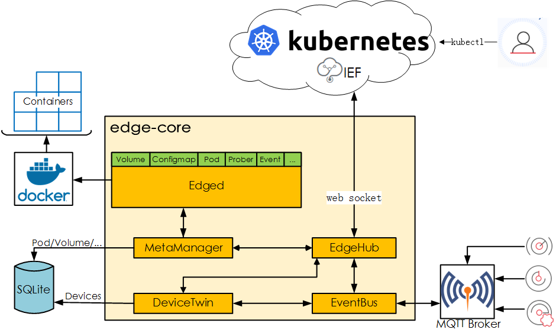

[TOC]

# Kubeedge


Kubeedge is an open source system that Extend native containerized application orchestration and device management capabilities to edge devices. It also offers **MQTT** based device monitoring, management and communication capabilities which will enable users flexibly develop applications or custom logic directly on cross-platform devices, and extend most container management capabilities from cloud side to edge side.

## Advantages

#### Edge Computing

Significantly decrease the volumes of data that must be moved, reducing transmission costs, shrinking latency between the data and the decision, improving quality of service. 

#### Simplify development

Offer container runtime based application management capability,  you can deployment application from your image and shield system difference. Same code can be run on a device or in cloud, and you can code in any language you know and use existing business logic without any change.

#### Kubernetes-native support

Kubeedge is built upon kubernetes and provides fundamental infrastructure support for network, application anagement and metadata synchronization between cloud and edge. Edge side decision, data analysis result, device status can be easily upload to cloud side for further analysis, data statistic, data visualization. 

#### Abundant applications

You can easily get and deploy complicate machine learning, image recognition, event processing and other high level applications to your edge side. Get them from the community, create modules and make them available to the community.

## Introduction

KubeEdge is composed of these components:

- **Edged:** Edged is an agent running on edge node for managing user's application.
- **EdgeHub:** EdgeHub is a web socket client, which is responsible for interacting with **Huawei Cloud IEF service**, including sync cloud side resources update, report edged side host and device status changes.
- **EventBus:** EventBus is a MQTT client to interact with MQTT server(mosquitto), offer subscribe and publish capability to other components.
- **DeviceTwin:** DeviceTwin is responsible for storing device status and syncing device status to the cloud. It also provides query interfaces for applications.
- **MetaManager:** MetaManager is the message processor and between edged and edgehub. It's also responsible for storing/retrieving metadata to/from a lightweight database(SQLite). 

### Architecture



## Road Map

KubeEdge will provide the fundamental infrastructure and basic functionalities for IOT/Edge workload. We will support the following features for KubeEdge in the future:
- K8s Application deployment through kubectl from Cloud to Edge node(s)
- K8s configmap, secret deployment through kubectl from Cloud to Edge node(s) and their applications in Pod
- Bi-directional and multiplex network communication between Cloud and edge nodes
- K8s Pod and Node status querying with kubectl at Cloud with data collected/reported from Edge
- Edge node autonomy when its getting offline and recover post reconnection to Cloud

## Usage

### Prerequisites

To use KubeEdge, you need make sure have **mosquitto**(as MQTT broker) and **docker** in your environment, if don't have, please reference the following step to install docker and mosquitto.

#### Install docker

For ubuntu:

```shell
# Install Docker from Ubuntu's repositories:
apt-get update
apt-get install -y docker.io

# or install Docker CE 18.06 from Docker's repositories for Ubuntu or Debian:
apt-get update && apt-get install apt-transport-https ca-certificates curl software-properties-common
curl -fsSL https://download.docker.com/linux/ubuntu/gpg | apt-key add -
add-apt-repository \
   "deb [arch=amd64] https://download.docker.com/linux/ubuntu \
   $(lsb_release -cs) \
   stable"
apt-get update && apt-get install docker-ce=18.06.0~ce~3-0~ubuntu
```

For centOS:

```shell
# Install Docker from CentOS/RHEL repository:
yum install -y docker

# or install Docker CE 18.06 from Docker's CentOS repositories:
yum install yum-utils device-mapper-persistent-data lvm2
yum-config-manager \
    --add-repo \
    https://download.docker.com/linux/centos/docker-ce.repo
yum update && yum install docker-ce-18.06.1.ce
```

#### Install mosquitto

For ubuntu:

```shell
apt install mosquitto
```

For centOS:

```shell
yum install mosquitto
```

See [mosquitto official website](https://mosquitto.org/download/) for more information.

### Build

Clone kube-edge

```shell
git clone clone https://github.com/***/kube0edge.git $GOPATH/src/kube-edge
cd $GOPATH/src/kube-edge
```

Build

```shell
make edge_core
```

### Run

Put the folder `conf` in the same directory as the `edge_core` binary

```shell
cd cmd/
cp -rf ../conf . 
```

Modify the configuration files accordingly, `edge.yaml` (modify `certfile`, `keyfile`, etc.)

```yaml
mqtt:
    server: tcp://127.0.0.1:1883

edgehub:
    websocket:
        url: ws://127.0.0.1:20000/fake_group_id/events
        certfile: /tmp/edge.crt
        keyfile: /tmp/edge.key
        handshake-timeout: 30 #second
        write-deadline: 15 # second
        read-deadline: 15 # second
    controller:
        heartbeat: 15  # second
        refresh-ak-sk-interval: 10 # minute
        auth-info-files-path: /var/IEF/secret
        placement-url: https://10.154.193.32:7444/v1/placement_external/message_queue
        project-id: e632aba927ea4ac2b575ec1603d56f10
        node-id: fb4ebb70-2783-42b8-b3ef-63e2fd6d242e

edged:
    register-node-namespace: default
    hostname-override: 93e05fa9-b782-4a59-9d02-9f6e639b4205
    interface-name: eth0
    node-status-update-frequency: 10 # second
    device-plugin-enabled: false
    gpu-plugin-enabled: false
    image-gc-high-threshold: 80 # percent
    image-gc-low-threshold: 40 # percent
    maximum-dead-containers-per-container: 1
    version: 2.0.0
```

Run

```shell
# run mosquitto
mosquitto -d -p 1883
# run edge_core
cd cmd/
./edge_core
# or
nohup ./edge_core > edge_core.log 2>&1 &
```

## Support

If you need support, start with the [troubleshooting guide], and work your way through the process that we've outlined.

That said, if you have questions, reach out to us, feel free to reach out to these folks:

- @m1093782566 
- @islinwb 
- @Lion-Wei 


