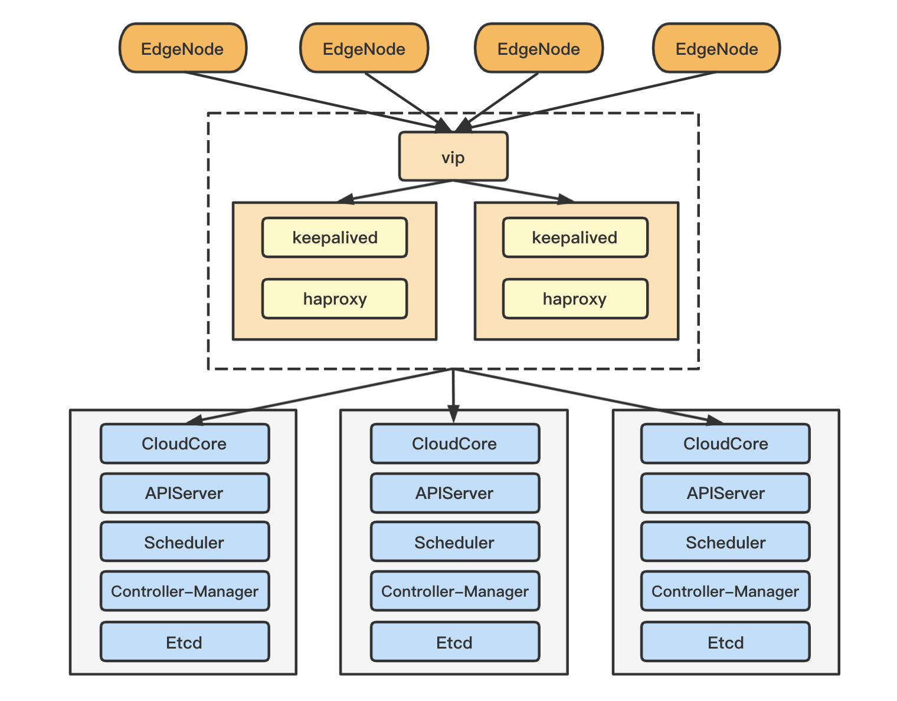

# The HA of CloudCore(deployed in k8s cluster)

This document is used for the multi-instance deployment of CloudCore. When a CloudCore in the cluster stops its service due to a failure, the cluster can transfer traffic to another normal CloudCore through the transfer of VIP, and maintain the normal operation between the cloud and edge. In addition, multiple active deployments of CloudCore can also be performed, that is, multiple CloudCores work at the same time, and the traffic from edge will be forwarded to all CloudCores in normal service according to the load balancing algorithm, which can improve the service performance of a large-scale cluster.

There are many ways to achieve high availability of CloudCore, such as ingress, keepalived, etc, here we recommend using keepalived + haproxy, and other methods of high availability deployment are waiting to be updated.

**Cluster Architecture:**

<div  align="center">

</div>

## 1.Determine the virtual IP of CloudCore

Determine a VIP that the CloudCore service exposed to the edge nodes. Here we recommend `keepalived` to do that. 

And you have to install `keepalived` in each of nodes where CloudCore runs, then modify the configuration file. The configuration of `keepalived` is shown in the end. Here suppose the VIP is 10.10.102.242.

**Note:**

- Ensure that the IPs of the nodes where CloudCore runs are in the same network segment with VIP
- Put the `health_check.sh` in the location specified in `keepalived.conf`, **and grant its execution permission** (`chmod 744 /etc/keepalived/health_check.sh`)

Execute `systemctl enable keepalived && systemctl start keepalived` to start keepalived. Then you can check the binding of the Network Interface Card through the `ip a` command. You can see that VIP is bound to a corresponding Network Interface Card of one of the masters. If you stop the keepalived, you can observe VIP drifting to other master nodes.


## 2.Prepare k8s high-availability cluster

Before deploying the highly available CloudCore, you need to prepare a multi-master cluster (three or more are recommended), set up a k8s master environment on one of the nodes, and let other master nodes join the master through `kubeadm join <VIP>:6443 --token <...> --discovery-token-ca-cert-hash <...> --control-plane`, then you can get a cluster with three masters, in which components such as `APIServer` and `Scheduler` are running on all master nodes in the form of pods.

For specific operation steps, please refer to the relevant k8s master high-availability deployment documents.

## 3.Create k8s resources

First of all, the normal operation of CloudCore requires `cloudimage`, so ensure your k8s cluster can pull `cloudimage`. If the image not exists. We can make one, and push to your registry. (Note: please modify `spec.template.spec.containers.image` in `03-ha-deployment.yaml.example`)

```shell script
cd $GOPATH/src/github.com/kubeedge/kubeedge
make cloudimage
```

Secondly, we need to create some k8s resources in advance, such as namespace of kubeedge, ServiceAccount, ClusterRole, ClusterRoleBinding, related CRDs, configmap including `cloudcore.yaml` and deployment definition files.

The manifests and scripts in `github.com/kubeedge/kubeedge/build/cloud/ha` will be used, so place these files to somewhere you can kubectl with (You have to make some modifications to manifests/scrips to suit your environment.)

**Modify:**

##### 02-ha-configmap.yaml

Configure the VIP address of CloudCore which is exposed to the edge nodes in the `advertiseAddress`, which will be added to SANs in cert of CloudCore. For example:

```yaml
modules:
  cloudHub:
    advertiseAddress:
    - 10.10.102.242 # vip
```

##### 03-ha-deployment.yaml.example

You had better directly schedule pods to specific number of nodes by `nodeSelector` when using `keepalived`.

The use of `nodeSelector` is as follow:

```shell script
kubectl label nodes [nodename] [key]=[value]  # label the nodes where the cloudcore will run
```

then modify the term of `nodeselector`:

```yaml
apiVersion: apps/v1
kind: Deployment
metadata:
  name: cloudcore
spec:
  replicas: 2 # number of your CloudCore instances!
  template:
    spec:
      nodeSelector: # configure the nodeSelector here!
        [key]: [value]
```

**Note:** If you want to reset the CloudCore, run this before creating k8s resources:

```shell script
kubectl delete namespace kubeedge
```

We create k8s resources from the manifests in name order. Before creating, **check the content of each manifest to make sure it meets your environment.**

Then create k8s resources:

```shell script
cd build/cloud/ha
for resource in $(ls *.yaml); do kubectl create -f $resource; done
```

**Note:** Now the follow manifests don't support `kubectl logs` command yet. If need, you have to make more configuration manually.

So far, you can get CloudCore pods in `Running` state, execute the `join` command in edge as usual to add edge nodes to the cluster, please note:

- Modify the `--cloudcore-ipport` parameter to `10.10.102.242:10000`
- Token acquisition: execute `kubectl get secret -n kubeedge tokensecret -oyaml -o jsonpath={".data.tokendata"} | base64 -d` in master

After execution, you can get a CloudCore high-availability cluster, but at the same time only the CloudCore where the VIP located is working.

If you want to achieve CloudCore multi-instance work at the same time, you need to proceed to the next step!

## 4.Achieve load balancing

HAProxy is a load balancing software that is used more frequently, providing high availability, load balancing, and proxy based on TCP and HTTP applications. The load balancing effect can be determined by configuring the load balancing algorithm.

The configuration of `haproxy` is shown in the end, and **check the content of each manifest to make sure it meets your environment**.

In the configuration, we specify the `10010/10012/10013/10014` port of `10.10.102.242` to replace the `10000/10001/10002/10003` port of the CloudCore.

Use `yum install haproxy -y` to install `haproxy`, modify the configuration and execute `systemctl enable haproxy && systemctl start haproxy`.

At the same time, some updates need to be made to the `keepalived` configuration: the normal operation of `haproxy` can ensure that the traffic coming in from `10.10.102.242:10010` is distributed to `masterX:10000` port according to the specified load balancing algorithm. To achieve this process, you need to ensure that the `haproxy` service is normal where the VIP located, so it is necessary to add the status monitoring of the `haproxy` in the `keepalived` health check, so that if the `haproxy` is down, the VIP will drift to other nodes.

**Modify keepalived's health check script:**

```shell script
#!/usr/bin/env bash
cloudcore_status=`netstat -nlp | grep 10000 | wc -l`
haproxy_status=`netstat -nlp | grep 10010 | wc -l`

if [ $cloudcore_status -gt 0 ] && [ $haproxy_status -gt 0 ] ; then
    exit 0
else
    exit 1
fi
```

After completing the above content, execute the `join` command in edge as usual to add edge nodes to the cluster, please note:

- Modify the `--cloudcore-ipport` parameter to `10.10.102.242:10010`
- Token acquisition: execute `kubectl get secret -n kubeedge tokensecret -oyaml -o jsonpath={".data.tokendata"} | base64 -d` in master
- Modify the generated `edgecore.yaml` file, replace the port number involved, and then restart `edgecore`:
```yaml
  apiVersion: edgecore.config.kubeedge.io/v1alpha1
  kind: EdgeCore
  modules:
    edgeHub:
      httpServer: https://10.10.102.242:10012 # change 10002 to 100012
      websocket:
        server: 10.10.102.242:10010 # change 10000 to 100010
    edgeStream:
      server: 10.10.102.242:10014 # change 10004 to 100014
```

So far, you have got a highly available cluster with multiple instances of CloudCore running at the same time!

## Configuration of keepalived

The `keepalived` configuration we recommend is as following. You can adjust it according to your needs. You can set up multiple BACKUP machines. After MASTER goes down, VIP will transfer to one of the BACKUP and take over the corresponding tasks.

**keepalived.conf:**

- master:

```yaml
! Configuration File for keepalived

global_defs {
  router_id lb01
  vrrp_mcast_group4 224.0.0.19
}
# Health Check
vrrp_script health_check {
  script "/etc/keepalived/health_check.sh" # the script for health check
  interval 2
  weight -5
  fall 3
  rise 5
}
vrrp_instance CloudCore {
  state MASTER
  interface eth0 # based on your host
  virtual_router_id 167 # must same as BACKUP
  priority 100
  advert_int 1
  authentication {
    auth_type PASS
    auth_pass 1111
  }
  virtual_ipaddress {
    10.10.102.242/24 # VIP
  }
  track_script {
    health_check
 }
}
```

- backup:

```yaml
! Configuration File for keepalived

global_defs {
  router_id lb02
  vrrp_mcast_group4 224.0.0.19
}
# Health Check
vrrp_script health_check {
  script "/etc/keepalived/health_check.sh" # the script for health check
  interval 2
  weight -5
  fall 3
  rise 5
}
vrrp_instance CloudCore {
  state BACKUP
  interface eth0 # based on your host
  virtual_router_id 167 # must same as MASTER
  priority 99
  advert_int 1
  authentication {
    auth_type PASS
    auth_pass 1111
  }
  virtual_ipaddress {
    10.10.102.242/24 # VIP
  }
  track_script {
    health_check
 }
}
```

**health_check.sh:**

```shell script
#!/usr/bin/env bash
cloudcore_status=`netstat -nlp | grep 10000 | wc -l`

if [ $cloudcore_status -gt 0 ] ; then
    exit 0
else
    exit 1
fi
```

## Configuration of haproxy

The `haproxy` configuration we recommend is as following. You can adjust it according to your needs. 

```yaml
#---------------------------------------------------------------------
# Example configuration for a possible web application.  See the
# full configuration options online.
#
#   http://haproxy.1wt.eu/download/1.4/doc/configuration.txt
#
#---------------------------------------------------------------------

#---------------------------------------------------------------------
# Global settings
#---------------------------------------------------------------------
global
    # to have these messages end up in /var/log/haproxy.log you will
    # need to:
    #
    # 1) configure syslog to accept network log events.  This is done
    #    by adding the '-r' option to the SYSLOGD_OPTIONS in
    #    /etc/sysconfig/syslog
    #
    # 2) configure local2 events to go to the /var/log/haproxy.log
    #   file. A line like the following can be added to
    #   /etc/sysconfig/syslog
    #
    #    local2.*                       /var/log/haproxy.log
    #
    log         127.0.0.1 local2

    chroot      /var/lib/haproxy
    pidfile     /var/run/haproxy.pid
    maxconn     4000
    user        haproxy
    group       haproxy
    daemon

    # turn on stats unix socket
    stats socket /var/lib/haproxy/stats

#---------------------------------------------------------------------
# common defaults that all the 'listen' and 'backend' sections will
# use if not designated in their block
#---------------------------------------------------------------------
defaults
    mode                    http
    log                     global
    option                  dontlognull
    option                  http-server-close
    option                  redispatch
    retries                 3
    timeout http-request    10s
    timeout queue           1m
    timeout connect         10s
    timeout client          1m
    timeout server          1m
    timeout http-keep-alive 10s
    timeout check           10s
    maxconn                 3000

#---------------------------------------------------------------------
# main frontend which proxys to the backends
#---------------------------------------------------------------------
frontend http_10000_front
    bind *:10010
    mode tcp
    default_backend http_10000_back

backend http_10000_back
    balance source # Choose your load balancing algorithm. "Source" is recommended here to ensure that requests from the same edgecore are always processed by the same cloudcore.
    mode tcp
    server cc1 {master1.ip}:10000 check inter 2000 rise 2 fall 5 # change {master1.ip} to your master ip
    server cc2 {master2.ip}:10000 check inter 2000 rise 2 fall 5
    server cc3 {master3.ip}:10000 check inter 2000 rise 2 fall 5

frontend http_10002_front
    bind *:10012
    mode tcp
    default_backend http_10002_back

backend http_10002_back
    balance source # Choose your load balancing algorithm. "Source" is recommended here to ensure that requests from the same edgecore are always processed by the same cloudcore.
    mode tcp
    server cc1 {master1.ip}:10002 check inter 2000 rise 2 fall 5 # change {master1.ip} to your master ip
    server cc2 {master2.ip}:10002 check inter 2000 rise 2 fall 5
    server cc3 {master3.ip}:10002 check inter 2000 rise 2 fall 5

frontend http_10003_front
    bind *:10013
    mode tcp
    default_backend http_10003_back

backend http_10003_back
    balance source # Choose your load balancing algorithm. "Source" is recommended here to ensure that requests from the same edgecore are always processed by the same cloudcore.
    mode tcp
    server cc1 {master1.ip}:10003 check inter 2000 rise 2 fall 5 # change {master1.ip} to your master ip
    server cc2 {master2.ip}:10003 check inter 2000 rise 2 fall 5
    server cc3 {master3.ip}:10003 check inter 2000 rise 2 fall 5

frontend http_10004_front
    bind *:10014
    mode tcp
    default_backend http_10004_back

backend http_10004_back
    balance source # Choose your load balancing algorithm. "Source" is recommended here to ensure that requests from the same edgecore are always processed by the same cloudcore.
    mode tcp
    server cc1 {master1.ip}:10004 check inter 2000 rise 2 fall 5 # change {master1.ip} to your master ip
    server cc2 {master2.ip}:10004 check inter 2000 rise 2 fall 5
    server cc3 {master3.ip}:10004 check inter 2000 rise 2 fall 5
```