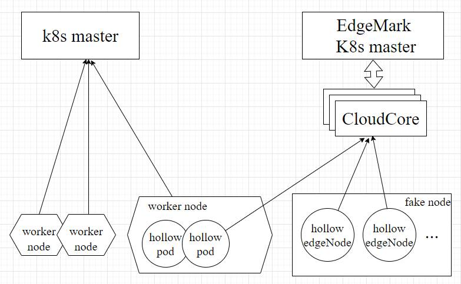

# Edgemark User Guide

## Introduction

Edgemark is a performance testing tool that inspired by
[Kubemark](https://github.com/kubernetes/kubernetes/tree/master/cmd/kubemark)
which allows users to run experiments on
simulated clusters. The primary use case is scalability testing, as simulated
clusters can be much bigger than the real ones. The objective is to expose
problems with the KubeEdge cloud components CloudCore that appear only on bigger clusters.

This document serves as a primer to understand what Edgemark is, what it is not,
and how to use it.

## Architecture

On a very high level, Edgemark cluster consists of three parts: a real kubernetes master,
KubeEdge CloudCore component and a set of “Hollow” Edge Nodes. Hollow Edge Node is registered
with `HollowEdgeCore`, which pretends to be an ordinary EdgeCore, but does not create any real containers.
`HollowEdgeCore` mocks runtime manager with Kubernetes `k8s.io/kubernetes/pkg/kubelet/cri/remote/fake/fake_runtime.go`,
where most logic sits. Except for simulating runtime manager, other behaviors is the same as edgecore.

Currently, Kubernetes master components run on a dedicated machine as pods that are
created/managed by kubelet, which itself runs as either a systemd or a supervisord
service on the master VM depending on the VM distro. Having a dedicated machine for the master
has a slight advantage over running the master components on an external cluster,
which is being able to completely isolate master resources from everything else.
The CloudCore has multiple instances and requires multiple dedicated nodes to maintain high reliability.
Usually In highly available configurations, a load balancer must sit in front of the CloudCore
to correctly route requests to healthy CloudCore servers. And The HollowEdgeNodes
on the other hand are run on an ‘external’ Kubernetes cluster
as pods in an isolated namespace (named edgemark). This idea of using pods on a
real cluster behave (or act) as nodes on the edgemark cluster lies at the heart of
edgemark's design.

## Requirements

To run Edgemark, you need:

1. A Kubernetes cluster (called `external cluster`) for running all your HollowEdgeNodes
2. A Kubernetes cluster (called `edgemark cluster`)  the master for HollowEdgeNodes.
3. Several dedicated nodes in `edgemark cluster` for deploy CloudCore, a load balancer
   that expose CloudCore service for HollowEdgeNodes and the load balancer has to be directly
   routable from HollowEdgeNodes.
4. You also need access to a Docker repository that has the
   container images for CloudCore, hollow-edge-node and node-problem-detector.
