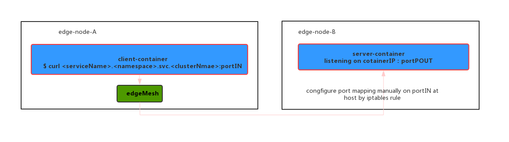
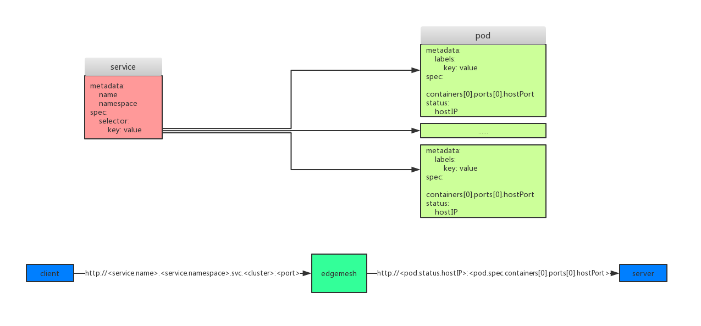
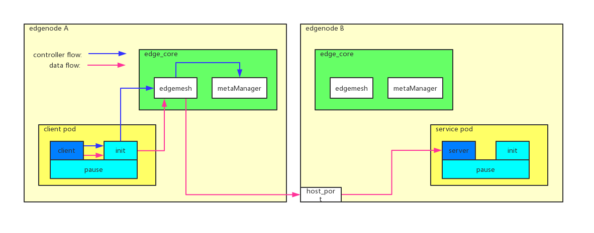

# EdgeMesh guide

In case network issue between cloud and edge side, we intergrate EdgeMesh to support DNS visit at any time.

Currently we only support HTTP1.x, more protocols like HTTPS and gRPC coming later.

EdgeMesh is enabled as default.

## Limitation

* Ensure network interface "docker0" exists, which means that EdgeMesh only works for Docker CRI.

## Environment Check

Before run examples, please check environment first.

### DNS Order

Modify `/etc/nsswitch.conf`, make sure `dns` is first order, like below:

```
$ grep hosts /etc/nsswitch.conf
hosts:          dns file mdns4_minimal [NOTFOUND=return]
```

### IP Forward Setting

Enable ip forward:

```
$ sudo echo "net.ipv4.ip_forward = 1" >> /etc/sysctl.conf
$ sudo sysctl -p
```

Then check it:

```
$ sudo sysctl -p | grep ip_forward
net.ipv4.ip_forward = 1
```

## Usage

Assume we have two edge nodes in ready state, we call them edge node "a" and "b":

```bash
$ kubectl get nodes
NAME          STATUS     ROLES    AGE   VERSION
edge-node-a   Ready      edge     25m   v1.15.3-kubeedge-v1.1.0-beta.0.358+0b7ac7172442b5-dirty
edge-node-b   Ready      edge     25m   v1.15.3-kubeedge-v1.1.0-beta.0.358+0b7ac7172442b5-dirty
master        NotReady   master   8d    v1.15.0
```

Deploy a sample pod from Cloud Side:

```bash
$ kubectl apply -f https://raw.githubusercontent.com/kubeedge/kubeedge/master/build/deployment.yaml
deployment.apps/nginx-deployment created
```

Check the pod is up and is running state, as we could see the pod is running on edge node b:

```bash
$ kubectl get pods -o wide
NAME                                READY   STATUS    RESTARTS   AGE   IP           NODE          NOMINATED NODE   READINESS GATES
nginx-deployment-54bf9847f8-sxk94   1/1     Running   0          14m   172.17.0.2   edge-node-b   <none>           <none>
```

Check it works:

```bash
$ curl 172.17.0.2
<!DOCTYPE html>
<html>
<head>
<title>Welcome to nginx!</title>
<style>
    body {
        width: 35em;
        margin: 0 auto;
        font-family: Tahoma, Verdana, Arial, sans-serif;
    }
</style>
</head>
<body>
<h1>Welcome to nginx!</h1>
<p>If you see this page, the nginx web server is successfully installed and
working. Further configuration is required.</p>

<p>For online documentation and support please refer to
<a href="http://nginx.org/">nginx.org</a>.<br/>
Commercial support is available at
<a href="http://nginx.com/">nginx.com</a>.</p>

<p><em>Thank you for using nginx.</em></p>
</body>
</html>
```

`172.17.0.2` is the IP of deployment and the output may be different since the version of nginx image.

Then create a service for it:
```yaml
$ cat <<EOF | kubectl apply -f -
apiVersion: v1
kind: Service
metadata:
  name: nginx-svc
  namespace: default
spec:
  clusterIP: None
  selector:
    app: nginx
  ports:
    - name: http-0
      port: 12345
      protocol: TCP
      targetPort: 80
EOF
```

>* For L4/L7 proxy, specify what protocol a port would use by the port's "name". First HTTP port should be named "http-0" and the second one should be called "http-1", etc.

Check the service and endpoints:

```bash
$ kubectl get service
NAME         TYPE        CLUSTER-IP   EXTERNAL-IP   PORT(S)     AGE
nginx-svc    ClusterIP   None         <none>        12345/TCP   77m
$ kubectl get endpoints
NAME         ENDPOINTS            AGE
nginx-svc    172.17.0.2:80        81m
```

To request a server, use url like this: `<service_name>.<service_namespace>.svc.<cluster>.<local>:<port>`

In our case, from edge node a or b, run following command:

```bash
$ curl http://nginx-svc.default.svc.cluster.local:12345
<!DOCTYPE html>
<html>
<head>
<title>Welcome to nginx!</title>
<style>
    body {
        width: 35em;
        margin: 0 auto;
        font-family: Tahoma, Verdana, Arial, sans-serif;
    }
</style>
</head>
<body>
<h1>Welcome to nginx!</h1>
<p>If you see this page, the nginx web server is successfully installed and
working. Further configuration is required.</p>

<p>For online documentation and support please refer to
<a href="http://nginx.org/">nginx.org</a>.<br/>
Commercial support is available at
<a href="http://nginx.com/">nginx.com</a>.</p>

<p><em>Thank you for using nginx.</em></p>
</body>
</html>
```

>* EdgeMesh supports both Host Networking and Container Networking
>* If you ever used EdgeMesh of old version, check your iptables rules. It might affect your test result.

## Sample


## Model

1. a headless service (a service with selector but ClusterIP is None)
2. one or more pods' labels match the headless service's selector
3. to request a server, use: ```<service_name>.<service_namespace>.svc.<cluster>:<port>```:
    1. get the service's name and namespace from domain name
    2. query all the backend pods from MetaManager by service's namespace and name
    3. LoadBalance returns the real backend containers' hostIP and hostPort

## Flow

1. client requests to server by server's domain name
2. DNS being hijacked to EdgeMesh by iptables rules, then a fake ip returned
3. request hijacked to EdgeMesh by iptables rules
4. EdgeMesh resolves request, gets domain name, protocol, request and so on
5. EdgeMesh load balances:
    1. get the service's name and namespace from the domain name
    2. query backend pods of the service from MetaManager
    3. choose a backend based on strategy
6. EdgeMesh transports request to server, wait for server's response and then sends response back to client
