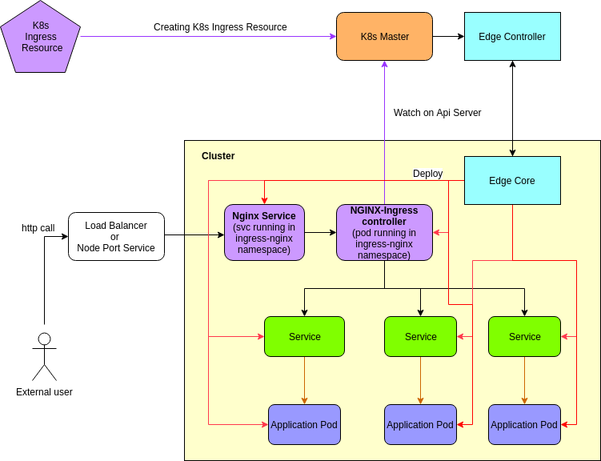

# Ingress Support at Edge


## Abstract:

To provide [ingress](https://kubernetes.io/docs/concepts/services-networking/ingress/) support at the edge. Ingress exposes HTTP routes from outside the cluster to services within the cluster. 
Using ingress the user can bring all their services under a single umbrella and manage them easily. The ingress support should continue to work even in offline scenarios i.e. even in the cases where 
connectivity between edge and cloud is lost/unreliable. 


## Motivation:

The cloud native and microservice architecture is becoming more and more popular and the edge node is becoming more and more powerful. In these scenarios, users might want to deploy their applications at the edge, 
which could need to be accessed by external users, through services. Using ingress we would be able to provide name based virtual hosting and load balance traffic.

This design document deals with enabling users to leverage powerful machines at the edge to provide external users (users of the application running as a pod within Kubeedge)
access to the services running within the different edge nodes.  


## Goals:

- Provide external users access to the multiple services running within the edge nodes in the same cluster.
- Provide name based virtual hosting and load balance traffic.
- Provide ingress support even in offline scenarios


## Non-Goals:

- To provide access to services running in different clusters


## Proposal:
We propose to use [kubernetes ingress resources](https://kubernetes.io/docs/concepts/services-networking/ingress/#the-ingress-resource) to connect to various services which in turn connect to their application.
We are proposing to use an [Nginx ingress controller](https://www.nginx.com/products/nginx/kubernetes-ingress-controller) (Other [ingress controllers](https://kubernetes.io/docs/concepts/services-networking/ingress-controllers/#additional-controllers) 
could also be utilized for this purpose, but for the current scope we are only considering a Nginx ingress controller) which would route the user requests to the respective service. 
Traffic routing is controlled by rules defined on the Ingress resource. This proposal uses Node-port service to redirect external users to the ingress service, instead we can also make use of an external load-balancer for this purpose. 


## Design Details:

In the current design the communication between external users and the services are handled by the nginx ingress controller. The communication between the services and their respective application pods will be handled by the edge mesh feature of KubeEdge. 



We are making use of nginx controller as our ingress controller to handle ingress resources. The nginx ingress controller runs as a pod (which would be deployed by edge core) in its own namespace (ingress-nginx). 
The nginx ingress controller pod can be accessed through the nginx service, which also runs in the same namespace as the ingress controller.


1. The user first has to deploy the Nginx ingress controller pod and service on the edge through the edge core (edged component to be specific).
2. Once the pod and service have been created, the user can define an ingress resource, which contains the rules based on which the ingress controller forwards the requests from the user.
3. The external users can access the Nginx service either through a load balancer or a Node port service which would forward requests to the nginx service.
4. The Nginx service forwards the request to the Nginx Ingress Controller pod.
5. Based on the rules that have been defined in the ingress resource, the ingress controller forwards the request to the appropriate service.
6. The services then forward the request to the respective application pods through the help of edge mesh feature of KubeEdge.


## Ingress Resource:

The Ingress resource is the kubernetes resource based on which the ingress cotroller decides where to forward the incoming traffic. It is basically used to set rules based on which the ingress controller can take action.
An example ingress resource is shown below :

 ```ssh

 apiVersion: networking.k8s.io/v1beta1
 kind: Ingress
 metadata:
   name: test-ingress               # name of the ingress resource
   annotations:
     nginx.ingress.kubernetes.io/rewrite-target: /
 spec:
   rules:
   - http:
       paths:
       - path: /testpath      # the path specified in the API based on which the controller will route traffic
         backend:
           serviceName: test     # the kubernetes service name to which the incoming request needs to be forwarded 
           servicePort: 80

 ```
The Ingress spec contains the information required to configure a load balancer or a proxy server. It contains the rules against which all incoming requests are matched.
Currently, ingress only supports rules for redirecting HTTP traffic.

### Rules:

Each HTTP rule contains the following information:

- An optional host. In this example, no host is specified, so the rule applies to all inbound HTTP traffic through the IP address specified. If a host is provided (for example, foo.bar.com), the rules apply to that host.
- A list of paths (for example, /testpath), each of which has an associated backend defined with a serviceName and servicePort. Both the host and path must match the content of an incoming request before the load balancer directs traffic to the referenced Service.
- A backend is a combination of Service and port names as described in the Service doc. HTTP (and HTTPS) requests to the Ingress that matches the host and path of the rule are sent to the listed backend.
- A default backend is often configured in an Ingress controller to service any requests that do not match a path in the spec.

