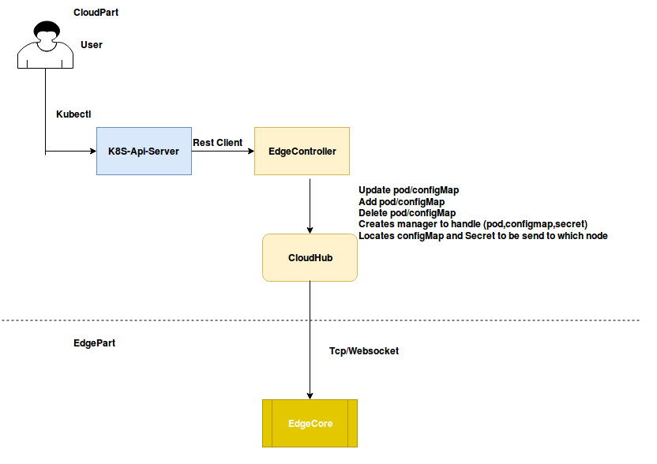
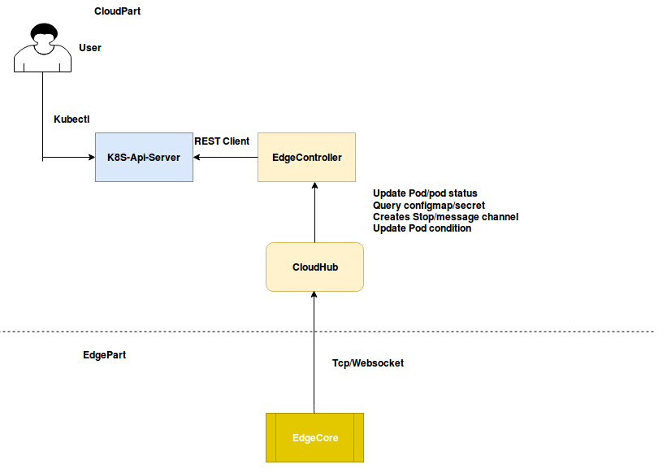

# Edge Controller

## Edge Controller Overview
 Controller(also known as edgecontroller) is the bridge between Kubernetes Api-Server and edgecore

   
## Operations Performed By Edge Controller
 
 The following are the functions performed by Edge controller :-
 - Downstream Controller: Sync add/update/delete event to edgecore from K8s Api-server
 - Upstream Controller: Sync watch and Update status of resource and events(node, pod and configmap) to K8s-Api-server and also subscribe message from edgecore
 - Controller Manager: Creates manager Interface which implements events for managing ConfigmapManager, LocationCache and podManager

## Downstream Controller:
### Sync add/update/delete event to edge
 
- Downstream controller: Watches K8S-Api-server and sends updates to edgecore via cloudHub
- Sync (pod, configmap, secret) add/update/delete event to edge via cloudHub
- Creates Respective manager (pod, configmap, secret) for handling events by calling manager interface
- Locates configmap and secret should be send to which node

## Upstream Controller:
### Sync watch and Update status of resource and events

- UpstreamController receives messages from edgecore and sync the updates to K8S-Api-server
- Creates stop channel to dispatch and stop event to handle pods, configMaps, node and secrets
- Creates message channel to update Nodestatus, Podstatus, Secret and configmap related events
- Gets Podcondition information like Ready, Initialized, Podscheduled and Unschedulable details
- **Below is the information for PodCondition**
   - **Ready**: PodReady means the pod is able to service requests and should be added to the load balancing pools for all matching services
   - **PodScheduled**: It represents status of the scheduling process for this pod
   - **Unschedulable**: It means scheduler cannot schedule the pod right now, may be due to insufficient resources in the cluster
   - **Initialized**: It means that all Init containers in the pod have started sucessfully
   - **ContainersReady**: It indicates whether all containers in the pod are ready
- **Below is the information for PodStatus**
   - **PodPhase**: Current condition of the pod
   - **Conditions**: Details indicating why the pod is in this condition
   - **HostIP**: IP address of the host to which pod is assigned
   - **PodIp**: IP address allocated to the Pod
   - **QosClass**: Assigned to the pod based on resource requirement
   
   
   
## Controller Manager:
### Creates manager Interface and implements ConfigmapManager, LocationCache and podManager

- Manager defines the Interface of a manager, ConfigManager, Podmanager, secretmanager implements it
- Manages OnAdd, OnUpdate and OnDelete events which will be updated to the respective edge node from the K8s-Api-server
- Creates an eventManager(configMaps, pod, secrets) which will start a CommonResourceEventHandler, NewListWatch and a newShared Informer for each event to Sync(add/update/delete)event(pod, configmap, secret) to edgecore via cloudHub
- **Below is the List of handlers created by controller Manager**
   - **CommonResourceEventHandler**: NewcommonResourceEventHandler creates CommonResourceEventHandler used for Configmap and pod Manager
   - **NewListWatch**: Creates a new ListWatch from the specified client resource namespace and field selector
   - **NewSharedInformer**: Creates a new Instance for the Listwatcher
