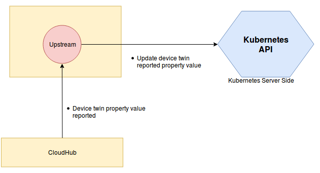

# Device Controller

## Device Controller Overview
 The device controller is the cloud component of KubeEdge which is responsible for device management. Device management im KubeEdge is implemented by making use of Kubernetes
 [Custom Resource Definitions (CRDs)](https://kubernetes.io/docs/concepts/extend-kubernetes/api-extension/custom-resources/) to describe device metadata/status and device controller to synchronize these device updates between edge and cloud. 
 The device controller starts two separate goroutines called `upstream controller` and `downstream controller`. These are not separate controllers as such but named here for clarity.

The device controller makes use of device model and device instance to implement device management :
 - **Device Model**: A `device model` describes the device properties exposed by the device and property visitors to access these properties. A device model is like a reusable template using which many devices can be created and managed.
 Details on device model definition can be found [here](https://github.com/kubeedge/kubeedge/blob/master/docs/proposals/device-crd.md#device-model-type-definition).
 - **Device Instance**: A `device` instance represents an actual device object. It is like an instantiation of the `device model` and references properties defined in the model. The device spec is static while the device status contains dynamically changing data like the desired state of a device property and the state reported by the device.
 Details on device instance definition can be found [here](https://github.com/kubeedge/kubeedge/blob/master/docs/proposals/device-crd.md#device-instance-type-definition).

 **Note**: Sample device model and device instance for a few protocols can be found at $GOPATH/src/github.com/kubeedge/kubeedge/build/crd-samples/devices

 
 
## Operations Performed By Device Controller
 
 The following are the functions performed by the device controller :-
 - **Downstream Controller**: Synchronize the device updates from the cloud to the edge node, by watching on K8S API server
 - **Upstream Controller**: Synchronize the device updates from the edge node to the cloud using device twin component

## Upstream Controller:

The upstream controller watches for updates from the edge node and applies these updates against the API server in the cloud. Updates are categorized below along with the possible
actions that the upstream controller can take:

  | Update Type                        | Action                                        |
  |-------------------------------     |---------------------------------------------- |
  |Device Twin Reported State Updated    |  The controller patches the reported state of the device twin property in the cloud. |
  

     
### Syncing Reported Device Twin Property Update From Edge To Cloud

The mapper watches devices for updates and reports them to the event bus via the MQTT broker. The event bus sends the reported state of the device to the device twin which stores it locally and then syncs the updates to the cloud. The device controller watches for device updates from the edge ( via the cloudhub ) and updates the reported state in the cloud.

## Downstream Controller:

The downstream controller watches for device updates against the K8S API server. Updates are categorized below along with the possible actions that the downstream controller can take:

| Update Type                    | Action                                       |
|-------------------------------|---------------------------------------------- |
|New Device Model Created       |  NA                                           |
|New Device Created             | The controller creates a new config map to store the device properties and visitors defined in the device model associated with the device.  This config map is stored in etcd. The existing config map sync mechanism in the edge controller is used to sync the config map to the egde. The mapper application running in a container can get the updated config map and use the property and visitor metadata to access the device. The device controller additionally reports the device twin metadata updates to the edge node.|
|Device Node Membership Updated | The device controller sends a membership update event to the edge node.|
|Device  Twin Desired State Updated | The device controller sends a twin update event to the edge node.|
|Device Deleted                 | The controller sends the device twin delete event to delete all device twins associated with the device. It also deletes config maps associated with the device and this delete event is synced to the edge. The mapper application effectively stops operating on the device.|

The idea behind using config map to store device properties and visitors is that these metadata are only required by the mapper applications running on the edge node in order to connect to the device and collect data.
Mappers if run as containers can load these properties as config maps . Any additions , deletions or updates to properties , visitors etc in the cloud are watched upon by the downstream controller and config maps are updated in etcd.
If the mapper wants to discover what properties a device supports, it can get the model information from the device instance.
Also, it can get the protocol information to connect to the device from the device instace. Once it has access to the device model,
it can get the properties supported by the device. In order to access the property, the mapper needs to get the corresponding visitor information.
This can be retrieved from the propertyVisitors list. Finally, using the visitorConfig, the mapper can read/write the data associated with the property.

### Syncing Desired Device Twin Property Update From Cloud To Edge

The device controller watches device updates in the cloud and relays them to the edge node. These updates are stored locally by the device twin. The mapper gets these updates via the MQTT broker and operates on the device based on the updates.

