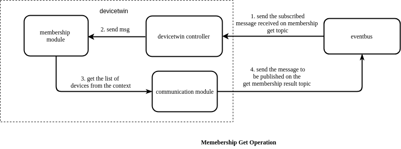
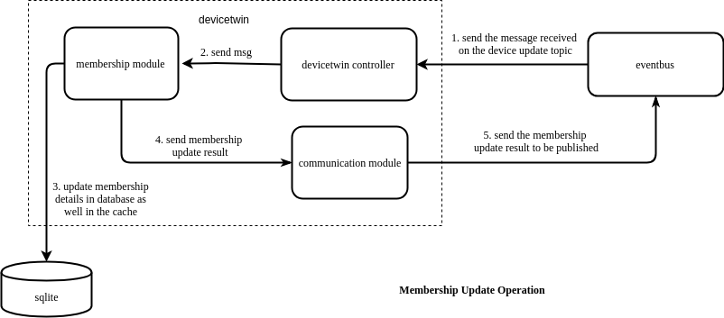
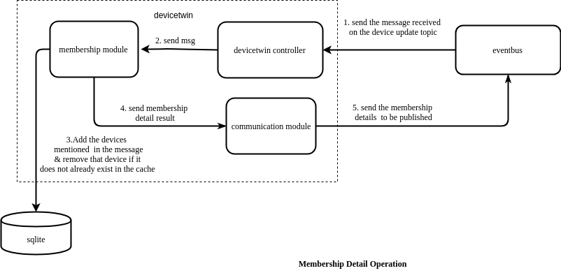
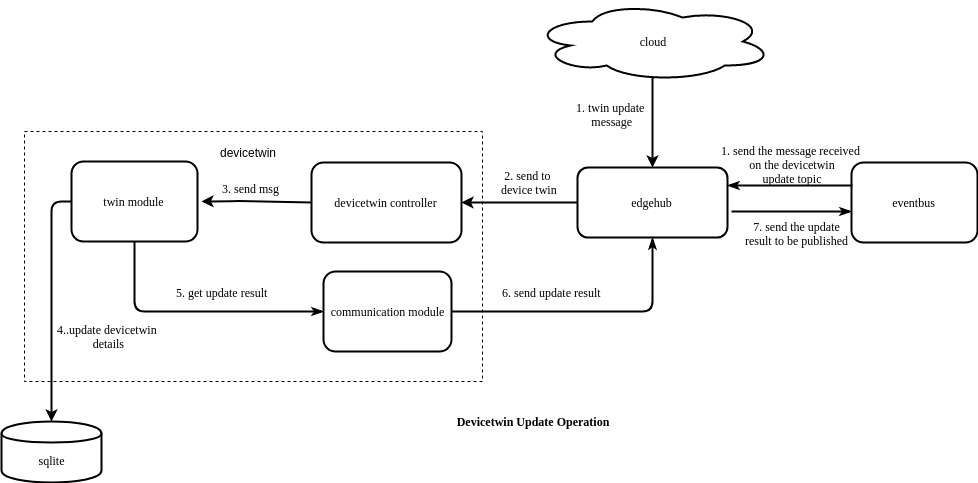
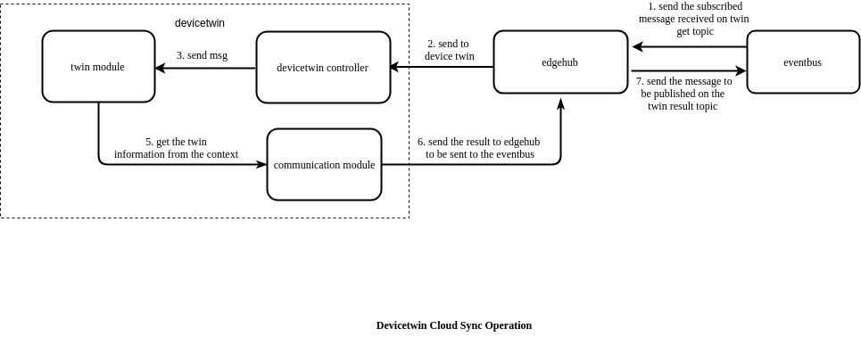
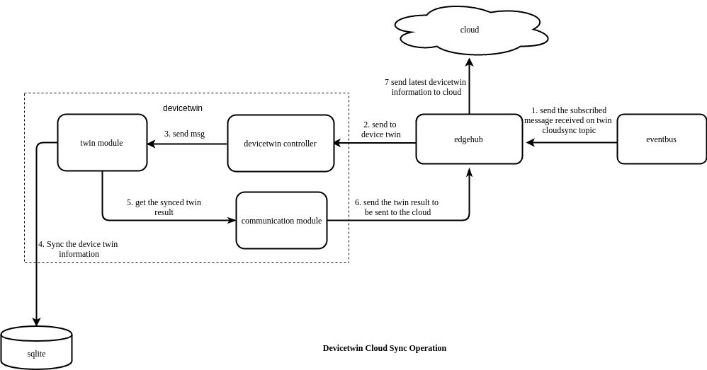
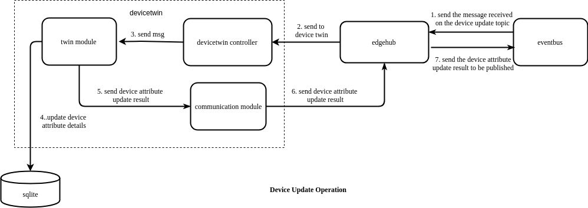
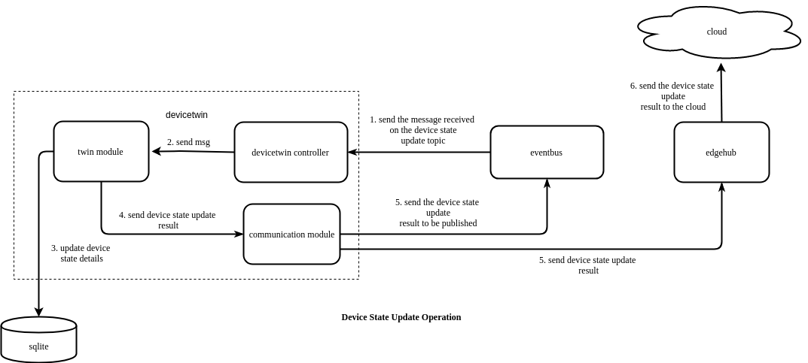

# DeviceTwin

## Overview

DeviceTwin module is responsible for storing device status, dealing with device attributes, handling device twin operations, creating a membership 
between the edge device and edge node, syncing device status to the cloud and syncing the device twin information between edge and cloud.
It also provides query interfaces for applications. Device twin consists of four sub modules (namely membership module, communication 
module, device module and device twin module) to perform the responsibilities of device twin module.
   
   
## Operations Performed By Device Twin Controller
 
 The following are the functions performed by device twin controller :-
  
  - Sync metadata to/from db ( Sqlite )
  - Register and Start Sub Modules
  - Distribute message to Sub Modules 
  - Health Check

### Sync Metadata to/from db ( Sqlite )
 
For all devices managed by the edge node , the device twin performs the below operations :-

   - It checks if the device in the device twin context (the list of devices are stored inside the device twin context), if not it adds a mutex to the context.
   - Query device from database
   - Query device attribute from database
   - Query device twin from database
   - Combine the device, device attribute and device twin data together into a single structure and stores it in the device twin context. 
 
  
### Register and Start Sub Modules

Registers the four device twin modules and starts them as separate go routines 

### Distribute Message To Sub Modules
 
1. Continuously listen for any device twin message in the beehive framework.
2. Send the received message to the communication module of device twin
3. Classify the message according to the message source, i.e. whether the message is from eventBus, edgeManager or edgeHub,
and fills the action module map of the module (ActionModuleMap is a map of action to module) 
4. Send the message to the required device twin module

  
### Health Check 
 
The device twin controller periodically ( every 60 s ) sends ping messages to submodules. Each of the submodules updates the timestamp in a map for itself once it receives a ping.
The controller checks if the timestamp for a module is more than 2 minutes old and restarts the submodule if true.
  

## Modules

DeviceTwin consists of four modules, namely :-

- Membership Module
- Twin Module
- Communication Module
- Device Module

### Membership Module

The main responsibility of the membership module is to provide membership to the new devices added through the cloud to the edge node.
This module binds the newly added devices to the edge node and creates a membership between the edge node and the edge devices.

The major functions performed by this module are:-

1. Initialize action callback map which is a map[string]Callback that contains the callback functions that can be performed
2. Receive the messages sent to membership module
3. For each message the action message is read and the corresponding function is called
4. Receive heartbeat from the heartbeat channel and send a heartbeat to the controller
 
The following are the action callbacks which can be performed by the membership module :-

   - dealMembershipGet
   - dealMembershipUpdated
   - dealMembershipDetail

**dealMembershipGet**:    dealMembershipGet()  gets the information  about the devices associated with the particular edge node, from the cache. 
- The eventbus first receives a message on its subscribed topic (membership-get topic).
- This message arrives at the  devicetwin controller, which further sends the message to membership module.  
- The membership module gets the devices associated with the edge node from the cache (context) and sends the information to the communication module. 
 It also handles errors that may arise while performing the  aforementioned process and sends the error to the communication module instead of device details.
- The communication module sends the information to the  eventbus component which further publishes the result on the 
 specified MQTT topic (get membership result topic). 

  

**dealMembershipUpdated**:  dealMembershipUpdated() updates the membership details of the node. 
                            It adds the devices, that were newly added, to the edge group and removes the devices, that were removed,
                            from the edge group and updates device details, if they have been altered or updated. 
- The edgehub module receives the membership update message from the cloud and forwards the message 
to devicetwin controller which further forwards it to the membership module. 
- The membership  module adds devices that are newly added, removes devices that have been recently 
deleted and also updates the devices that were already existing in the database as well as in the cache. 
- After updating the details of the devices a  message is sent to the communication module of the device twin, which sends the message to eventbus module to be published on the given MQTT topic. 
                            
  
                    
                                        
**dealMembershipDetail**:   dealMembershipDetail() provides the membership details of the edge node, providing information
                            about the devices associated with the edge node, after removing the membership details of 
                            recently removed devices. 
- The eventbus module receives the message that arrives on the subscribed topic,the message is then forwarded  to the 
devicetwin controller which further forwards it to the membership module. 
- The membership  module adds devices that are mentioned in the message, removes 
devices that that are not present in the cache. 
- After updating the details of the devices a  message is sent to the communication module of the device twin.

  

### Twin Module

The main responsibility of the twin module is to deal with all the device twin related operations. It can perform 
operations like device twin update, device twin get and device twin sync-to-cloud.

The major functions performed by this module are:-

1. Initialize action callback map (which is a  map of action(string) to the callback function that performs the requested action)
2. Receive the messages sent to twin module
3. For each message the action message is read and the corresponding function is called
4. Receive heartbeat from the heartbeat channel and send a heartbeat to the controller
 
The following are the action callbacks which can be performed by the twin module :-

   - dealTwinUpdate
   - dealTwinGet
   - dealTwinSync
   
**dealTwinUpdate**: dealTwinUpdate() updates the device twin information for a particular device. 
- The devicetwin update message can either be received by edgehub module from the cloud or from 
the MQTT broker through the eventbus component (mapper will publish a message on the device twin update topic) . 
- The message is then sent to the device twin controller from where it is sent to the device twin module. 
- The twin module updates the twin value in the database and sends the update result message to the communication module. 
- The communication module will in turn send the publish message to the MQTT broker through the eventbus.
                    
  
                 
                 
**dealTwinGet**: dealTwinGet() provides the device twin  information for a particular device. 
- The eventbus component  receives the message that arrives on the subscribed twin get topic and forwards the message to devicetwin controller, which further sends the message to twin module. 
- The twin module gets the devicetwin related information for the particular device and sends it to the communication module, it also handles errors that arise when the device is not found or if any internal problem occurs.
- The communication module sends the information to the eventbus component, which publishes the result on the topic specified . 
                                                
  

**dealTwinSync**: dealTwinSync() syncs the device twin information to the cloud.
 - The eventbus module receives the message on the subscribed twin cloud sync topic .
 - This message is then sent to the devicetwin controller from where it is sent to the twin module. 
 - The twin module then syncs the twin information present in the database and sends the synced twin results to the communication module. 
 - The communication module further sends the information to edgehub component which will in turn send the updates to the cloud through the websocket connection. 
 - This function also performs operations like publishing the updated twin details  document, delta of the device twin as well as the update result (in case there is some error) to a specified topic through the communication module,
 which sends the data to edgehub, which will send it to eventbus which publishes on the MQTT broker.
                                    
            

### Communication Module

The main responsibility of communication module is to ensure the communication functionality between device twin  and the other components.

The major functions performed by this module are:-

1. Initialize action callback map which is a map[string]Callback that contains the callback functions that can be performed
2. Receive the messages sent to communication module
3. For each message the action message is read and the corresponding function is called
4. Confirm whether the actions specified in the message are completed or not, if the action is not completed then redo the action
5. Receive heartbeat from the heartbeat channel and send a heartbeat to the controller

The following are the action callbacks which can be performed by the communication module :-

   - dealSendToCloud
   - dealSendToEdge
   - dealLifeCycle
   - dealConfirm   
   
 
**dealSendToCloud**: dealSendToCloud() is used to send data to the cloudHub component.
                     This function first ensures that the cloud is connected, then sends the message to the edgeHub module (through the beehive framework),
                     which in turn will forward the message to the cloud (through the websocket connection).

**dealSendToEdge**:  dealSendToEdge() is used to send data to the other modules present at the edge.
                     This function sends the message received to the edgeHub module using beehive framework.
                     The edgeHub module after receiving the message will send it to the required recipient. 
                   
**dealLifeCycle**:   dealLifeCycle() checks if the cloud is connected and the state of the twin is disconnected, it then changes the status 
                     to connected and sends the node details to edgehub. If the cloud is disconnected then, it sets the state of the twin
                     as disconnected. 

**dealConfirm**:     dealConfirm() is used to confirm the event. It checks whether the type of the message is right and 
                     then deletes the id from the confirm map.   
 

### Device Module

The main responsibility of the device module is to perform the device related operations like dealing with device state updates 
and device attribute updates.
      
The major functions performed by this module are :-

1. Initialize action callback map (which is a  map of action(string) to the callback function that performs the requested action)
2. Receive the messages sent to device module
3. For each message the action message is read and the corresponding function is called
4. Receive heartbeat from the heartbeat channel and send a heartbeat to the controller
 
The following are the action callbacks which can be performed by the device module :-

   - dealDeviceUpdated
   - dealDeviceStateUpdate
   
 **dealDeviceUpdated**: dealDeviceUpdated() deals with the operations to be performed when a device attribute update is encountered.
                        It updates the changes to the device attributes, like addition of attributes, updation of attributes and deletion of attributes
                        in the database. It also sends the result of the device attribute update to be published to the eventbus component.
 - The device attribute updation is initiated from the cloud, which sends the update to edgehub.
 - The edgehub component sends the message to the device twin controller which forwards the message to the device module.
 - The device module updates the device attribute details into the database after which, the device module sends the result of the device attribute update to be published
  to the eventbus component through the communicate module of devicetwin. The eventbus component further publishes the result on the specified topic.
                        
  
 
 **dealDeviceStateUpdate**:  dealDeviceStateUpdate() deals with the operations to be performed when a device status update is encountered.
                             It updates the state of the device as well as the last online time of the device in the database.
                             It also sends the update state result, through the communication module,  to the cloud through the edgehub module and to the  eventbus module which in turn 
                             publishes the result on the specified topic of the MQTT broker.
- The device state updation is initiated by publishing a message on the specified topic which is being subscribed by the eventbus component.
- The eventbus component sends the message to the device twin controller which forwards the message to the device module.
- The device module updates the state of the device as well as the last online time of the device in the database.
- The device module then sends the result of the device state update to the eventbus component and edgehub component through the communicate module of devicetwin. The eventbus component further publishes the result on the specified topic, while the 
edgehub component sends the device status update to the cloud.

  
  
  
## Tables

DeviceTwin module creates three tables in the database, namely :-

- Device Table
- Device Attribute Table
- Device Twin Table

### Device Table 

Device table contains the data regarding the devices added to a particular edge node.
The following are the columns present in the device table :  

|Column Name | Description |  
|---|---|  
| **ID** |  This field indicates the id assigned to the device |  
| **Name** | This field indicates the name of the device |  
| **Description** | This field indicates the description of the device |  
| **State** | This field indicates the state of the device |  
| **LastOnline** | This fields indicates when the device was last online |  

**Operations Performed :-**  

The following are the operations that can be performed on this data :-

- **Save Device**: Inserts a device in the device table

- **Delete Device By ID**: Deletes a device by its ID from the device table

- **Update Device Field**: Updates a single field in the device table

- **Update Device Fields**: Updates multiple fields in the device table

- **Query Device**: Queries a device from the device table 

- **Query Device All**: Displays all the devices present in the device table

- **Update Device Multi**: Updates multiple columns of multiple devices in the device table

- **Add Device Trans**: Inserts device, device attribute and device twin in a single transaction, if any of these operations fail, 
   then it rolls back the other insertions  

- **Delete Device Trans**: Deletes device, device attribute and device twin in a single transaction, if any of these operations fail, 
   then it rolls back the other deletions  

### Device Attribute Table 

Device attribute table contains the data regarding the device attributes associated with a particular device in the edge node.
The following are the columns present in the device attribute table :  

| Column Name | Description |
|----------------|--------------------------|
| **ID** |  This field indicates the id assigned to the device attribute |
| **DeviceID** |  This field indicates the device id of the device associated with this attribute |
| **Name** | This field indicates the name of the device attribute |
| **Description** | This field indicates the description of the device attribute |
| **Value** | This field indicates the value of the device attribute |
| **Optional** | This fields indicates whether the device attribute is optional or not |
| **AttrType** | This fields indicates the type of attribute that is referred to |
| **Metadata** |This fields describes the metadata associated with the device attribute  |

**Operations Performed :-**   

The following are the operations that can be performed on this data :  

   - **Save Device Attr**: Inserts a device attribute in the device attribute table
    
   - **Delete Device Attr By ID**: Deletes a device attribute by its ID from the device attribute table

   - **Delete Device Attr**: Deletes a device attribute from the device attribute table by filtering based on device id and device name
   
   - **Update Device Attr Field**: Updates a single field in the device attribute table
   
   - **Update Device Attr Fields**: Updates multiple fields in the device attribute table
   
   - **Query Device Attr**: Queries a device attribute from the device attribute table 
      
   - **Update Device Attr Multi**: Updates multiple columns of multiple device attributes in the device attribute table
       
   - **Delete Device Attr Trans**: Inserts device attributes, deletes device attributes and updates device attributes in a single transaction.
   

### Device Twin Table 

Device twin table contains the data related to the device device twin associated with a particular device in the edge node.
The following are the columns present in the device twin table :  

| Column Name | Description |  
|---|---|  
| **ID** | This field indicates the id assigned to the device twin |  
| **DeviceID** |  This field indicates the device id of the device associated with this device twin |  
| **Name** | This field indicates the name of the device twin |  
| **Description** | This field indicates the description of the device twin |  
| **Expected** | This field indicates the expected value of the device |  
| **Actual** | This field indicates the actual value of the device |  
| **ExpectedMeta** | This field indicates the metadata associated with the expected value of the device |  
| **ActualMeta** | This field indicates the metadata associated with the actual value of the device |  
| **ExpectedVersion** | This field indicates the version of the expected value of the device |  
| **ActualVersion** | This field indicates the version of the actual value of the device |  
| **Optional** | This fields indicates whether the device twin is optional or not |  
| **AttrType** | This fields indicates the type of attribute that is referred to |  
| **Metadata** | This fields describes the metadata associated with the device twin |  

**Operations Performed :-**   

The following are the operations that can be performed on this data :-
     
   - **Save Device Twin**: Inserts a device twin in the device twin table
    
   - **Delete Device Twin By Device ID**: Deletes a device twin by its ID from the device twin table

   - **Delete Device Twin**: Deletes a device twin from the device twin table by filtering based on device id and device name
   
   - **Update Device Twin Field**: Updates a single field in the device twin table
   
   - **Update Device Twin Fields**: Updates multiple fields in the device twin table
   
   - **Query Device Twin**: Queries a device twin from the device twin table 
      
   - **Update Device Twin Multi**: Updates multiple columns of multiple device twins in the device twin table
       
   - **Delete Device Twin Trans**: Inserts device twins, deletes device twins and updates device twins in a single transaction.
  
