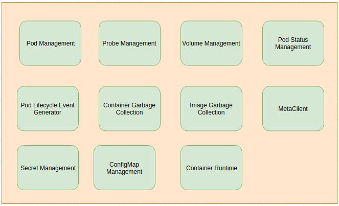
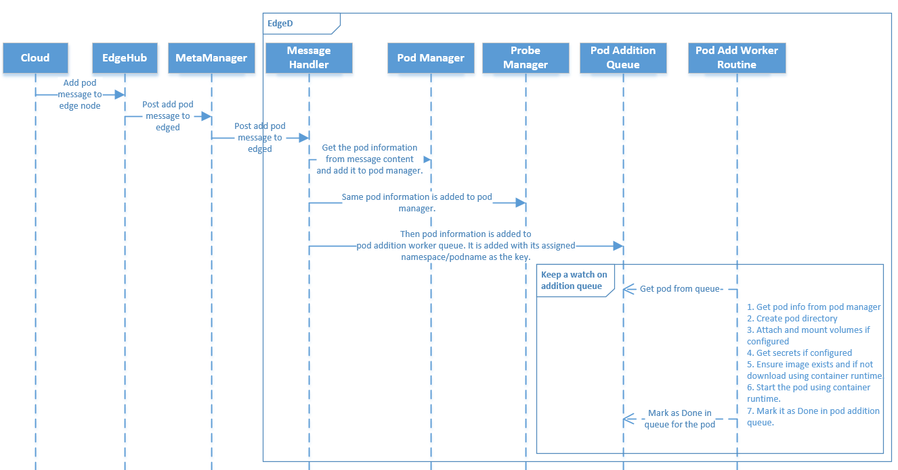
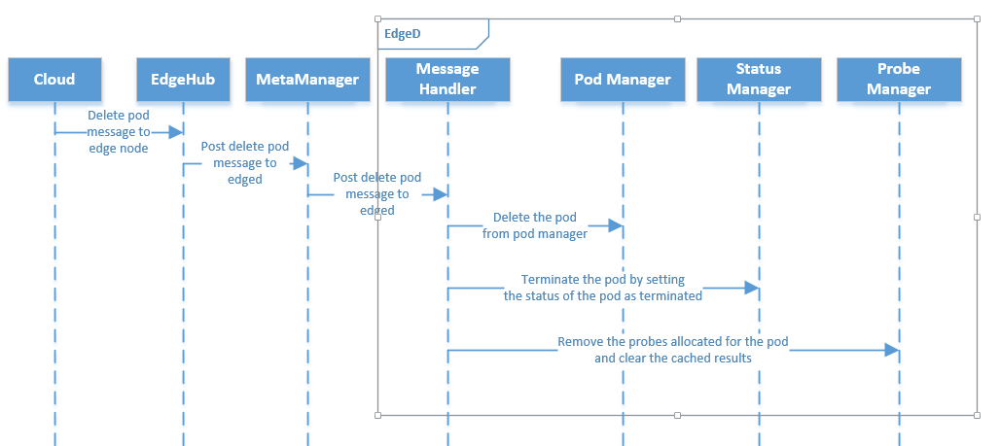
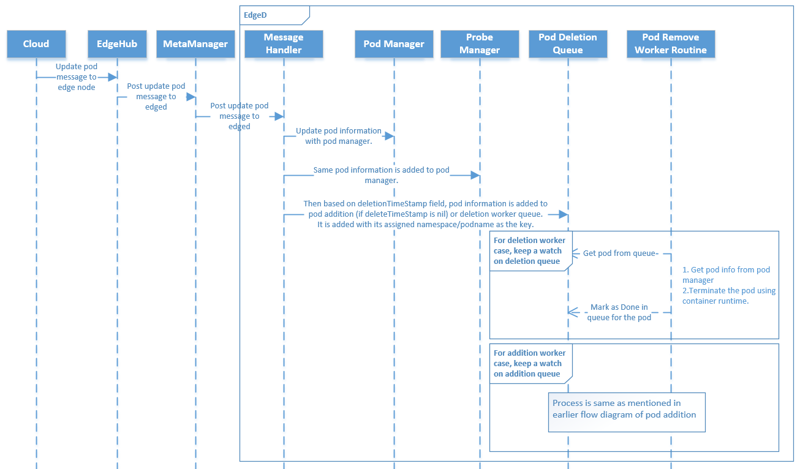
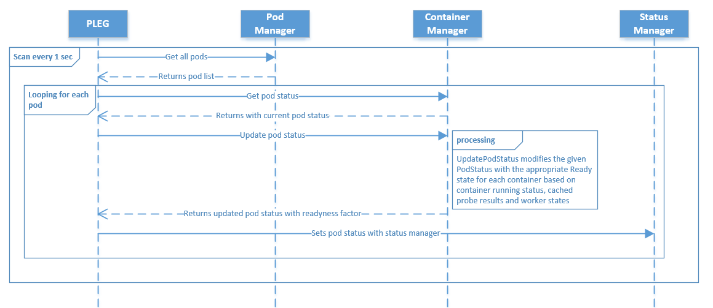
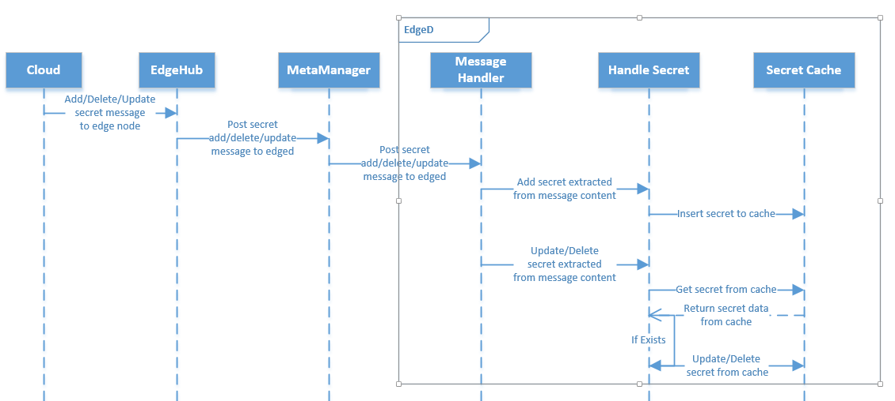
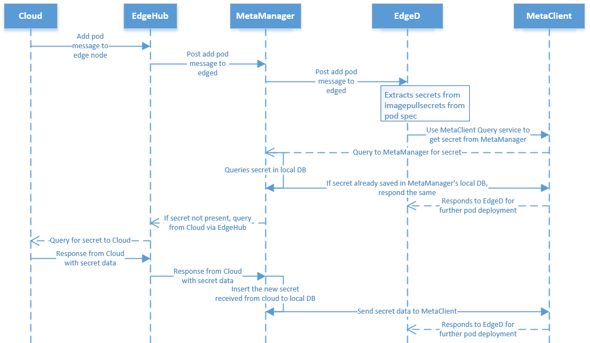
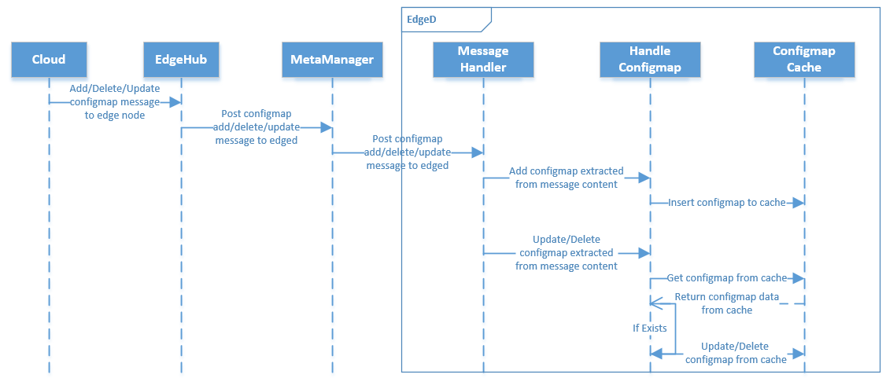
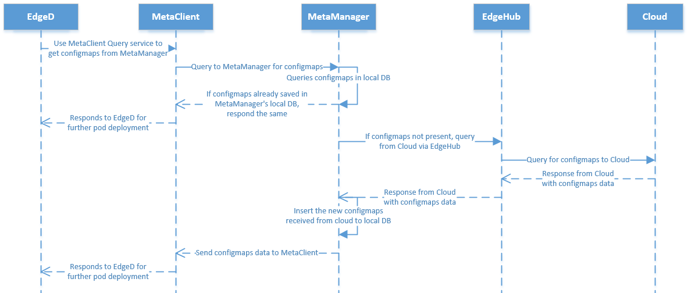
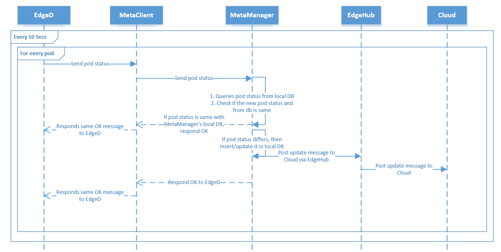

# EdgeD

## Overview

EdgeD is an edge node module which manages pod lifecycle. It helps user to deploy containerized workloads or applications at the edge node. Those workloads could perform any operation from simple telemetry data manipulation to analytics or ML inference and so on. Using `kubectl` command line interface at the cloud side, user can issue commands to launch the workloads.

Docker container runtime is currently supported for container and image management. In future other runtime support shall be added, like containerd etc.,

There are many modules which work in tandom to achive edged's functionalities.

  

*Fig 1: EdgeD Functionalities*

## Pod Management

It is handles for pod addition, deletion and modification. It also tracks the health of the pods using pod status manager and pleg.
Its primary jobs are as follows:

- Receives and handles pod addition/deletion/modification messages from metamanager.
- Handles separate worker queues for pod addition and deletion.
- Handles worker routines to check worker queues to do pod operations.
- Keeps separate cache for config map and secrets respectively.
- Regular cleanup of orphaned pods

  

*Fig 2: Pod Addition Flow*

  

*Fig 3: Pod Deletion Flow*

  

*Fig 4: Pod Updation Flow*

## Pod Lifecycle Event Generator

This module helps in monitoring pod status for edged. Every second, using probe's for liveness and readiness, it updates the information with pod status manager for every pod.

  

*Fig 5: PLEG at EdgeD*

## CRI for edged

Container Runtime Interface (CRI) – a plugin interface which enables edged to use a wide variety of container runtimes, without the need to recompile and also support multiple runtimes like docker, containerd, cri-o etc

#### Why CRI for edge?
Currently kubeedge edged supports only docker runtime using the legacy dockertools. 
+ CRI support for  multiple container runtime in kubeedge is needed due to below mentioned factors 
  + Include CRI support as in kubernetes kubelet to support containerd, cri-o etc

  + Continue with docker runtime support using legacy dockertools until CRI support for the same is available i.e. support
    for docker runtime using dockershim is not considered in edged
  + Support light weight container runtimes on resource constrained edge node which are unable to run the existing docker runtime
  + Support multiple container runtimes like docker, containerd, cri-o etc on the edge node.
  + Support for corresponding CNI with pause container and IP will be considered later
  + Customer can run light weight container runtime on resource constrained edge node that cannot run the existing docker runtime
  + Customer has the option to choose from multiple container runtimes on his edge platform

  

*Fig 6: CRI at EdgeD*

## Secret Management

At edged, Secrets are handled separately. For its operations like addition, deletion and modifications; there are separate set of config messages or interfaces.
Using these interfaces, secrets are updated in cache store.
Below flow diagram explains the message flow.

  

*Fig 7: Secret Message Handling at EdgeD*

Also edged uses MetaClient module to fetch secret from Metamanager (if available with it) else cloud. Whenever edged queries for a new secret which Metamanager doesn't has, the request is forwared to cloud. Before sending the response containing the secret, it stores a copy of it and send it to edged.
Hence the subsequent query for same secret key will be responded by Metamanger only, hence reducing the response delay.
Below flow diagram shows, how secret is fetched from metamanager and cloud. The flow of how secret is saved in metamanager.

  

*Fig 8: Query Secret by EdgeD*

## Probe Management

Probe management creates to probes for readiness and liveness respectively for pods to monitor the containers. Readiness probe helps by monitoring when the pod has reached to running state. Liveness probe helps in monitoring the health of pods, if they are up or down. 
As explained earlier, PLEG module uses its services.

## ConfigMap Management
At edged, ConfigMap are also handled separately. For its operations like addition, deletion and modifications; there are separate set of config messages or interfaces.
Using these interfaces, configMaps are updated in cache store.
Below flow diagram explains the message flow.

  

*Fig 9: ConfigMap Message Handling at EdgeD*

Also edged uses MetaClient module to fetch configmap from Metamanager (if available with it) else cloud. Whenever edged queries for a new configmaps which Metamanager doesn't has, the request is forwared to cloud. Before sending the response containing the configmaps, it stores a copy of it and send it to edged.
Hence the subsequent query for same configmaps key will be responded by Metamanger only, hence reducing the response delay.
Below flow diagram shows, how configmaps is fetched from metamanager and cloud. The flow of how configmaps is saved in metamanager.

  

*Fig 10: Query Configmaps by EdgeD*

## Container GC

Container garbage collector is an edged routine which wakes up every minute, collecting and removing dead containers using the specified container gc policy.
The policy for garbage collecting containers we apply takes on three variables, which can be user-defined. MinAge is the minimum age at which a container can be garbage collected, zero for no limit. MaxPerPodContainer is the max number of dead containers any single pod (UID, container name) pair is allowed to have, less than zero for no limit. MaxContainers is the max number of total dead containers, less than zero for no limit as well. Generally, the oldest containers are removed first.

## Image GC

Image garbage collector is an edged routine which wakes up every 5 secs, collects information about disk usage based on the policy used.
The policy for garbage collecting images we apply takes two factors into consideration, HighThresholdPercent and LowThresholdPercent. Disk usage above the high threshold will trigger garbage collection, which attempts to delete unused images until the low threshold is met. Least recently used images are deleted first.

## Status Manager

Status manager is as an independent edge routine, which collects pods statuses every 10 seconds and forwards this information with cloud using metaclient interface to the cloud.

  

*Fig 11: Status Manager Flow*

## Volume Management

Volume manager runs as an edge routine which brings out the information of which volume(s) are to be attached/mounted/unmounted/detached based on pods scheduled on the edge node.

Before starting the pod, all the specified volumes referenced in pod specs are attached and mounted, Till then the flow is blocked and with it other operations.

## MetaClient

Metaclient is an interface of Metamanger for edged. It helps edge to get configmap and secret details from metamanager or cloud.
It also sends sync messages, node status and pod status towards metamanger to cloud.
