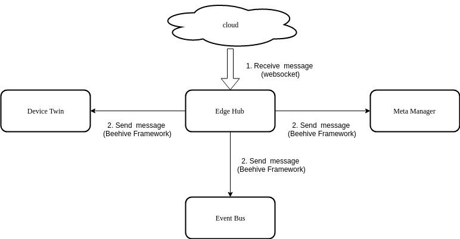

# Edgehub

## Overview

Edge hub is responsible for interacting with CloudHub component present in the cloud. It can connect to the CloudHub using either a web-socket connection or using [QUIC](https://quicwg.org/ops-drafts/draft-ietf-quic-applicability.html) protocol.
It supports functions like sync cloud side resources update, report edged side host and device status changes.

It acts as the communication link between the edge and the cloud.
It forwards the messages received from the cloud to the corresponding module at the edge and vice-versa.

The main functions performed by edgehub are :-

- Get CloudHub URL
- Keep Alive
- Publish Client Info
- Route to Cloud 
- Route to Edge


## Get CloudHub URL

The main responsibility of get cloudHub URL is to contact the placement server and get the URL of cloudHub.   

1. A HTTPS client is created using the certificates provided 
2. A get request is sent to the placement URL 
3. ProjectID and NodeID are added to the body of the response received from the placement URL to form the cloudHub URL.

```go
bodyBytes, _ := ioutil.ReadAll(resp.Body)
url := fmt.Sprintf("%s/%s/%s/events", string(bodyBytes), ehc.config.ProjectID, ehc.config.NodeID)
```
## Keep Alive

A keep-alive message or heartbeat is sent to cloudHub after every heartbeatPeriod.


## Publish Client Info

- The main responsibility of publish client info is to inform the other groups or modules regarding the status of connection to the cloud.

- It sends a beehive message to all groups (namely metaGroup, twinGroup and busGroup), informing them whether cloud is connected or disconnected. 


## Route To Cloud 

The main responsibility of route to cloud is to receive from the other modules (through beehive framework), all the
messages that are to be sent to the cloud, and send them to cloudHub through the websocket connection.
 
The major steps involved in this process are as follows :-

1. Continuously receive messages from beehive Context 
2. Send that message to cloudHub 
3. If the message received is a sync message then :
 
 	3.1 If response is received on syncChannel then it creates a map[string] chan containing the messageID of the message as key
	    
	3.2 It waits for one heartbeat period to receive a response on the channel created, if it does not receive any response on the channel within the specified time then it times out.
	     
	3.3 The response received on the channel is sent back to the module using the SendResponse() function.


## Route To Edge

The main responsibility of route to edge is to receive messages from the cloud (through the websocket connection) and
send them to the required groups through the beehive framework.

The major steps involved in this process are as follows :-

- Receive message from cloudHub

- Check whether the route group of the message is found.

- Check if it is a response to a SendSync() function.

- If it is not a response message then the message is sent to the required group

- If it is a response message then the message is sent to the syncKeep channel




## Usage

EdgeHub can be configured to communicate in two ways as mentioned below:

- **Through websocket protocol**: Click [here](https://github.com/kubeedge/kubeedge/blob/master/docs/proposals/quic-design.md#edgehub-connect-to-cloudhub-through-websocket-protocol) for details.
- **Through QUIC protocol**: Click [here](https://github.com/kubeedge/kubeedge/blob/master/docs/proposals/quic-design.md#edgehub-connect-to-cloudhub-through-quic) for details.