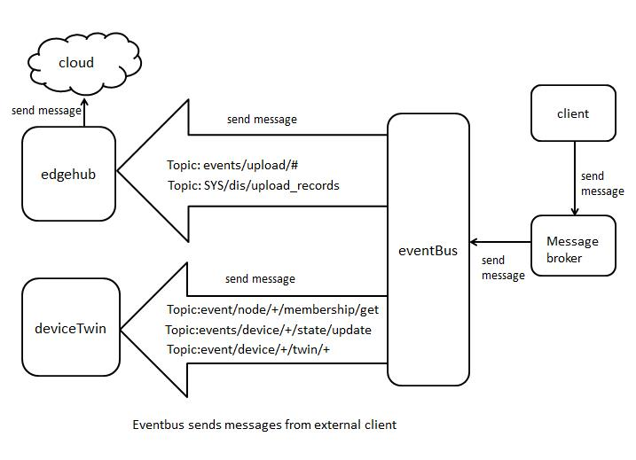
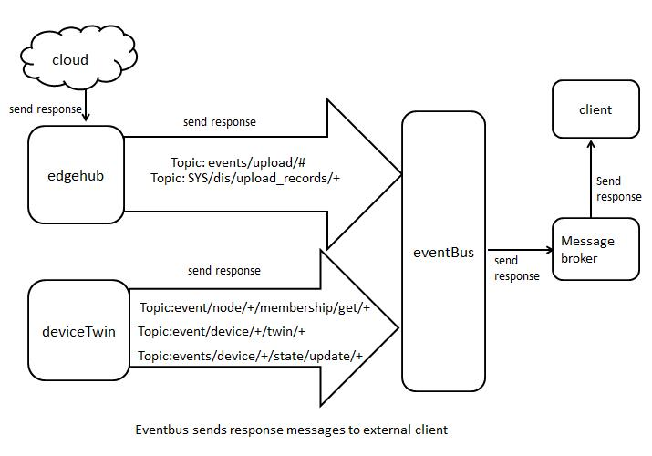

# EventBus
## Overview
Eventbus acts as an interface for sending/receiving messages on mqtt topics.

It supports 3 kinds of mode:
- internalMqttMode
- externalMqttMode 
- bothMqttMode
## Topic
eventbus subscribes to the following topics:
```
- $hw/events/upload/#
- SYS/dis/upload_records
- SYS/dis/upload_records/+
- $hw/event/node/+/membership/get
- $hw/event/node/+/membership/get/+
- $hw/events/device/+/state/update
- $hw/events/device/+/state/update/+
- $hw/event/device/+/twin/+
```
Note: topic wildcards

| wildcard  |  Description |
|---|---|
| #  |  It must be the last character in the topic, and matches the current tree and all subtrees. |
| +  |  It matches exactly one item in the topic tree. |


## Flow chart
### **1. eventbus sends messages from external client**


### **2. eventbus sends response messages to external client**



