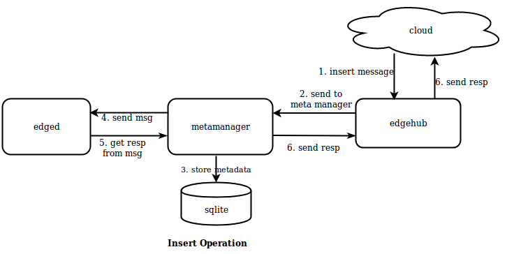
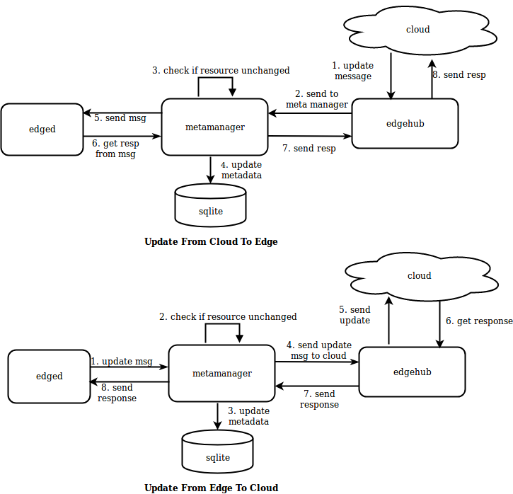
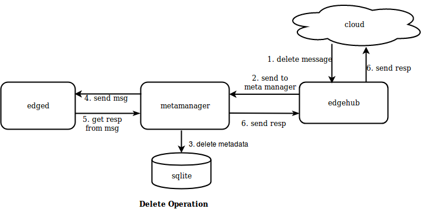
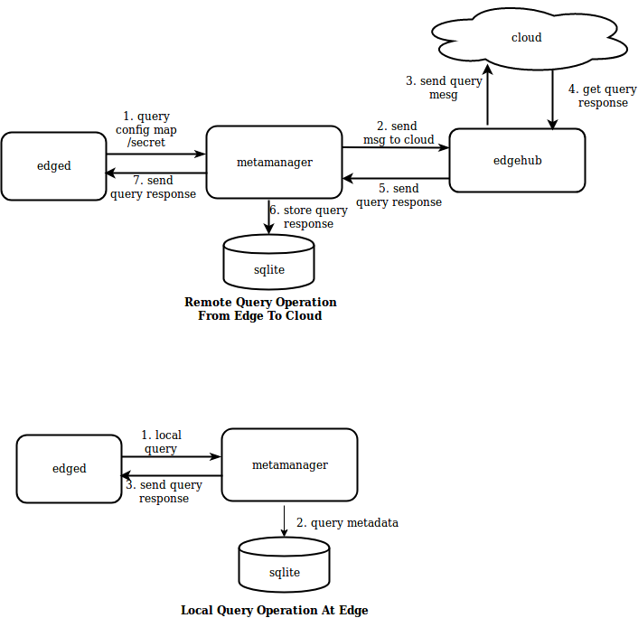

# MetaManager
## Overview
MetaManager is the message processor between edged and edgehub.
It's also responsible for storing/retrieving metadata to/from a lightweight database(SQLite).

Metamanager receives different types of messages based on the operations listed below :
- Insert
- Update
- Delete
- Query
- Response
- NodeConnection
- MetaSync

## Insert Operation
`Insert` operation messages are received via the cloud when new objects are created.
An example could be a new user application pod created/deployed through the cloud.



The insert operation request is received via the cloud by edgehub. It dispatches the
request to the metamanager which saves this message in the local database.
metamanager then sends an asynchronous message to edged. edged processes the insert request e,g.
by starting the pod and populates the response in the message.
metamanager inspects the message, extracts the response and sends it back to edged
which sends it back to the cloud.

## Update Operation
`Update` operations can happen on objects at the cloud/edge.

The update message flow is similar to an insert operation. Additionally, metamanager checks if the resource being updated has changed locally. 
If there is a delta, only then the update is stored locally and the message is 
passed to edged and response is sent back to the cloud.



## Delete Operation
`Delete` operations are triggered when objects like pods are deleted from the 
cloud.



## Query Operation
`Query` operations let you query for metadata either locally at the edge or for some remote resources like config maps/secrets from the cloud. edged queries this
metadata from metamanager which further handles local/remote query processing and
returns the response back to edged. A Message resource can be broken into 3 parts 
(resKey,resType,resId) based on separator ‘/’.



## Response Operation
`Responses` are returned for any operations performed at the cloud/edge. Previous operations
showed the response flow either from the cloud or locally at the edge.

## NodeConnection Operation
`NodeConnection` operation messages are received from edgeHub to give information about the cloud connection status. metamanager tracks this state in-memory and uses it in certain operations
like remote query to the cloud.

## MetaSync Operation
`MetaSync` operation messages are periodically sent by metamanager to sync the status of the
pods running on the edge node. The sync interval is configurable in `conf/edge.yaml` 
( defaults to `60` seconds ).

```yaml
meta:
    sync:
        podstatus:
            interval: 60 #seconds
```
