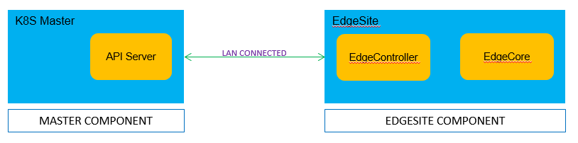

# EdgeSite: Standalone Cluster at edge

## Abstract

In Edge computing, there are scenarios where customers would like to have a whole cluster installed at edge location. As a result,
admins/users can leverage the local control plane to implement management functionalities and take advantages of all edge computing's benefits.

EdgeSite helps running lightweight clusters at edge.

## Motivation

There are scenarios user need to run a standalone Kubernetes cluster at edge to get full control and improve the offline scheduling capability. There are two scenarios user need to do that:

* The edge cluster is in CDN instead of the user's site

  The CDN sites usually be large around the world and the network connectivity and quality cannot be guaranteed. Another factor is that the application deployed in CDN edge do not need to interact with center usually. For those deploy edge cluster in CDN resources, they need to make sure the cluster is workable without the connection with central cloud not only for the deployed applicatons but also the schedule capabilities. So that the CDN edge is manageable regardless the connection to one center.

* User need to deploy an edge environment with limited resources and offline running for most of the time

  In some IOT scenarios, user need to deploy a full control edge environment and running offline.

For these use cases, a standalone, full controlled, light weight Edge cluster is required.
By integrating KubeEdge and standard Kubernetes, this EdgeSite enables customers to run an efficient kubernetes cluster for Edge/IOT computing. 

## Assumptions

Here we assume a cluster is deployed at edge location including the management control plane.
For the management control plane to manage some scale of edge worker nodes, the hosting master node needs to have sufficient resources.

The assumptions are

1. EdgeSite cluster master node is of no less than 2 CPUs and no less than 1GB memory
2. If high availability is required, 2-3 master nodes are needed at different edge locations
3. The same Kubernetes security (authN and authZ) mechanisms are used to ensure the secure handshake between master and worker nodes
4. The same K8s HA mechanism is to be used to enable HA

## Architecture Design


## Advantages

With the integration, the following can be enabled

1. Full control of Kubernetes cluster at edge
2. Light weight control plane and agent
3. Edge worker node autonomy in case of network disconnection/reconnection
4. All benefits of edge computing including latency, data locality, etc.

## Getting Started

### Setup



### Steps for K8S (API server) Cluster

+ [Install docker](https://docs.docker.com/install/)

+ [Install kubeadm/kubectl](https://kubernetes.io/docs/setup/independent/install-kubeadm/)

+ [Creating cluster with kubeadm](<https://kubernetes.io/docs/setup/independent/create-cluster-kubeadm/>)

+ After initializing Kubernetes master, we need to expose insecure port 8080 for edgecontroller/kubectl to work with http connection to Kubernetes apiserver.
  Please follow below steps to enable http port in Kubernetes apiserver.

    ```shell
    vi /etc/kubernetes/manifests/kube-apiserver.yaml
    # Add the following flags in spec: containers: -command section
    - --insecure-port=8080
    - --insecure-bind-address=0.0.0.0
    ```

+ (**Optional**)KubeEdge also supports https connection to Kubernetes apiserver. Follow the steps in [Kubernetes Documentation](https://kubernetes.io/docs/tasks/access-application-cluster/configure-access-multiple-clusters/) to create the kubeconfig file.

  Enter the path to kubeconfig file in controller.yaml

  ```yaml
  controller:
    kube:
      ...
      kubeconfig: "path_to_kubeconfig_file" #Enter path to kubeconfig file to enable https connection to k8s apiserver
  ```

### Steps for EdgeSite

#### Getting EdgeSite Binary

##### Using Source code

+ Clone KubeEdge (EdgeSite) code

  ```shell
  git clone https://github.com/kubeedge/kubeedge.git $GOPATH/src/github.com/kubeedge/kubeedge
  ```

+ Build EdgeSite

  ```shell
  cd $GOPATH/src/github.com/kubeedge/kubeedge/edgesite
  make
  ```

##### Download Release packages

  TBA

#### Configuring EdgeSite

Modify [edgeSite.yaml](https://github.com/kubeedge/kubeedge/blob/master/edgesite/conf/edgeSite.yaml) configuration file, with the IP address of K8S API server

+ Configure K8S (API Server)
  
  Replace `localhost` at `controller.kube.master` with the IP address

  ```yaml
  controller:
    kube:
      master: http://localhost:8080
      ...
  ```

+ Add EdgeSite (Worker) Node ID/name

  Replace `fb4ebb70-2783-42b8-b3ef-63e2fd6d242e` with an unique edge id/name in below fields :
    - `controller.kube.node-id`
    - `controller.edged.hostname-override`
  
  ```yaml
  controller:
    kube:
      ...
      node-id: fb4ebb70-2783-42b8-b3ef-63e2fd6d242e
      node-name: fb4ebb70-2783-42b8-b3ef-63e2fd6d242e
      ...
    edged:
      ...
      hostname-override: fb4ebb70-2783-42b8-b3ef-63e2fd6d242e
      ...
  ```

+ Configure MQTT (**Optional**)

  The Edge part of KubeEdge uses MQTT for communication between deviceTwin and devices. KubeEdge supports 3 MQTT modes:

  1) internalMqttMode: internal mqtt broker is enabled. (Default)
  2) bothMqttMode: internal as well as external broker are enabled.
  3) externalMqttMode: only external broker is enabled.

  Use mode field in [edgeSite.yaml](https://github.com/kubeedge/kubeedge/blob/master/edgesite/conf/edgeSite.yaml#L4) to select the desired mode.

  ```yaml
  mqtt:
    ...
    mode: 0 # 0: internal mqtt broker enable only. 1: internal and external mqtt broker enable. 2: external mqtt broker enable only.
    ...
  ```

  To use KubeEdge in double mqtt or external mode, you need to make sure that [mosquitto](https://mosquitto.org/) or [emqx edge](https://www.emqx.io/downloads/edge) is installed on the edge node as an MQTT Broker.

#### Run EdgeSite

  ```shell
    # run edgesite
    # `conf/` should be in the same directory as the cloned KubeEdge repository
    # verify the configurations before running edgesite
    ./edgesite
    # or
    nohup ./edgesite > edgesite.log 2>&1 &
  ```

**Note:** Please run edgesite using the users who have root permission.

### Deploy EdgeSite (Worker) Node to K8S Cluster

We have provided a sample node.json to add a node in kubernetes. Please make sure edgesite (worker) node is added to k8s api-server. 
Run below steps:

+ Modify node.json
  
  Replace `fb4ebb70-2783-42b8-b3ef-63e2fd6d242e` in [node.json](https://github.com/kubeedge/kubeedge/blob/master/build/node.json#L5) file, to the id/name of the edgesite node. ID/Name should be same as used before while updating `edgesite.yaml`

  ```json
    {
      "metadata": {
        "name": "fb4ebb70-2783-42b8-b3ef-63e2fd6d242e",
      }
    }
  ```

+ Add node in K8S API server
  
  In the console execute the below command

    ```shell
      kubectl apply -f $GOPATH/src/github.com/kubeedge/kubeedge/build/node.json
    ```

+ Check node status

  Below command to check the edgesite node status.

  ```shell
    kubectl get nodes

    NAME         STATUS     ROLES    AGE     VERSION
    testing123   Ready      <none>   6s      0.3.0-beta.0
  ```

  Observe the edgesite node is in `Ready` state

### Deploy Application

  Try out a sample application deployment by following below steps.

  ```shell
  kubectl apply -f $GOPATH/src/github.com/kubeedge/kubeedge/build/deployment.yaml
  ```

  **Note:** Currently, for edgesite node, we must use hostPort in the Pod container spec so that the pod comes up normally, or the pod will be always in ContainerCreating status. The hostPort must be equal to containerPort and can not be 0.

  Then you can use below command to check if the application is normally running.

  ```shell
    kubectl get pods
  ```