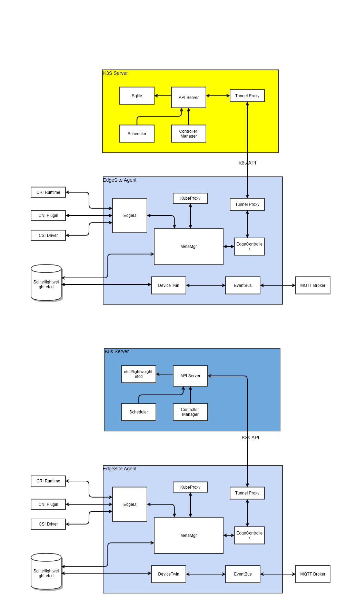

# EdgeSite: Lightweight Cluster at edge

## Abstract
In Edge computing, there are scenarios where customers would like to have a whole cluster installed at edge location. As a result, 
admins/users can leverage the local control plane to implement management functionalities and take advantages of all edge computing's benefits. 

This design doc is to enable customers deploy and run lightweight clusters at edge. 

## Motivation
For these use cases, when considering large set of edge locations, the resource usage of management plane adding together will be high. 
K3s is an opensource project enabling lightweight Kubernetes cluster including the light control plane and worker components. 
KubeEdge is the other opensource project enabling lightweight k8s client on the edge nodes. The KubeEdge agent runtime memory footprint is 
10MB and it supports Kubernetes primitives. Meanwhile KubeEdge is targeted for Edge/IOT computing with many functionality enablements. 

By integrating KubeEdge and K3s, this proposal enables customers to run an efficient kubernetes cluster for Edge/IOT computing. 

## Assumptions
Here we assume a cluster is deployed at edge location including the management control plane. 
For the management control plane to manage some scale of edge worker nodes, the hosting master node needs to have sufficient resources. 
The assumptions are
1. EdgeSite cluster master node is of no less than 2 CPUs and no less than 1GB memory
2. If high availability is required, 2-3 master nodes are needed at different edge locations
3. The same Kubernetes security (authN and authZ) mechanisms are used to ensure the secure handshake between master and worker nodes
4. The same K8s HA mechanism is to be used to enable HA

## Architecture Design


## Advantages
With the integration, the following can be enabled

1. Light weight control plane and agent
2. Edge worker node autonomy in case of network disconnection/reconnection
3. All benefits of edge computing including latency, data locality, etc.
4. Support large scale of edge clusters without consuming too much resources for control plane

## Protocol 
K8s client library interface will be used. The edgecontroller on each edge node only watches against k8s types for the node itself. 

The informer programming model will be used between EdgeController and APIServer. 
For example:

```go
informer := factory.Core().V1().Pods().Informer()
stopper := make(chan struct{})
defer close(stopper)

informer.AddEventHandler(cache.ResourceEventHandlerFuncs{
    AddFunc: func(obj interface{}) {
        // "k8s.io/apimachinery/pkg/apis/meta/v1" provides an Object
        // interface that allows us to get metadata easily
        mObj := obj.(v1.Object)
        log.Printf("New Pod Added to Store: %s", mObj.GetName())
    },
})
```

And the data can be written to the client side store. 

## Work Items
1. Port current EdgeController code to KubeEdge agent side
2. Remove cloudhub/edgehub 
3. Come up with lightweight etcd
   For lightweight etcd, we keep etcdv3 implementation and remove v2; and some other items.
4. Lightweight kubeproxy on edgecore
5. E2E 


