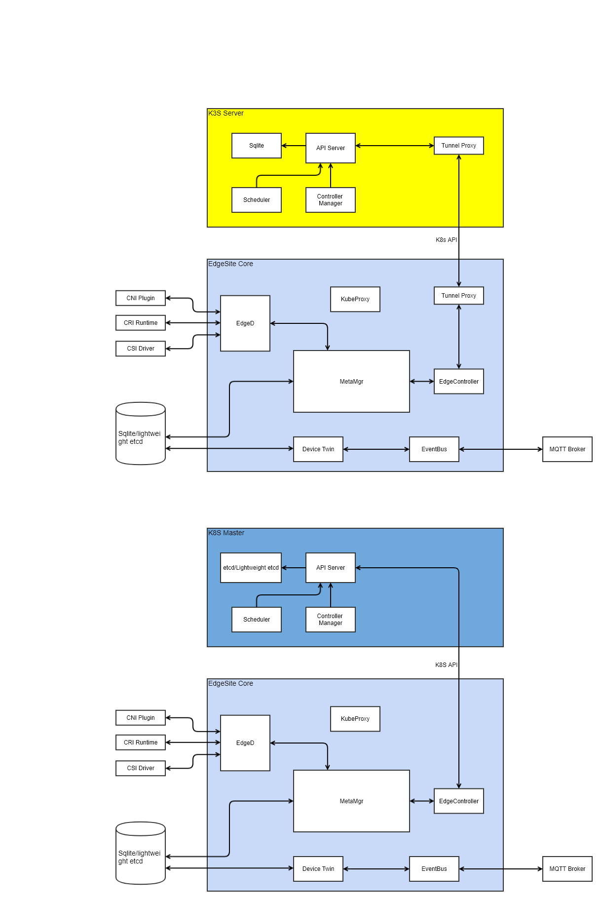

# EdgeSite: Standalone Cluster at edge

## Abstract
In Edge computing, there are scenarios where customers would like to have a whole cluster installed at edge location. As a result, 
admins/users can leverage the local control plane to implement management functionalities and take advantages of all edge computing's benefits. 

This design doc is to enable customers deploy and run lightweight clusters at edge. 

## Motivation
There are scenarios user need to run a standalone Kubernetes cluster at edge to get full control and improve the offline scheduling capability. There are two scenarios user need to do that:

* The edge cluster is in CDN instead of the user's site

  The CDN sites usually be large around the world and the network connectivity and quality cannot be guaranteed. Another factor is that the application deployed in CDN edge do not need to interact with center usually. For those deploy edge cluster in CDN resources, they need to make sure the cluster is workable without the connection with central cloud not only for the deployed applicatons but also the schedule capabilities. So that the CDN edge is manageable regardless the connection to one center.

* User need to deploy an edge environment with limited resources and offline running for most of the time

  In some IOT scenarios, user need to deploy a full control edge environment and running offline.

For these use cases, a standalone, full controlled, light weight Edge cluster is required.
By integrating KubeEdge and standard Kubernetes, this proposal enables customers to run an efficient kubernetes cluster for Edge/IOT computing. User can also leverage other smaller Kubernetes implementation such as K3S to make the footprint even smaller.

## Assumptions
Here we assume a cluster is deployed at edge location including the management control plane. 
For the management control plane to manage some scale of edge worker nodes, the hosting master node needs to have sufficient resources. 
The assumptions are
1. EdgeSite cluster master node is of no less than 2 CPUs and no less than 1GB memory
2. If high availability is required, 2-3 master nodes are needed at different edge locations
3. The same Kubernetes security (authN and authZ) mechanisms are used to ensure the secure handshake between master and worker nodes
4. The same K8s HA mechanism is to be used to enable HA

## Architecture Design


## Advantages
With the integration, the following can be enabled

1. Full control of Kubernetes cluster at edge
2. Light weight control plane and agent
3. Edge worker node autonomy in case of network disconnection/reconnection
4. All benefits of edge computing including latency, data locality, etc.

## Protocol 
K8s client library interface will be used. The edgecontroller on each edge node only watches against k8s types for the node itself. 

The informer programming model will be used between EdgeController and APIServer. 
For example:

```go
informer := factory.Core().V1().Pods().Informer()
stopper := make(chan struct{})
defer close(stopper)

informer.AddEventHandler(cache.ResourceEventHandlerFuncs{
    AddFunc: func(obj interface{}) {
        // "k8s.io/apimachinery/pkg/apis/meta/v1" provides an Object
        // interface that allows us to get metadata easily
        mObj := obj.(v1.Object)
        log.Printf("New Pod Added to Store: %s", mObj.GetName())
    },
})
```

And the data can be written to the client side store. 

## Work Items
1. Port current EdgeController code to KubeEdge agent side
2. Make cloudhub/edgehub optional
3. Come up with lightweight etcd

   For lightweight etcd, we keep etcdv3 implementation and remove v2; and some other items.

4. Lightweight kubeproxy on edgecore
5. E2E 


