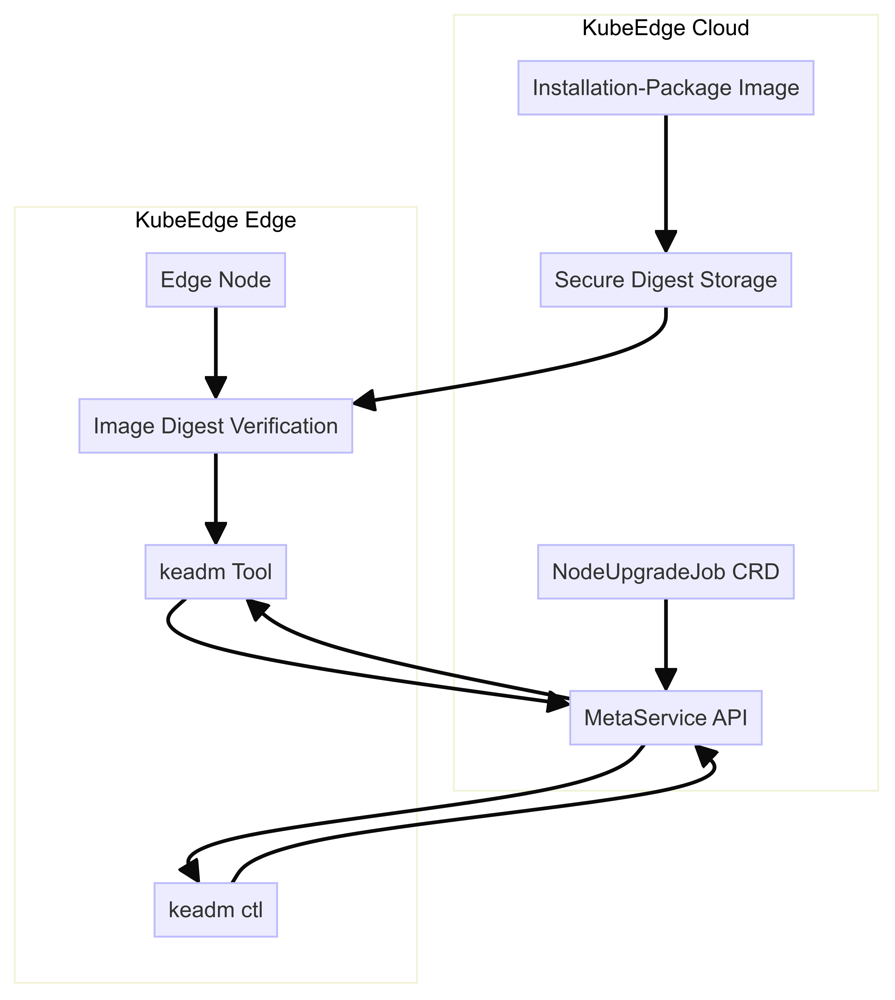

# OTA(Over-The-Air) Upgrades For Edge Node

## Motivation

In order to make the edge node more convenient and rapid upgrade, we introduce a remote upgrade scheme OTA (Over-The-Air) into KubeEdge.In the main process of OTA(i.e. make the bundle, download the bundle, verify the bundle and firmware upgrade), we have realized most steps.Our release will generate a new image version called installation-package, then we use the NodeUpgradeJob CRD to obtain the installation tool keadm in the image and run the command to upgrade the edge node.During this process, if the hacker masquerades the image in the edge node, this will result in the untrusted binary keadm. We need to verify the digest of the image before the keadm executes the upgrade, which is the third step of OTA to verify the bundle.And in some business scenarios (Internet of vehicles, Internet of Things), we also need to provide an option to make the node wait for confirmation from a person with permission before upgrading the edge node.

## Goals

- Update the proposal of the NodeUpgradeJob
- During the edge node upgrade, the keadm can verify the image digest. If the image is invalid, the edge node cannot be upgraded and an error message is reported
- If the edge node upgrade confirmation is enabled, the upgrade cannot be executes before the confirmation and the job will always be waiting
- Users can call the metaserver API or execute command `keadm ctl ...` to confirm the upgrade

## Project framework diagram



## Implementation details
### Validation of the Image Digest Before Edge Node Upgrade

#### Objective
Prevent a hacker from masquerading an image and introducing an untrusted binary by validating the image's digest before the upgrade process begins.
#### Steps
- When the NodeUpgradeJob CRD is used to initiate the upgrade, implement a mechanism to fetch the image's digest from a trusted source (e.g., a secure image registry),and we use `oras-go` tool.
  - First parse the mirror URL by calling `ParseReference` function(e.g., "docker.io/library/ubuntu:latest")
  - Then create a new remote repository instance,if a token is provided,set up the authentication client.
  - Last,Set up the context for the request,and call `Resolve` method to resolve the image reference to get the manifest descriptor.And return the image digest.
- Release image digest:Pass the obtained image digest to the edge using EdgeHub.
  ```go
  type NodeUpgradeJobRequest struct {
      UpgradeID           string
      HistoryID           string
      Version             string
      UpgradeTool         string
      Image               string
      ImageDigest         string
      RequireConfirmation bool
    }
  ```
- Fetch and Compare Digest:Before executing the keadm tool on the edge node, the edge node obtains the digest transmitted from the cloud through a request. Calculate the digest of the locally available image and compare it with the obtained digest.
  ```go
    if upgradeReq.ImageDigest != "" {
      var local string
      local, err = container.GetImageDigest(image)
      if err != nil {
        return err
      }
      if upgradeReq.ImageDigest != local {
        return fmt.Errorf("invalid installation-package image digest value: %s", local)
      }
    }
  ```
- Decision Making:If the digests match, proceed with the upgrade. If they do not match, abort the upgrade process and possibly trigger an alert or a log entry for investigation.

### Add a Field to Define Edge Node Upgrade Confirmation
#### Objective
Allow for manual confirmation before proceeding with the upgrade, especially in critical scenarios like Internet of Vehicles (IoV) or Internet of Things (IoT).
#### Steps
- Configuration Field：Introduce a new field in the NodeUpgradeJob CRD (Custom Resource Definition) to specify whether manual confirmation is required. This field could be named `requireConfirmation` or similar.

    - `yaml` configuration file
    ```yaml
    apiVersion: edge.kubeedge.io/v1alpha1
    kind: NodeUpgradeJob
    metadata:
      name: example-nodeupgradejob
    spec:
      image: "installation-package:latest"
      requireConfirmation: true  # new field
    ```
    - `NodeUpgradeJobSpec` structure definition
    ```go
    type NodeUpgradeJobSpec struct {
        ......
        ......
        ......
        // RequireConfirmation specifies whether you need to confirm the upgrade
        RequireConfirmation bool `json:"requireConfirmation,omitempty"`
    }
    ```
- Upgrade Logic Modification：Modify the upgrade logic to check the value of this new field before starting the upgrade.We add this new field in the `edge/pkg/edgehub/task/taskexecutor/node_upgrade.go` file,the follow is the example:
  ```go
  func initUpgrade(taskReq types.NodeTaskRequest) (event fsm.Event) {
    ......
    ......
    if upgradeReq.RequireConfirmation {
      return fsm.Event{
        Type:   "Confirm",
        Action: api.ActionConfirmation,
        Msg:    "Wait for a confirm for upgrade request on the edge site.",
      }
    }
    return event
  }
  ```

### API in MetaService for Confirming Edge Node Upgrade
#### Objective
Provide a mechanism for authorized personnel to confirm the upgrade manually.
#### Steps
- Register the `confirm-upgrade` service in the `edge/pkg/metamanager/metaserver/server.go`file.
  ```go
    case reqInfo.Verb == "create":
      if reqInfo.Name == "restart" {
          ls.Factory.Restart(reqInfo.Namespace).ServeHTTP(w, req)
        } else if reqInfo.Name == "confirm-upgrade" {
          ls.Factory.ConfirmUpgrade(reqInfo.Name).ServeHTTP(w, req)
        } else {
          ls.Factory.Create(reqInfo).ServeHTTP(w, req)
        }
  ```
- In the `edge/pkg/metamanager/metaserver/handlerfactory/ext_handler.go` file,create the `ConfirmUpgrade` function  which called when registering the service.
  - First call the `limitedReadBody` function to get the `nodeName` parameter.
  - Then store the structure `type.NodeTaskRequest` in the `upgradeJobName` table.
  - Last, execute the command to update the image on the edge and delete the `upgradeJobName` table.

### Command in `keadm ctl` for Confirming Upgrade
#### Objective
Provide a command-line tool for administrators to confirm the upgrade
#### Steps
- Subcommand Development:Add a new subcommand to `keadm ctl` that sends a confirmation signal to the MetaService API. This command could be named something like `confirm`.
  - First we create a new `cobra.Command` structure
  ```go
    cmd := &cobra.Command{
      Use:   "confirm",
      Short: edgeConfirmShortDescription,
      Long:  edgeConfirmShortDescription,
      RunE: func(cmd *cobra.Command, args []string) error {
        // TODO:Call the confirm-upgrade service exposed by metaserver through the post method of kubernetes client。
      },
    }
  ```
- Command Example:`keadm ctl confirm --edgenode-name=<node_name>`