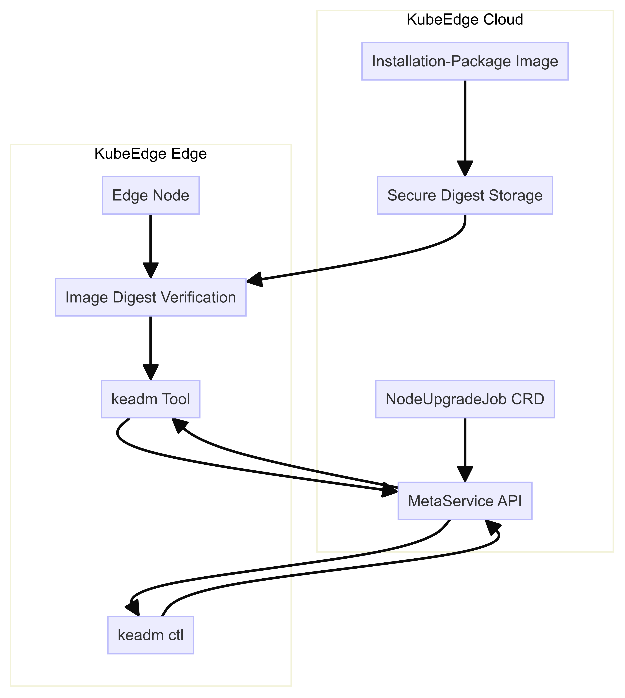

# OTA(Over-The-Air) Upgrades For Edge Node

## Motivation

In order to make the edge node more convenient and rapid upgrade, we introduce a remote upgrade scheme OTA (Over-The-Air) into KubeEdge.In the main process of OTA(i.e. make the bundle, download the bundle, verify the bundle and firmware upgrade), we have realized most steps.Our release will generate a new image version called installation-package, then we use the NodeUpgradeJob CRD to obtain the installation tool keadm in the image and run the command to upgrade the edge node.During this process, if the hacker masquerades the image in the edge node, this will result in the untrusted binary keadm. We need to verify the digest of the image before the keadm executes the upgrade, which is the third step of OTA to verify the bundle.And in some business scenarios (Internet of vehicles, Internet of Things), we also need to provide an option to make the node wait for confirmation from a person with permission before upgrading the edge node.

## Goals

- Update the proposal of the NodeUpgradeJob
- During the edge node upgrade, the keadm can verify the image digest. If the image is invalid, the edge node cannot be upgraded and an error message is reported
- If the edge node upgrade confirmation is enabled, the upgrade cannot be executes before the confirmation and the job will always be waiting
- Users can call the metaserver API or execute command `keadm ctl ...` to confirm the upgrade

## Project framework diagram



## Implementation details
### Validation of the Image Digest Before Edge Node Upgrade

#### Objective
Prevent a hacker from masquerading an image and introducing an untrusted binary by validating the image's digest before the upgrade process begins.
#### Steps
- When the NodeUpgradeJob CRD is used to initiate the upgrade, implement a mechanism to fetch the image's digest from a trusted source (e.g., a secure image registry),and we use `oras-go` tool.
**Example**:Registry v2 API
  ```go
  // GetImageDigest retrieves the digest of a given image from a registry
  func getImageDigest(imageURL string, token string) (string, error) {
    // Parse the image reference (e.g., "docker.io/library/ubuntu:latest")
    ref, err := registry.ParseReference(imageURL)
    if err != nil {
      return "", err
    }
    // Create a new remote repository instance
    repository, err := remote.NewRepository(ref.Repository)
    if err != nil {
      return "", err
    }

    // If a token is provided, set up the authentication client
    if token != "" {
      credential := &auth.Credential{
        AccessToken: token,
      }
      repository.Client = &auth.Client{
        Client: retry.DefaultClient,
        Header: http.Header{
          "User-Agent": {"oras-go"},
        },
        Credential: func(ctx context.Context, host string) (auth.Credential, error) {
          return *credential, nil
        },
        Cache:              nil,
        ClientID:           "oras-client",
        ForceAttemptOAuth2: false,
      }
    }
    // Set up the context for the request
    ctx := context.Background()
    // Resolve the image reference to get the manifest descriptor
    descriptor, err := repository.Resolve(ctx, ref.Reference)
    if err != nil {
      return "", err
    }

    // Return the image digest
    return descriptor.Digest.String(), nil
  }
  ```
- Release image digest:Pass the obtained image digest to the edge using EdgeHub.
  ```go
  type NodeUpgradeJobRequest struct {
      UpgradeID           string
	  HistoryID           string
	  Version             string
	  UpgradeTool         string
	  Image               string
	  ImageDigest         string
	  RequireConfirmation bool
    }
  ```
- Fetch and Compare Digest:Before executing the keadm tool on the edge node, the edge node obtains the digest transmitted from the cloud through a `request` request. Calculate the digest of the locally available image and compare it with the obtained digest.
- Decision Making:If the digests match, proceed with the upgrade. If they do not match, abort the upgrade process and possibly trigger an alert or a log entry for investigation.

### Add a Field to Define Edge Node Upgrade Confirmation
#### Objective
Allow for manual confirmation before proceeding with the upgrade, especially in critical scenarios like Internet of Vehicles (IoV) or Internet of Things (IoT).
#### Steps
- Configuration Field：Introduce a new field in the NodeUpgradeJob CRD (Custom Resource Definition) to specify whether manual confirmation is required. This field could be named `requireConfirmation` or similar.

    - `yaml` configuration file
    ```yaml
    apiVersion: edge.kubeedge.io/v1alpha1
    kind: NodeUpgradeJob
    metadata:
      name: example-nodeupgradejob
    spec:
      image: "installation-package:latest"
      requireConfirmation: true  # new field
    ```
    - `NodeUpgradeJobSpec` structure definition
    ```go
    type NodeUpgradeJobSpec struct {
        ......
        ......
        ......
        // RequireConfirmation specifies whether you need to confirm the upgrade
        RequireConfirmation bool `json:"requireConfirmation,omitempty"`
    }
    ```
- Upgrade Logic Modification：Modify the upgrade logic to check the value of this new field before starting the upgrade.We add this new field in the `edge/pkg/edgehub/task/taskexecutor/node_upgrade.go` file,the follow is the example:
  ```go
  func initUpgrade(taskReq types.NodeTaskRequest) (event fsm.Event) {
    ......
    ......
    if upgradeReq.RequireConfirmation {
      return fsm.Event{
        Type:   "Confirm",
        Action: api.ActionConfirmation,
        Msg:    "Wait for a confirm for upgrade request on the edge site.",
      }
    }
    return event
  }
  ```

### API in MetaService for Confirming Edge Node Upgrade
#### Objective
Provide a mechanism for authorized personnel to confirm the upgrade manually.
#### Steps
- API Endpoint：Develop a new API endpoint in the MetaService that can receive a confirmation signal.
- Integration with Upgrade Process：Integrate this API with the upgrade process so that upon receiving a valid confirmation, the upgrade process can resume.

  The example code in `edge/pkg/metamanager/metaserver/handlerfactory/ext_handler.go`:
  ```go
  func (f *Factory) ConfirmUpgrade(_ /*edgeappName*/ string) http.Handler {
    h := http.HandlerFunc(func(w http.ResponseWriter, req *http.Request) {
      klog.Infof("Begin to run upgrade command")
      var upgradeReq commontypes.NodeUpgradeJobRequest
      var configFile string
      var nodeTaskReq types.NodeTaskRequest// Can we save parameter in the meta and delete it when upgrading ends?
      upgradeCmd := fmt.Sprintf("keadm upgrade edge --upgradeID %s --historyID %s --fromVersion %s --toVersion %s --config %s --image %s > /tmp/keadm.log 2>&1",
        upgradeReq.UpgradeID, upgradeReq.HistoryID, version.Get(), upgradeReq.Version, configFile, upgradeReq.Image)

      executor, _ := taskexecutor.GetExecutor(taskexecutor.TaskUpgrade)
      event, _ := executor.Do(nodeTaskReq)
      klog.Info("Confirm Upgrade:" + event.Type + "," + event.Msg)
      // run upgrade cmd to upgrade edge node
      // use nohup command to start a child progress
      command := fmt.Sprintf("nohup %s &", upgradeCmd)
      cmd := exec.Command("bash", "-c", command)
      s, err := cmd.CombinedOutput()
      if err != nil {
        http.Error(w, fmt.Sprintf("run upgrade command %s failed: %v, res: %s", command, err, s),
          http.StatusInternalServerError)
        return
      }
      klog.Infof("!!! Finish upgrade from Version %s to %s ...", version.Get(), upgradeReq.Version)
      // TODO: How to proceed backup and rollback ...
    })
    return h
  }
  ```
### Command in `keadm ctl` for Confirming Upgrade
#### Objective
Provide a command-line tool for administrators to confirm the upgrade
#### Steps
- Subcommand Development:Add a new subcommand to `keadm ctl` that sends a confirmation signal to the MetaService API. This command could be named something like `confirm`.
- Usage Instructions:`keadm ctl confirm --node=<node_name>`

