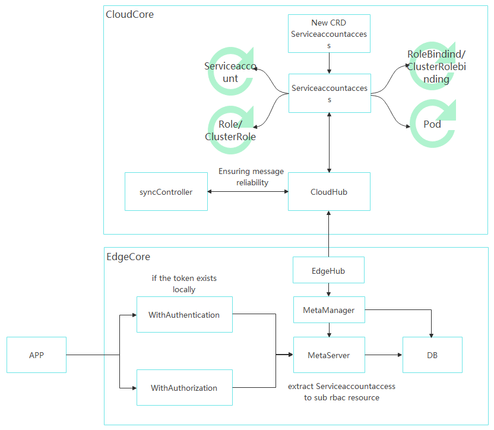

## Enabling authentication and RBAC authorization within the MetaServer on the edge node.

- [Summary](#summary)
- [Motivation](#motivation)
  - [Goals](#goals)
  - [Non-goals](#non-goals)
- [Design Details](#design-details)
  - [Architecture](#architecture)
- [API](#api)
- [Before using](#before-using)
- [Test Cases](#test-cases)
- [Plan](#plan)

### Summary

Currently, the Edge Native K8s API access is implemented through MetaServer on the edge node. However, the authentication and authorization processes are performed in the cloud, which prevents authentication and authorization in offline scenarios on the edge node.
To address this, the authentication and authorization functionalities are now implemented within MetaServer. During authentication, the token's plaintext fields are decoded using base64 to ensure consistency between the token and the pod. As for token signature verification, since the edge node doesn't store the token's associated public key, it checks the existence of the token in the edge node's database to validate its legitimacy.
For RBAC authorization, the logic aligns with the authentication process in Kubernetes. The newly added CRD resource, ServiceAccountAccess, includes all the RBAC resources associated with the corresponding ServiceAccount (including ServiceAccount, Role, ClusterRole, RoleBinding, and ClusterRoleBinding). Using the controller-runtime framework, these associated resources are reconciled and dynamically deployed to the respective edge nodes. The edge nodes parse the resources to obtain the corresponding RBAC resources and implement the WithAuthorization interface in MetaServer's handler to enable RBAC authorization.

### Motivation

It is recommended to restrict the permissions of edge applications for users with high security requirements. Edge containers should be started with non-root privileges, and critical host directories like the SQLite DB directory should not be mounted inside the container.

This feature allows for limiting the access permissions of edge applications when accessing native Kubernetes APIs through MetaServer.

##### Goals

- Perform authentication and authorization for API access on the edge node.

##### Non-goals

- Updating the newly added CRD resource to enable RBAC policy distribution.

### Design Details

#### Architecture



##### On the cloud：

- The newly added CRD resource is automatically synchronized with ServiceAccount without requiring user intervention.
- Leverage the controller-runtime framework to dynamically list/watch the associated RBAC resources.
- The CRD is created automatically and synchronized with RBAC data when Pods are created on the edge node.
- The syncController guarantees the reliable delivery of resources.
- Rbac resource garbage clean up

##### On the edge

- Receive K8s resources sent from the cloud and store them in the DB.
- Implement WithAuthorization / WithAuthentication interface within MetaServer. During authentication, the token's plaintext fields are decoded using base64 to ensure consistency between the token and the pod. As for token signature verification, since the edge node doesn't store the token's associated public key, it checks the existence of the token in the edge node's database to validate its legitimacy. For RBAC authorization, the logic aligns with the authentication process in Kubernetes.

### API

GVK: policy.kubeedge.io/v1alpha1, Kind=ServiceAccountAccess

```
// +genclient
// +k8s:deepcopy-gen:interfaces=k8s.io/apimachinery/pkg/runtime.Object
// +kubebuilder:object:root=true
// +kubebuilder:subresource:status
// +kubebuilder:resource:shortName=saaccess

// ServiceAccountAccess is the Schema for the ServiceAccountAccess API
type ServiceAccountAccess struct {
	metav1.TypeMeta   `json:",inline"`
	metav1.ObjectMeta `json:"metadata,omitempty"`

	// Spec represents the specification of rbac.
	// +required
	Spec AccessSpec `json:"spec,omitempty"`

	// Status represents the node list which store the rules.
	// +optional
	Status AccessStatus `json:"status,omitempty"`
}

// AccessStatus defines the observed state of ServiceAccountAccess
type AccessStatus struct {
	// NodeList represents the node name which store the rules.
	NodeList []string `json:"nodeList,omitempty"`
}

// +kubebuilder:object:root=true
// +k8s:deepcopy-gen:interfaces=k8s.io/apimachinery/pkg/runtime.Object

// ServiceAccountAccessList contains a list of ServiceAccountAccess
type ServiceAccountAccessList struct {
	metav1.TypeMeta `json:",inline"`
	metav1.ListMeta `json:"metadata,omitempty"`
	Items           []ServiceAccountAccess `json:"items"`
}

// AccessSpec defines the desired state of AccessSpec
type AccessSpec struct {
	// ServiceAccount is one-to-one corresponding relations with the serviceaccountaccess.
	ServiceAccount corev1.ServiceAccount `json:"serviceAccount,omitempty"`
	// ServiceAccountUid is the uid of serviceaccount.
	ServiceAccountUid types.UID `json:"serviceAccountUid,omitempty"`
	// AccessRoleBinding represents rbac rolebinding plus detailed role info.
	AccessRoleBinding []AccessRoleBinding `json:"accessRoleBinding,omitempty"`
	// AccessClusterRoleBinding represents rbac ClusterRoleBinding plus detailed ClusterRole info.
	AccessClusterRoleBinding []AccessClusterRoleBinding `json:"accessClusterRoleBinding,omitempty"`
}

// AccessRoleBinding represents rbac rolebinding plus detailed role info.
type AccessRoleBinding struct {
	// RoleBinding represents rbac rolebinding.
	RoleBinding rbac.RoleBinding `json:"roleBinding,omitempty"`
	// Rules contains role rules.
	Rules []rbac.PolicyRule `json:"rules,omitempty"`
}

// AccessClusterRoleBinding represents rbac ClusterRoleBinding plus detailed ClusterRole info.
type AccessClusterRoleBinding struct {
	// ClusterRoleBinding represents rbac ClusterRoleBinding.
	ClusterRoleBinding rbac.ClusterRoleBinding `json:"clusterRoleBinding,omitempty"`
	// Rules contains role rules.
	Rules []rbac.PolicyRule `json:"rules,omitempty"`
}
```

##### Before using

- Initial CRD

kubectl apply -f build/crds/policy/policy_v1alpha1_serviceaccountaccess.yaml

- Enable featuregate of `requireAuthorization` 

Featuregate of `requireAuthorization` default is false as it is in the alpha stage, follow belowing to enable this gate.
edgecore.yaml:

```
apiVersion: edgecore.config.kubeedge.io/v1alpha1
kind: EdgeCore
featureGates:
  requireAuthorization: true
...
```

cloudcore.yaml:

```
apiVersion: cloudcore.config.kubeedge.io/v1alpha1
kind: CloudCore
featureGates:
  requireAuthorization: true
...
```

### Test Cases

1. Changing the associated ServiceAccount of a running pod.
2. Modifying the rules in a role while a pod is running.
3. Adding a ServiceAccount to a rolebinding while a pod is running.
4. Creating a new rolebinding while a pod is running.
5. Restarting the edgecore.
6. list/watch from MetaServer.

### Plan

- Implement cache indexer for K8s objects on the edge node
- Implement ABAC and other authorization capabilities, including OPA.
