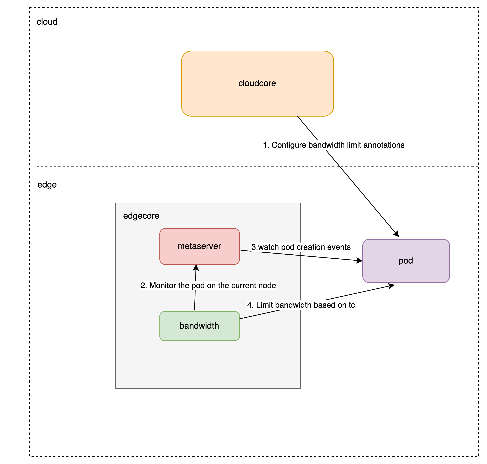

# KubeEdge Support Bandwidth Limit

## Abstract


In native kubernetes, when a container is started, a virtual network is built through the runtime interface to the underlying cni network plug-in and bound to the container. To restrict the network of the container, the underlying layer needs to be restricted by the cni network plug-in,
and the cni network plug-in will submit the network restriction instructions and specific configurations to the Linux traffic control (tc) subsystem. tc contains a set of mechanisms and operations through which data packets queue on the network interface for transmission/reception (token bucket filter TBF),
thereby achieving traffic control.

In this proposal, we plan to implement traffic control function based on edge computing scenarios.

## Motivation

Native Kubernetes relies on CNI plug-ins to implement current limiting. However, in edge computing scenarios, due to the special network environment, it may not support network plug-ins such as flannel and calico.

Therefore, we hope to implement traffic control functions through KubeEdge in edge computing scenarios without relying on CNI.


## Goals

1. Support bridge mode traffic control through annotations
2. Not dependent on CNI plugins.
3. Does not invade or affect other functions of kubeedge.


## Architecture Design




## Detail Design

1）Deployment Configuration：
Add traffic configuration options for application network resources in Deployment configuration：
``` sh
  ingress(Ingress traffic rate limiting)
  egress(Egress traffic rate limiting)
  kubeedge/ingress-bandwidth: 2M
  kubeedge/egress-bandwidth: 3M
```

2）Edgecore-aware traffic limitation：
- The metaserver module of the edgecore relies on the edge to monitor the pod changes (Add, Update, Delete events) of the edge nodes
- The tc module obtains the annotations configuration of the pod based on the metaserver. If a limited flow label configuration is found (key judgment, value cannot be empty), the current limiting operation is performed.

3）Get the network card of the application container：
The current container network mode is bridge bridging, which directly obtains the network card interface through the container；
``` sh
# Get PID
CONTAINER_ID="%s"
PID=$(ctr -n k8s.io tasks ls | grep $CONTAINER_ID | awk '{print $2}' | tr -d '\n')

# Enter the network namespace and extract eth0@if
IFACE_NAME=$(nsenter -t $PID -n ip a | grep 'eth0@if' | awk '{print $2}' | tr -d '\n')

# Output interface name
echo "$IFACE_NAME"
```

4）Bandwidth limiting configuration
If the current container network mode is bridge, configure it on the virtual network interface；
``` sh
tc qdisc add dev vethdd8cdba root handle 1: tbf rate 4Mbit burst 5kb latency 5ms
```

## Implementation Details
1）Add a bandwidth directory under the edged module to control the bandwidth limiting function based on a BandwidthManager flag, which defaults to false.

2）In the edgecore configuration file, add the "bandwidthManager" configuration item under the edged module.
``` sh
......
  edged:
    containerRuntime: remote
    enable: true
    hostnameOverride: test-node-1ias5j8vd
    masterServiceNamespace: default
    maxContainerCount: -1
    maxPerPodContainerCount: 1
    minimumGCAge: 0s
    bandwidthManager: true
```


