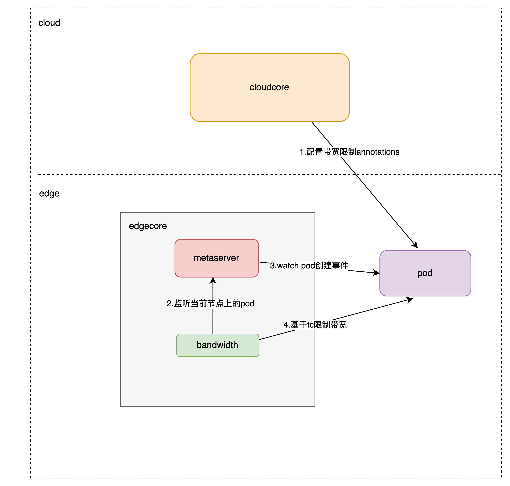

# KubeEdge Support Bandwidth Limit

## Abstract


在原生kubernetes里，容器启动时，是通过运行时接口对底层cni网络插件来构建虚拟网络，bind到容器实现。对容器进行网络限制，底层需要cni网络插件的限制，而cni网络插件会将网络限制指令，将具体配置提交给 Linux 流量控制 (tc)子系统。
tc包含一组机制和操作，数据包通过这些机制和操作在网络接口上排队等待传输/接收（令牌桶过滤器TBF），从而达到流量控制。

在本提案中，我们计划基于边缘计算场景实现流量控制功能。

## Motivation

原生kubernetes是依赖于CNI插件实现限流，但在边缘计算场景下，因为网络环境特殊，不一定能支持像flannel、calico这些网络插件。

因此，我们希望能够在边缘计算场景下，通过KubeEdge实现流量控制功能，不依赖于CNI。


## Goals

1. 通过annotions的方式支持bridge模式的流量控制
2. 不依赖CNI插件.
3. 不侵入和影响kubeedge其它功能.


## Architecture Design




## Detail Design

1）Deployment配置：
在Deployment配置中针对应用的网络资源添加流量配置选项功能，细分为两个维度：
``` sh
  ingress(入口流量速率限制)
  egress(出口流量速率限制)
  kubeedge/ingress-bandwidth: 2M
  kubeedge/egress-bandwidth: 3M
```

2）edgecore感知到流量限制配置：
- 依赖边端的edgecore的metamanager模块监听边端节点的pod变化(Add、Update、Delete事件)
- tc模块基于metamanager获取pod的annotions配置，如果发现有限流标签配置(key判断，value不能为空)，执行限流操作

3）获取应用容器的网卡：
当前容器网络模式是bridge桥接，直接通过当前容器获取网卡接口；
``` sh
# 获取 PID
CONTAINER_ID="%s"
PID=$(ctr -n k8s.io tasks ls | grep $CONTAINER_ID | awk '{print $2}' | tr -d '\n')

# 进入网络命名空间并提取 eth0@if
IFACE_NAME=$(nsenter -t $PID -n ip a | grep 'eth0@if' | awk '{print $2}' | tr -d '\n')

# 输出接口名称
echo "$IFACE_NAME"
```

4）限流配置
如果当前容器网络模式是bridge桥接，配置到虚拟网卡上；
``` sh
tc qdisc add dev vethdd8cdba root handle 1: tbf rate 4Mbit burst 5kb latency 5ms
```

## Implementation Details
1）在edge/pkg目录下添加bandwidth目录，注册 "带宽限流" 模块， 其中moudleName(tc)、groupName(bandwith)。

2）edgecore的配置文件里，添加 "BandwidthManager"配置模块。
``` sh
......
  serviceBus:
    enable: false
    port: 9060
    server: 127.0.0.1
    timeout: 60
  bandwidthManager:
    enable: true
```


