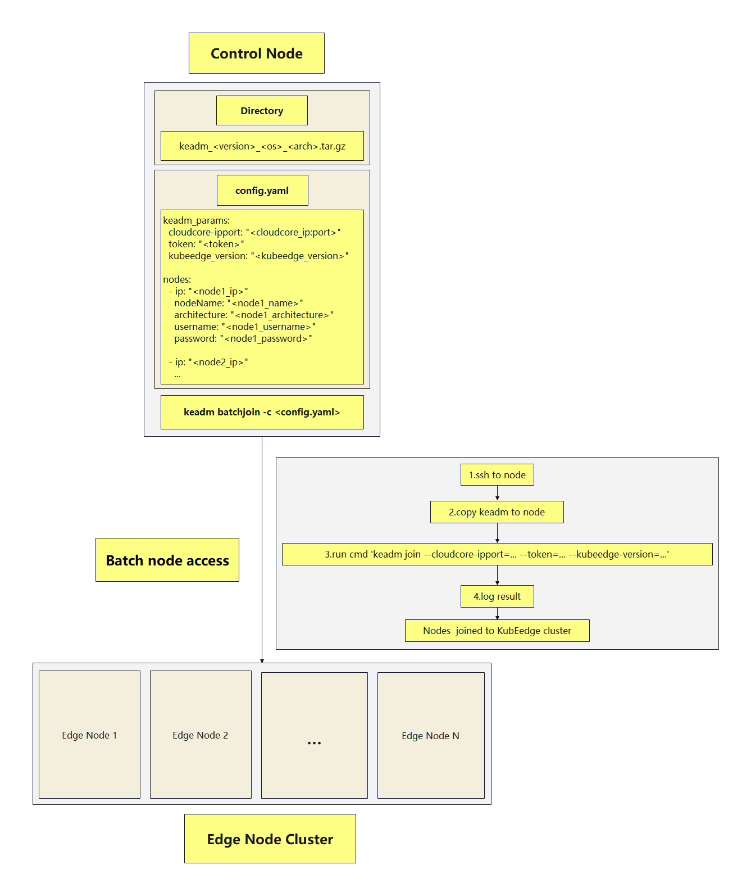

- [Motivation](#motivation)
- [Goals](#goals)
- [Proposal](#proposal)
- [Use Cases](#use-cases)
- [Design overview](#design-overview)
- [Implementation Details](#implementation-details)
    - [Preparation](#preparation)
    - [Keadm tool acquisition and preparation](#keadm-tool-acquisition-and-preparation)
    - [Configuration file preparation](#configuration-file-preparation)
    - [Source code modification and new command addition](#source-code-modification-and-new-command-addition)
    - [Logic for implementing batch access](#logic-for-implementing-batch-access)
    - [Logging](#logging)
- [Road map](#road-map)

## Motivation

This proposal aims to solve the node access efficiency problem on the current KubeEdge edge computing platform.

- The current KubeEdge only supports manual single-node access, which is cumbersome and time-consuming for large-scale deployment of edge nodes, and batch node access needs to be realized to improve efficiency.


## Goals

Batch access to edge nodes in the KubeEdge system:

- Simplifies node access operations, improves deployment efficiency, and ensures system stability and reliability.


## Proposal

- **Configuration file support:** Supports configuration files in YAML format, containing information such as the CloudCore address, authentication token, KubeEdge version, etc. required for each node connection.
- **Development automation tools:** Read edge node information from the configuration file and connect each node automatically to dynamically build the `keadm batchjoin` command.
- **Logging:** Records the status and execution results of each node registration, generating log files for tracking and review.


## Use Cases

- **New Node Deployment:** When a large number of new edge nodes are needed to access the KubeEdge system, the registration and configuration of nodes can be completed quickly, saving a lot of labor and time costs.

- **System Expansion:** When the system needs to be expanded, new edge nodes can be quickly integrated into the existing KubeEdge cluster to ensure system scalability and extensibility.


## Design overview




## Implementation Details

#### Preparation

- On the control node, verify the IP addresses that can reach each edge node by using the ping command.

#### Keadm tool acquisition and preparation

- Confirm the existence and configuration of the keadm tools on the control node, and if there is no tar.gz package that conforms to the naming convention, download the required keadm tools from the GitHub release.

#### Configuration file preparation

Create a YAML-formatted configuration file `config.yaml` to store all edge node information that needs to be accessed in batches.

**nodes**: contains details of each edge node.

- **ip**: The IP address of the edge node.
  - **architecture**: The hardware architecture type of the edge node, such as `amd64`, 'arm', or `arm64`.

  - **username**: the username required to log in to the SSH edge node.

  - **password**: the password required for SSH logging in to the edge node.

  - **EdgeNodeName** (optional): The name icon for each edge node, used to distinguish and identify each node in a cluster.


-  **keadm_params**: Contains details to configure edge node access.
  -  **KubeEdgeVersion**: Specifies the version of Kube Edge to download and use.
  -  **CloudCoreIPPort**: The IP address and port of CloudCore.
  -  **Token**: Token for authentication.
  -  **CertPath**: Certificate path used by EdgeCore.
  -  **RemoteRuntimeEndpoint**: The remote runtime terminal of the edge node.
  -  **CertPort**: The port to apply for the edge node certificate.
  -  **Labels**: Customized node tags.
  -  **ImageRepository**: Mirror Storage.
  -  **HubProtocol**: Communication protocol for edge nodes.
  -  **Sets**: The key value pairs set in the command line.
  -  **CGroupDriver**: The CGroup driver used.
  -  **TarballPath**: The path of the KubeEdge tarball.
  -  **WithMQTT**: Specifies whether to install and start MQTT Broker.

#### Source code modification and new command addition

- Add new command `keadm batchjoin`.


```go
var (
	batchJoinDescription = `
"keadm batchjoin" command bootstraps multiple KubeEdge's worker nodes (at the edge) components.
It will also connect with the cloud component to receive
further instructions and forward telemetry data from
devices to the cloud.
`
	batchJoinExample = `
keadm batchjoin --config=<path to configuration file>

  - For this command --config flag is a required option
  - This command will download and install the specified version of pre-requisites and KubeEdge for all nodes listed in the configuration file
`

func NewBatchJoin() *cobra.Command {
	joinOptions := newOption()
	step := common.NewStep()
	cmd := &cobra.Command{
		Use:          "batchjoin",
		Short:        "Batch join multiple edge nodes to the KubeEdge cluster",
		Long:         batchJoinDescription,
		Example:      batchJoinExample,
		SilenceUsage: true,
		PreRunE: func(cmd *cobra.Command, args []string) error {
			configFilePath, err := cmd.Flags().GetString("config")
			if err != nil {
				return err
			}
			if _, err := os.Stat(configFilePath); os.IsNotExist(err) {
				return fmt.Errorf("configuration file %s does not exist", configFilePath)
			}
			joinOptions.Config = configFilePath
			return nil
		},
		RunE: func(cmd *cobra.Command, args []string) error {
			return batchJoinNodes(joinOptions, step)
		},
	}

	AddJoinOtherFlags(cmd, joinOptions)
	cmd.Flags().StringVarP(&joinOptions.Config, "config", "c", "", "Path to the configuration file")
	cmd.MarkFlagRequired("config")

	return cmd
}

func newOption() *common.JoinOptions {
	joinOptions := &common.JoinOptions{}
	joinOptions.WithMQTT = false
	joinOptions.CGroupDriver = v1alpha2.CGroupDriverCGroupFS
	joinOptions.CertPath = common.DefaultCertPath
	joinOptions.RemoteRuntimeEndpoint = constants.DefaultRemoteRuntimeEndpoint
	joinOptions.HubProtocol = api.ProtocolTypeWS
	return joinOptions
}

func createDirs() error {
	...
	return nil
}

func setEdgedNodeLabels(opt *common.JoinOptions) map[string]string {
	labelsMap := make(map[string]string)
	...
	return labelsMap
}

func createBootstrapFile(opt *common.JoinOptions) error {
	bootstrapFile := constants.BootstrapFile
	...
	return os.WriteFile(bootstrapFile, token, 0640)
}
```

#### Logic for implementing batch access

Load the profile file and use the SSH library (such as `github.com/melbahja/goph`) to mass-connect to each edge node and execute the `keadm join` command.

```go
func batchJoinNodes(opt *common.JoinOptions, step *common.Step) error {
	configFilePath := opt.Config
	step.Printf("Reading configuration from %s\n", configFilePath)
	...
	return nil
}

func readBatchJoinConfig(configFilePath string) (*BatchJoinConfig, error) {
	var config BatchJoinConfig
	data, err := os.ReadFile(configFilePath)
	...
	return &config, nil
}

func joinNode(node NodeConfig, params KeadmParams, step *common.Step) error {
	step.Printf("Joining node %s with IP %s\n", node.EdgeNodeName, node.IP)

	joinCommand := fmt.Sprintf(
		"keadm join --cloudcore-ipport=%s --token=%s --kubeedge-version=%s",
		params.CloudCoreIPPort, params.Token, params.KubeEdgeVersion,
	)
	...
	return nil
}
```

#### Logging

- Implements detailed logging to record the registration status, execution results, and exceptions of each node.


## Road map

#### System Design (7.1-7.15)

- Design of detailed implementation scenarios.

#### Development and Testing (7.16-8.31)

- Write code to implement project functionality.
- Execute tests to verify system functionality.

#### Deployment and Validation (9.1-9.15)

- Deploy the system to the test environment and perform validation.
- Gather feedback and perform problem fixing and optimization.
- Prepare the system for formal deployment.

#### Code tuning and organization (9.16-9.30)

- Code tuning and organization.
- Write comprehensive documentation.