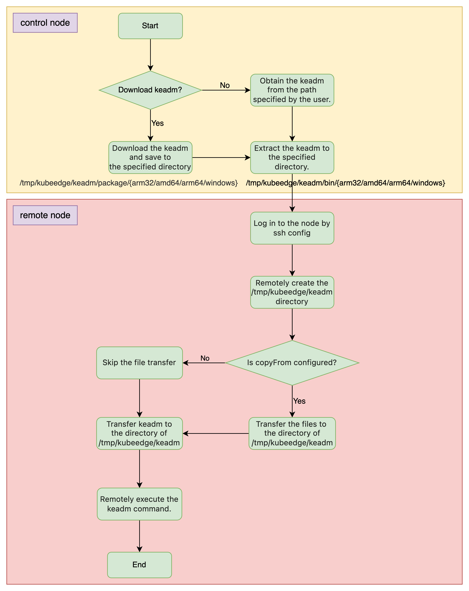

- [Motivation](#motivation)
- [Goals](#goals)
- [Design overview](#design-overview)
    - [Configuration Definition and Detailed Explanation](#configuration-definition-and-detailed-explanation)
    - [Overall Execution Flow Chart](#overall-execution-flow-chart)
    - [Pre-run and Post-run Parameter Description](#pre-run-and-post-run-parameter-description)
- [Use Example](#use-example)
    - [Video Demo](#video-demo)

## Motivation

Currently, the keadm tool of KubeEdge only supports manual single-node management. However, in edge scenarios, the scale of nodes is often very large, and the management process of a single node can no longer cope with such large-scale scenarios. Therefore, it is very meaningful to implement an efficient and scalable batch node management process.

## Goals

- Define the configuration standard for batch node management.
- Simplify node access operations and improve deployment efficiency.
- Ensure system stability and reliability.
- Provide clear log output.
- Provide detailed case guidance.

## Design overview

#### Configuration Definition and Detailed Explanation

The configuration file is passed in the form of a yaml file, and the usage method is `keadm batch --config=path-to-file`. Using `keadm batch gen-config` can generate a configuration sample template.

The following is a detailed description of the specific structure definition:

```go
// BatchJoinOptions has the kubeedge batch join information filled by CLI
type BatchProcessOptions struct {
  ConfigFile string
}

// Config defines the batch-join config file format
type Config struct {
  Keadm     Keadm  `yaml:"keadm"`
  Nodes     []Node `yaml:"nodes"`
  MaxRunNum int    `yaml:"maxRunNum"`
}

type Keadm struct {
  Download          Download          `yaml:"download"`
  KeadmVersion      string            `yaml:"keadmVersion"`
  ArchGroup         []string          `yaml:"archGroup"`
  OfflinePackageDir *string           `yaml:"offlinePackageDir,omitempty"`
  CmdTplArgs        map[string]string `yaml:"cmdTplArgs,omitempty"`
}

type Download struct {
  URL    *string `yaml:"url,omitempty"`
  Enable *bool    `yaml:"enable"`
}

// Node defines the node information used in batch-join config file
type Node struct {
  NodeName string  `yaml:"nodeName"`
  KeadmCmd string  `yaml:"keadmCmd"`
  CopyFrom *string `yaml:"copyFrom,omitempty"`
  SSH      SSH     `yaml:"ssh"`
}

type SSH struct {
  IP       string     `yaml:"ip"`
  Username string     `yaml:"username"`
  Port     *int       `yaml:"port,omitempty"`
  Auth     AuthConfig `yaml:"auth"`
}

type AuthConfig struct {
  Type           string          `yaml:"type"`
  PasswordAuth   *PasswordAuth   `yaml:"passwordAuth,omitempty"`
  PrivateKeyAuth *PrivateKeyAuth `yaml:"privateKeyAuth,omitempty"`
}

type PasswordAuth struct {
  Password string `yaml:"password"`
}

type PrivateKeyAuth struct {
  PrivateKeyPath string `yaml:"privateKeyPath"`
}
```

`BatchProcessOptions.ConfigFile`: Used to specify the configuration file for batch node processing. `example: keadm batch -c./config.yaml`

`Config.Keadm`: Used to configure the download of the keadm installation package.

- `Config.Keadm.Download`: When `Config.Keadm.Download.Enable` is `true`, the installation package will be downloaded from the address provided by `Config.Keadm.Download.URL`. If `URL` is empty, the installation package will be downloaded from the official github repository by default. When `Config.Keadm.Download.Enable` is `false`, the offline installation package provided by `OfflinePackageDir` will be used. The default value is true.
- `Config.Keadm.KeadmVersion`: Specifies the version of the keadm installation package.
- `Config.Keadm.ArchGroup`: Specifies the keadm architecture, and multiple architectures can be specified at the same time. Currently, the supported architectures are `arm`, `arm64`, and `amd64`.
- `Config.Keadm.OfflinePackageDir`: Specifies the directory of the offline keadm installation package.
- `Config.Keadm.CmdTplArgs`: The general template for the keadm execution command, used in conjunction with `Config.Nodes[x].KeadmCmd`.

`Config.Keadm.Nodes`: The configuration of the remote nodes to be batch processed.

- `Config.Keadm.Nodes.NodeName`: The name of the remote node. It is not mandatory to be consistent with the actual node name, and it is mainly used to distinguish different node tasks. This parameter must be unique and cannot be repeated.
- `Config.Keadm.Nodes.KeadmCmd`: The keadm command to be executed. The command does not include the first-level keadm command. The template parameters configured in `Config.Keadm.CmdTplArgs` can be referenced in this command. For specific usage, refer to the following case.
  **Note**: The wildcard is used as `{{xxx}}`. When the wildcard appears at the beginning of the command, the command needs to be enclosed in `''` or `""`.
- `Config.Keadm.Nodes.CopyFrom`: The file copy directory, an optional parameter. Once this parameter is configured, all files in this directory will be copied to the remote node. Currently, subdirectories are not allowed in this directory.
- `Config.Keadm.Nodes.SSH`: Configures the SSH login information of the remote node, including `IP`, `Username`, `Port`, `Auth`, etc. The `Username` needs to be configured as the `root` user to ensure relevant permissions. `Port` is an optional parameter, and the default value is `22`. `Auth` supports two types: `privateKey` and `password`.

`Config.Keadm.MaxRunNum`: Used to configure the maximum number of goroutines when go executes in batches.

#### Overall Execution Flow Chart



**Control node**:

- Responsible for downloading the keadm installation package according to the specific configuration or using the offline installation package. The downloaded installation package is uniformly stored in the `/tmp/kubeedge/keadm/package/{amd64/arm64/arm}` directory of the control node.
- If the user configures the offline installation package path by themselves, they need to create the offline file according to the format requirement of `xxx/{amd64/arm64/arm}/keadm-{version}-linux-{arch}.tar.gz`.
- The installation package is uniformly decompressed to the `/tmp/kubeedge/keadm/bin/{amd64/arm64/arm}` directory.

**Join node**:

- The node access process is executed concurrently, and the concurrency number depends on the configuration of `Config.Keadm.MaxRunNum`.
- The keadm executable file and all files in the `Config.Keadm.Nodes.CopyFrom` directory are uploaded to the `/tmp/kubeedge/keadm` directory of the node to be accessed through ssh.

#### Pre-run and Post-run Parameter Description

To support custom scripts, we have introduced the optional parameters `pre-run` and `post-run` in various commands of keadm. These parameters allow users to pass in custom script files to perform some pre or post script tasks. For specific usage, refer to the subsequent use cases.

Usage command reference:
```shell
keadm reset --post-run=test.sh xxx
keadm join --pre-run=test.sh xxx
```

## Use Example
  [Demo](https://github.com/kubeedge/website/blob/0fa121e858e51df8d5918ea523072e9048e82af5/docs/advanced/batch-node.md)