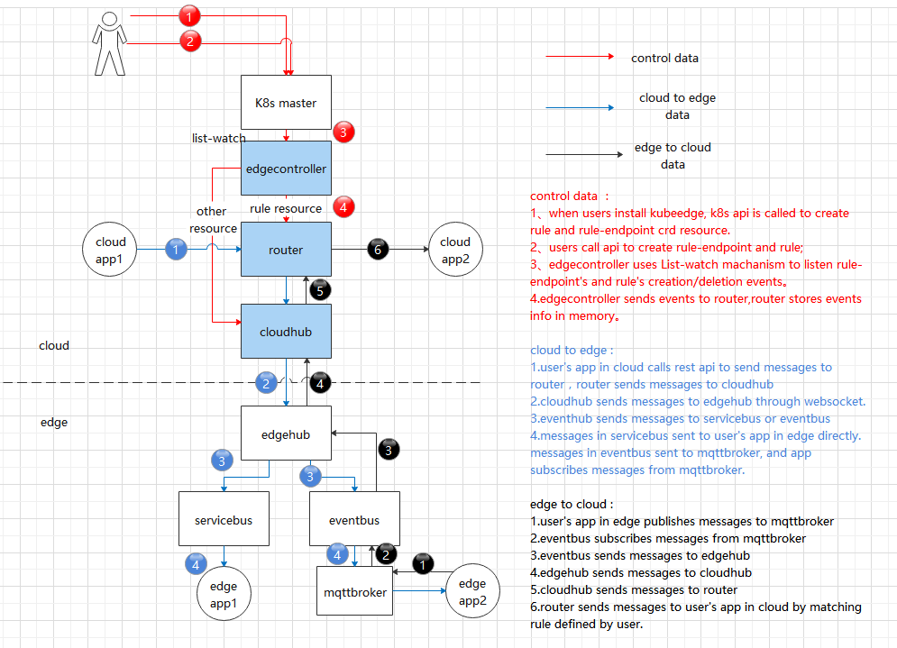

# Cloud edge message design

## Motivation

At present, the user's custom message delivery between cloud and edge is not completed. Users need to implement the code by themselves to deliver the message. This leads to code decoupling. And it is Unfriendly to users.
This proposal addresses this problem for users to delivery their custom messages between cloud and edge by rest api or mqtt broker.

### Goals

- offer a solution for user's custom message delivery mechanism between cloud and edge.

### Non-goals
- To provide HA / failover mechanism for cloudhub.
- To address secure communication.
- To address encryption of data stored.

## Proposal

Currently There is no common solutions to deliver user's custom messages between cloud and edge.
The proposal is to introduce a solution for users to deliver their custom message between cloud and edge by rest api or mqtt broker.

### Usage scenarios
- used for user's control data delivery;
- not suitable for large data delivery;
- the data size of delivery at one time is limited to 12MB.

### Use Cases

- user can deliver custom message from cloud to edge by calling api in cloudcore. And it will deliver the message to mqttbroker on edge finally.

    1. user creates a rule which defines the message's source and target info.
	2. user's app in cloud calls an api of cloudcore to deliver custom message; the message is delivered to edge, and published to mqttbroker with a topic.
	3. user's app in edge subscribes the message with the same topic in step 2.
- user can deliver custom message from edge to cloud by publishing message to mqttbroker. And it will deliver the message to rest api in cloud finally.

    1. user creates a rule which defines the message's source and target info.
	2. user's app in edge published message to mqttbroker with a topic.
	3. user's app in cloud got the message in step 2.

- user can deliver custom message from cloud to edge by calling api in cloudcore. And it will call rest api on edgenode finally. And get the result.

    1. user creates a rule which defines the message's source and target info.
	2. user's app in cloud calls an api of cloudcore to deliver custom message; cloudcore delivered the message to edgecore. Edgecore will call edge's rest api.
	3. user's app in cloud got the result of api call in step 2.

## Design Details

### Message Delivery Mechanisms


### RuleEndpoint and Rule definition
* A ruleEndpoint defines where messages come from, or where messages go to. It contains 3 types: rest, eventbus, servicebus.
    1. **rest**: a rest endpoint in the cloud. It is a source ruleEndpoint to send rest requests to the edge. Or a target ruleEndpoint to receive message from edge.

    2. **eventbus**: It is a source ruleEndpoint to send data to the cloud, or a target ruleEndpoint to receive messages from the cloud. 

    3. **servicebus**:  a rest api on edge node. It is a target ruleEndpoint to receive messages delivered from cloud.

* Rule defines how messages were delivered from source ruleendpoint to target ruleendpoint. It contains 3 rule types.

   1. rest->eventbus: users' app calls rest api in cloud to send messages, finally  messages were sent to mqttbroker in edge.
   2. eventbus->rest: users publish messages to mqttbroker in edge, finally messages were sent to rest api in cloud.
   3. rest->servicebus: users' app calls rest api in cloud to send messages, finally  messages were sent to user's app in edge.

### RuleEndpoint and Rule CRD design
* RuleEndpoint
```
apiVersion: apiextensions.k8s.io/v1
kind: CustomResourceDefinition
metadata:
  name: ruleendpoints.rules.kubeedge.io
spec:
  group: rules.kubeedge.io
  versions:
    - name: v1
      served: true
      storage: true
      schema:
        openAPIV3Schema:
          type: object
          properties:
            spec:
              type: object
              properties:
                ruleEndpointType:
                  description: |
                    ruleEndpointType is a string value representing rule-endpoint type. its value is
                    one of rest/eventbus/servicebus.
                  type: string
                properties:
                  description: |
                    properties is not required except for servicebus rule-endpoint type. It is a map
                    value representing rule-endpoint properties.when ruleEndpointType is servicebus,
                    its value is {"service_port":"8080"}.
                  type: object
                  additionalProperties:
                    type: string
              required:
                - ruleEndpointType
  scope: Namespaced
  names:
    plural: ruleendpoints
    singular: ruleendpoint
    kind: RuleEndpoint
    shortNames:
      - re

```

* Rule 
```
apiVersion: apiextensions.k8s.io/v1
kind: CustomResourceDefinition
metadata:
  name: rules.rules.kubeedge.io
spec:
  group: rules.kubeedge.io
  versions:
    - name: v1
      served: true
      storage: true
      schema:
        openAPIV3Schema:
          type: object
          properties:
            spec:
              type: object
              properties:
                source:
                  description: |
                    source is a string value representing where the messages come from. Its
                    value is the same with rule-endpoint name. For example, my-rest or my-eventbus.
                  type: string
                sourceResource:
                  description: |
                    sourceResource is a map representing the resource info of source. For rest
                    rule-endpoint type its value is {"path":"/a/b"}. For eventbus rule-endpoint type its
                    value is {"topic":"<user define string>","node_name":"xxxx"}
                  type: object
                  additionalProperties:
                    type: string
                target:
                  description: |
                    target is a string value representing where the messages go to. its value is
                    the same with rule-endpoint name. For example, my-eventbus or my-rest or my-servicebus.
                  type: string
                targetResource:
                  description: |
                    targetResource is a map representing the resource info of target. For rest
                    rule-endpoint type its value is {"resource":"http://a.com"}. For eventbus rule-endpoint
                    type its value is {"topic":"/xxxx"}. For servicebus rule-endpoint type its value is
                    {"path":"/request_path"}.
                  type: object
                  additionalProperties:
                    type: string
              required:
                - source
                - sourceResource
                - target
                - targetResource
            status:
              type: object
              properties:
                successMessages:
                  type: integer
                failMessages:
                  type: integer
                errors:
                  items:
                    type: string
                  type: array
  scope: Namespaced
  names:
    plural: rules
    singular: rule
    kind: Rule

```

### how to deliver custom messages

1. cloud to edge : **rest->eventbus**

1.1 create rest and eventbus type ruleEndpoint if they don't exist. Exec command:

	`kubectl create -f create-ruleEndpoint-rest.yaml`
	`kubectl create -f create-ruleEndpoint-eventbus.yaml`


create-ruleEndpoint-rest.yaml's contents are as follows:
```
apiVersion: rules.kubeedge.io/v1
kind: RuleEndpoint
metadata:
  name: my-rest
  labels:
    description: test
spec:
  ruleEndpointType: "rest"
  properties: {}
```

create-ruleEndpoint-eventbus.yaml's contents are as follows:
```
apiVersion: rules.kubeedge.io/v1
kind: RuleEndpoint
metadata:
  name: my-eventbus
  labels:
    description: test
spec:
  ruleEndpointType: "eventbus"
  properties: {}
```


1.2 create rule. Exec command:

`kubectl create -f create-rule-rest-eventbus.yaml`

create-rule-rest-eventbus.yaml's contents are as follows:

```
apiVersion: rules.kubeedge.io/v1
kind: Rule
metadata:
  name: my-rule
  labels:
    description: test
spec:
  source: "my-rest"
  sourceResource: {"path":"/a"}
  target: "my-eventbus"
  targetResource: {"topic":"test"}
```

1.3 call rest api in the cloud to send messages to edge.

The rest api in the cloud can be called to send messages to eventbus on an edge node based on the node name and sourceResource. 

- Method: POST
- URL: **http://{rest_endpoint}/{node_name}/{namespace}/{path}**, {rest_endpoint} is router's endpoint, {node_name} is name of edgenode, {namespace} is the namespace of rule, {path}'s prefix is source ruleEndpoint's sourceResource.
- Body: {user_message}, {user_message} is user's message

For example:
- Method: POST
- URL: http://{rest_endpoint}/{node_name}/default/a
- Body： {"message":"123"}

1.4 User's app subscribes custom topics from mqtt-broker in edge to receive messages from the cloud. 

- Topic: {topic}, {topic} is target ruleEndpoint's targetResource.
- Message:  {user_message}

For example:
- subscribe Topic: 'test', exec command with mosquitto: `mosquitto_sub -t 'test' -d`
- Get Message: {"message":"123"}

2. edge to cloud: **eventbus->rest**:

2.1 create rest type and eventbus type ruleEndpoint if they don't exist. Exec command:

	`kubectl create -f create-ruleEndpoint-rest.yaml`
	`kubectl create -f create-ruleEndpoint-eventbus.yaml`


create-ruleEndpoint-rest.yaml's contents are as follows:
```
apiVersion: rules.kubeedge.io/v1
kind: RuleEndpoint
metadata:
  name: my-rest
  labels:
    description: test
spec:
  ruleEndpointType: "rest"
  properties: {}
```

create-ruleEndpoint-eventbus.yaml's contents are as follows:
```
apiVersion: rules.kubeedge.io/v1
kind: RuleEndpoint
metadata:
  name: my-eventbus
  labels:
    description: test
spec:
  ruleEndpointType: "eventbus"
  properties: {}
```


2.2 create rule. Exec command:

`kubectl create -f create-rule-eventbus-rest.yaml`

create-rule-eventbus-rest.yaml's contents are as follows:

```
apiVersion: rules.kubeedge.io/v1
kind: Rule
metadata:
  name: my-rule-eventbus-rest
  labels:
    description: test
spec:
  source: "my-eventbus"
  sourceResource: {"topic": "test","node_name": "xxx"}
  target: "my-rest"
  targetResource: {"resource":"http://a.com"}
```

2.3 User's app in edge publishes messages with custom topic to MQTT broker on edge node. 
- Topic: {namespace}/{topic}
- Message:  {user_api_body}

for example:
- publish data with mosquitto, exec command:

 `mosquitto_pub -t 'default/test' -d -m '{"edgemsg":"msgtocloud"}'`

2.4 Kubeedge delivers messages to user api address in cloud. 

- Method: POST
- URL: **http://{user_api}**, or **https://{user_api}**,{user_api} is target ruleEndpoint's targetResource.
- Body: {user_api_body}

For example: user's app in cloud gets the data {"edgemsg":"msgtocloud"}

3. cloud to edge : **rest->servicebus**

3.1 create rest and servicebus type ruleEndpoint if they don't exist. Exec command:

	`kubectl create -f create-ruleEndpoint-rest.yaml`
	`kubectl create -f create-ruleEndpoint-servicebus.yaml`


create-ruleEndpoint-rest.yaml's contents are as follows:
```
apiVersion: rules.kubeedge.io/v1
kind: RuleEndpoint
metadata:
  name: my-rest
  labels:
    description: test
spec:
  ruleEndpointType: "rest"
  properties: {}
```

create-ruleEndpoint-servicebus.yaml's contents are as follows:
```
apiVersion: rules.kubeedge.io/v1
kind: RuleEndpoint
metadata:
  name: my-servicebus
  labels:
    description: test
spec:
  ruleEndpointType: "servicebus"
  properties: {"service_port":"6666"}
```


3.2 create rule. Exec command:

`kubectl create -f create-rule-rest-servicebus.yaml`

create-rule-rest-servicebus.yaml's contents are as follows:

```
apiVersion: rules.kubeedge.io/v1
kind: Rule
metadata:
  name: my-rule-rest-servicebus
  labels:
    description: test
spec:
  source: "my-rest"
  sourceResource: {"path":"/a"}
  target: "my-servicebus"
  targetResource: {"path":"/b"}
```

3.3 user's app calls rest api in the cloud to send messages to edge.

The rest api in the cloud can be called to send messages to servicebus on an edge node based on the node name and sourceResource. 

- Method: POST/GET/DELETE/PUT
- URL: **http://{rest_endpoint}/{node_name}/{namespace}/{path}**, {rest_endpoint} is router's endpoint, {node_name} is name of edgenode, {namespace} is namespace of rule. {path} is source ruleEndpoint's sourceResource.
- Body: {user_message}, {user_message} is user's message

finally, kubeedge's servicebus will call api on edgen node.
- Method: POST/GET/DELETE/PUT
- URL: **http://127.0.0.1:{port}/{path}**, {port} is target ruleEndpoint's properties, {path} is target ruleEndpoint's targetResource.  
- Body: {user_message}, {user_message} is user's message

For example:
- Method: POST
- URL: http://{rest_endpoint}/{node_name}/default/a
- Body： {"message":"123"}

finnaly, kubeedge's servicebus calls api on edge node. For example:
- Method: POST
- URL: http://127.0.0.1:6666/b
- Body： {"message":"123"}

user's app gets the result of the api on edge node.

## Exception scenarios/Corner cases handling

### CloudCore restart

- When cloudcore restarts or starts normally, it will get all rules from edge-controller, and store in memory.

## Implementation plan

- Alpha: v1.6 rest->eventbus, eventbus->rest
- Beta: v1.7 rest->servicebus
- GA: TBD

Checkout the tracking issue for latest implementation details.
