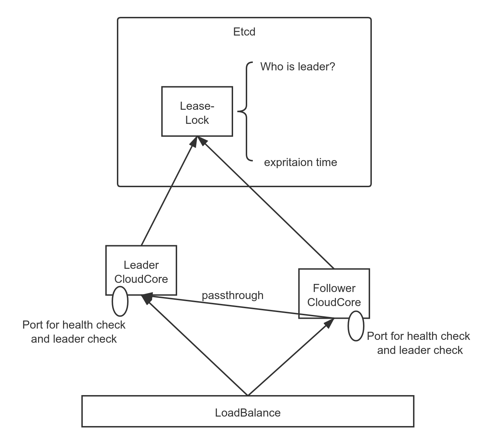

# CloudCore High Availability Design
## Motivation
KubeEdge is designed to serve hundreds of edgenodes, and ideally it should be high availability.
#### Goal
- Alpha

Support CloudCore crash/restart, support ha in hot standby mode.
- Beta

Realize ha in stateless mode, it means multiple CloudCores could serve at the same time, and CloudCore no longer a performance bottlenecks if the number of edgenodes increases.

## Design detail for alpha
### Brief description of CloudCore

At present, CloudCore is essentially an edge-resource distribution center, which encapsulates resource objects into messages.The dest-node of the message is recoreded in `Message.Router.Resource`.There are four type modules which could generate delivery-messages(from cloud to edge)：

- DownStream (in EdgeController)

  When DownStream init, it will `Watch` all pod-event, and picks out pod-events which are assigned to edgenodes(labeled by "node-role.kubernetes.io/edge:"). Because of `pod.Spec.NodeName`, DownStream could directly build `Message.Router.Resource` when generate pod-related messages, but for configmaps and secrets, there is no such similar field. So when DownStream delivery pod, it will check if the pod refers to configmaps the secrets, and record configmapNames and secretNames and their dest-node.The list of edgenodes and the list of configmaps and secrets to dest-node are recored in **LocationCache**(aka. resource distribution route ), which is declared below:
  ```go
   // LocationCache cache the map of node, pod, configmap, secret
  type LocationCache struct {
    // EdgeNodes is a map, key is nodeName, value is Status
    EdgeNodes sync.Map
    // configMapNode is a map, key is namespace/configMapName, value is nodeName
    configMapNode sync.Map
    // secretNode is a map, key is namespace/secretName, value is nodeName
    secretNode sync.Map
    // services is a map, key is namespace/serviceName, value is v1.Service
    services sync.Map
    // endpoints is a map, key is namespace/endpointsName, value is v1.endpoints
    endpoints sync.Map
    // servicePods is a map, key is namespace/serviceName, value is []v1.Pod
    servicePods sync.Map
  }
  ```
- UpStream (in EdgeController)

  When edge-node gets the pod from cloud, it will check if there are related configmaps and secrets in edge-store. If not it will send a "Query" message（with node information) to cloud, and Upstream will response.

- DeviceController

  Currently only `device` need to be sent to edge-node by DeviceController. The device-related event are all asigned to edge-nodes, and `device.Spec` is recoreding the information of dest-node. So DeviceController do not need a "LocationCache".

- SyncController

  SyncController will periodically compare the saved objects resourceVersion with the objects in K8s, and then trigger the events such as retry and deletion. All resource that has been left out will be sent to edge-node again and again by SyncController. Data needed for SyncController running proerly is stored in etcd as CRD.

### Crash/Restart
  Before designing high availability in hot standby mode, we should determine if CloudCore will run well and no message will be missing after crash and restart, that is the new CloudCore could synchronize the old state. According to description above, all the data is:

  1. LocationCache
  2. sync-CRD in etcd

  For the former, CloudCore will triger the initialization of LocationCache when restarts; For the latter, CloudCore crash does not affect information in etcd. Messages left out during crash will be re-sync when SyncController reruns.

### HA in hot standby mode
#### The lifecycle of CloudCore
  1. LeaderElection block
  1. Become the leader
  1. Start each controller and serve for edge-nodes
  1. Notify the LoadBalance cloudcore is ready
  1. Lose the leadership position due to network fluctuation or other reason, **shutdown immediately**;At the same time, one of the standby cloudcores becomes leader.
  1. Restart by an external operation, downgrade to be a standby cloudcore also known as follower.

  The process of 3(start the controllers) also contains the cache initialization, such as the above-mentioned LocationCache.Ideally cache should initialize before the Leader election block, but it means the deconstruction of controllers as well as a lot of work. If subsequent discoveries show that cache initialization time led to the switch time growth greatly, then consider to deconstruct the controllers. At present, the cache initialization time is in milliseconds.

#### Leader election (refer to ha in controller manager)
  

  According to the hot standby plan of Controller Manager, we use the concept of lease resources in K8S to realize LeaderElection. If there are multiple cloudcores vying for the Leader, each CC will try to create this lease resource in etcd. Successful creation means becoming a Leader and the lease must be renewed regularly (leaseDurationSeconds). If the Leader does not renew the lease, it  will expire and other followers will occupy the position of Leader. The definition of leaselock is shown below:
  ```go
  type LeaderElectionRecord struct {
      HolderIdentity       string      `json:"holderIdentity"`
      LeaseDurationSeconds int         `json:"leaseDurationSeconds"`
      AcquireTime          metav1.Time `json:"acquireTime"`
      RenewTime            metav1.Time `json:"renewTime"`
      LeaderTransitions    int         `json:"leaderTransitions"`
  }
  ```
#### Notify the LoadBalance cloudcore is ready
  After CloudCore becomes the Leader and successfully starts each controller, it is also necessary to inform the LoadBalance that CloudCore is ready. Considering that CloudCore will be deployed in the k8s cluster as a container, there are two types of LoadBalance :
##### Kubernetes native loadbalancer
According to the K8s's native loadbalance mechanism, the load balancer decides whether to forward traffic to the back-end based on whether the endpoint is ready. So let us review the readiness definition:
- Container Readiness

  A client determines whether a Container is "ready" by testing whether the Pod's `status.containerStatuses[]` list includes an element whose `name` == name of the container and whose `ready` == true. That condition is set according to the following rule.

  `Container is ready == Container is running AND readiness probe returns success`

- Pod Readiness

  A client determines whether a Pod is  "ready" by testing whether the Pod's `status.conditions[]` list includes an element whose `type` == "Ready" and whose `status` == "True". That condition is set according to the following rule.

  `Pod is ready == All containers are ready`
- Endpoint Readiness

  A client determines whether an Endpoint is "ready" by testing whether the Endpoints’ `subsets[].addresses[]` list includes an element whose `targetRef` points to corresponding pod. That condition is set according to the following rule.

  `Endpoint is ready == Pod is ready`

- PodReadinessGate
```yaml
...
kind: Pod
...
spec:
  readinessGates:
  - conditionType: "kubeedge.io/CloudCoreIsLeader"

status:
  conditions:
  - lastProbeTime: null
    lastTransitionTime: 2020-01-01T00:00:00Z
    status: "False"
    type: kubeedge.io/CloudCoreIsLeader
```
  When a Pod defines a PodReadinessGate shown as above, its PodReadiness definition will be rewritten, that is：

  `Pod is ready == All containers are ready + PodReadinessGate is true`

  for now:

  `Endpoint is readiness == All container are ready + PodReadinessGate is true`

It means traffic is not forward to the back cloudcore until we Patch the status of "kubeedge.io/CloudCoreIsLeader" from "False" to "True" after this cloudcore becoming leader.

##### Other LoadBalance such as keepalived

In this case, we only need to expose a readyz endpoint handler to tell CloudCore whether or not the service is available externally. readyz endpoint handler calls Check.It fails (returns an error) if cloudcore has not been a leader or own the lease but had not been able to renew it.

```go
func (l *ReadyzAdaptor) Check(req *http.Request) error {
	l.pointerLock.Lock()
	defer l.pointerLock.Unlock()
	if l.le == nil {
		return fmt.Errorf("leaderElection is not setting")
	}
	if !l.le.IsLeader() {
		return fmt.Errorf("not yet a leader")
	}
	return l.le.Check(l.timeout)
}
```
At present, it is tentatively decided that this handle path is `/readyz`.And register the handle to cloudhub https server.


