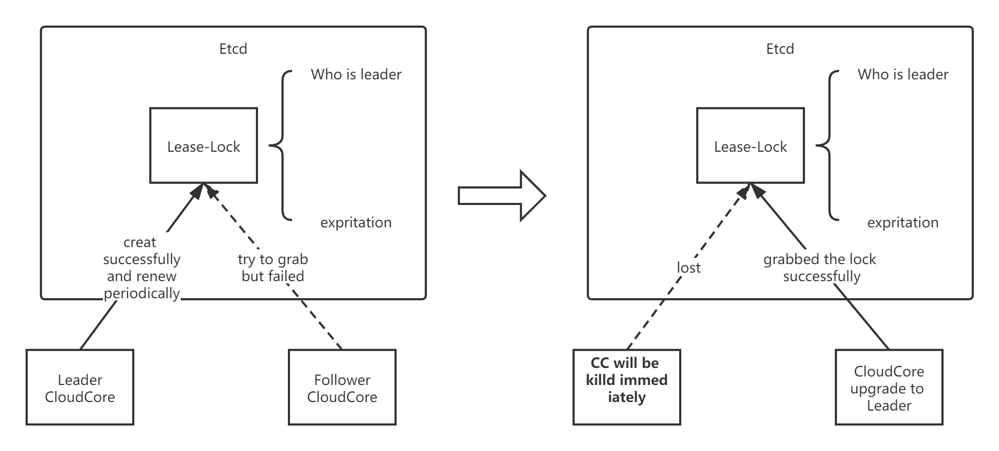

# CloudCore High Availability Design
## Motivation
Kubeedge is design to serve hundreds of edgenodes,and it is obviously single CC could hardly run well all the time, ideally it should be HA.
#### Goal
- Alpha

Support CloudCore crash/restart, support ha in hot standby mode.
- Beta

Realize ha in stateless mode, it means multiple CloudCores could serve at the same time, and CloudCore no longer a performance bottlenecks if the number of edgenodes increases.

## Design detail for alpha
### Brief description of CloudCore

At present, CloudCore is essentially an edge-resource distribution center, which encapsulates resource objects into messages.The dest-node of the message is recoreded in `Message.Router.Resource`.There are four type module which could generate delivery-messages(from cloud to edge)：

- DownStream (in EdgeController) 
  
  When DownStream init, it will `Watch` all pod-event, and picks out pod-event which is assigned to edgenodes(labeled by "node-role.kubernetes.io/edge:"). Because of `pod.Spec.NodeName`, DownStream could directly build `Message.Router.Resource` when generate pod-related messages, but for configmaps and secrets, there is no such similar field. So when DownStream delivery pod, it will check if the pod refers to configmaps the secrets, and record configmapNames and secretNames and their dest-node.The list of edgenodes and the list of configmaps and secrets to dest-node are recored in **LocationCache**(aka. resource distribution route ), which is declared below:
  ```go
   // LocationCache cache the map of node, pod, configmap, secret
  type LocationCache struct {
    // EdgeNodes is a map, key is nodeName, value is Status
    EdgeNodes sync.Map
    // configMapNode is a map, key is namespace/configMapName, value is nodeName
    configMapNode sync.Map
    // secretNode is a map, key is namespace/secretName, value is nodeName
    secretNode sync.Map
    // services is a map, key is namespace/serviceName, value is v1.Service
    services sync.Map
    // endpoints is a map, key is namespace/endpointsName, value is v1.endpoints
    endpoints sync.Map
    // servicePods is a map, key is namespace/serviceName, value is []v1.Pod
    servicePods sync.Map
  }
  ```
- UpStream (in EdgeController)

  When edge-node get the pod from cloud,it will check if there are related configmaps and secrets in edge-store. If not it will send a "Query" message（with node information) to cloud, and Upstream will response.
  
- DeviceController

  Currently only `device` need to be sent to edge-node by DeviceController. The device-related event are all asigned to edge-nodes, and `device.Spec` is recoreding the information of dest-node. So DeviceController do not need a "LocationCache".
  
- SyncController

  SyncController will periodically compare the saved objects resourceVersion with the objects in K8s, and then trigger the events such as retry and deletion. All resource that has been left out will be sent to edge-node again and again by SyncController. Data needed for SyncController running proerly is stored in etcd as CRD.
  
#### Crash/Restart (√)
  According to description above, all the data that CloudCore needs to run properly is:
  
  1. LocationCache
  2. sync-CRD in etcd
  
  For the former, CloudCore will triger the initialization of LocationCache when restarts; For the latter, CloudCore crash does not affect information in etcd. Message left out during crash will be re-sync when SyncController reruns.
  
### ha in hot standby mode
#### Leader election (refer to ha in controller manager)
  
  
  There is a Lease type in Kubernetes. As the name suggests, its role is to create a resource with a lease. Suppose there are multiple nodes that want to compete for the leader, then everyone first tries to create this Lease resource. If the creation is successful, then you are the leader. Successful creation does not mean that you have always been a leader. You have to renew your leases regularly (leaseDurationSeconds). If you do not renew your lease, your lease will expire and other participants will preempt the leader's position.
  Relative code has aleady exist in kubernetes/client-go.
  ```go
  type LeaderElectionRecord struct {
    // HolderIdentity is the ID that owns the lease. If empty, no one owns this lease and
    // all callers may acquire. Versions of this library prior to Kubernetes 1.14 will not
    // attempt to acquire leases with empty identities and will wait for the full lease
    // interval to expire before attempting to reacquire. This value is set to empty when
    // a client voluntarily steps down.
      HolderIdentity       string      `json:"holderIdentity"`
      LeaseDurationSeconds int         `json:"leaseDurationSeconds"`
      AcquireTime          metav1.Time `json:"acquireTime"`
      RenewTime            metav1.Time `json:"renewTime"`
      LeaderTransitions    int         `json:"leaderTransitions"`
  }
  ```
#### healthcheck and leadercheck for LoadBalance

  We should expose healthcheck service for LoadBalance, as well as wheathe the CloudCore is Leader.
  
#### What Follower do
- Following

  - stop delivery, but still List-Watch API-Server for updating LocationCache
  - if the request is still received, just passthrough to leader
  - Keep trying to possess Lease-Lock
  
- Preempted the leader's position
  - Disconnect all edge-nodes and wait for new connection request
  - Start to delivery message to edge-nodes
  - SyncController ensure resending missing messages during switch.
  
