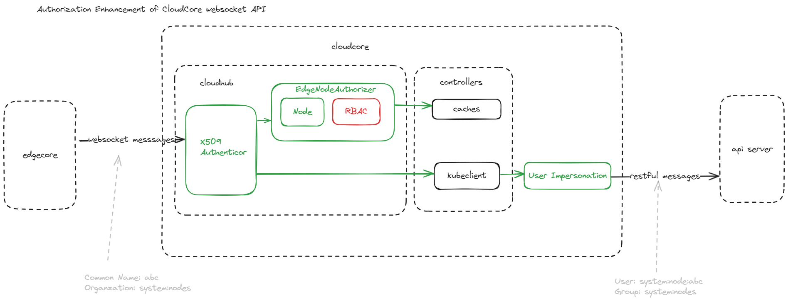
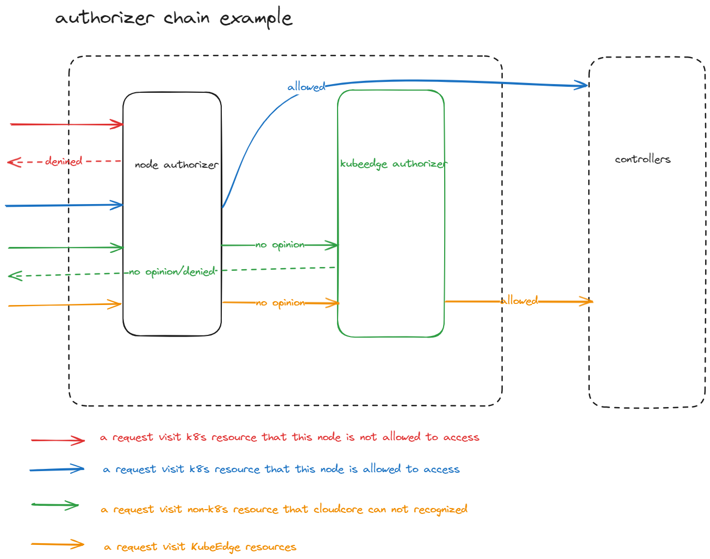

# Authorization Enhancement for CloudCore Websocket API

## Motivation
CloudCore is the bridge between edge nodes and api server. However, it cannot restrict the access to cluster resources for a specific node. To address this issue, it is necessary to make an enhancement on CloudCore websocket API.

#### Goal
- Alpha

Support node authorization mode. CloudCore can restrict an edge node from operating the resources owned by other edge nodes. It is planned to implement this feature before release 1.18.
- Beta

Support RBAC authorization mode. KubeEdge users can utilize RBAC configurations to limit the access to their custom resources. There are still some implementation details to be discussed.

## Design detail for alpha



### Summary

CloudHub is the entrance of CloudCore websocket API so that we can identify the sender of messages and check whether the sender has sufficient permissions.

### Authentication

To establish the websocket connection with CloudCore, EdgeCore must provide a X509 certificate, which is signed by CloudCore. By verifying the client certificates and parsing the `Subject` fields, CloudHub can identify different nodes.

### Authorization

Most of CloudHub APIs read/write k8s resources. To limit access to k8s resources, reusing the existing mechanism is a good choice. `User impersonation` can override the user info, which minimizes the permissions of requests made by a privileged user.

Some of CloudHub APIs won't directly access k8s resources. We must manually check the node permissions. Code reuse can decrease the complexity of development and maintenance. API server employs several authorization modes to authorize the requests: `Node`, `ABAC`, `RBAC`, `Webhook`. `NodeAuthorizer` implements the `Node` authorization mode, which prevent a node from reading the resources that are not related with the pods deployed on it. The `unionAuthzHandler` provides an approach to organize all of these authorization modes. Additionally, an authorizer for KubeEdge custom resource is necessary to bypass the authorizer chain.

The following graph demonstrates how CloudHub handles different requests by the authorizer chain.



## Configurations

This feature may introduce following configurations:

```yaml
kubeAPIConfig:
  ...
modules:
  cloudhub:
    authorization:
      // optional, default false, toggle authoration
      enable: true
      // optional, default to false, do authorization but always allow all the requests
      debug: false
      // required, an authorizer chain 
      authorizers:
        // node authorization mode
        - node:
            enable: true
  ...
```

## Compatibility

- By default, this feature is disabled.
- This feature replies on the `Common Name` field of client certificate to identify edge nodes. Older version of EdgeCore(<1.16) will try to create a certificate with same `Common Name`. In the situation of upgrading, you can manually generate new client certificate and replace old one with it.    
- To safely adapt to this feature, you can switch `debug` on. When authorization fails, CloudCore just records the log but the requests are normally proceeded.
