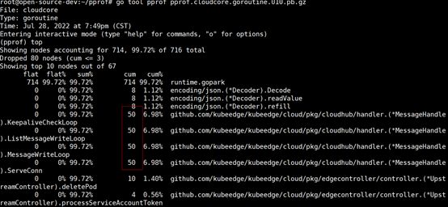
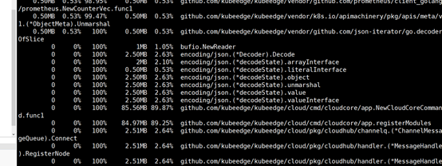
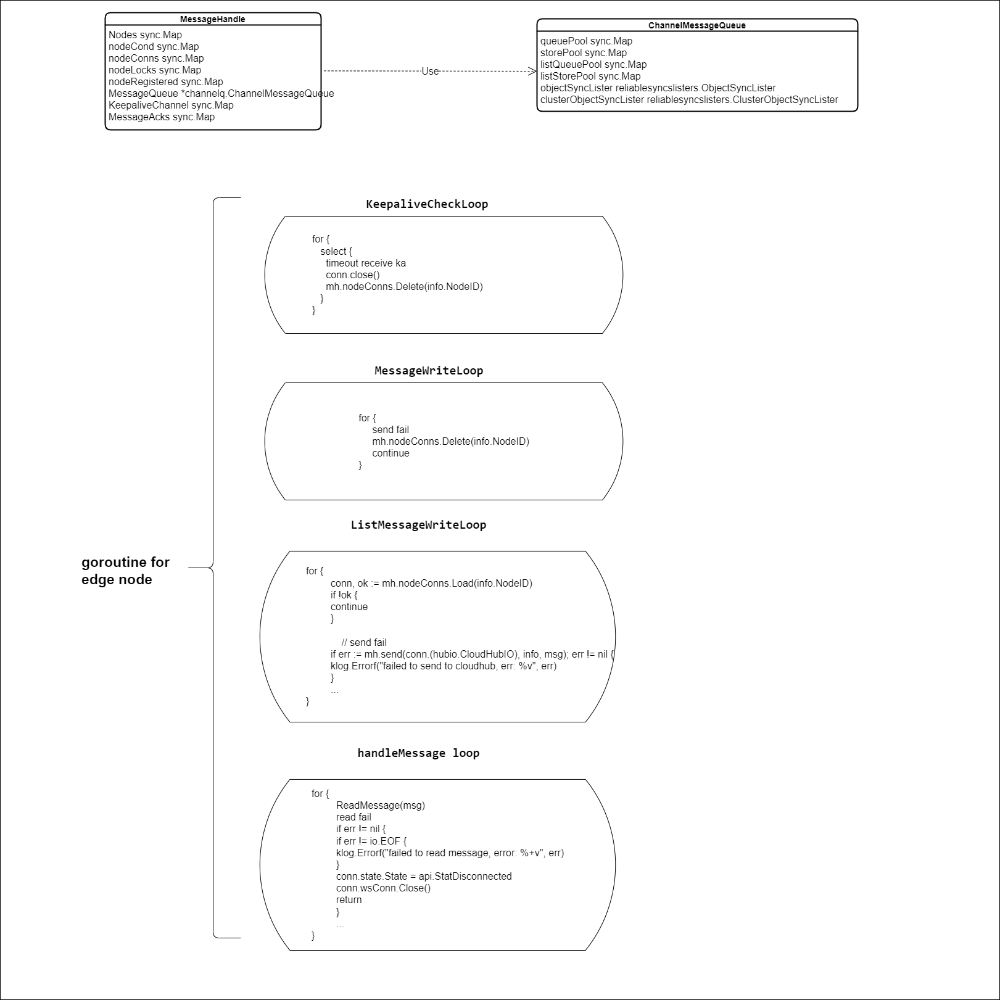
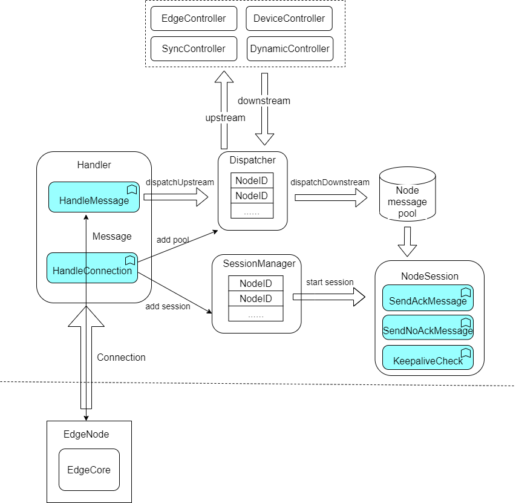

# CloudHub refactoring background

There are currently many problems related to cloudhub, Especially in some corner case scenarios, such as weak edge network, network interruption, high network latency, intermittent connection, etc.


**Some issue about CloudHub**

1.  https://github.com/kubeedge/kubeedge/issues/4070
2.  https://github.com/kubeedge/kubeedge/issues/3736
3.  https://github.com/kubeedge/kubeedge/issues/4055
4.  https://github.com/kubeedge/kubeedge/issues/3622
5.  https://github.com/kubeedge/kubeedge/pull/3244#issuecomment-1038576062


In addition, cloudhub also has some goroutine leak and memory leak bugs

The node is interrupted or disconnected, but the goroutine does not exit. When the node is reconnected, a new goroutine will be generated




The node is interrupted or disconnected, but some node data is not cleaned up.




Maintenance difficulty: Currently, in cloudhub, the connection management, message distribution, and message processing codes are mixed together, and it is difficult to read, modify, and maintain. There is no unit test to ensure that the code modification is correct, and it is very difficult to add unit test.

# CloudHub refactoring scope


1. **Centralized realization of node connection management and message sending and receiving capabilities**

   The logic of connection management and data sending and receiving is used as the basic logic, which can be managed and maintained by separate modules.
   
2. **Decouple as much as possible from the business**

   Separate business logic from node connection communication, so that business logic no longer cares about communication details, avoiding repeated development and coupling

3. **Added unit test cases, covering basic and edge test cases**

   After refactoring, it is convenient to add new test cases, and by simulating related interfaces, 80% coverage of test cases can be achieved.

4. **New E2E use cases are added to ensure the correct and stable functions of cloudcore in extreme scenarios**

   Add some edge cases in the long-term stability test to the E2E test cases to ensure the stability of cloudcore in extreme scenarios


# CloudHub refactoring details

The current logic in cloudhub for each node connection  is shown below. The main problem at the moment is the goroutine does not exit when the node is disconnected, when the node reconnect to the cloudhub, it may connect to the current cloudhub replicas or the other cloudhub replicas, so the old goroutine is never exited unless the node is deleted from the Kubernetes. Also the date in the message queue and store does not clear when the node is disconnected. When the node reconnects to the cloudhub replicas  again, dirty data will be sent to the edge node, and this will cause inconsistency  data between cloud and edge.



First, we abstract two modes for message sending.  The specific explanation is as follows.

```
// There are two `AcknowledgeMode` for message that send to edge node
// ------------------------------------------------------------------
// ACK mode: In this mode, the edge node MUST send acknowledgement to
// the CloudHub for the messages it receive after successfully process.
// After metaManger successfully stores the message in the edge node,
// an acknowledgement will be sent to the CloudHub to inform that the
// message was successfully processed. If the connection lost before edge
// node sends acknowledgement for the message, the server will assume the
// message has not been processed successfully and will resend the message
// to the edge node until CloudHub receive the acknowledgement message.
// ------------------------------------------------------------------
// NO-ACK mode: In this mode, edge node does not send acknowledgement
// to the CloudHub for the messages it receives. The CloudHub will
// assume the edge node has received the message and is successfully
// processed. This acknowledgment mode can cause messages being transmitted
// to the edge node to get dropped. But this mode usually is used when
// send response message for request from the edge, so if the edge node
// do not receive the message, it will issue a new request and try again.
// ------------------------------------------------------------------
```

The architecture after cloudhub refactoring is shown in the figure.



The relevant interface and structure definitions are as follows.

```
// MessageDispatcher is responsible for the dispatch of upstream messages
// (edge to cloud) and downstream messages (cloud to edge)
type MessageDispatcher interface {
	// DispatchDownstream continuously reads the messages from cloudHub module,
	// and according to the content of the message, the message is dispatched
	// to the message queue of each edge node.
	DispatchDownstream()

	// DispatchUpstream dispatch messages sent from edge nodes to the cloud,
	// such as node status messages, pod status messages, etc.
	DispatchUpstream(message *beehivemodel.Message, info *model.HubInfo)

	// AddNodeMessagePool add the given node message pool to the dispatcher.
	AddNodeMessagePool(nodeID string, pool *model.NodeMessagePool)

	// DeleteNodeMessagePool deletes the given node message pool from the dispatcher.
	DeleteNodeMessagePool(nodeID string, pool *model.NodeMessagePool)

	// GetNodeMessagePool provides the nodeMessagePool that matches node ID
	GetNodeMessagePool(nodeID string) *model.NodeMessagePool

	// Publish sends the given message to module according to the message source
	Publish(msg *beehivemodel.Message) error
}
```


```
type Handler interface {
	// HandleConnection is invoked when a new connection arrives
	HandleConnection(connection conn.Connection)

	// HandleMessage is invoked when a new message arrives.
	HandleMessage(container *mux.MessageContainer, writer mux.ResponseWriter)

	// OnEdgeNodeConnect is invoked when a new connection is established
	OnEdgeNodeConnect(info *model.HubInfo, connection conn.Connection) error

	// OnEdgeNodeDisConnect is invoked when a connection is lost
	OnEdgeNodeDisconnect(info *model.HubInfo, connection conn.Connection)

	// OnReadTransportErr is invoked when the connection read message err
	OnReadTransportErr(nodeID, projectID string)
}
```


```
type Manager struct {
	// NodeNumber is the number of currently connected edge
	// nodes for single cloudHub instance
	NodeNumber int32
	// NodeLimit is the maximum number of edge nodes that can
	// connected to single cloudHub instance
	NodeLimit int32
	// NodeSessions maps a node ID to NodeSession
	NodeSessions sync.Map
}
```


```
// NodeSession is an abstraction of a node connection lifecycle.
type NodeSession struct {
	// nodeID is the identifier of the edge node and is unique in the cluster
	nodeID string

	// projectID is the project ID to which the edge node belongs
	projectID string

	// connection is the underlying net connection (websocket or QUIC)
	connection conn.Connection

	// keepaliveInterval is the interval in seconds that keepalive messages
	// are received from the peer.
	keepaliveInterval time.Duration

	// keepaliveChan defines a chan which will receive the keepalive message
	keepaliveChan chan struct{}

	// nodeMessagePool stores all the message that will send to an single edge node
	nodeMessagePool *model.NodeMessagePool

	// ackMessageCache records the mapping of message ID to its response channel
	ackMessageCache sync.Map

	// reliableClient the objectSync client for interacting with Kubernetes API servers
	reliableClient reliableclient.Interface

	// terminateErr records the error type of session termination
	terminateErr int32

	// stopOnce is used to mark that session Terminating can only be executed once
	stopOnce sync.Once

	ctx        context.Context
	cancelFunc context.CancelFunc
}
```


