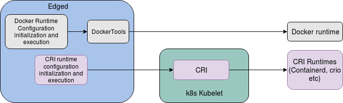

# CRI Support in edged

* [CRI Support in edged](#CRI-Support-in-edged)
  * [Motivation](#motivation)
    * [Goals](#goals)
    * [Non\-goals](#non-goals)
  * [Proposal](#proposal)
    * [Use Cases](#use-cases)
  * [High Level Design](#high-level-design)  
    * [Edged with CRI support](#edged-with-cri-support)
  * [Low Level Design](#low-level-design)  
    * [Configuration parameters](#configuration-parameters)
    * [Data structure modifications](#data-structure-modifications)
    * [Edged object creation modifications](#edged-object-creation-modifications)
    * [Runtime dependent module modifications](#runtime-dependent-module-modifications)
    * [Runtime dependent functional modifications](#runtime-dependent-functional-modifications)
  * [Open Questions](#open-questions) 
    
    
## Motivation
This proposal addresses the Container Runtime Interface support in edged to enable the following
1. Support light weight container runtimes on resource constrained edge node which are unable to run the existing docker runtime
2. Support multiple container runtimes like docker, containerd, cri-o etc on the edge node.

### Goals
CRI support in edged must:
* support multiple runtimes like docker, contianerd, cri-o etc.
* Support for corresponding CNI with pause container and IP will be considered later

### Non-goals

* Automatic detection of container runtimes and its selection.
* 
## Proposal

Currently Kubernetes kubelet CRI supports container runtimes like containerd, cri-o etc but support for docker runtime is
provided using dockershim as well. However going forward even docker runtime will be supported through only CRI. Also 
currently kubeedge edged supports only docker runtime using the legacy dockertools. Hence we propose to support multiple 
container runtime in kubeedge edged as follows
1. Include CRI support as in kubernetes kubelet to support contianerd, cri-o etc
2. Continue with docker runtime support using legacy dockertools until CRI support for the same is available i.e. support
for docker runtime using dockershim is not considered in edged


### Use Cases

* Customer can run light weight container runtime on resource constrained edge node that cannot run the existing docker runtime
* Customer has the option to choose from multiple container runtimes on his edge platform


## High Level Design

### Edged with CRI support


## Low Level Design

### Configuration parameters

The following configuration parameters need to be added

No | Parameter | Type | Values | Description
---|---|---|---|---
1 | containerRuntimeName | string | DockerRuntime/RemoteRuntime | Runtime name
2   | RemoteRuntimeEndpoint | string | /var/run/*.sock | Endpoint of remote runtime service
3   | RemoteImageEndpoint | string | same as remoteRuntimeEndpoint if not specified | Endpoint of remote image service
4   | RuntimeRequestTimeout | Duration | time value | timeout for all runtime request

```go
type Config struct {
       ....
       runtimeType           string
       remoteRuntimeEndpoint string
       remoteImageEndpoint   string
       RuntimeRequestTimeout metav1.Duration
       ....
 }
 ```
### Data structure modifications

The edged data strcuture needs to include the generic runtime which currently has docker runtime including the runtime state and
runtime name.

```go
//Define edged
type edged struct {
  ....
  // Last timestamp when runtime responded on ping
  // Mutex is used to protect this value
  runtimeState *runtimeState
  containerRuntimeName string
  // Container runtime
  containerRuntime kubecontainer.Runtime
  // updateRuntimeMux is a lock on updating runtime, because this path is not thread-safe
  // This lock is used by Kubelet.updateRuntimeUp function and shouldn't be used anywhere else
  updateRuntimeMux sync.Mutex
  ....
}

```

###  Edged object creation modifications

The existing newEdged() function needs to modified include creating CRI runtime object based on the runtime type including
creations of objects for runtime and image services. However the existing edged does not provide the support for all the 
parameters required to create the CRI runtime object and default parameters need to be considered for the same.

```go

//newEdged creates new edged object and initialises it
func newEdged() (*edged, error) {
       conf := getConfig()
       ......
       
       switch conf.runtimeType {
            case DockerContainerRuntime:
              	runtime, err := dockertools.NewDockerManager(ed.livenessManager, 0, 0, backoff, true, conf.devicePluginEnabled, gpuManager, conf.interfaceName)
	              if err != nil {
		              return nil, fmt.Errorf("get docker manager failed, err: %s", err.Error())
	              }
                containerRuntimeName = DockerContainerRuntime
            case RemoteContainerRuntime:
                if conf.remoteRuntimeEndpoint != "" {
		              // remoteImageEndpoint is same as remoteRuntimeEndpoint if not explicitly specified
		              if conf.remoteImageEndpoint == "" {
			              conf.remoteImageEndpoint = conf.remoteRuntimeEndpoint
		              }
                }
                containerRefManager := kubecontainer.NewRefManager()
                httpClient := &http.Client{}
                runtimeService, imageService, err := getRuntimeAndImageServices(conf.remoteRuntimeEndpoint, conf.remoteImageEndpoint, conf.RuntimeRequestTimeout)
                if err != nil {
                  return nil, err
                }
                containerRuntime, err := kuberuntime.NewKubeGenericRuntimeManager(
                  recorder,
                  ed.livenessManager,
                  nil,
                  containerRefManager,
                  nil,
                  nil,
                  nil,
                  nil,
                  httpClient,
                  backoff,
                  false,
                  0,
                  0,
                  false,
                  runtimeService,
                  imageService,
                  nil,
                  nil,
               )
               if err != nil {
                       return nil, fmt.Errorf("get docker manager failed, err: %s", err.Error())
               }
               containerRuntimeName = RemoteContainerRuntime
            default:
		          return nil, fmt.Errorf("unsupported CRI runtime: %q", runtimeType)
       }
       .....
       .....
}

//Function to get CRI runtime and image service
func getRuntimeAndImageServices(remoteRuntimeEndpoint string, remoteImageEndpoint string, runtimeRequestTimeout metav1.Duration) (internalapi.RuntimeService, internalapi.ImageManagerService, error) {
       rs, err := remote.NewRemoteRuntimeService(remoteRuntimeEndpoint, runtimeRequestTimeout.Duration)
       if err != nil {
               return nil, nil, err
       }
       is, err := remote.NewRemoteImageService(remoteImageEndpoint, runtimeRequestTimeout.Duration)
       if err != nil {
               return nil, nil, err
       }
       return rs, is, err
}

// Get Config
func getConfig() *Config {
	....
	conf.runtimeType = config.CONFIG.GetConfigurationByKey("edged.runtime-type").(string)
	conf.remoteRuntimeEndpoint = config.CONFIG.GetConfigurationByKey("edged.remote-runtime-endpoint").(string)
	conf.remoteImageEndpoint = config.CONFIG.GetConfigurationByKey("edged.remote-image-endpoint").(string)
	....
}

```
### Runtime dependent module modifications
The following modules which are dependent on the runtime needs to be handled during edged start based on docker runtime or
remote CRI runtime.
1. Volume Manager
2. PLEG

```go
func (e *edged) Start(c *context.Context) {
  ....
  switch (e.containerRuntimeName) {
    case DockerContainerRuntime:
      e.volumeManager = volumemanager.NewVolumeManager(
		    ....
		    e.runtime.(*dockertools.DockerManager),
        ....
      )
      e.pleg = edgedpleg.NewGenericLifecycle(
        e.runtime.(*dockertools.DockerManager).ContainerManager,
        .....
      )
    case RemoteContainerRuntime:
      e.volumeManager = volumemanager.NewVolumeManager(
		    ....
		    e.containerRuntime,
        ....
      )
      e.pleg = pleg.NewGenericLifecycle(
        e.containerRuntime,
        .....
      )
  }
  ....
    
}
```

### Runtime dependent functional modifications

The following functionalaties which are based on the docker runtime need to be modified to handle the CRI runtimes as well

```go
func (e *edged) initializeModules() error {
  ....
  switch (e.containerRuntimeName) {
    case DockerContainerRuntime:
	    e.runtime.Start(e.GetActivePods)
    case RemoteContainerRuntime:
      //TBD for CRI
  ....
}
func (e *edged) consumePodAddition(namespacedName *types.NamespacedName) error {
  ....
  err = e.runtime.EnsureImageExists(pod, secrets)
  //TBD for CRI
  ....
  err = e.runtime.StartPod(pod, opt)
  // TBD for CRI
  ....
}

func (e *edged) consumePodDeletion(namespacedName *types.NamespacedName) error {
  ....
  switch (e.containerRuntimeName) {
    case DockerContainerRuntime:
	    err := e.runtime.TerminatePod(pod.UID)
    case RemoteContainerRuntime:
      e.containerRuntime.KillPod(pod,nil,0)
   }
  
  ....
}

func (e *edged) syncPod() {
	//read containers from host
	e.runtime.InitPodContainer()
  
  // TBD for CRI
  
  ....
}

func (e *edged) addPod(obj interface{}) {
  ....
  if (e.containerRuntimeName == DockerContainerRuntime)
    e.runtime.UpdatePluginResources(nodeInfo, attrs)
  ....
}

func (e *edged) HandlePodCleanups() error {
  ....
  switch (e.containerRuntimeName) {
    case DockerContainerRuntime:
	    containerRunningPods, err := e.runtime.GetPods(true)
    case RemoteContainerRuntime:
      containerRunningPods, err := e.containerRuntime.GetPods(true)
  }
  ....
  if (e.containerRuntimeName == DockerContainerRuntime)
    e.runtime.CleanupOrphanedPod(pods)
  ....
}

```


