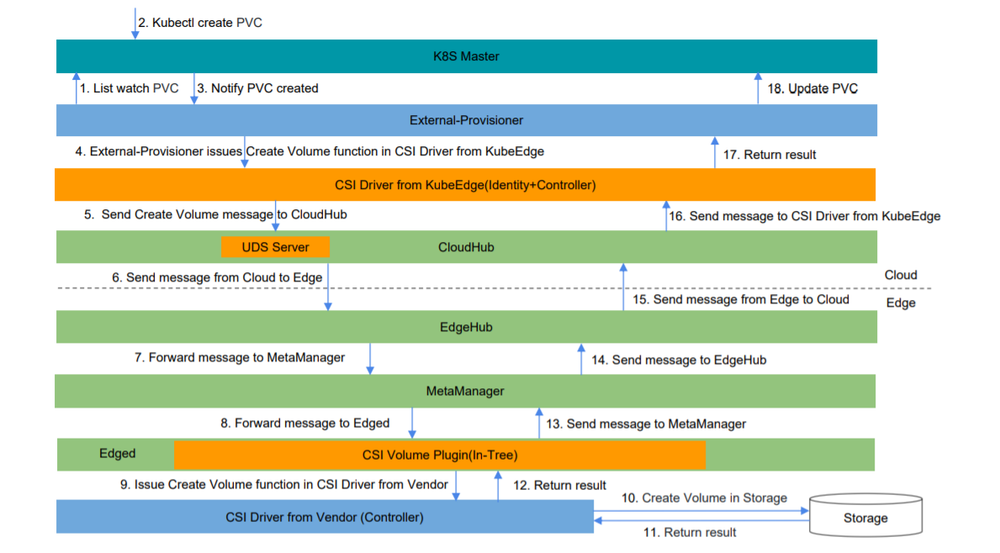
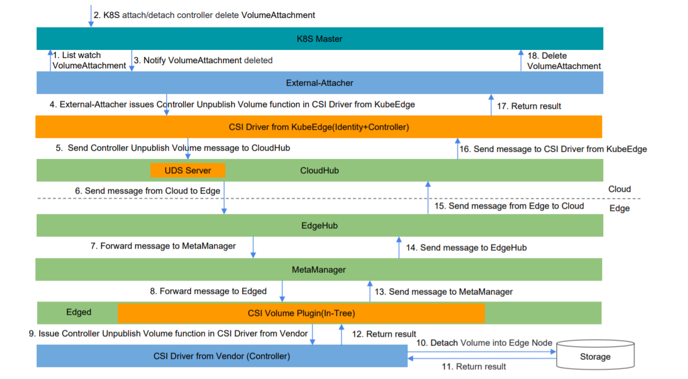
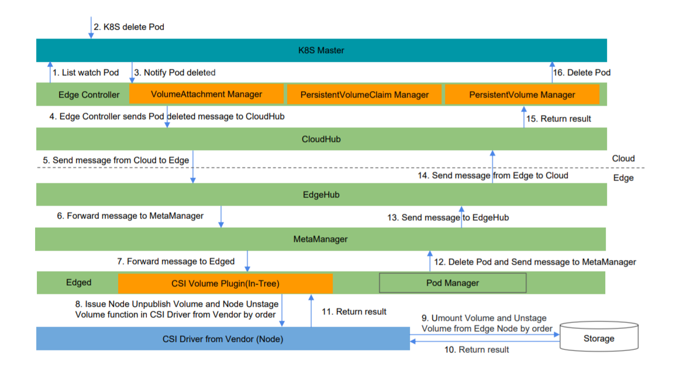

# Container Storage Interface Proposal

* [Container Storage Interface Proposal](#container-storage-Interface-proposal)
  * [Motivation](#motivation)
  * [Goals](#goals)
  * [Non\-goals](#non-goals)
  * [Proposal](#proposal)
    * [Requirement](#requirement)
    * [Architecture](#architecture)
    * [Workflow](#workflow)
    * [Deployment](#deployment)
    * [Example](#example)
  * [Graduation Criteria](#graduation-criteria)
    * [Alpha](#alpha)
    * [Beta](#beta)
    * [GA](#ga)

## Motivation

Currently KubeEdge only supports the following in-tree volumes which are based on Kubernetes.

* [emptyDir](https://kubernetes.io/docs/concepts/storage/volumes/#emptydir)
* [hostPath](https://kubernetes.io/docs/concepts/storage/volumes/#hostpath)
* [configMap](https://kubernetes.io/docs/concepts/storage/volumes/#configmap)
* [secret](https://kubernetes.io/docs/concepts/storage/volumes/#secret)

That is not enough for the users who are using KubeEdge.
Running applications with persistent data store at edge is common.
For example, in a system which collects video data and makes analysis,
one application stores the video data into a shared storage,
and another application reads the data from the storage to make analysis.
In this scenario, the NFS storage is quite suitable and is not implemented by KubeEdge.
KubeEdge should allow users to store data using StorageClass (SC),
PersistentVolume (PV) and PersistentVolumeClaim (PVC)
so that the users can deploy stateful applications at edge.

The Container Storage Interface (CSI) is a specification that resulted from cooperation
between community members including Kubernetes, Mesos, Cloud Foundry, and Docker.
The goal of this interface is to establish a standardized mechanism
to expose arbitrary storage systems to their containerized workloads.
CSI Spec has already been released v1.1 and lots of CSI Drivers are released by vendors.
CSI Volume Plugin was first introduced to Kubernetes v1.9 with Alpha
and graduated to stable (GA) since v1.13, and continuously be improved util now.

* [CSI Spec](https://github.com/container-storage-interface/spec/blob/master/spec.md)
* [CSI Drivers](https://kubernetes-csi.github.io/docs/drivers.html)
* [CSI Volume Plugin in Kubernetes](https://github.com/kubernetes/community/blob/master/contributors/design-proposals/storage/container-storage-interface.md)

We can support Container Storage Interface (CSI) in KubeEdge,
and give a standardized solution to the users who want to use persistent storage at edge.
KubeEdge would provide very limited in-tree PersistentVolume (PV) implementations,
many of upstream PersistentVolumes (PVs) are storage services on cloud, not quite suitable at edge.
The key is to implement CSI and bring extendability to users so that they can install their own storage plugins.
The users can choose any kind of CSI Drivers on demands. Since KubeEdge is built upon Kubernetes,
it is possible to reuse some of existing framework from Kubernetes in KubeEdge.

## Goals

* To support [Basic CSI Volume Lifecycle](https://github.com/container-storage-interface/spec/blob/master/spec.md#volume-lifecycle) in KubeEdge.
   * Create Volume and Delete Volume.
   * Controller Publish Volume and Controller Unpublish Volume.
   * Node Stage Volume and Node Unstage Volume.
   * Node Publish Volume and Node Unpublish Volume.
* Compatible with Kubernetes and CSI.
* To support storage at edge.

## Non-goals

* To support Raw Block Volume.
* To support Volume Snapshot and Restore.
* To support Volume Topology.
* To support storage on cloud.

## Proposal

### Requirement
* Kubernetes v1.15+
* CSI Spec v1.0.0+

### Architecture


The added components in KubeEdge are including:
* External-Provisioner: list watch the Kubernetes API Resource `PersistentVolumeClaim` (`PVC`)
   and send messages to edge to issue actions including `Create Volume` and `Delete Volume` at edge.
   The users can reuse the [external-provisioner](https://github.com/kubernetes-csi/external-provisioner) from Kubernetes-CSI community.
* External-Attacher: list watch the Kubernetes API Resource `VolumeAttachment` and send messages to edge
   to issue actions including `Controller Publish Volume` and `Controller Unpublish Volume` at edge.
   The users can reuse the [external-attacher](https://github.com/kubernetes-csi/external-attacher) from Kubernetes-CSI community.
* CSI Driver from KubeEdge: this is more like CSI Driver proxy, and it implements all of the `Identity` and `Controller` interfaces.
  It connects with CloudHub by UNIX Domain Sockets (UDS) and sends messages to edge.
  Actually all of the actions about the Volume Lifecycle are executed in the CSI Driver from Vendor at edge.
* UDS Server: provide the communication channel between KubeEdge and CSI Driver from KubeEdge.
  It is hosted in the KubeEdge CloudHub, but it is only used to communicate with CSI Driver from KubeEdge on cloud.
  It is not used to communicate between cloud and edge.
  It will receive messages from CSI Driver and send them to edge by the communication channel
  between CloudHub and EdgeHub such as websocket, quic and so forth,
  and then give a response to CSI Driver from KubeEdge.
* Managers in Edge Controller: including PersistentVolume Manager, PersistentVolumeClaim Manager, VolumeAttachment Manager and so on.
  These manager components will poll the Kubernetes API Volume related Resources
  like PersistentVolume, PersistentVolumeClaim and VolumeAttachment,
  and sync these resources metadata to edge.
* CSI Volume Plugin(In-Tree): issue actions including
   `Create Volume` and `Delete Volume`,
   `Controller Publish Volume` and `Controller Unpublish Volume`
   `Node Stage Volume` and `Node Unstage Volume`,
   `Node Publish Volume` and `Node Unpublish Volume` at edge.
* Node-Driver-Registrar: register the CSI Driver from Vendor into `Edged` by UNIX Domain Sockets (UDS).
  The users can reuse the [node-driver-registrar](https://github.com/kubernetes-csi/node-driver-registrar) from Kubernetes-CSI community.
* CSI Driver from Vendor: these drivers are chosen by the users and the KubeEdge team will not provide them.

### Workflow

#### Create Volume


#### Delete Volume


#### Attach Volume


#### Detach Volume


#### Mount Volume


#### Umount Volume


### Deployment

Before using CSI, on cloud the cluster admins need to deploy a `Statefulset` or `Deployment`
to support for Create / Delete Volume and  Attach / Detach Volume.
Here is a `Statefulset` example for CSI HostPath Driver on cloud.

```yaml
kind: StatefulSet
apiVersion: apps/v1
metadata:
  name: csi-hostpath-controller
spec:
  serviceName: "csi-hostpath-controller"
  replicas: 1
  selector:
    matchLabels:
      app: csi-hostpath-controller
  template:
    metadata:
      labels:
        app: csi-hostpath-controller
    spec:
      serviceAccountName: csi-controller
      containers:
        - name: csi-provisioner
          image: quay.io/k8scsi/csi-provisioner:v1.2.1
          imagePullPolicy: IfNotPresent
          args:
            - -v=5
            - --csi-address=/csi/csi.sock
            - --connection-timeout=15s
          volumeMounts:
            - mountPath: /csi
              name: csi-socket-dir
        - name: csi-attacher
          image: quay.io/k8scsi/csi-attacher:v1.1.1
          imagePullPolicy: IfNotPresent
          args:
            - --v=5
            - --csi-address=/csi/csi.sock
          volumeMounts:
          - mountPath: /csi
            name: csi-socket-dir
        - name: csi-driver
          image: kubeedge/csidriver:v1.1.0
          imagePullPolicy: IfNotPresent
          args:
            - "--v=5"
            - "--drivername=$(CSI_DRIVERNAME)"
            - "--endpoint=$(CSI_ENDPOINT)"
            - "--kubeedge-endpoint=$(KUBEEDGE_ENDPOINT)"
            - "--nodeid=$(KUBE_NODE_NAME)"
          env:
            - name: CSI_DRIVERNAME
              value: csi-hostpath
            - name: CSI_ENDPOINT
              value: unix:///csi/csi.sock
            - name: KUBEEDGE_ENDPOINT
              value: unix:///kubeedge/kubeedge.sock
            - name: KUBE_NODE_NAME
              # replace this value with the name of edge node
              # which is in charge of Create Volume and Delete Volume,
              # Controller Publish Volume and Controller Unpublish Volume.
              value: edge-node
          securityContext:
            privileged: true
          volumeMounts:
            - mountPath: /csi
              name: csi-socket-dir
            - mountPath: /kubeedge
              name: kubeedge-socket-dir
      volumes:
        - hostPath:
            path: /var/lib/kubelet/plugins/csi-hostpath
            type: DirectoryOrCreate
          name: csi-socket-dir
        - hostPath:
            path: /var/lib/kubeedge
            type: DirectoryOrCreate
          name: kubeedge-socket-dir
```

The `Statefulset` includes:

* The following containers:

  * `csi-provisioner` (`External-Provisioner`) container

    Responsible for issuing the calls of Create / Delete Volume.

  * `csi-attacher` (`External-Attacher`) container

    Responsible for issuing the calls of Attach / Detach Volume.

  * `csi-driver` (`CSI Driver from KubeEdge`) container

    Responsible for forwarding the calls from `csi-provisioner` and `csi-attacher` to CloudHub.

    The value of env `CSI_DRIVERNAME` is used to specify the name of CSI Driver on the edge node,
    which will execute the calls including Create / Delete Volume and  Attach / Detach Volume.

    The value of env `CSI_ENDPOINT` is used to specify the address of CSI UNIX Domain Socket.

    The value of env `KUBEEDGE_ENDPOINT` is used to specify the address of KubeEdge CloudHub UNIX Domain Socket.

    The value of env `KUBE_NODE_NAME` is used to specify the name of edge node which is in charge of
    `Create Volume` and `Delete Volume`, `Controller Publish Volume` and `Controller Unpublish Volume`.

* The following volumes:

  * `csi-socket-dir` hostPath volume

      Expose `/var/lib/kubelet/plugins/csi-hostpath` from the host on Cloud.

      Mount in all the three containers.
      It will use this UNIX Domain Socket to make communications between `csi-provisioner` / `csi-attacher` and `csi-driver`.

  * `kubeedge-socket-dir` hostPath volume

      Expose `/var/lib/kubeedge` from the host.

      Mount inside `csi-driver` container which is the primary means of communication between KubeEdge CloudHub and the `csi-driver` container.

The `Deployment` can be also used for this deployment on Cloud.

**Currently we use UNIX Domain Socket between `csi-driver` container and KubeEdge CloudHub,
so that the users need to deploy the above `StatefulSet` or `Deployment` with KubeEdge Cloud Core in the same host.**

At edge the cluster admins need to deploy a `DaemonSet` as a sidecar
to add support for the chosen CSI Driver from Vendor.
Here is a `DaemonSet` example for CSI HostPath Driver at edge.

```yaml
kind: DaemonSet
apiVersion: apps/v1beta2
metadata:
  name: csi-hostpath-edge
spec:
  selector:
    matchLabels:
      app: csi-hostpath-edge
  template:
    metadata:
      labels:
        app: csi-hostpath-edge
    spec:
      hostNetwork: true
      containers:
        - name: node-driver-registrar
          image: quay.io/k8scsi/csi-node-driver-registrar:v1.1.0
          imagePullPolicy: IfNotPresent
          lifecycle:
            preStop:
              exec:
                command: ["/bin/sh", "-c", "rm -rf /registration/csi-hostpath /registration/csi-hostpath-reg.sock"]
          args:
            - --v=5
            - --csi-address=/csi/csi.sock
            - --kubelet-registration-path=/var/lib/edged/plugins/csi-hostpath/csi.sock
          securityContext:
            privileged: true
          env:
            - name: KUBE_NODE_NAME
              valueFrom:
                fieldRef:
                  fieldPath: spec.nodeName
          volumeMounts:
            - name: socket-dir
              mountPath: /csi
            - name: registration-dir
              mountPath: /registration
        - name:  csi-hostpath-driver
          securityContext:
            privileged: true
            capabilities:
              add: ["SYS_ADMIN"]
            allowPrivilegeEscalation: true
          image: quay.io/k8scsi/hostpathplugin:v1.1.0
          imagePullPolicy: IfNotPresent
          args:
            - "--drivername=csi-hostpath"
            - "--v=5"
            - "--nodeid=$(KUBE_NODE_NAME)"
            - "--endpoint=unix:///csi/csi.sock"
          env:
            - name: KUBE_NODE_NAME
              valueFrom:
                fieldRef:
                  apiVersion: v1
                  fieldPath: spec.nodeName
          imagePullPolicy: "IfNotPresent"
          volumeMounts:
            - name: socket-dir
              mountPath: /csi
            - name: plugins-dir
              mountPath: /var/lib/edged/plugins
              mountPropagation: Bidirectional
            - name: mountpoint-dir
              mountPath: /var/lib/edged/pods
              mountPropagation: "Bidirectional"
      volumes:
        - name: socket-dir
          hostPath:
            path: /var/lib/edged/plugins/csi-hostpath
            type: DirectoryOrCreate
        - name: registration-dir
          hostPath:
            path: /var/lib/edged/plugins_registry
            type: DirectoryOrCreate
        - name: plugins-dir
          hostPath:
            path: /var/lib/edged/plugins
            type: DirectoryOrCreate
        - name: mountpoint-dir
          hostPath:
            path: /var/lib/edged/pods
            type: DirectoryOrCreate
```
The `DaemonSet` includes:

* The following containers:

  * `node-driver-registrar` container

    Responsible for registering the UNIX Domain Socket with Edged.

  * `csi-hostpath-driver` container

    developed by the vendor.

* The following volumes:

  * `socket-dir` hostPath volume

      Expose `/var/lib/edged/plugins/csi-hostpath` from the edge node as `hostPath.type: DirectoryOrCreate`.

      Mount inside `csi-hostpath-driver` container which is the primary means of communication between Edged and the `csi-hostpath-driver` container.

  * `registration-dir` hostPath volume

      Expose `/var/lib/edged/plugins_registry` from the edge node.

      Mount only in `node-driver-registrar` container at `/registration`.

      `node-driver-registrar` will use this UNIX Domain Socket to register the CSI Driver with Edged.

  * `plugins-dir` hostPath volume

      Expose `/var/lib/edged/plugins` from the edge node as `hostPath.type: DirectoryOrCreate`.

      Mount inside `csi-hostpath-driver` container.

  * `mountpoint-dir` hostPath volume

      Expose `/var/lib/edged/pods` from the edge node.

      Mount only in `csi-hostpath-driver` container at `/var/lib/edged/pods`.
      Ensure [bi-directional mount propagation](https://kubernetes.io/docs/concepts/storage/volumes/#mount-propagation) is enabled,
      so that any mounts setup inside this container are propagated back to edge node host machine.

If it is not possible to support `DaemonSet` in some KubeEdge release versions,
The cluster admins need to deploy `Deployment` in place of `DaemonSet`.

### Example

#### Static Provisioning Example

Static Provisioning means the volume has already been created.
There is no need to create volume by the `External-Provisioner`.
The users can request for persistent storage using PersistentVolume and PersistentVolumeClaim.
Here list the CSI NFS Driver as an example.

PersistentVolume Example:
```yaml
apiVersion: v1
kind: PersistentVolume
metadata:
  name: csi-nfs-pv
  labels:
    name: csi-nfs-pv
spec:
  accessModes:
  - ReadWriteMany
  capacity:
    storage: 1Gi
  csi:
    driver: csi-nfs
    volumeHandle: data-id
    volumeAttributes:
      server: 127.0.0.1
      share: /export
```
Refer to the NFS share information and create a PersistentVolume.
`server: 127.0.0.1` and `share: /export` in the `volumeAttributes` are used to speficy the NFS share information.

PersistentVolumeClaim Example:
```yaml
apiVersion: v1
kind: PersistentVolumeClaim
metadata:
  name: csi-nfs-pvc
spec:
  accessModes:
  - ReadWriteMany
  resources:
    requests:
      storage: 1Gi
  selector:
    matchExpressions:
    - key: name
      operator: In
      values: ["csi-nfs-pv"]
```
Based on the PersistentVolume, this example is used to define PersistentVolumeClaim.
Once the PersistentVolumeClaim is created successfully,
the PersistentVolume will be bound to the PersistentVolumeClaim.

Pod binding PersistentVolumeClaim Example:
```yaml
kind: Pod
apiVersion: v1
metadata:
  name: my-csi-app
spec:
  containers:
    - name: my-frontend
      image: busybox
      volumeMounts:
      - mountPath: "/data"
        name: my-csi-volume
      command: [ "sleep", "1000000" ]
  volumes:
    - name: my-csi-volume
      persistentVolumeClaim:
        claimName: csi-nfs-pvc
```
`claimName: csi-nfs-pvc` is the name of PersistentVolumeClaim.
Before the pod starts up, the volume will be attached to the edge node, and then mounted inside the pod.

#### Dynamic Provisioning Example

Dynamic Provisioning means the volume will be created by `External-Provisioner` firstly,
and then the volume will be attached into the edge node which is running the pod,
at last the volume will be mounted into the pod.
Here list the CSI HostPath Driver as an example.

StorageClass Example:
```yaml
apiVersion: storage.k8s.io/v1
kind: StorageClass
metadata:
  name: csi-hostpath-sc
provisioner: csi-hostpath
reclaimPolicy: Delete
volumeBindingMode: Immediate
```
`provisioner: csi-hostpath` is used to specify which kind of CSI Driver will be used.

PersistentVolumeClaim Example:
```yaml
apiVersion: v1
kind: PersistentVolumeClaim
metadata:
  name: csi-hostpath-pvc
spec:
  accessModes:
  - ReadWriteOnce
  resources:
    requests:
      storage: 1Gi
  storageClassName: csi-hostpath-sc
```
`storageClassName: csi-hostpath-sc` is used to specify the storage class name
which is defined in the StorageClass Example.
Once PersistentVolumeClaim is created, KubeEdge will create volume based on
the CSI Driver which is specified in the StorageClass, and the PersistentVolume
will be created in Kubernetes and bound to the PersistentVolumeClaim.

Pod binding PersistentVolumeClaim Example:
```yaml
kind: Pod
apiVersion: v1
metadata:
  name: my-csi-app
spec:
  containers:
    - name: my-frontend
      image: busybox
      volumeMounts:
      - mountPath: "/data"
        name: my-csi-volume
      command: [ "sleep", "1000000" ]
  volumes:
    - name: my-csi-volume
      persistentVolumeClaim:
        claimName: csi-hostpath-pvc
```
`claimName: csi-hostpath-pvc` is the name of PersistentVolumeClaim.
Before the pod starts up, the volume will be attached to the edge node, and then mounted inside the pod.

## Graduation Criteria

### Alpha

#### Work Items

* Managers in Edge Controller.
  * PersistentVolume Manager.
  * PersistentVolumeClaim Manager.
  * VolumeAttachment Manager.
  * Node Manager.
* CSI Driver from KubeEdge.
  * Create Volume and Delete Volume.
  * Controller Publish Volume and Controller Unpublish Volume.
* UNIX Domain Socket Server in CloudHub.
* CSI Volume Plugin(In-Tree) in Edged.
  * Create Volume and Delete Volume.
  * Controller Publish Volume and Controller Unpublish Volume.
  * Node Stage Volume and Node Unstage Volume.
  * Node Publish Volume and Node Unpublish Volume.
* Resource Message Exchange in MetaManager.
  * PersistentVolume
  * PersistentVolumeClaim
  * VolumeAttachment
  * Node

#### Graduation Criteria

* Fully compatible with the interfaces defined by [CSI Spec](https://github.com/container-storage-interface/spec/blob/master/spec.md) from v1.0.0.
* Fully compatible with Kubernetes from v1.15.
* In Alpha some allowed limitations are including:
  * The StatefulSet or Deployment including `External-Provisioner`, `External-Attacher` and `CSI Driver from KubeEdge`
    needs to be deployed with KubeEdge Cloud Core in the same host since the UNIX Domain Socket is used between them.
  * There is an Edge Node which is in charge of `Create Volume` and `Delete Volume`,
    `Controller Publish Volume` and `Controller Unpublish Volume`.
    The name of this Edge Node needs to be manually specified in the parameters of `CSI Driver from KubeEdge`.

#### Release Plan

KubeEdge 1.1

### Beta

#### Work Items

* Support Cross-Host communication between CloudHub and CSI Driver from KubeEdge.
* Edge Node Election in CSI Driver from KubeEdge.
* Unit Tests for CSI Support.
* Integration Tests for CSI Support.
* E2E Tests for CSI Support.

#### Graduation Criteria

* All of the tests are done and passed including Unit Tests, Integration Tests and E2E Tests.
* All of the limitations existing in Alpha are solved.

#### Release Plan

KubeEdge 1.3

### GA

#### Work Items

* Failure Recovery Mechanism.
* CSI User Guide in KubeEdge.

#### Graduation Criteria

* Failure Recovery Mechanism for High Availability.
* The User Guide is clear and easy for the users to use in the production environment.

#### Release Plan

TBD
