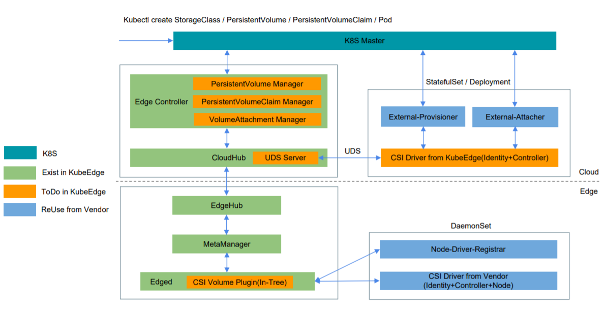
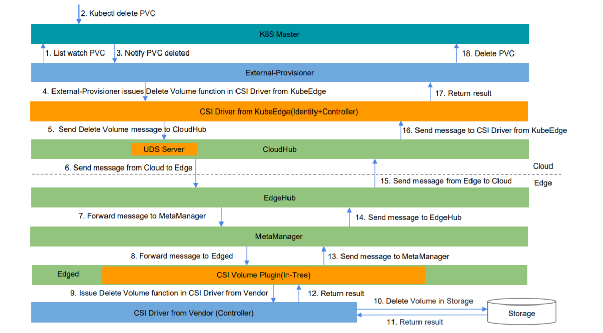
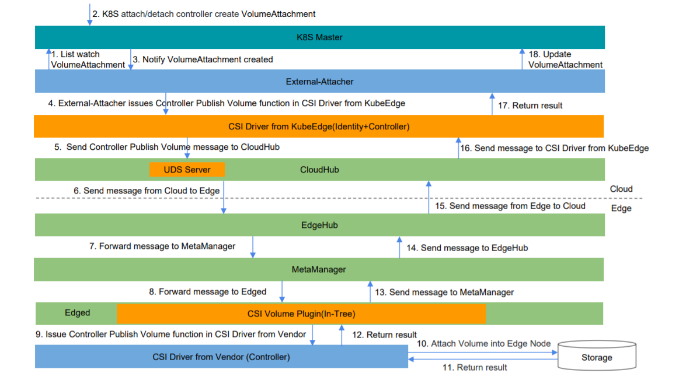
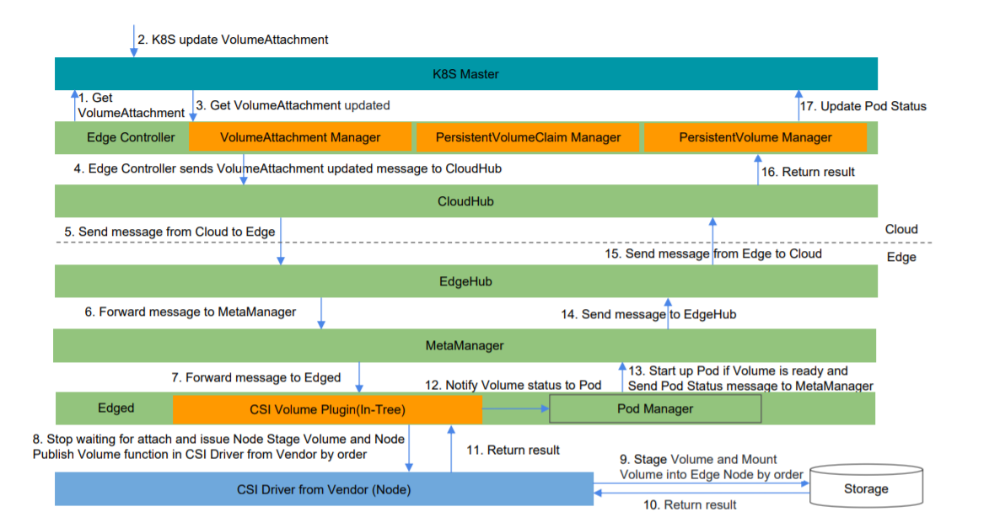

# Container Storage Interface Proposal

* [Container Storage Interface Proposal](#container-storage-Interface-proposal)
  * [Motivation](#motivation)
  * [Goals](#goals)
  * [Non\-goals](#non-goals)
  * [Proposal](#proposal)
    * [Requirement](#requirement)
    * [Architecture](#architecture)
    * [Workflow](#workflow)
    * [Deployment](#deployment)
    * [Example](#example)
  * [Work Items](#work-items)
  * [Graduation Criterias](#graduation-criterias)

## Motivation

Currently KubeEdge only supports the following in-tree volumes which are based on Kubernetes.

* [emptyDir](https://kubernetes.io/docs/concepts/storage/volumes/#emptydir)
* [hostPath](https://kubernetes.io/docs/concepts/storage/volumes/#hostpath)
* [configMap](https://kubernetes.io/docs/concepts/storage/volumes/#configmap)
* [secret](https://kubernetes.io/docs/concepts/storage/volumes/#secret)

That is not enough for the users who are using KubeEdge.
Running applications with persistant data store at edge is common.
For example, in a system which collects video data and makes analysis,
one application stores the video data into a shared storage,
and another application reads the data from the storage to make analysis.
In this scenario, the NFS storage is quite suitable and is not implemented by KubeEdge.
KubeEdge should allow users to store data using StorageClass (SC),
PersistentVolume (PV) and PersistentVolumeClaim (PVC)
so that the users can deploy stateful applications at edge.

The Container Storage Interface (CSI) is a specification that resulted from cooperation
between community members including Kubernetes, Mesos, Cloud Foundry, and Docker.
The goal of this interface is to establish a standardized mechanism
to expose arbitrary storage systems to their containerized workloads.
CSI Spec has already been released v1.1 and lots of CSI Drivers are released by vendors.
CSI Volume Plugin was first introduced to Kubernetes v1.9 with Alpha
and graduated to stable (GA) since v1.13.

* [CSI Spec](https://github.com/container-storage-interface/spec/blob/master/spec.md)
* [CSI Drivers](https://kubernetes-csi.github.io/docs/drivers.html)
* [CSI Volume Plugin in Kubernetes](https://github.com/kubernetes/community/blob/master/contributors/design-proposals/storage/container-storage-interface.md)

We can support Container Storage Interface (CSI) in KubeEdge,
and give a standardized solution to the users who want to use persistent storage at edge.
KubeEdge would provide very limited in-tree PersistentVolume (PV) implementations,
many of upstream PersistentVolumes (PVs) are storage services on cloud, not quite suitable at edge.
The key is to implement CSI and bring extendability to users so that they can install their own storage plugins.
The users can choose any kind of CSI Drivers on demands. Since KubeEdge is built upon Kubernetes,
it is possible to reuse some of existing framework from Kubernetes in KubeEdge.

## Goals

* To support [Basic CSI Volume Lifecycle](https://github.com/container-storage-interface/spec/blob/master/spec.md#volume-lifecycle) in KubeEdge.
   * Create Volume and Delete Volume.
   * Controller Publish Volume and Controller Unpublish Volume.
   * Node Stage Volume and Node Unstage Volume.
   * Node Publish Volume and Node Unpublish Volume.
* Compatible with Kubernetes and CSI.
* To support storage at edge.

## Non-goals

* To support Raw Block Volume.
* To support Volume Snapshot and Restore.
* To support Volume Topology.
* To support storage on cloud.

## Proposal

### Requirement
* Kubernetes v1.13+
* CSI Spec v1.0.0+

### Architecture


The added components in KubeEdge are including:
* External-Provisioner: list watch the Kubernetes API Resource `PersistentVolumeClaim` (`PVC`)
   and send messages to edge to issue actions including `Create Volume` and `Delete Volume` at edge.
   The users can reuse the [external-provisioner](https://github.com/kubernetes-csi/external-provisioner) from Kubernetes-CSI community.
* External-Attacher: list watch the Kubernetes API Resource `VolumeAttachment` and send messages to edge
   to issue actions including `Controller Publish Volume` and `Controller Unpublish Volume` at edge.
   The users can reuse the [external-attacher](https://github.com/kubernetes-csi/external-attacher) from Kubernetes-CSI community.
* CSI Driver for CloudHub: this is more like CSI Driver proxy, and it implements all of the `Identity` and `Controller` interfaces.
  It connects with CloudHub by UNIX Domain Sockets (UDS) and sends messages to edge.
  Actually all of the actions about the Volume Lifecycle are executed in the CSI Drviers at edge.
* Managers in Edge Controller: including PersistentVolume Manager, PersistentVolumeClaim Manager, VolumeAttachment Manager and so on.
  These manager components will list watch the Kubernetes API Volume related Resources
  like PersistentVolume, PersistentVolumeClaim and VolumeAttachment,
  and sync these resources metadata to edge.
* CSI Volume Plugin: issue actions including
   `Create Volume` and `Delete Volume`,
   `Controller Publish Volume` and `Controller Unpublish Volume`
   `Node Stage Volume` and `Node Unstage Volume`,
   `Node Publish Volume` and `Node Unpublish Volume` at edge.
* Node-Driver-Registrar: register the CSI Drivers into `Edged` by UNIX Domain Sockets (UDS).
  The users can reuse the [node-driver-registrar](https://github.com/kubernetes-csi/node-driver-registrar) from Kubernetes-CSI community.
* CSI Drivers: these drivers are chosen by the users and the KubeEdge team will not provide them.

### Workflow

#### Create Volume


#### Delete Volume


#### Attach Volume


#### Detach Volume


#### Mount Volume


#### Umount Volume


### Deployment

Before using CSI Drivers, on cloud the cluster admins need to deploy a `Statefulset` or `Deployment`
as a sidecar to add support for Create / Delete Volume and  Attach / Detach Volume.
Here is a deployment example for CSI HostPath Driver on cloud.

```yaml
kind: StatefulSet
apiVersion: apps/v1
metadata:
  name: csi-hostpath-oncloud
spec:
  serviceName: "csi-hostpath-oncloud"
  replicas: 1
  selector:
    matchLabels:
      app: csi-hostpath-oncloud
  template:
    metadata:
      labels:
        app: csi-hostpath-oncloud
    spec:
      containers:
        - name: csi-provisioner
          image: quay.io/k8scsi/csi-provisioner:v1.0.1
          args:
            - -v=5
            - --csi-address=/csi/csi.sock
            - --connection-timeout=15s
          volumeMounts:
            - mountPath: /csi
              name: csi-socket-dir
        - name: csi-attacher
          image: quay.io/k8scsi/csi-attacher:v1.0.1
          args:
            - --v=5
            - --csi-address=/csi/csi.sock
          volumeMounts:
          - mountPath: /csi
            name: csi-socket-dir
        - name: csi-cloudhub-driver
          image: kubeedge/csi-cloudhub-driver:v1.0
          args:
            - "--v=5"
            - "--csiendpoint=$(CSI_ENDPOINT)"
            - "--kubeedgeendpoint=$(KUBEEDGE_ENDPOINT)"
            - "--kubeedgeedgenodename=$(KUBEEDGE_EDGENODENAME)"
            - "--csidrivername=$(CSI_DRIVERNAME)"
          env:
            - name: CSI_ENDPOINT
              value: unix:///csi/csi.sock
            - name: KUBEEDGE_ENDPOINT
              value: unix:///kubeedge/kubeedge.sock
            - name: KUBEEDGE_EDGENODENAME
              value: edgenode1
            - name: CSI_DRIVERNAME
              value: csi-hostpath
          securityContext:
            privileged: true
          volumeMounts:
            - mountPath: /csi
              name: csi-socket-dir
          volumeMounts:
            - mountPath: /kubeedge
              name: kubeedge-socket-dir
      volumes:
        - hostPath:
            path: /var/lib/kubelet/plugins/csi-hostpath
            type: DirectoryOrCreate
          name: csi-socket-dir
        - hostPath:
            path: /var/lib/kubeedge
            type: DirectoryOrCreate
          name: kubeedge-socket-dir
```

The `Statefulset` includes:

* The following containers:

  * `csi-provisioner` (`External-Provisioner`) container

    Responsible for issuing the calls of Create / Delete Volume.

  * `csi-attacher` (`External-Attacher`) container

    Responsible for issuing the calls of Attach / Detach Volume.

  * `csi-cloudhub-driver` (`CSI Driver for CloudHub`) container

    Responsible for forwarding the calls from `csi-provisioner` and `csi-attacher` to cloudhub.

    The value of env `CSI_ENDPOINT` is used to specify the address of CSI UNIX Domain Socket.

    The value of env `KUBEEDGE_ENDPOINT` is used to specify the address of KubeEdge CloudHub UNIX Domain Socket.

    The value of env `KUBEEDGE_EDGENODENAME` is used to specify the name of edge node
    which will execute the calls including Create / Delete Volume and  Attach / Detach Volume.

    The value of env `CSI_DRIVERNAME` is used to specify the name of CSI Driver on the edge node,
    which will execute the calls including Create / Delete Volume and  Attach / Detach Volume.

* The following volumes:

  * `csi-socket-dir` hostPath volume

      Expose `/var/lib/kubelet/plugins/csi-hostpath` from the host on Cloud.

      Mount in all the three containers.
      It will use this UNIX Domain Socket to make communications between `csi-provisioner` / `csi-attacher` and `csi-cloudhub-driver`.

  * `kubeedge-socket-dir` hostPath volume

      Expose `/var/lib/kubeedge` from the host.

      Mount inside `csi-cloudhub-driver` container which is the primary means of communication between KubeEdge Cloudhub and the `csi-cloudhub-driver` container.

The `Deployment` can be also used for this deployment on Cloud.
Currently we use UNIX Domain Socket between `csi-cloudhub-driver` container and KubeEdge CloudHub,
so that the users need to deploy the above `StatefulSet` or `Deployment` with KubeEdge Edge Controller in the same host.

At edge the cluster admins need to deploy a `DaemonSet` as a sidecar
to add support for the chosen CSI Drivers in KubeEdge.
Here is a deployment example for CSI HostPath Driver at edge.

```yaml
kind: DaemonSet
apiVersion: apps/v1beta2
metadata:
  name: csi-hostpath-atedge
spec:
  selector:
    matchLabels:
      app: csi-hostpath-atedge
  template:
    metadata:
      labels:
        app: csi-hostpath-atedge
    spec:
      hostNetwork: true
      containers:
        - name: node-driver-registrar
          image: quay.io/k8scsi/csi-node-driver-registrar:v1.1.0
          lifecycle:
            preStop:
              exec:
                command: ["/bin/sh", "-c", "rm -rf /registration/csi-hostpath /registration/csi-hostpath-reg.sock"]
          args:
            - --v=5
            - --csi-address=/csi/csi.sock
            - --kubelet-registration-path=/var/lib/kubelet/plugins/csi-hostpath/csi.sock
          securityContext:
            privileged: true
          env:
            - name: KUBE_NODE_NAME
              valueFrom:
                fieldRef:
                  fieldPath: spec.nodeName
          volumeMounts:
            - name: plugin-dir
              mountPath: /plugin
            - name: registration-dir
              mountPath: /registration
        - name:  csi-hostpath-driver
          securityContext:
            privileged: true
            capabilities:
              add: ["SYS_ADMIN"]
            allowPrivilegeEscalation: true
          image: quay.io/k8scsi/csi-hostpath-driver:v1.0.0
          args :
            - "--nodeid=$(NODE_ID)"
            - "--endpoint=$(CSI_ENDPOINT)"
          env:
            - name: NODE_ID
              valueFrom:
                fieldRef:
                  fieldPath: spec.nodeName
            - name: CSI_ENDPOINT
              value: unix://plugin/csi.sock
          imagePullPolicy: "IfNotPresent"
          volumeMounts:
            - name: plugin-dir
              mountPath: /plugin
            - name: pods-mount-dir
              mountPath: /var/lib/kubelet/pods
              mountPropagation: "Bidirectional"
      volumes:
        - name: registration-dir
          hostPath:
            path: /var/lib/kubelet/plugins_registry
            type: Directory
        - name: plugin-dir
          hostPath:
            path: /var/lib/kubelet/plugins/csi-hostpath-driver
            type: DirectoryOrCreate
        - name: pods-mount-dir
          hostPath:
            path: /var/lib/kubelet/pods
            type: Directory
```
The `DaemonSet` includes:

* The following containers:

  * `node-driver-registrar` container

    Responsible for registering the UNIX Domain Socket with edged.

  * `csi-hostpath-driver` container

    developped by the vendor.

* The following volumes:

  * `registration-dir` hostPath volume

      Expose `/var/lib/kubelet/plugins_registry` from the edge node.

      Mount only in `node-driver-registrar` container at `/registration`.

      `node-driver-registrar` will use this UNIX Domain Socket to register the CSI Driver with Edged.

  * `plugin-dir` hostPath volume

      Expose `/var/lib/kubelet/plugins/csi-hostpath-driver` from the edge node as `hostPath.type: DirectoryOrCreate`.

      Mount inside `csi-hostpath-driver` container which is the primary means of communication between Edged and the `csi-hostpath-driver` container.

  * `pods-mount-dir` hostPath volume

      Expose `/var/lib/kubelet/pods` from the edge node.

      Mount only in `csi-hostpath-driver` container at `/var/lib/kubelet/pods`.
      Ensure [bi-directional mount propagation](https://kubernetes.io/docs/concepts/storage/volumes/#mount-propagation) is enabled, 
      so that any mounts setup inside this container are propagated back to edge node host machine.

If it is not possible to deploy mutiple containers in `DaemonSet` in some KubeEdge release versions,
The cluster admins need to deploy two DaemonSets which includes `csi-hostpath-driver` and `node-driver-registrar` respectively.

### Example

#### Static Provisioning Example

Static Provisioning means the volume has already been created.
There is no need to create volume by the `External-Provisioner`.
The users can request for persistent storage using PersistentVolume and PersistentVolumeClaim.
Here list the CSI NFS Driver as an example.

PersistentVolume Example:
```yaml
apiVersion: v1
kind: PersistentVolume
metadata:
  name: csi-nfs-pv
  labels:
    name: csi-nfs-pv
spec:
  accessModes:
  - ReadWriteMany
  capacity:
    storage: 1Gi
  csi:
    driver: csi-nfs-driver
    volumeHandle: data-id
    volumeAttributes:
      server: 127.0.0.1
      share: /export
```
Refer to the NFS share information and create a PersistentVolume.
`server: 127.0.0.1` and `share: /export` in the `volumeAttributes` are used to speficy the NFS share information.

PersistentVolumeClaim Example:
```yaml
apiVersion: v1
kind: PersistentVolumeClaim
metadata:
  name: csi-nfs-pvc
spec:
  accessModes:
  - ReadWriteMany
  resources:
    requests:
      storage: 1Gi
  selector:
    matchExpressions:
    - key: name
      operator: In
      values: [" csi-nfs-pv"]
```
Based on the PersistentVolume, this example is used to define PersistentVolumeClaim.
Once the PersistentVolumeClaim is created successfully,
the PersistentVolume will be bound to the PersistentVolumeClaim.

Pod binding PersistentVolumeClaim Example:
```yaml
kind: Pod
apiVersion: v1
metadata:
  name: my-csi-app
spec:
  containers:
    - name: my-frontend
      image: busybox
      volumeMounts:
      - mountPath: "/data"
        name: my-csi-volume
      command: [ "sleep", "1000000" ]
  volumes:
    - name: my-csi-volume
      persistentVolumeClaim:
        claimName: csi-nfs-pvc
```
`claimName: csi-hostpath-pvc` is the name of PersistentVolumeClaim.
Before the pod starts up, the volume will be attached to the edge node, and then mounted inside the pod.

#### Dynamic Provisioning Example

Dynamic Provisioning means the volume will be created by `External-Provisioner` firstly,
and then the volume will be attached into the edge node which is running the pod,
at last the volume will be mounted into the pod.
Here list the CSI HostPath Driver as an example.

StorageClass Example:
```yaml
apiVersion: storage.k8s.io/v1
kind: StorageClass
metadata:
  name: csi-hostpath-sc
provisioner: csi-hostpath-driver
reclaimPolicy: Delete
volumeBindingMode: Immediate
```
`provisioner: csi-hostpath-driver` is used to specify which kind of CSI Driver will be used.
`csi-hostpath` is defined in the CSI hostPath Driver.

PersistentVolumeClaim Example:
```yaml
apiVersion: v1
kind: PersistentVolumeClaim
metadata:
  name: csi-hostpath-pvc
spec:
  accessModes:
  - ReadWriteOnce
  resources:
    requests:
      storage: 1Gi
  storageClassName: csi-hostpath-sc
```
`storageClassName: csi-hostpath-sc` is used to specify the storage class name
which is defined in the StorageClass Example.
Once PersistentVolumeClaim is created, KubeEdge will create volume based on
the CSI Driver which is specified in the StorageClass, and the PersistentVolume
will be created in Kubernetes and bound to the PersistentVolumeClaim.

Pod binding PersistentVolumeClaim Example:
```yaml
kind: Pod
apiVersion: v1
metadata:
  name: my-csi-app
spec:
  containers:
    - name: my-frontend
      image: busybox
      volumeMounts:
      - mountPath: "/data"
        name: my-csi-volume
      command: [ "sleep", "1000000" ]
  volumes:
    - name: my-csi-volume
      persistentVolumeClaim:
        claimName: csi-hostpath-pvc
```
`claimName: csi-hostpath-pvc` is the name of PersistentVolumeClaim.
Before the pod starts up, the volume will be attached to the edge node, and then mounted inside the pod.

## Work Items

* Support UNIX Domain Sockets in Beehive since CloudHub will use it.
* Managers in Edge Controller.
  * PersistentVolume Manager.
  * PersistentVolumeClaim Manager.
  * VolumeAttachment Manager.
  * ......
* CSI Driver for CloudHub.
* CSI Volume Plugin in Edged.
* Unit Tests for CSI Support.
* Intergration Tests for CSI Support.
* E2E Tests for CSI Support.
* CSI User Guide in KubeEdge.

## Graduation Criterias

* Support all of the interfaces defined by [CSI Spec](https://github.com/container-storage-interface/spec/blob/master/spec.md) from v1.0.0.
  Currently some features are not included in Alpha like Volume Snapshot and Restore and so on.
* Fully compatible with Kubernetes from v1.13.
  The features in Kubernetes should be also supported in KubeEdge like Raw Block Volume and so on.
* Support storage from cloud and edge.
* All of the tests are done and passed including Unit Tests, Intergration Tests and E2E Tests.
* The User Guide is clear and easy for the users to use in the producation environment.
* More than two Release Versions accompanied with KubeEdge.
