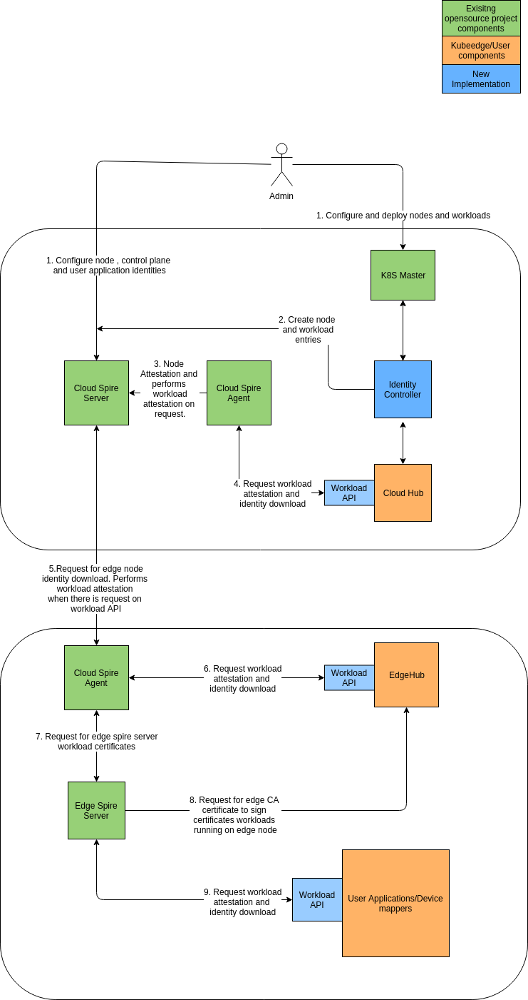
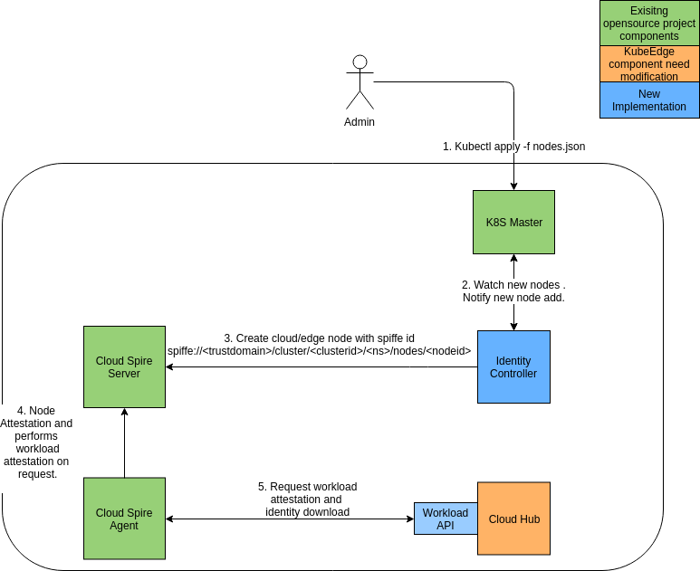
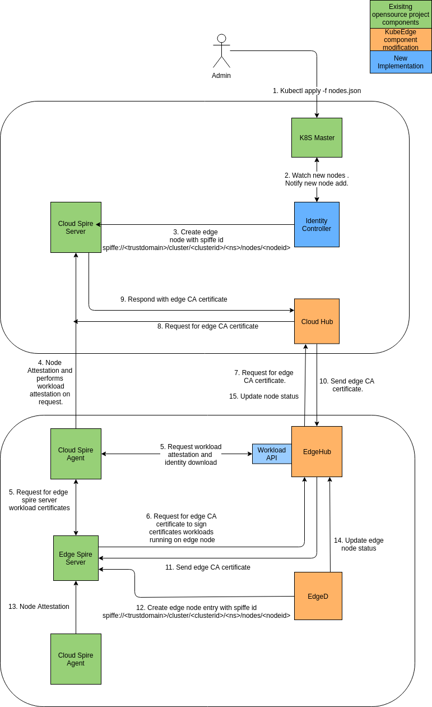
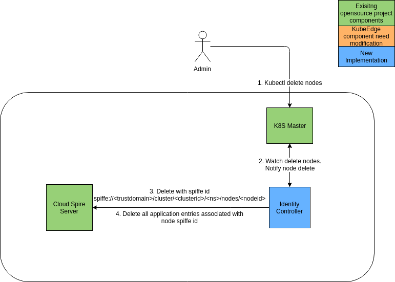
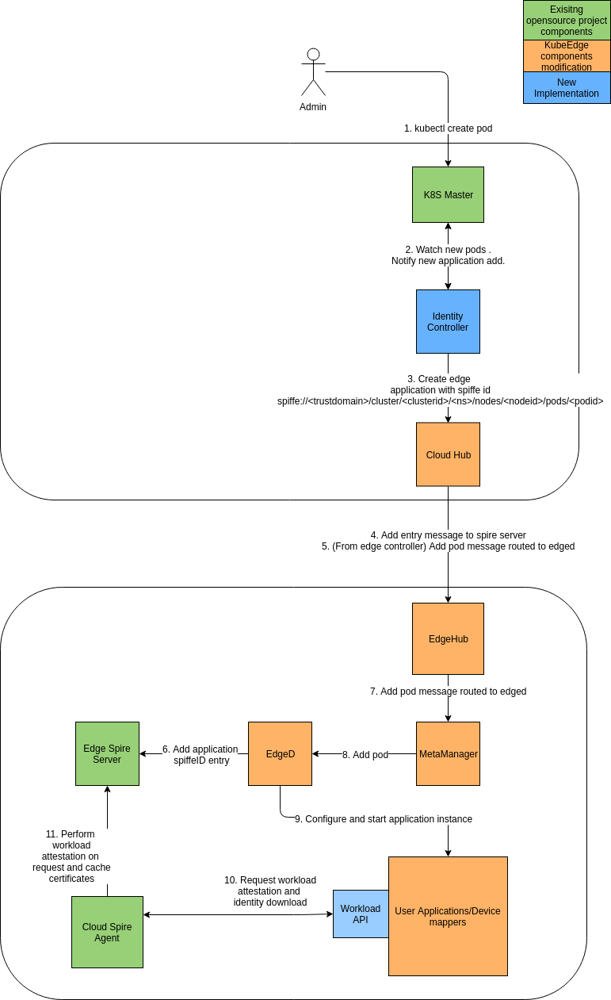
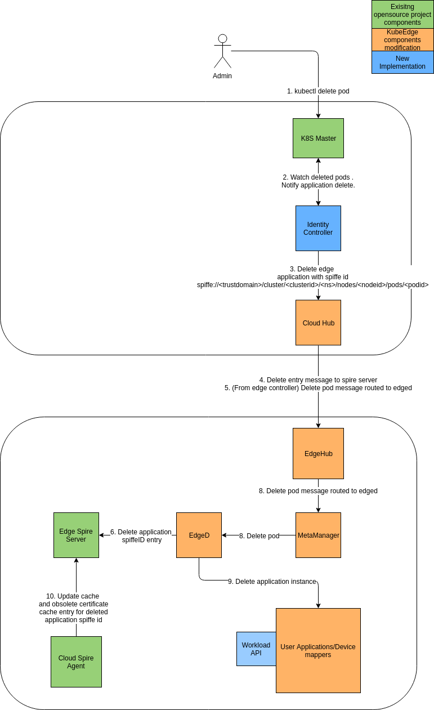

# Decentralized Edge Service Identity Framework Design

* [Decentralized Edge Service Identity Framework Design](#Decentralized Edge Service Identity Framework Design)
  * [Motivation](#motivation)
    * [Goals](#goals)
    * [Non\-goals](#non-goals)
  * [Proposal](#proposal)
    * [Use Cases](#use-cases)
  * [Design Details](#design-details)  
    * [Node registration and deletion](#nodes-registration-and-deletion)
    * [Application registration and deletion](#application-registration-and-deletion)
  * [Offline Scenarios](#offline-scenarios)
  * [Scalability](#scalability)
  * [Open questions](#open-questions)

## Motivation

Security is a paramount requirement for edge computing architecture as security breaches can make a complete organization to come to a halt (IIot) , data breach can lead to privacy issues and also control of the complete edge computing infrastructure. Each computation process and communication is required to be secure and auditable which requires a strong identity framework which supports assignment of identities for every workload and device, attestation of identities, rotation of secrets, blocking invalid identities from communication channels and information that helps better auditing. Traditional methods of network isolation strategies pose difficulty with scalabiliy and mobility of user devices and applications as network policies and user-specific edge node security management requires manual intervention from administrators and are prone to human errors.

### Goals (in security-version 0.1)
* Ability to assign identities for edge nodes and workloads.
* Ability to attest the identities assigned.
* Ability to block requests from workloads which are not allowed to communicate.
* Ability to rotate secrets for KubeEdge components after a configured TTL.
* Ability to rotate secrets for user workloads after a configured TTL.
* Ability to rotate secrets for user workloads to obtain secrets without connecting to cloud during the configured TTL.

### Non-goals (in security-version 0.1)

* To issue identities for devices connecting to KubeEdge using mqtt.
* To address secure deployment of certificates for identity servers.
* Sync up node-name or node identities from k8s master to security identities.
* Communication policies.
* Bootstrapping SPIRE components.
* Force revocation of ca bundle and leaf certificates.
* Policy management.
* Spire server federation.

## Proposal
* Use SPIFFE specification based SPIRE for implementation of identity servers.
TBD : Information about spire
* Architecture goal.
TBD : Overall architecture

* PoC without KubeEdge integration.
TBD : Link to PoC example

### Use Cases

* Perform create/delete operations on node entries.
  * Users will create and delete node entries with identity framework by adding nodes and application instances either using kubernetes master or spire cli along with manual deployment of application.
  * Identity framework will perform node attestation based on the entry and attestation plugin configured.

* Perform CRUD operations on workload entries.
   * Users can create, update and delete application instance.
   * Identity framework will perform workload attestation and provide application leaf certificates.

* Workload pod liveness/readiness probe report can be used to understand the connectivity.

* Workload implements workload api to retrieve and rotate certificates.

## Design Details

### Node registration and deletion

Node regisrations are created using exiting kubernetes API. Alternatively, node registrations can also be created using spire-server cli.

On addition of a new edge node, identity controller watches nodes and automatically creates entry for edge node and edge components with attestation information.

For cloud node registration,  

+ Master node is created once the kubernetes control plane is initialized. 

+ Based on the node type, master or slave, respective edge component are assigned a spiffe id with attestation information as configured.

+ Identity controller creates a new entry with spire server.

+ Cloud spire agent performs node attestation and receives node certificates. The node certificates are used to connect to spire server through node api for workload certificate requests.

+ Cloud hub implements spire workload api to retrieve certificates. Cloud spire agent performs workload attestation. On successful attestation, certificate signing request is made to cloud spire server. On response from cloud spire server, cloud spire agent caches the certificate and responds to cloud hub with private key and certificate.

For edge node registration, 

+ Edge node entry is created at kubernetes api server using kubectl command. 

+ Based on the node type, master or slave, respective edge component are assigned a spiffe id with attestation information as configured.

+ Identity controller creates a new entry with spire server.

+ Cloud spire agent performs node attestation and receives node certificates. The node certificates are used to connect to spire server through node api for workload certificate requests.

+ Edge hub implements spire workload api to retrieve certificates. Cloud spire agent (at edge node) performs workload attestation. On successful attestation, certificate signing request is made to cloud spire server. On response from cloud spire server, cloud spire agent caches the certificate and responds to cloud hub with private key and certificate.

+ Edge spire server initialization can be performed with two options. 
1) (Recommended) Edge spire server can download workload api certificates and connect to edgehub (or metamanager?) to download intermediate CA certificates.
2) Edge spire server can download workload api certificates and connect to cloud spire server directly to download intermediate CA certificates.

+ EdgeD on initialization creates node entry with edge spire server and updates the status to kubernetes api server through hub interface.

To delete node,

### Application registration and deletion

On addition of a new user application pod, edged creates entry at edge node spire server, which enables application to retrieve and rotate certificates.

For delete pod,

## Offline scenarios
When there is intermittent / no connectivity between the edge node and the cloud , edge applications can still rotate certificates based on TTL configured for edge spire server.

## Scalability
In the current design, the solution is scalable for single cluster of edge application deployment under a node. Applications hosted under different edge spire server requires a federated spire server deployment for east-to-west direct communication between applications. Also, a policy management framework is necessary for controlling the authorization between applications.

## Open questions
- How are edge nodes identified from other kubernetes nodes deployed in a cluster (heterogenous deployments) ?
- Is it better to use a different CRD for managing identity entries? Using a CRD requires an extra API call to manage the entries.
- Is it better to consider zero trust environment and enable encryption for all communications inside an edge/cloud node?
