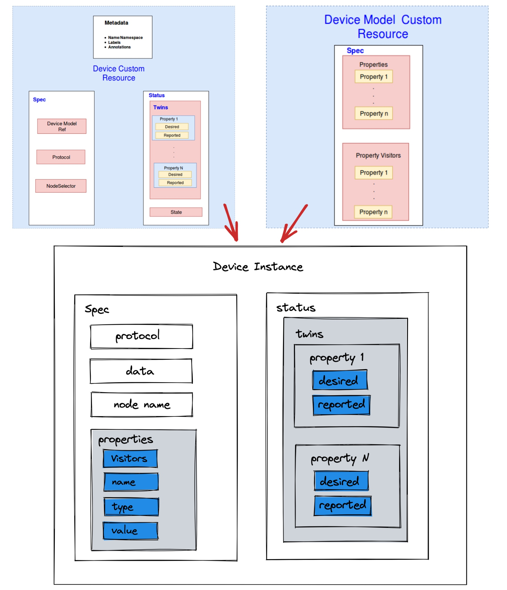

# Device Management v1beta1 Version

## Motivation

In the `alpha` version, there are two CRDs, DeviceModel and Device, but they have the following issues:

1. The same attributes are described in both Device and DeviceModel, but the descriptions are different. This blurs the boundaries and makes it difficult for users to understand how to use them.
2. The original purpose of DeviceModel was to address redundancy, but the current design does not effectively achieve this goal.
3. The existing code is complex, and there are issues with the order of updates for Device and DeviceModel.
4. Whether DeviceModel is necessary or if it can be eliminated, with its content merged into Device.

## Goals

- Refactor the Device module
- Device Instance CRD `v1beta1` - added
- Device Instance CRD `v1alpha2` - deprecated
- Device Model CRD `v1alpha2` - deprecated
- Device ConfigMap - deprecated

## User-facing change

- No longer backward compatible with `alpha` version of Device CR instances.
- Deprecated the usage of Device ConfigMap.
- Mappers need to integrate with KubeEdge using the latest DMI interface.
- Unit/E2E Tests related to Device.

### Use Cases

* Describe device properties.
    * Users can describe device properties and access mechanisms to interact with / control the device.
* Perform CRUD operations on devices from cloud.
    * Users can create, update and delete device metadata from the cloud via the CRD APIs exposed by the Kubernetes API
      server.
    * Users can control the desired state of a device via the CRD APIs.
* Report device properties values.
    * Mapper applications running on the edge can report the current values of the device properties.

## Design Details

### CRD API Group and Version

The `Device` CRD's will be namespace-scoped.
The tables below summarize the group, kind and API version details for the CRDs.

* DeviceInstance

| Field      | Description         |
|------------|---------------------|
| Group      | devices.kubeedge.io |
| APIVersion | v1beta1             |
| Kind       | Device              |

### Device instance CRD



A `device` instance represents an actual device object.

The device spec is static, including device properties list, it describes the details of each property, including its name, type, access method

The device status contains dynamically changing data like the desired state of a device property and the state reported by the device.

### Device instance type definition

```go
// DeviceSpec represents a single device instance.
type DeviceSpec struct {
// Data section describe a list of time-series properties which should be processed
// on edge node.
// +optional
Data DeviceData `json:"data,omitempty"`
// NodeName is a request to schedule this device onto a specific node. If it is non-empty,
// the scheduler simply schedules this device onto that node, assuming that it fits
// resource requirements.
// +optional
NodeName string `json:"nodeName,omitempty"`
// List of properties which describe the device properties.
// properties list item must be unique by properties.Name.
// +optional
Properties []DeviceProperties `json:"properties,omitempty"`
// Required: The protocol configuration used to connect to the device.
Protocol ProtocolConfig `json:"protocol,omitempty"`
}

// Only one of its members may be specified.
type ProtocolConfig struct {
// Protocol configuration for opc-ua
// +optional
OpcUA *ProtocolConfigOpcUA `json:"opcua,omitempty"`
// Protocol configuration for modbus
// +optional
Modbus *ProtocolConfigModbus `json:"modbus,omitempty"`
// Protocol configuration for bluetooth
// +optional
Bluetooth *ProtocolConfigBluetooth `json:"bluetooth,omitempty"`
// Configuration for protocol common part
// +optional
Common *ProtocolConfigCommon `json:"common,omitempty"`
// Configuration for customized protocol
// +optional
CustomizedProtocol *ProtocolConfigCustomized `json:"customizedProtocol,omitempty"`
}

type ProtocolConfigOpcUA struct {
// Required: The URL for opc server endpoint.
URL string `json:"url,omitempty"`
// Username for access opc server.
// +optional
UserName string `json:"userName,omitempty"`
// Password for access opc server.
// +optional
Password string `json:"password,omitempty"`
// Defaults to "none".
// +optional
SecurityPolicy string `json:"securityPolicy,omitempty"`
// Defaults to "none".
// +optional
SecurityMode string `json:"securityMode,omitempty"`
// Certificate for access opc server.
// +optional
Certificate string `json:"certificate,omitempty"`
// PrivateKey for access opc server.
// +optional
PrivateKey string `json:"privateKey,omitempty"`
// Timeout seconds for the opc server connection.???
// +optional
Timeout int64 `json:"timeout,omitempty"`
}

// Only one of its members may be specified.
type ProtocolConfigModbus struct {
// Required. 0-255
SlaveID *int64 `json:"slaveID,omitempty"`
}

// Only one of COM or TCP may be specified.
type ProtocolConfigCommon struct {
// +optional
COM *ProtocolConfigCOM `json:"com,omitempty"`
// +optional
TCP *ProtocolConfigTCP `json:"tcp,omitempty"`
// Communication type, like tcp client, tcp server or COM
// +optional
CommType string `json:"commType,omitempty"`
// Reconnection timeout
// +optional
ReconnTimeout int64 `json:"reconnTimeout,omitempty"`
// Reconnecting retry times
// +optional
ReconnRetryTimes int64 `json:"reconnRetryTimes,omitempty"`
// Define timeout of mapper collect from device.
// +optional
CollectTimeout int64 `json:"collectTimeout,omitempty"`
// Define retry times of mapper will collect from device.
// +optional
CollectRetryTimes int64 `json:"collectRetryTimes,omitempty"`
// Define collect type, sync or async.
// +optional
// +kubebuilder:validation:Enum=sync;async
CollectType string `json:"collectType,omitempty"`
// Customized values for provided protocol
// +optional
// +kubebuilder:validation:XPreserveUnknownFields
CustomizedValues *CustomizedValue `json:"customizedValues,omitempty"`
}

type ProtocolConfigTCP struct {
// Required.
IP string `json:"ip,omitempty"`
// Required.
Port int64 `json:"port,omitempty"`
}

type ProtocolConfigCOM struct {
// Required.
SerialPort string `json:"serialPort,omitempty"`
// Required. BaudRate 115200|57600|38400|19200|9600|4800|2400|1800|1200|600|300|200|150|134|110|75|50
// +kubebuilder:validation:Enum=115200;57600;38400;19200;9600;4800;2400;1800;1200;600;300;200;150;134;110;75;50
BaudRate int64 `json:"baudRate,omitempty"`
// Required. Valid values are 8, 7, 6, 5.
// +kubebuilder:validation:Enum=8;7;6;5
DataBits int64 `json:"dataBits,omitempty"`
// Required. Valid options are "none", "even", "odd". Defaults to "none".
// +kubebuilder:validation:Enum=none;even;odd
Parity string `json:"parity,omitempty"`
// Required. Bit that stops 1|2
// +kubebuilder:validation:Enum=1;2
StopBits int64 `json:"stopBits,omitempty"`
}

type ProtocolConfigBluetooth struct {
// Unique identifier assigned to the device.
// +optional
MACAddress string `json:"macAddress,omitempty"`
}

type ProtocolConfigCustomized struct {
// Unique protocol name
// Required.
ProtocolName string `json:"protocolName,omitempty"`
// Any config data
// +optional
// +kubebuilder:validation:XPreserveUnknownFields
ConfigData *CustomizedValue `json:"configData,omitempty"`
}

// DeviceStatus reports the device state and the desired/reported values of twin attributes.
type DeviceStatus struct {
// A list of device twins containing desired/reported desired/reported values of twin properties.
// Optional: A passive device won't have twin properties and this list could be empty.
// +optional
Twins []Twin `json:"twins,omitempty"`
}

// Twin provides a logical representation of control properties (writable properties in the
// device model). The properties can have a Desired state and a Reported state. The cloud configures
// the `Desired`state of a device property and this configuration update is pushed to the edge node.
// The mapper sends a command to the device to change this property value as per the desired state .
// It receives the `Reported` state of the property once the previous operation is complete and sends
// the reported state to the cloud. Offline device interaction in the edge is possible via twin
// properties for control/command operations.
type Twin struct {
// Required: The property name for which the desired/reported values are specified.
// This property should be present in the device model.
PropertyName string `json:"propertyName,omitempty"`
// Required: the reported property value.
Reported TwinProperty `json:"reported,omitempty"`
// Required: the desired property value.
Desired TwinProperty `json:"desired,omitempty"`
}

// TwinProperty represents the device property for which an Expected/Actual state can be defined.
type TwinProperty struct {
// Required: The value for this property.
Value string `json:"value,"`
// Additional metadata like timestamp when the value was reported etc.
// +optional
Metadata map[string]string `json:"metadata,omitempty"`
}

// DeviceData reports the device's time-series data to edge MQTT broker.
// These data should not be processed by edgecore. Instead, they can be processed by
// third-party data-processing apps like EMQX kuiper.
type DeviceData struct {
// Required: A list of data properties, which are not required to be processed by edgecore
DataProperties []DataProperty `json:"dataProperties,omitempty"`
// Topic used by mapper, all data collected from dataProperties
// should be published to this topic,
// the default value is $ke/events/device/+/data/update
// +optional
DataTopic string `json:"dataTopic,omitempty"`
}

// DataProperty represents the device property for external use.
type DataProperty struct {
// Required: The property name for which should be processed by external apps.
// This property should be present in the device model.
PropertyName string `json:"propertyName,omitempty"`
// Additional metadata like timestamp when the value was reported etc.
// +optional
Metadata map[string]string `json:"metadata,omitempty"`
}

// DeviceProperties describes the specifics all the properties of the device.
type DeviceProperties struct {
// Required: The device property name to be accessed. It must be unique.
Name string `json:"name,omitempty"`
// Required: PropertyType represents the type and data validation of the property.
Type PropertyType `json:"type,omitempty"`
// Visitors are intended to be consumed by device mappers which connect to devices
// and collect data / perform actions on the device.
// Required: Protocol relevant config details about the how to access the device property.
Visitors VisitorConfig `json:"visitors,omitempty"`
// Define how frequent mapper will report the value.
// +optional
ReportCycle int64 `json:"reportCycle,omitempty"`
// Define how frequent mapper will collect from device.
// +optional
CollectCycle int64 `json:"collectCycle,omitempty"`
}

// VisitorConfig At least one of its members must be specified.
type VisitorConfig struct {
// Opcua represents a set of additional visitor config fields of opc-ua protocol.
// +optional
OpcUA *VisitorConfigOPCUA `json:"opcua,omitempty"`
// Modbus represents a set of additional visitor config fields of modbus protocol.
// +optional
Modbus *VisitorConfigModbus `json:"modbus,omitempty"`
// Bluetooth represents a set of additional visitor config fields of bluetooth protocol.
// +optional
Bluetooth *VisitorConfigBluetooth `json:"bluetooth,omitempty"`
// CustomizedProtocol represents a set of visitor config fields of bluetooth protocol.
// +optional
CustomizedProtocol *VisitorConfigCustomized `json:"customizedProtocol,omitempty"`
// Customized values for visitor of provided protocols
// +optional
// +kubebuilder:validation:XPreserveUnknownFields
CustomizedValues *CustomizedValue `json:"customizedValues,omitempty"`
}

// Common visitor configurations for bluetooth protocol
type VisitorConfigBluetooth struct {
// Required: Unique ID of the corresponding operation
CharacteristicUUID string `json:"characteristicUUID,omitempty"`
// Responsible for converting the data coming from the platform into a form that is understood by the bluetooth device
// For example: "ON":[1], "OFF":[0]
// +optional
DataWriteToBluetooth map[string][]byte `json:"dataWrite,omitempty"`
// Responsible for converting the data being read from the bluetooth device into a form that is understandable by the platform
// +optional
BluetoothDataConverter BluetoothReadConverter `json:"dataConverter,omitempty"`
}

// Specifies the operations that may need to be performed to convert the data
type BluetoothReadConverter struct {
// Required: Specifies the start index of the incoming byte stream to be considered to convert the data.
// For example: start-index:2, end-index:3 concatenates the value present at second and third index of the incoming byte stream. If we want to reverse the order we can give it as start-index:3, end-index:2
StartIndex int `json:"startIndex,omitempty"`
// Required: Specifies the end index of incoming byte stream to be considered to convert the data
// the value specified should be inclusive for example if 3 is specified it includes the third index
EndIndex int `json:"endIndex,omitempty"`
// Refers to the number of bits to shift left, if left-shift operation is necessary for conversion
// +optional
ShiftLeft uint `json:"shiftLeft,omitempty"`
// Refers to the number of bits to shift right, if right-shift operation is necessary for conversion
// +optional
ShiftRight uint `json:"shiftRight,omitempty"`
// Specifies in what order the operations(which are required to be performed to convert incoming data into understandable form) are performed
// +optional
OrderOfOperations []BluetoothOperations `json:"orderOfOperations,omitempty"`
}

// Specify the operation that should be performed to convert incoming data into understandable form
type BluetoothOperations struct {
// Required: Specifies the operation to be performed to convert incoming data
BluetoothOperationType BluetoothArithmeticOperationType `json:"operationType,omitempty"`
// Required: Specifies with what value the operation is to be performed
BluetoothOperationValue float64 `json:"operationValue,omitempty"`
}

// Operations supported by Bluetooth protocol to convert the value being read from the device into an understandable form
// +kubebuilder:validation:Enum:Add;Subtract;Multiply;Divide
type BluetoothArithmeticOperationType string

// Bluetooth Protocol Operation type
const (
BluetoothAdd      BluetoothArithmeticOperationType = "Add"
BluetoothSubtract BluetoothArithmeticOperationType = "Subtract"
BluetoothMultiply BluetoothArithmeticOperationType = "Multiply"
BluetoothDivide   BluetoothArithmeticOperationType = "Divide"
)

// Common visitor configurations for opc-ua protocol
type VisitorConfigOPCUA struct {
// Required: The ID of opc-ua node, e.g. "ns=1,i=1005"
NodeID string `json:"nodeID,omitempty"`
// The name of opc-ua node
BrowseName string `json:"browseName,omitempty"`
}

// Common visitor configurations for modbus protocol
type VisitorConfigModbus struct {
// Required: Type of register
Register ModbusRegisterType `json:"register,omitempty"`
// Required: Offset indicates the starting register number to read/write data.
Offset *int64 `json:"offset,omitempty"`
// Required: Limit number of registers to read/write.
Limit *int64 `json:"limit,omitempty"`
// The scale to convert raw property data into final units.
// Defaults to 1.0
// +optional
Scale float64 `json:"scale,omitempty"`
// Indicates whether the high and low byte swapped.
// Defaults to false.
// +optional
IsSwap bool `json:"isSwap,omitempty"`
// Indicates whether the high and low register swapped.
// Defaults to false.
// +optional
IsRegisterSwap bool `json:"isRegisterSwap,omitempty"`
}

// The Modbus register type to read a device property.
// +kubebuilder:validation:Enum=CoilRegister;DiscreteInputRegister;InputRegister;HoldingRegister
type ModbusRegisterType string

// Modbus device protocol register types
const (
ModbusRegisterTypeCoilRegister          ModbusRegisterType = "CoilRegister"
ModbusRegisterTypeDiscreteInputRegister ModbusRegisterType = "DiscreteInputRegister"
ModbusRegisterTypeInputRegister         ModbusRegisterType = "InputRegister"
ModbusRegisterTypeHoldingRegister       ModbusRegisterType = "HoldingRegister"
)

// Common visitor configurations for customized protocol
type VisitorConfigCustomized struct {
// Required: name of customized protocol
ProtocolName string `json:"protocolName,omitempty"`
// Required: The configData of customized protocol
// +kubebuilder:validation:XPreserveUnknownFields
ConfigData *CustomizedValue `json:"configData,omitempty"`
}

// Represents the type and data validation of a property.
// Only one of its members may be specified.
type PropertyType struct {
// +optional
Int *PropertyTypeInt64 `json:"int,omitempty"`
// +optional
String *PropertyTypeString `json:"string,omitempty"`
// +optional
Double *PropertyTypeDouble `json:"double,omitempty"`
// +optional
Float *PropertyTypeFloat `json:"float,omitempty"`
// +optional
Boolean *PropertyTypeBoolean `json:"boolean,omitempty"`
// +optional
Bytes *PropertyTypeBytes `json:"bytes,omitempty"`
}

type PropertyTypeInt64 struct {
// Required: Access mode of property, ReadWrite or ReadOnly.
AccessMode PropertyAccessMode `json:"accessMode,omitempty"`
// +optional
DefaultValue int64 `json:"defaultValue,omitempty"`
// +optional
Minimum int64 `json:"minimum,omitempty"`
// +optional
Maximum int64 `json:"maximum,omitempty"`
// The unit of the property
// +optional
Unit string `json:"unit,omitempty"`
}

type PropertyTypeString struct {
// Required: Access mode of property, ReadWrite or ReadOnly.
AccessMode PropertyAccessMode `json:"accessMode,omitempty"`
// +optional
DefaultValue string `json:"defaultValue,omitempty"`
}

type PropertyTypeDouble struct {
// Required: Access mode of property, ReadWrite or ReadOnly.
AccessMode PropertyAccessMode `json:"accessMode,omitempty"`
// +optional
DefaultValue float64 `json:"defaultValue,omitempty"`
// +optional
Minimum float64 `json:"minimum,omitempty"`
// +optional
Maximum float64 `json:"maximum,omitempty"`
// The unit of the property
// +optional
Unit string `json:"unit,omitempty"`
}

type PropertyTypeFloat struct {
// Required: Access mode of property, ReadWrite or ReadOnly.
AccessMode PropertyAccessMode `json:"accessMode,omitempty"`
// +optional
DefaultValue float32 `json:"defaultValue,omitempty"`
// +optional
Minimum float32 `json:"minimum,omitempty"`
// +optional
Maximum float32 `json:"maximum,omitempty"`
// The unit of the property
// +optional
Unit string `json:"unit,omitempty"`
}

type PropertyTypeBoolean struct {
// Required: Access mode of property, ReadWrite or ReadOnly.
AccessMode PropertyAccessMode `json:"accessMode,omitempty"`
// +optional
DefaultValue bool `json:"defaultValue,omitempty"`
}

type PropertyTypeBytes struct {
// Required: Access mode of property, ReadWrite or ReadOnly.
AccessMode PropertyAccessMode `json:"accessMode,omitempty"`
}

// The access mode for  a device property.
// +kubebuilder:validation:Enum=ReadWrite;ReadOnly
type PropertyAccessMode string

// Access mode constants for a device property.
const (
ReadWrite PropertyAccessMode = "ReadWrite"
ReadOnly  PropertyAccessMode = "ReadOnly"
)

// +genclient
// +k8s:deepcopy-gen:interfaces=k8s.io/apimachinery/pkg/runtime.Object

// Device is the Schema for the devices API
// +k8s:openapi-gen=true
type Device struct {
metav1.TypeMeta   `json:",inline"`
metav1.ObjectMeta `json:"metadata,omitempty"`

Spec   DeviceSpec   `json:"spec,omitempty"`
Status DeviceStatus `json:"status,omitempty"`
}

// +k8s:deepcopy-gen:interfaces=k8s.io/apimachinery/pkg/runtime.Object

// DeviceList contains a list of Device
type DeviceList struct {
metav1.TypeMeta `json:",inline"`
metav1.ListMeta `json:"metadata,omitempty"`
Items           []Device `json:"items"`
}

```

### Device instance sample

```yaml
apiVersion: devices.kubeedge.io/v1beta1
kind: Device
metadata:
  name: modbus-v1beta1-device
spec:
  nodeName: worker-node1
  properties:
    - name: temperature
      type:
        int:
          accessMode: ReadWrite
          maximum: 100
      collectCycle: 2000
      reportCycle: 2000
      visitors:
        modbus:
          register: HoldingRegister
          offset: 2
          limit: 1
          scale: 1
          isSwap: true
          isRegisterSwap: true
    - name: temperature-enable
      type:
        string:
          accessMode: ReadWrite
          defaultValue: 'OFF'
      collectCycle: 2000
      reportCycle: 2000
      visitors:
        modbus:
          register: DiscreteInputRegister
          offset: 3
          limit: 1
          scale: 1.0
          isSwap: true
          isRegisterSwap: true
  protocol:
    common:
      com: { }
      tcp:
        ip: 127.0.0.1
        port: 502
    modbus:
      slaveID: 0
status:
  twins:
    - propertyName: temperature
      desired:
        metadata:
          timestamp: '1692168021640'
          type: int
        value: '30'
    - propertyName: temperature-enable
      desired:
        metadata:
          timestamp: '1692168021640'
          type: string
        value: 'OFF'

```

### Validation

[Open API v3 Schema based validation](https://kubernetes.io/docs/tasks/access-kubernetes-api/custom-resources/custom-resource-definitions/#validation) can be used to guard against bad requests.
Invalid values for fields ( example string value for a boolean field etc) can be validated using this.
In some cases , we also need custom validations
[Validation admission web hooks](https://kubernetes.io/docs/reference/access-authn-authz/admission-controllers/#validatingadmissionwebhook) can be used to implement such custom validation rules.

Here is a list of validations we need to support :

#### Device Instance Validations

- Don't allow device instance creation if any `Required` fields are missing ( like property name , twin property value, twin property name etc.)
- Don't allow device instance creation if the names in the Properties list not be unique.
- Don't allow device instance creation if a desired twin property's name cannot be matched to a device property in the device model it refers to.

### Downstream Controller

The downstream controller watches for device updates against the K8S API server.

In version `v1beta1`, the working logic of the downstream controller remains consistent with the `v1alpha` version, but the handling of DeviceModel and ConfigMap has been removed, significantly simplifying the code complexity.

Updates are categorized below along with the possible actions that the downstream controller can take:

| Update Type  | Action      |
|-------|-------------------|
| New Device Created    | The controller first stores device information in a sync.Map. If the device has provided node information, it sends a message to create the device type to the edge node. |
| Device Node Membership Updated     | The device controller sends a membership update event to the edge node. |
| Device  Twin Desired State Updated | The device controller sends a twin update event to the edge node.  |
| Device Deleted                     | The controller will first remove the device from the sync.Map. If the device had previously been deployed to an edge node, it sends a deletion message to the edge node, thus notifying the edge to delete this device.    |

### Upstream Controller
 The upstream controller watches for updates from the edge node and applies these updates against the API server in the cloud. Updates are categorized below along with the possible actions that the upstream controller can take:

| Update Type          | Action    |
|-----------------  |------------------ |
|Device Twin Reported State Updated    |  The controller patches the reported state of the device twin property in the cloud. |

## Implementation plan

- Complete `v1beta1` API design.
- Replace `v1alpha` content with `v1beta1`.
- Remove code related to `ConfigMap` and `DeviceModel`.
- Complete overall logic modifications and test cases.

All future modifications to the Device CRD will be based on the `v1beta1` version.
