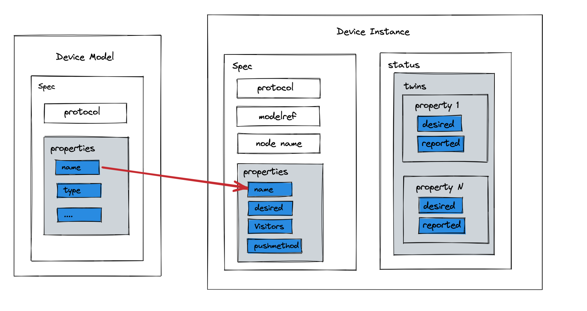

# Device Management v1beta1 Version

## Motivation

In the `alpha` version, there are two CRDs, DeviceModel and Device, but they have the following issues:

1. The same attributes are described in both Device and DeviceModel, but the descriptions are different. This blurs the boundaries and makes it difficult for users to understand how to use them.
2. The original purpose of DeviceModel was to address redundancy, but the current design does not effectively achieve this goal.
3. The existing code is complex, and there are issues with the order of updates for Device and DeviceModel.
4. Whether DeviceModel is necessary or if it can be eliminated, with its content merged into Device.

## Goals

- Refactor the Device module
- Device Model CRD `v1beta1` - added
- Device Instance CRD `v1beta1` - added
- Device Model CRD `v1alpha2` - deprecated
- Device Instance CRD `v1alpha2` - deprecated
- Device ConfigMap - deprecated

## User-facing change

- No longer backward compatible with `alpha` version of Device CR instances.
- Deprecated the usage of Device ConfigMap.
- Mappers need to integrate with KubeEdge using the latest DMI interface.
- Unit/E2E Tests related to Device.

### Use Cases

* Describe device properties.
    * Users can describe device properties and access mechanisms to interact with / control the device.
* Perform CRUD operations on devices from cloud.
    * Users can create, update and delete device metadata from the cloud via the CRD APIs exposed by the Kubernetes API
      server.
    * Users can control the desired state of a device via the CRD APIs.
* Report device properties values.
    * Mapper applications running on the edge can report the current values of the device properties.

## Design Details

### CRD API Group and Version



The `DeviceModel` and `Device` CRD's will be namespace-scoped.
The tables below summarize the group, kind and API version details for the CRDs.

* DeviceModel

| Field      | Description         |
|------------|---------------------|
| Group      | devices.kubeedge.io |
| APIVersion | v1beta1             |
| Kind       | DeviceModel         |

* DeviceInstance

| Field      | Description         |
|------------|---------------------|
| Group      | devices.kubeedge.io |
| APIVersion | v1beta1             |
| Kind       | Device              |


### Device model CRD

A `device model` describes the device properties exposed by the device . A device model is a `Physical model` which constrains the properties and parameters of physical devices.

### Device Model Type Definition
```go

// DeviceModelSpec defines the model for a device.It is a blueprint which describes the device
// capabilities and access mechanism via property visitors.
type DeviceModelSpec struct {
	// Required: List of device properties.
	Properties []ModelProperty `json:"properties,omitempty"`
	// Required: Protocol name used by the device.
	Protocol string `json:"protocol,omitempty"`
}

// ModelProperty describes an individual device property / attribute like temperature / humidity etc.
type ModelProperty struct {
	// Required: The device property name.
	Name string `json:"name,omitempty"`
	// The device property description.
	// +optional
	Description string `json:"description,omitempty"`
	// Required: Type of device property, ENUM: INT,FLOAT,DOUBLE,STRING,BOOLEAN,BYTES
	Type PropertyType `json:"type,omitempty"`
	// Required: Access mode of property, ReadWrite or ReadOnly.
	AccessMode PropertyAccessMode `json:"accessMode,omitempty"`
	// +optional
	Minimum string `json:"minimum,omitempty"`
	// +optional
	Maximum string `json:"maximum,omitempty"`
	// The unit of the property
	// +optional
	Unit string `json:"unit,omitempty"`
}

// The type of device property.
// +kubebuilder:validation:Enum=INT;FLOAT;DOUBLE;STRING;BOOLEAN;BYTES
type PropertyType string

const (
	INT     PropertyType = "INT"
	FLOAT   PropertyType = "FLOAT"
	DOUBLE  PropertyType = "DOUBLE"
	STRING  PropertyType = "STRING"
	BOOLEAN PropertyType = "BOOLEAN"
	BYTES   PropertyType = "BYTES"
)

// The access mode for  a device property.
// +kubebuilder:validation:Enum=ReadWrite;ReadOnly
type PropertyAccessMode string

// Access mode constants for a device property.
const (
	ReadWrite PropertyAccessMode = "ReadWrite"
	ReadOnly  PropertyAccessMode = "ReadOnly"
)

// +genclient
// +k8s:deepcopy-gen:interfaces=k8s.io/apimachinery/pkg/runtime.Object

// DeviceModel is the Schema for the device model API
// +k8s:openapi-gen=true
// +kubebuilder:storageversion
type DeviceModel struct {
	metav1.TypeMeta   `json:",inline"`
	metav1.ObjectMeta `json:"metadata,omitempty"`

	Spec DeviceModelSpec `json:"spec,omitempty"`
}
```

### Device model sample
```yaml
apiVersion: devices.kubeedge.io/v1beta1
kind: DeviceModel
metadata:
  name: beta1-model
spec:
  properties:
    - name: temp
      description: beta1-model
      type: INT
      accessMode: ReadWrite
      maximum: "100"
      minimum: "1"
      unit: "Celsius"
  protocol: modbus
```

### Device instance CRD

A `device` instance represents an actual device object.

The device spec is static, including device properties list, it describes the details of each property, including its name, type, access method

The device status contains dynamically changing data like the desired state of a device property and the state reported by the device.

### Device instance type definition

```go

// DeviceSpec represents a single device instance.
type DeviceSpec struct {
	// Required: DeviceModelRef is reference to the device model used as a template
	// to create the device instance.
	DeviceModelRef *v1.LocalObjectReference `json:"deviceModelRef,omitempty"`
	// NodeName is a request to schedule this device onto a specific node. If it is non-empty,
	// the scheduler simply schedules this device onto that node, assuming that it fits
	// resource requirements.
	// +optional
	NodeName string `json:"nodeName,omitempty"`
	// List of properties which describe the device properties.
	// properties list item must be unique by properties.Name.
	// +optional
	Properties []DeviceProperty `json:"properties,omitempty"`
	// Required: The protocol configuration used to connect to the device.
	Protocol ProtocolConfig `json:"protocol,omitempty"`
}

// DeviceStatus reports the device state and the desired/reported values of twin attributes.
type DeviceStatus struct {
	// A list of device twins containing desired/reported desired/reported values of twin properties.
	// Optional: A passive device won't have twin properties and this list could be empty.
	// +optional
	Twins []Twin `json:"twins,omitempty"`
}

// Twin provides a logical representation of control properties (writable properties in the
// device model). The properties can have a Desired state and a Reported state. The cloud configures
// the `Desired`state of a device property and this configuration update is pushed to the edge node.
// The mapper sends a command to the device to change this property value as per the desired state .
// It receives the `Reported` state of the property once the previous operation is complete and sends
// the reported state to the cloud. Offline device interaction in the edge is possible via twin
// properties for control/command operations.
type Twin struct {
	// Required: The property name for which the desired/reported values are specified.
	// This property should be present in the device model.
	PropertyName string `json:"propertyName,omitempty"`
	// Required: the reported property value.
	Reported TwinProperty `json:"reported,omitempty"`
	// The meaning of here is to indicate desired value of `deviceProperty.Desired`
	// that the mapper has received in current cycle.
	// Useful in cases that people want to check whether the mapper is working
	// appropriately and its internal status is up-to-date.
	// This value should be only updated by devicecontroller upstream.
	ObservedDesired TwinProperty `json:"observedDesired,omitempty"`
}

// TwinProperty represents the device property for which an Expected/Actual state can be defined.
type TwinProperty struct {
	// Required: The value for this property.
	Value string `json:"value,"`
	// Additional metadata like timestamp when the value was reported etc.
	// +optional
	Metadata map[string]string `json:"metadata,omitempty"`
}

type ProtocolConfig struct {
	// Unique protocol name
	// Required.
	ProtocolName string `json:"protocolName,omitempty"`
	// Any config data
	// +optional
	// +kubebuilder:validation:XPreserveUnknownFields
	ConfigData *CustomizedValue `json:"configData,omitempty"`
}

// DeviceProperty describes the specifics all the properties of the device.
type DeviceProperty struct {
	// Required: The device property name to be accessed. It must be unique.
	Name string `json:"name,omitempty"`
	// The desired property value.
	Desired TwinProperty `json:"desired,omitempty"`
	// Visitors are intended to be consumed by device mappers which connect to devices
	// and collect data / perform actions on the device.
	// Required: Protocol relevant config details about the how to access the device property.
	Visitors VisitorConfig `json:"visitors,omitempty"`
	// Define how frequent mapper will report the value.
	// +optional
	ReportCycle int64 `json:"reportCycle,omitempty"`
	// Define how frequent mapper will collect from device.
	// +optional
	CollectCycle int64 `json:"collectCycle,omitempty"`
	// whether be reported to the cloud
	ReportToCloud bool `json:"reportToCloud,omitempty"`
	// PushMethod represents the protocol used to push data,
	// please ensure that the mapper can access the destination address.
	// +optional
	PushMethod *PushMethod `json:"pushMethod,omitempty"`
}

type PushMethod struct {
	// HTTP Push method configuration for http
	// +optional
	HTTP *PushMethodHTTP `json:"http,omitempty"`
	// MQTT Push method configuration for mqtt
	// +optional
	MQTT *PushMethodMQTT `json:"mqtt,omitempty"`
}

type PushMethodHTTP struct {
	// +optional
	HostName string `json:"hostName,omitempty"`
	// +optional
	Port int64 `json:"port,omitempty"`
	// +optional
	RequestPath string `json:"requestPath,omitempty"`
	// +optional
	Timeout int64 `json:"timeout,omitempty"`
}

type PushMethodMQTT struct {
	// broker address, like mqtt://127.0.0.1:1883
	// +optional
	Address string `json:"address,omitempty"`
	// publish topic for mqtt
	// +optional
	Topic string `json:"topic,omitempty"`
	// qos of mqtt publish param
	// +optional
	QoS int32 `json:"qos,omitempty"`
	// Is the message retained
	// +optional
	Retained bool `json:"retained,omitempty"`
}

type VisitorConfig struct {
	// Required: name of customized protocol
	ProtocolName string `json:"protocolName,omitempty"`
	// Required: The configData of customized protocol
	// +kubebuilder:validation:XPreserveUnknownFields
	ConfigData *CustomizedValue `json:"configData,omitempty"`
}

// +genclient
// +k8s:deepcopy-gen:interfaces=k8s.io/apimachinery/pkg/runtime.Object

// Device is the Schema for the devices API
// +k8s:openapi-gen=true
// +kubebuilder:storageversion
type Device struct {
	metav1.TypeMeta   `json:",inline"`
	metav1.ObjectMeta `json:"metadata,omitempty"`

	Spec   DeviceSpec   `json:"spec,omitempty"`
	Status DeviceStatus `json:"status,omitempty"`
}

// +k8s:deepcopy-gen:interfaces=k8s.io/apimachinery/pkg/runtime.Object

// DeviceList contains a list of Device
type DeviceList struct {
	metav1.TypeMeta `json:",inline"`
	metav1.ListMeta `json:"metadata,omitempty"`
	Items           []Device `json:"items"`
}

// CustomizedValue contains a map type data
// +kubebuilder:validation:Type=object
type CustomizedValue struct {
	Data map[string]interface{} `json:"-"`
}

```

### Device instance sample

```yaml
apiVersion: devices.kubeedge.io/v1beta1
kind: Device
metadata:
  name: beta1-device
spec:
  deviceModelRef:
    name: beta1-model
  nodeName: worker-node1
  properties:
    - name: temp
      collectCycle: 2000      # 2000 stands for 2000 milliseconds (2 seconds)
      reportCycle: 2000       # 2000 stands for 2000 milliseconds (2 seconds)
      desired:
        value: "30"
      reportToCloud: true
      visitors:
        protocolName: modbus
        configData:
          register: "HoldingRegister"
          offset: 2
          limit: 1
          scale: 1
          isSwap: true
          isRegisterSwap: true
  protocol:
    protocolName: modbus
    configData:
      ip: 172.17.0.3
      port: 1502

```

Shown above is an example device model for a temperature sensor with Modbus protocol. It has one property:
- `temp`: the temperature readings from the sensor. The `type` field indicates that the temperature property is of type `int`, it is read-only and the maximum value it can take is 100.

Property visitors provide details like how to access device properties. In the above example, there is a visitor defined which describe how to read/write the device properties using `modbus` protocol. Detailed information on the Modbus registers to access is provided along with the offset, limit and other settings.


### Validation

[Open API v3 Schema based validation](https://kubernetes.io/docs/tasks/access-kubernetes-api/custom-resources/custom-resource-definitions/#validation) can be used to guard against bad requests.
Invalid values for fields ( example string value for a boolean field etc) can be validated using this.
In some cases , we also need custom validations
[Validation admission web hooks](https://kubernetes.io/docs/reference/access-authn-authz/admission-controllers/#validatingadmissionwebhook) can be used to implement such custom validation rules.

Here is a list of validations we need to support :

#### Device Instance Validations

- Don't allow device instance creation if any `Required` fields are missing ( like property name , twin property value, twin property name etc.)
- Don't allow device instance creation if the names in the Properties list not be unique.
- Don't allow device instance creation if a desired twin property's name cannot be matched to a device property in the device model it refers to.

### Downstream Controller

The downstream controller watches for device updates against the K8S API server.

In version `v1beta1`, the working logic of the downstream controller remains consistent with the `v1alpha` version, but the handling of DeviceModel and ConfigMap has been removed, significantly simplifying the code complexity.

Updates are categorized below along with the possible actions that the downstream controller can take:

| Update Type  | Action      |
|-------|-------------------|
| New Device Created    | The controller first stores device information in a sync.Map. If the device has provided node information, it sends a message to create the device type to the edge node. |
| Device Node Membership Updated     | The device controller sends a membership update event to the edge node. |
| Device  Twin Desired State Updated | The device controller sends a twin update event to the edge node.  |
| Device Deleted                     | The controller will first remove the device from the sync.Map. If the device had previously been deployed to an edge node, it sends a deletion message to the edge node, thus notifying the edge to delete this device.    |

### Upstream Controller
 The upstream controller watches for updates from the edge node and applies these updates against the API server in the cloud. Updates are categorized below along with the possible actions that the upstream controller can take:

| Update Type          | Action    |
|-----------------  |------------------ |
|Device Twin Reported State Updated    |  The controller patches the reported state of the device twin property in the cloud. |
