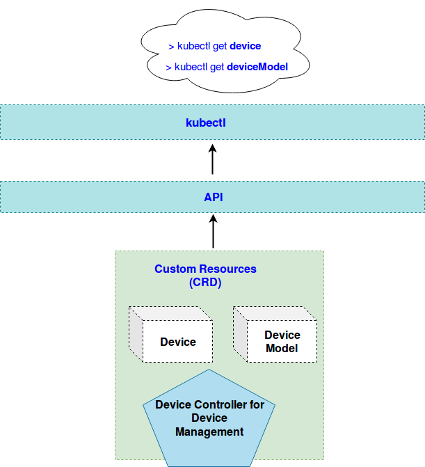
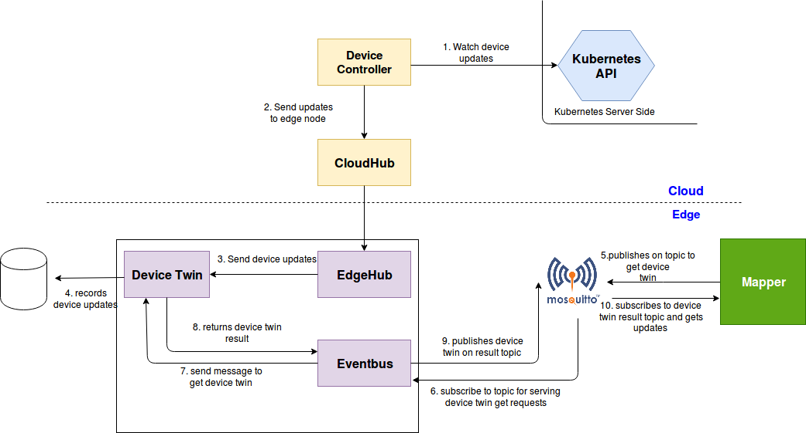
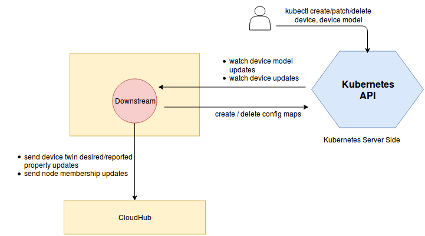

# Device Management using CRDs

* [Device Management using CRDs](#device-management-using-crds)
  * [Motivation](#motivation)
    * [Goals](#goals)
    * [Non\-goals](#non-goals)
  * [Proposal](#proposal)
    * [Use Cases](#use-cases)
  * [Design Details](#design-details)  
    * [Device model CRD](#device-model-crd)
    * [Device model type definition](#device-model-type-definition)
    * [Device model sample](#device-model-sample)
    * [Device instance CRD](#device-instance-crd)
    * [Device instance type definition](#device-instance-type-definition)
    * [Device instance sample](#device-instance-sample)
    * [CRD API Group and Version](#crd-api-group-and-version)
    * [Validation](#validation)
    * [Synchronizing Device Twin Updates](#synchronizing-device-twin-updates)
      * [Syncing Expected Device Twin Property Update From Cloud To Edge](#syncing-expected-device-twin-property-update-from-cloud-to-edge)
      * [Syncing Actual Device Twin Property Update From Edge To Cloud](#syncing-actual-device-twin-property-update-from-edge-to-cloud)
  * [Device Controller Design](#device-controller-design)
    * [Downstream Controller](#downstream-controller)
    * [Upstream Controller](#upstream-controller)
  * [Offline Scenarios](#offline-scenarios)
  * [Scalability](#scalability)
  * [Device Lifecycle Management](#device-lifecycle-management)
    * [Device Actions](#device-actions)
    * [Device Events](#device-events)
   * [Security](#security)
   * [Open questions](#open-questions)

## Motivation

Device management is a key feature required for IoT use-cases in edge computing.
This proposal addresses how can we manage devices from the cloud and synchronize
the device updates between edge nodes and cloud.

### Goals

Device management must:
* provide APIs for managing devices from the cloud.
* synchronize the device updates between cloud and edge nodes.

### Non-goals

* To design **secure** device provisioning.
* To address OTA device firmware upgrades.
* To address how device auto-discovery can happen.
* To address device migration scenarios.

## Proposal
We propose using Kubernetes [Custom Resource Definitions (CRDs)](https://kubernetes.io/docs/concepts/extend-kubernetes/api-extension/custom-resources/) to describe device metadata/status and a controller to synchronize these device updates between edge and cloud.


### Use Cases

* Describe device properties.
  * Users can describe device proeprties and access mechanisms to interact with / control the device.
* Perform CRUD operations on devices from cloud.
   * Users can create, update and delete device metadata from the cloud via the CRD APIs exposed by the Kubernetes API server.
   * Users can control the expected state of a device via the CRD APIs.
* Report device status from the edge node.
  * Mapper applications running on the edge can report the device state as well the actual values of the control attributes.

## Design Details

### Device model CRD


A `device model` describes the device properties exposed by the device and property visitors to access these properties. A device model is like a reusable template using which many devices can be created and managed.

### Device Model Type Definition
```go
// DeviceModelSpec defines the model / template for a device.It is a blueprint which describes the device
// capabilities and access mechanism via property visitors.
type DeviceModelSpec struct {
  // List of device properties.
  // Required.
  DeviceProperties       []DeviceProperty        `json:"properties,omitempty"`
  // List of property visitors which describe how to access the device properties.
  // Required.
  DevicePropertyVisitors []DevicePropertyVisitor `json:"propertyVisitors,omitempty"`
}

// DeviceProperty describes an individual device property / attribute like temperature / humidity etc.
type DeviceProperty struct {
  // The device property name.
  // Required.
  Name         string            `json:"name,omitempty"`
  // The device property description.
  // +optional
  Description  string            `json:"description,omitempty"`
  // Additional configuration about the device property like datatype, range, min, max etc.
  // Optional: If no configuration details are provided, it is assumed that the property is an empty read-only string.
  // +optional
  Config       map[string]string `json:"config,omitempty"`
}

// DevicePropertyVisitor describes the specifics of accessing a particular device
// property. Visitors are intended to be consumed by device mappers which connect to devices
// and collect data / perform actions on the device. A device may support multiple protocols.
// We can define multiple visitors per protocol for a device. For e.g If a device supports Bluetooth
// protocol , the visitors would describe the 128-bit UUIDs to read / write charactersitics of a Bluetooth
// service exposed by the device.
type DevicePropertyVisitor struct {
  // The protocol type to connect to the device and access the property.
  // Required.
  Protocol     ProtocolType      `json:"protocol,omitempty"`
  // A list of visitors describing the properties which can be accessed with the protocol.
  // Required.
  Visitors     []PropertyVisitor `json:"visitors,omitempty"`
}

// ProtocolType describes the protocol type used to communicate with the device instance.
type ProtocolType string

const (
	// Bluetooth Low Energy(BLE) Protocol
	BluetoothLE  ProtocolType = "BluetoothLE"
	// Zigbee Protocol
	Zigbee       ProtocolType = "Zigbee"
	// Modbus Protocol
	Modbus       ProtocolType = "Modbus"
	// BACnet Protocol
	BACnet       ProtocolType = "BACnet"
	// OPC UA Protocol
	OPCUA        ProtocolType = "OPCUA"
)

// PropertyVisitor contains details like which property can be accessed and the
// access mechanisms are described via key-value pairs in the metadata.
type PropertyVisitor struct {
  // The device property visitor name.
  // Required.
  Name         string            `json:"name,omitempty"`
  // The device property name to be accessed. This should refer to one of the
  // device properties defined in the device model.
  // Required.
  PropertyName string            `json:"propertyName,omitempty"`
  // Additional metadata about the how to access the device property.
  // Required.
  Config       map[string]string `json:"config,omitempty"`
}

// +genclient
// +k8s:deepcopy-gen:interfaces=k8s.io/apimachinery/pkg/runtime.Object

// DeviceModel is the Schema for the device model API
// +k8s:openapi-gen=true
type DeviceModel struct {
	metav1.TypeMeta   `json:",inline"`
	metav1.ObjectMeta `json:"metadata,omitempty"`

	Spec DeviceModelSpec `json:"spec,omitempty"`
}

// +k8s:deepcopy-gen:interfaces=k8s.io/apimachinery/pkg/runtime.Object

// DeviceModelList contains a list of DeviceModel
type DeviceModelList struct {
	metav1.TypeMeta `json:",inline"`
	metav1.ListMeta `json:"metadata,omitempty"`
	Items           []DeviceModel `json:"items"`
}
```

### Device model sample
```yaml
apiVersion: devices.kubeedge.io/v1alpha1
kind: DeviceModel
metadata:
  labels:
    description: 'TI Simplelink SensorTag Device Attributes Model'
    manufacturer: 'Texas Instruments'
    model: CC2650
  name: sensor-tag-model
spec:
  properties:
  - name: temperature
    description: 'Temperature from Temperature Sensor in Degrees Fahrenheit'
    config:
      dataType: float
      accessMode: r
      unit: 'degree fahrenheit'
  - name: temperature-enable
    description: 'Enable Temperature Sensor'
    config:
      dataType: string
      accessMode: rw
  propertyVisitors:
    - protocol:  BluetoothLE # valid values : [BluetoothLE, Zigbee, ModbusTCP, ModbusRTU, BACnet, OPCUA]
      visitors:
      - name: temperature
        propertyName: temperature
        config:
          uuid: F000AA01-0451-4000-B000-000000000000
      - name: temperatureEnable
        propertyName: temperature-enable
        config:
          uuid: F000AA02-0451-4000-B000-000000000000
```

The above example is for a [CC2650 SensorTag](http://processors.wiki.ti.com/index.php/CC2650_SensorTag_User's_Guide) device. The SensorTag exposes all its sensors via [Bluetooth Smart (Bluetooth Low Energy)](https://en.wikipedia.org/wiki/Bluetooth_Low_Energy) services. The sensor drivers interface to a GATT server running on TI BLE-Stack v2. The GATT server contains a primary service for each sensor for configuration and data collection. Each service exposes charactersitics which can be accessed via 128 bit UUIDs.

The sample shows two charactersitics being exposed to the user. Access modes describe whether the charactersitic is read-only or can be written to. For the temperature sensor, the temperature is a read-only charactersitic . The sensor can be configured to enable data collection via another charactersitic.

Property visitors provide such additional details like how to access these device properties. For example, the temperature can be read from charactersitic with UUID `F000AA01-0451-4000-B000-000000000000`. If we need to enable data collection, we can write to the charactersitic with UUID `F000AA02-0451-4000-B000-000000000000`.

Since different devices may support different access mechanisms, the metadata is designed as a map of key-value pairs. The properties and visitors would be helpful in implementing mappers which need to connect to a device and read / write data or configure the device etc.

### Device instance CRD


A `device` instance represents an actual device object. It is like an instantiation of the `device model` and references properties defined in the model. It additionally reports the expected and actual values of the properties, protocol details like server url etc.

### Device instance type definition
```go
// DeviceSpec represents a single device instance. It is an instantation of a device model.
type DeviceSpec struct {
  // DeviceModelRef is reference to the device model used as a template
  // to create the device instance.
  // Required.
  DeviceModelRef *core.LocalObjectReference `json:"deviceModelRef,omitempty"`
  // The protocol configuration used to connect to the device.
  // Required.
  Protocol       Protocol                   `json:"protocol,omitempty"`
  // The edge node name to which the device belongs.
  // Optional: Defaults to empty string indicating the device is currently not bound to any edge node.
  // +optional
  NodeName       string                     `json:"nodeName,omitempty"`
}

// Protocol contains the communication protocol details to connect to a device and read/write data.
type Protocol struct {
  // The Protocol name. Since a device can support multiple protocols with different configurations,
  // the protocol name is used for differentiation.
  // Required.
  Name   string            `json:"name,omitempty"`
  // The Protocol type e.g. BLE, Modbus, OPC UA, ZigBee etc.
  // Required.
  Type   ProtocolType      `json:"type,omitempty"`
  // Additional protocol configuration like server url, number of slave nodes/ connections etc.
  // This depends on the specific protocol.
  // +optional
  Config map[string]string `json:"config,omitempty"`
}

// DeviceStatus reports the device state and the expected/actual values of twin attributes.
type DeviceStatus struct {
  // The state of the device (e.g online, offline, unknown).
  // Optional: Defaults to `unknown`.
  // +optional
  State string `json:"state,omitempty"`
  // a list of device twins containing expected/actual states of control properties.
  // Optional: A passive device won't have control attributes and this list could be empty.
  // +optional
  Twins []Twin `json:"twins,omitempty"`
}

// A Twin provides a logical representation of control attributes (writable properties in the
// device model). The attribute can have an Expected state and an Actual state. The cloud configures
// the `Expected`state of a device property and this configuration update is pushed to the edge node.
// The mapper sends a command to the device to change this property value as per the expected state .
// It receives the `Actual` state of the property once the previous operation is complete and sends
// the actual state to the cloud. Offline device interaction in the edge is possible via twin
// properties for control/command operations.
type Twin struct {
  // The property name for which the expected/actual values are reported.
  // This property should be present in the device model.
  // Required.
  Name     string    `json:"name,omitempty"`
  // the expected attribute value for this property.
  // Required.
  Expected Attribute `json:"expected,omitempty"`
  // the actual attribute value for this property.
  // Required.
  Actual   Attribute `json:"actual,omitempty"`
}

// Attribute represents the device property for which an Expected/Actual state can be defined.
type Attribute struct {
  // Describes whether this property is optional or not.
  // Required.
  Optional string            `json:"optional,omitempty"`
  // The value for this attribute.
  // Required.
  Value    string            `json:"value,omitempty"`
  // Additional metadata like timestamp when the value was reported etc.
  // +optional
  Metadata map[string]string `json:"metadata,omitempty"`
}

// +genclient
// +k8s:deepcopy-gen:interfaces=k8s.io/apimachinery/pkg/runtime.Object

// Device is the Schema for the devices API
// +k8s:openapi-gen=true
type Device struct {
	metav1.TypeMeta   `json:",inline"`
	metav1.ObjectMeta `json:"metadata,omitempty"`

	Spec   DeviceSpec   `json:"spec,omitempty"`
	Status DeviceStatus `json:"status,omitempty"`
}

// +k8s:deepcopy-gen:interfaces=k8s.io/apimachinery/pkg/runtime.Object

// DeviceList contains a list of Device
type DeviceList struct {
	metav1.TypeMeta `json:",inline"`
	metav1.ListMeta `json:"metadata,omitempty"`
	Items           []Device `json:"items"`
}
```

### Device instance sample
```yaml
apiVersion: devices.kubeedge.io/v1alpha1
kind: Device
metadata:
  name: sensor-tag01
  labels:
    description: 'TI Simplelink SensorTag 2.0 with Bluetooth 4.0'
    manufacturer: 'Texas Instruments'
    model: CC2650
    macAddress: 'B0:B4:48:BD:0F:83'
spec:
  deviceModelRef:
    name: sensor-tag-model
#  currently all devices are indirect, maybe we can add it later.
#  connectionType: indirect/direct
  protocol:
    name: ble-01
    type: BluetoothLE # valid values : [BluetoothLE, Zigbee, Modbus, BACnet, OPCUA]
    config: {}
  node:
    comment: 'SensorTag belongs to test-node'
    id: test-node
    relation: my-edge-node
status:
  state: online
  twins:
    - name: temperature-enable
      actual:
        metadata:
          timestamp: '1550049403598'
          type: string
        value: OFF
      expected:
        metadata:
          timestamp: '1550049403598'
          type: string
        value: OFF
```
### CRD API Group and Version
The tables below summarize the group, kind and API version details for the CRDs.

* DeviceModel

| Field                 | Description             |
|-----------------------|-------------------------|
|Group                  | devices.kubeedge.io     |
|APIVersion             | v1alpha1                |
|Kind                   | DeviceModel             |

* DeviceInstance

| Field                 | Description             |
|-----------------------|-------------------------|
|Group                  | devices.kubeedge.io     |
|APIVersion             | v1alpha1                |
|Kind                   | Device                  |

### Validation
[Open API v3 Schema based validation](https://kubernetes.io/docs/tasks/access-kubernetes-api/custom-resources/custom-resource-definitions/#validation) can be used to guard against bad requests.

## Synchronizing Device Twin Updates

The below illustrations describe the flow of events that would occur when device twin expected/actual property values are updated from the cloud/edge.

### Syncing Expected Device Twin Property Update From Cloud To Edge

The device controller watches device updates in the cloud and relays them to the edge node. These updates are stored locally by the device twin. The mapper gets these updates via the broker and operates on the device based on the updates.

### Syncing Actual Device Twin Property Update From Edge To Cloud

The mapper watches devices for updates and reports them to the event bus via the broker. The event bus reports the actual state to the device twin which stores it locally and then syncs the updates to the cloud. The device controller watches for device updates from the edge ( via the cloudhub ) and updates the actual state in the cloud.

## Device Controller Design
The device controller starts two separate goroutines called  `upstream` controller and `downstream` controller. These are not separate controllers as such but named here for clarity.
The job of the downstream controller is to synchronize the device updates from the cloud to the edge node. The job of the upstream controller is the reverse.

### Downstream Controller


The downstream controller watches for device updates against the K8S API server.
Updates are categorized below along with the possible actions that the downstream controller can take:

| Update Type                    | Action                                       |
|-------------------------------|---------------------------------------------- |
|New Device Model Created       |  NA                                           |
|New Device Created             | The controller creates a new config map to store the device properties and visitors defined in the device model associated with the device.  This config map is stored in etcd. The existing config map sync mechanism in the edge controller is used to sync the config map to the egde. The mapper application running in a container can get the updated config map and use the property and visitor metadata to access the device. The device controller additionally reports the device twin metadata updates to the edge node.|
|Device Node Membership Updated | The device controller sends a membership update event to the edge node.|
|Device  Twin Expected State Updated | The device controller sends a twin update event to the edge node.|
|Device Model Updated           |  TODO: What happens to existing devices using this model which are generating telemetry data as per the old model ? Do we update the config map associated with the devices which are using this device model ?|
|Device Deleted                 | The controller sends the device twin delete event to delete all device twins associated with the device. It also deletes config maps associated with the device and this delete event is synced to the edge. The mapper application effectively stops operating on the device.|
|Device Model Deleted           |  The controller needs to run [`finalizers`](https://kubernetes.io/docs/tasks/access-kubernetes-api/custom-resources/custom-resource-definitions/#finalizers) to ensure that all device instances using the device model are deleted first, and only then should the model deletion proceed.|

The idea behind using config map to store device properties and visitors is that these metadata are only required by the mapper applications running on the edge node in order to connect to the device and collect data.
Mappers if run as containers can load these properties as config maps . Any additions , deletions or updates to properties , visitors etc in the cloud are watched upon by the downstream controller and config maps are updated in etcd. The existing edge controller already has the mechanism to watch on config map updates and push them to the edge node. A mapper application can get these updates and then adjust the data collection process.
A separate design proposal can be prepared to illustrate the details of how mappers can leverage these config maps.

A sample config map for the device model described earlier is shown below

### Device Config Map sample
```yaml
apiVersion: v1
kind: ConfigMap
metadata:
  name: device1-config
  namespace: foo
data:
  deviceProfile.json: |-
    {
      "deviceInstances": [
        {
          "id": "1",
          "name": "device1",
          "protocol": "ble-01",
          "model": "SensorTagModel"
        }
      ],
      "deviceModels": [
        {
          "name": "SensorTagModel",
          "description": "TI Simplelink SensorTag Device Attributes Model",
          "properties": [
            {
              "name": "temperature",
              "datatype": "float",
              "accessMode": "r",
              "unit": "degree fahrenheit"
            },
            {
              "name": "temperature-enable",
              "datatype": "float",
              "accessMode": "r",
              "unit": "degree fahrenheit"
            }
          ]
        }
      ],
      "protocols": [
        {
          "name": "ble-01",
          "protocol": "BluetoothLE",
          "protocolConfig": {

          }
        }
      ],
      "propertyVisitors": [
        {
          "name": "temperature",
          "propertyName": "temperature",
          "modelName": "SensorTagModel",
          "protocol": "BluetoothLE",
          "visitorConfig": {
            "uuid": "F000AA01-0451-4000-B000-000000000000"
          }
        },
        {
          "name": "temperatureEnable",
          "propertyName": "temperature-enable",
          "modelName": "SensorTagModel",
          "protocol": "BluetoothLE",
          "visitorConfig": {
            "uuid": "F000AA02-0451-4000-B000-000000000000"
          }
        }
      ]
    }
```

If the mapper wants to discover what properties a device supports, it can get the model information from the device instance.
Also , it can get the protocol information to connect to the device from the device instace. Once it has access to the device model ,
it can get the properties supported by the device. In order to access the property , the mapper needs to get the corresponding visitor information.
This can be retrieved from the propertyVisitors list. Finally , using the visitorConfig, the mapper can read/write the data associated with the property.

### Upstream Controller

 The upstream controller watches for updates from the edge node and applies these updates against the API server in the cloud. Updates are categorized below along with the possible actions that the upstream controller can take:

  | Update Type                        | Action                                        |
  |-------------------------------     |---------------------------------------------- |
  |Device Twin Actual State Updated    |  The controller patches the actual state of the device twin property in the cloud. |
  |Device State Updated                | The controller patches the device state in the cloud.|

## Offline scenarios
In case where there is intermittent / no connectivity between the edge node and the cloud , we need to have mechanisms to retry until the updates are correctly propagated. A retry mechanism with a configurable retry timeout and number of retry attempts can be implemented.

## Scalability
The following factors need to be evaluated in order to analyze issues with scale :
- What device data to sync between cloud and edge; how frequent; do we store historical data ?
  - The downstream controller needs to sync device twin updates, node membership updates, and store the device model properties and visitors as config maps if being consumed by a device. The edge controller needs to sync config maps to the edge. The upstream controller needs to sync device twin updates and device state to cloud.
- The detailed design of device controller watching against cloud and edge and the tree structure of device data stored at cloud and edge.
  - A detailed design for the device controller is provided in earlier section. The device model and the device instance would be stored in etcd in the cloud. The device twin updates are stored at the edge. The device property and visitors , protocol config are stored in config-maps and consumed by mappers.
- How are we going to use the device data at cloud ? This can help evaluate item 1
  - This is desribed in the device controller design.

## Device Lifecycle Management
IoT device lifecycle management comprises of several steps listed below
- Device onboarding / provisioning
  - The device needs to be registered (via authorization or admission control mechanism). This is currently not in scope of this design.
- Device configuration
  - The device needs to be reconfigured many a times during it's lifecycle. No new capabilities are added.
  The device CRD has device twins which contain expected values for control attributes. By changing the expected value of a control attribute , we can re-configure the device behaviour.
- Device Updates
  - Firmware updates or some bug fixes need to be applied to the device. This can be a scheduled or ad-hoc update.
  The current design doesn't support applying such updates. We can support additional actions in the future to perform such tasks.
- Device monitoring
  - Device status needs to be monitored to support proper management actions. Currently we rely on the mapper to report the current device state in the Status of the device CRD. Additional health checks or probes can be further explored to enhance monitoring and troubleshooting capabilities of the platform.
- Device deprovisioning
  - The device needs to be de-registered from the platform if no longer needed to be managed. This is currently not in scope of this design.
- Device retirement
  - If a device is damaged , it needs to be retired. This is currently not in scope of this design.

### Device Actions
- Currently the device model doesn't support [WOT style actions](https://iot.mozilla.org/wot/#actions-resource). The only way to perform some action on the device is by changing the expected state of the twin attribute in the status field. We need to see how WOT actions can be incorporated in this model and who will consume those actions ?
Will it be the responsibility of the mapper to expose HTTP APIs for the actions ? Can we generate server / client code to perform / consume these actions ? Can we handle firmware updates with such actions ?

### Device Events
- Currently the device model doesn't support  [WOT style events](https://iot.mozilla.org/wot/#events-resource). Should telemetry data like sensor temperature readings etc emitted by devices be reported as events ? WOT events are some abnormal events reported by the device like overheated, or reboot etc.

## Security
Secure device provisioning is the first step in the device lifecycle management. This is not in scope of the current design proposal. Various provisioning techniques could be explored like Trusted Platform Modules(TPM), X.509 certificates etc. Depending on the device type (directly connect to the edge or LTE/wifi or something else), in case of LTE/wifi, further security guard would be needed.

## Open questions
- How do we resolve conflicts if the same data is updated in the edge and cloud ?
