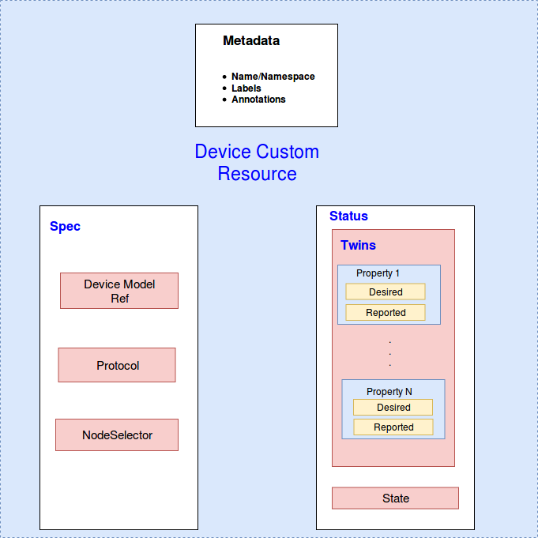

# Device Management using CRDs

* [Device Management using CRDs](#device-management-using-crds)
  * [Motivation](#motivation)
    * [Goals](#goals)
    * [Non\-goals](#non-goals)
  * [Proposal](#proposal)
    * [Use Cases](#use-cases)
  * [Design Details](#design-details)  
    * [CRD API Group and Version](#crd-api-group-and-version)
    * [Device model CRD](#device-model-crd)
    * [Device model type definition](#device-model-type-definition)
    * [Device model sample](#device-model-sample)
    * [Device instance CRD](#device-instance-crd)
    * [Device instance type definition](#device-instance-type-definition)
    * [Device instance sample](#device-instance-sample)
    * [Validation](#validation)
    * [Synchronizing Device Twin Updates](#synchronizing-device-twin-updates)
      * [Syncing Desired Device Twin Property Update From Cloud To Edge](#syncing-desired-device-twin-property-update-from-cloud-to-edge)
      * [Syncing Reported Device Twin Property Update From Edge To Cloud](#syncing-reported-device-twin-property-update-from-edge-to-cloud)
  * [Device Controller Design](#device-controller-design)
    * [Downstream Controller](#downstream-controller)
    * [Upstream Controller](#upstream-controller)
  * [Offline Scenarios](#offline-scenarios)
  * [Scalability](#scalability)
  * [Device Lifecycle Management](#device-lifecycle-management)
    * [Device Actions](#device-actions)
    * [Device Events](#device-events)
   * [Security](#security)
   * [Open questions](#open-questions)

## Motivation

Device management is a key feature required for IoT use-cases in edge computing.
This proposal addresses how can we manage devices from the cloud and synchronize
the device updates between edge nodes and cloud.

### Goals

Device management must:
* provide APIs for managing devices from the cloud.
* synchronize the device updates between cloud and edge nodes.

### Non-goals

* To design **secure** device provisioning.
* To address OTA device firmware upgrades.
* To address how device auto-discovery can happen.
* To address device migration scenarios.

## Proposal
We propose using Kubernetes [Custom Resource Definitions (CRDs)](https://kubernetes.io/docs/concepts/extend-kubernetes/api-extension/custom-resources/) to describe device metadata/status and a controller to synchronize these device updates between edge and cloud.


### Use Cases

* Describe device properties.
  * Users can describe device properties and access mechanisms to interact with / control the device.
* Perform CRUD operations on devices from cloud.
   * Users can create, update and delete device metadata from the cloud via the CRD APIs exposed by the Kubernetes API server.
   * Users can control the desired state of a device via the CRD APIs.
* Report device properties values.
  * Mapper applications running on the edge can report the current values of the device properties.

## Design Details

### CRD API Group and Version
The `DeviceModel` and `Device` CRD's will be namespace-scoped.
The tables below summarize the group, kind and API version details for the CRDs.

* DeviceModel

| Field                 | Description             |
|-----------------------|-------------------------|
|Group                  | devices.kubeedge.io     |
|APIVersion             | v1alpha1                |
|Kind                   | DeviceModel             |

* DeviceInstance

| Field                 | Description             |
|-----------------------|-------------------------|
|Group                  | devices.kubeedge.io     |
|APIVersion             | v1alpha1                |
|Kind                   | Device                  |

### Device model CRD


A `device model` describes the device properties exposed by the device and property visitors to access these properties. A device model is like a reusable template using which many devices can be created and managed.

### Device Model Type Definition
```go
// DeviceModelSpec defines the model / template for a device.It is a blueprint which describes the device
// capabilities and access mechanism via property visitors.
type DeviceModelSpec struct {
	// Required: List of device properties.
	Properties       []DeviceProperty        `json:"properties,omitempty"`
	// Required: List of property visitors which describe how to access the device properties.
	// PropertyVisitors must unique by propertyVisitor.propertyName.
	PropertyVisitors []DevicePropertyVisitor `json:"propertyVisitors,omitempty"`
}

// DeviceProperty describes an individual device property / attribute like temperature / humidity etc.
type DeviceProperty struct {
	// Required: The device property name.
	Name        string        `json:"name,omitempty"`
	// The device property description.
	// +optional
	Description string        `json:"description,omitempty"`
	// Required: PropertyType represents the type and data validation of the property.
	Type        PropertyType  `json:"type,omitempty"`
}

// Represents the type and data validation of a property.
// Only one of its members may be specified.
type PropertyType struct {
	// +optional
	Int    PropertyTypeInt64  `json:"int,omitempty"`
	// +optional
	String PropertyTypeString `json:"string,omitempty"`
}

type PropertyTypeInt64 struct {
	// Required: Access mode of property, ReadWrite or ReadOnly.
	AccessMode   PropertyAccessMode `json:"accessMode,omitempty"`
	// +optional
	DefaultValue int64              `json:"defaultValue,omitempty"`
	// +optional
	Minimum      int64              `json:"minimum,omitempty"`
	// +optional
	Maximum      int64              `json:"maximum,omitempty"`
	// The unit of the property
	// +optional
	Unit         string             `json:"unit,omitempty"`
}

type PropertyTypeString struct {
	// Required: Access mode of property, ReadWrite or ReadOnly.
	AccessMode   PropertyAccessMode `json:"accessMode,omitempty"`
	// +optional
	DefaultValue string             `json:"defaultValue,omitempty"`
}

// The access mode for  a device property.
type PropertyAccessMode string

// Access mode constants for a device property.
const (
	ReadWrite PropertyAccessMode = "ReadWrite"
	ReadOnly  PropertyAccessMode = "ReadOnly"
)

// DevicePropertyVisitor describes the specifics of accessing a particular device
// property. Visitors are intended to be consumed by device mappers which connect to devices
// and collect data / perform actions on the device.
type DevicePropertyVisitor struct {
	// Required: The device property name to be accessed. This should refer to one of the
	// device properties defined in the device model.
	PropertyName string `json:"propertyName,omitempty"`
	// Required: Protocol relevant config details about the how to access the device property.
	VisitorConfig       `json:",inline"`
}

// At least one of its members must be specified.
type VisitorConfig struct {
	// Opcua represents a set of additional visitor config fields of opc-ua protocol.
	// +optional
	OpcUA VisitorConfigOPCUA   `json:"opcua,omitempty"`
	// Modbus represents a set of additional visitor config fields of modbus protocol.
	// +optional
	Modbus VisitorConfigModbus `json:"modbus,omitempty"`
	// Bluetooth represents a set of additional visitor config fields of bluetooth protocol.
	// +optional
	Bluetooth VisitorConfigBluetooth `json:"bluetooth,omitempty"`
}

// Common visitor configurations for bluetooth protocol
type VisitorConfigBluetooth struct {
	// Required: Unique ID of the corresponding operation
	CharacteristicUUID string `json:"characteristicUUID,omitempty"`
	// Responsible for converting the data coming from the platform into a form that is understood by the bluetooth device
	// For example: "ON":[1], "OFF":[0]
	//+optional
	DataWriteToBluetooth map[string][]byte `json:"dataWrite,omitempty"`
	// Responsible for converting the data being read from the bluetooth device into a form that is understandable by the platform
	//+optional
	BluetoothDataConverter BluetoothReadConverter `json:"dataConverter,omitempty"`
}

// Specifies the operations that may need to be performed to convert the data
type BluetoothReadConverter struct {
	// Required: Specifies the start index of the incoming byte stream to be considered to convert the data.
	// For example: start-index:2, end-index:3 concatenates the value present at second and third index of the incoming byte stream. If we want to reverse the order we can give it as start-index:3, end-index:2
	StartIndex int `json:"startIndex,omitempty"`
	// Required: Specifies the end index of incoming byte stream to be considered to convert the data
	// the value specified should be inclusive for example if 3 is specified it includes the third index
	EndIndex int `json:"endIndex,omitempty"`
	// Refers to the number of bits to shift left, if left-shift operation is necessary for conversion
	// +optional
	ShiftLeft uint `json:"shiftLeft,omitempty"`
	// Refers to the number of bits to shift right, if right-shift operation is necessary for conversion
	// +optional
	ShiftRight uint `json:"shiftRight,omitempty"`
	// Specifies in what order the operations(which are required to be performed to convert incoming data into understandable form) are performed
	//+optional
	OrderOfOperations []BluetoothOperations `json:"orderOfOperations,omitempty"`
}

// Specify the operation that should be performed to convert incoming data into understandable form
type BluetoothOperations struct {
	// Required: Specifies the operation to be performed to convert incoming data
	BluetoothOperationType BluetoothArithmaticOperationType `json:"operationType,omitempty"`
	// Required: Specifies with what value the operation is to be performed
	BluetoothOperationValue float64 `json:"operationValue,omitempty"`
}

// Operations supported by Bluetooth protocol to convert the value being read from the device into an understandable form
type BluetoothArithmeticOperationType string

// Bluetooth Protocol Operation type
const (
	BluetoothAdd      BluetoothArithmeticOperationType = "Add"
	BluetoothSubtract BluetoothArithmeticOperationType = "Subtract"
	BluetoothMultiply BluetoothArithmeticOperationType = "Multiply"
	BluetoothDivide   BluetoothArithmeticOperationType = "Divide"
)

// Common visitor configurations for opc-ua protocol
type VisitorConfigOPCUA struct {
	// Required: The ID of opc-ua node, e.g. "ns=1,i=1005"
	NodeID     string     `json:"nodeID,omitempty"`
	// The name of opc-ua node
	BrowseName string     `json:"browseName,omitempty"`
}

// Common visitor configurations for modbus protocol
type VisitorConfigModbus struct {
	// Required: Type of register
	Register       ModbusRegisterType `json:"register,omitempty"`
	// Required: Offset indicates the starting register number to read/write data.
	Offset         int64              `json:"offset,omitempty"`
	// Required: Limit number of registers to read/write.
	Limit          int64              `json:"limit,omitempty"`
	// The scale to convert raw property data into final units.
	// Defaults to 1.0
	// +optional
	Scale          float64            `json:"scale,omitempty"`
	// Indicates whether the high and low byte swapped.
	// Defaults to false.
	// +optional
	IsSwap         bool               `json:"isSwap,omitempty"`
	// Indicates whether the high and low register swapped.
	// Defaults to false.
	// +optional
	IsRegisterSwap bool               `json:"isRegisterSwap,omitempty"`
}

// The Modbus register type to read a device property.
type ModbusRegisterType string

// Modbus protocol register types
const (
	ModbusRegisterTypeCoilRegister          ModbusRegisterType = "CoilRegister"
	ModbusRegisterTypeDiscreteInputRegister ModbusRegisterType = "DiscreteInputRegister"
	ModbusRegisterTypeInputRegister         ModbusRegisterType = "InputRegister"
	ModbusRegisterTypeHoldingRegister       ModbusRegisterType = "HoldingRegister"
)

// +genclient
// +k8s:deepcopy-gen:interfaces=k8s.io/apimachinery/pkg/runtime.Object

// DeviceModel is the Schema for the device model API
// +k8s:openapi-gen=true
type DeviceModel struct {
	metav1.TypeMeta      `json:",inline"`
	metav1.ObjectMeta    `json:"metadata,omitempty"`

	Spec DeviceModelSpec `json:"spec,omitempty"`
}

// +k8s:deepcopy-gen:interfaces=k8s.io/apimachinery/pkg/runtime.Object

// DeviceModelList contains a list of DeviceModel
type DeviceModelList struct {
	metav1.TypeMeta `json:",inline"`
	metav1.ListMeta `json:"metadata,omitempty"`
	Items           []DeviceModel `json:"items"`
}
```

### Device model sample
```yaml
apiVersion: devices.kubeedge.io/v1alpha1
kind: DeviceModel
metadata:
  labels:
    description: 'TI Simplelink SensorTag Device Model'
    manufacturer: 'Texas Instruments'
    model: CC2650
  name: sensor-tag-model
spec:
  properties:
  - name: temperature
    description: temperature in degree celsius
    type:
      int:
        accessMode: ReadOnly
        maximum: 100
        unit: Degree Celsius
  - name: temperature-enable
    description: enable data collection of temperature sensor
    type:
      string:
        accessMode: ReadWrite
        defaultValue: OFF
  - name: pressure
    description: barometric pressure sensor in hectopascal
    type:
      int:
        accessMode: ReadOnly
        unit: hectopascal
  - name: pressure-enable
    description: enable data collection of barometric pressure sensor
    type:
      string:
        accessMode: ReadWrite
        defaultValue: OFF
  propertyVisitors:
  - propertyName: temperature
    modbus:
      register: CoilRegister
      offset: 2
      limit: 1
      scale: 1.0
      isSwap: true
      isRegisterSwap: true
  - propertyName: temperature-enable
    modbus:
      register: DiscreteInputRegister
      offset: 3
      limit: 1
      scale: 1.0
      isSwap: true
      isRegisterSwap: true
  - propertyName: pressure-enable
    bluetooth:
      characteristicUUID: f000aa4204514000b000000000000000
      dataWrite:
        ON: [1]
        OFF: [0]
  - propertyName: pressure
    bluetooth:
      characteristicUUID: f000aa4104514000b000000000000000
      dataConverter:
        startIndex: 3
        endIndex: 5
        orderOfOperations:
        - operationType: Divide
          operationValue: 100
```
Shown above is an example device model for a temperature sensor with Modbus protocol. It has two properties:
- `temperature`: the temperature readings from the sensor. The `type` field indicates that the temperature property is of type `int`, it is read-only and the maximum value it can take is 100.
- `temperature-enable`: this property defines whether data collection is enabled from the sensor. It is a writable property. Data collection is disabled if it is set to `OFF`. To turn on data collection, it needs to be set to `ON`.

Property visitors provide details like how to access device properties. In the above example, there are two visitors defined which describe how to read/write the device properties using `modbus` protocol. Detailed information on the Modbus registers to access is provided along with the offset, limit and other settings.

### Device instance CRD


A `device` instance represents an actual device object. It is like an instantiation of the `device model` and references properties defined in the model. The device spec is static while the device status contains dynamically changing data like the desired state of a device property and the state reported by the device.

### Device instance type definition
```go
// DeviceSpec represents the static information of a single device instance.
type DeviceSpec struct {
	// Required: DeviceModelRef is reference to the device model used as a template
	// to create the device instance.
	DeviceModelRef *core.LocalObjectReference `json:"deviceModelRef,omitempty"`
	// Required: The protocol configuration used to connect to the device.
	Protocol       ProtocolConfig             `json:"protocol,omitempty"`
	// NodeSelector indicates the binding preferences between devices and nodes.
	// Refer to k8s.io/kubernetes/pkg/apis/core NodeSelector for more details
	// +optional
	NodeSelector   *core.NodeSelector         `json:"nodeSelector,omitempty"`
}

// Only one of its members may be specified.
type ProtocolConfig struct {
	// Protocol configuration for opc-ua
	// +optional
	OpcUA  *ProtocolConfigOpcUA  `json:"opcua,omitempty"`
	// Protocol configuration for modbus
	// +optional
	Modbus *ProtocolConfigModbus `json:"modbus,omitempty"`
}

type ProtocolConfigOpcUA struct {
	// Required: The URL for opc server endpoint.
	Url            string `json:"url,omitempty"`
	// Username for access opc server.
	// +optional
	UserName       string `json:"userName,omitempty"`
	// Password for access opc server.
	// +optional
	Password       string `json:"password,omitempty"`
	// Defaults to "none".
	// +optional
	SecurityPolicy string `json:"securityPolicy,omitempty"`
	// Defaults to "none".
	// +optional
	SecurityMode   string `json:"securityMode,omitempty"`
	// Certificate for access opc server.
	// +optional
	Certificate    string `json:"certificate,omitempty"`
	// PrivateKey for access opc server.
	// +optional
	PrivateKey     string `json:"privateKey,omitempty"`
	// Timeout seconds for the opc server connection.???
	// +optional
	Timeout        int64  `json:"timeout,omitempty"`
}

// Only one of its members may be specified.
type ProtocolConfigModbus struct {
	// +optional
	RTU *ProtocolConfigModbusRTU `json:"rtu,omitempty"`
	// +optional
	TCP *ProtocolConfigModbusTCP `json:"tcp,omitempty"`
}

type ProtocolConfigModbusTCP struct {
	// Required.
	IP string      `json:"ip,omitempty"`
	// Required.
	Port int64     `json:"port,omitempty"`
	// Required.
	SlaveID string `json:"slaveID,omitempty"`
}

type ProtocolConfigModbusRTU struct {

	// Required.
	SerialPort string `json:"serialPort,omitempty"`
	// Required. BaudRate 115200|57600|38400|19200|9600|4800|2400|1800|1200|600|300|200|150|134|110|75|50
	BaudRate   int64  `json:"baudRate,omitempty"`
	// Required. Valid values are 8, 7, 6, 5.
	DataBits   int64  `json:"dataBits,omitempty"`
	// Required. Valid options are "none", "even", "odd". Defaults to "none".
	Parity     string `json:"parity,omitempty"`
	// Required. Bit that stops 1|2
	StopBits   int64  `json:"stopBits,omitempty"`
	// Required. 0-255
	SlaveID    int64  `json:"slaveID,omitempty"`
}

// DeviceStatus contains the desired/reported values of device twin properties.
type DeviceStatus struct {
	// A list of device twins containing desired/reported values of twin properties.
	// A passive device won't have twin properties and this list could be empty.
	// +optional
	Twins []Twin      `json:"twins,omitempty"`
}

// A Twin provides a logical representation of control properties (writable properties in the
// device model). The properties can have a desired (expected) state and a reported(actual) state.
// The cloud configures the `desired` state of a device property and this configuration update is pushed
// to the edge node. The mapper sends a command to the device to change this property value as per the desired state.
// The mapper sends the state reported by the device to the cloud. Offline device interaction in the edge is // possible via twin properties for control/command operations.
type Twin struct {
	// Required: The property name for which the desired/reported values are specified.
	// This property should be present in the device model.
	PropertyName string       `json:"propertyName,omitempty"`
	// Required: the desired property value
	Desired      TwinProperty `json:"desired,omitempty"`
	// Required: the reported property value.
	Reported     TwinProperty `json:"reported,omitempty"`
}

// TwinProperty represents the device property for which a desired/reported state can be defined.
type TwinProperty struct {
	// Required: The value for this property.
	Value    string            `json:"value,omitempty"`
	// Additional metadata like timestamp when the value was reported etc.
	// +optional
	Metadata map[string]string `json:"metadata,omitempty"`
}

// +genclient
// +k8s:deepcopy-gen:interfaces=k8s.io/apimachinery/pkg/runtime.Object

// Device is the Schema for the devices API
// +k8s:openapi-gen=true
type Device struct {
	metav1.TypeMeta   `json:",inline"`
	metav1.ObjectMeta `json:"metadata,omitempty"`

	Spec   DeviceSpec   `json:"spec,omitempty"`
	Status DeviceStatus `json:"status,omitempty"`
}

// +k8s:deepcopy-gen:interfaces=k8s.io/apimachinery/pkg/runtime.Object

// DeviceList contains a list of Device
type DeviceList struct {
	metav1.TypeMeta `json:",inline"`
	metav1.ListMeta `json:"metadata,omitempty"`
	Items           []Device `json:"items"`
}
```

### Device instance sample
```yaml
apiVersion: devices.kubeedge.io/v1alpha1
kind: Device
metadata:
  name: sensor-tag01
  labels:
    description: 'TI Simplelink SensorTag 2.0 with Bluetooth 4.0'
    manufacturer: 'Texas Instruments'
    model: CC2650
spec:
  deviceModelRef:
    name: sensor-tag-model
  protocol:
    modbus:
      rtu:
        serialPort: '1'
        baudRate: 115200
        dataBits: 8
        parity: even
        stopBits: 1
        slaveID: 1
  nodeSelector:
    nodeSelectorTerms:
    - matchExpressions:
      - key: ''
        operator: In
        values:
        - node1
status:
  twins:
    - propertyName: temperature-enable
      reported:
        metadata:
          timestamp: '1550049403598'
          type: string
        value: OFF
      desired:
        metadata:
          timestamp: '1550049403598'
          type: string
        value: OFF
```

### Validation
[Open API v3 Schema based validation](https://kubernetes.io/docs/tasks/access-kubernetes-api/custom-resources/custom-resource-definitions/#validation) can be used to guard against bad requests.
Invalid values for fields ( example string value for a boolean field etc) can be validated using this.
In some cases , we also need custom validations (e.g create a device instance which refers to a non -existent device model ) .
[Validation admission web hooks](https://kubernetes.io/docs/reference/access-authn-authz/admission-controllers/#validatingadmissionwebhook) can be used to implement such custom validation rules.

Here is a list of validations we need to support :

#### Device Model Validations
- Don't allow model creation if any `Required` fields are missing ( like property name , type, access mode etc.)
- Property type can be only string or int64. Other types are not supported.
- The Property access mode for a property can be one of `ReadWrite` or `ReadOnly`. Other access modes are not supported.
- Property visitors are currently supported for bluetooth, modbus and opcua protocols only. Other protocol visitors are not supported.
- The BluetoothArithmeticOperationType for Bluetooth read converter can have values one of `[Add, Subtract, Multiply, Divide]`
- The ModbusRegisterType for Modbus visitor config can have values one of `[CoilRegister, DiscreteInputRegister, InputRegister, HoldingRegister]`. Other register types are not supported.
- Don't allow model deletion if there is at least one device instance referring to it.
- Don't allow deletion of a device property from the model if there is a corresponding device twin property in a device instance which refers to this model.
- Don't allow deletion of a device property visitor if the corresponding device property exists.

#### Device Instance Validations
- Don't allow device instance creation if any `Required` fields are missing ( like devicemodel ref , twin property value, twin property name etc.)
- Don't allow device instance creation if it refers to a device model reference which doesn't exist.
- Don't allow device instance creation if a desired twin property's name cannot be matched to a device property in the device model it refers to.
- Protocol configs are optional , but if provided , they can be one of `[opcua, modbus and bluetooth]`. Other protocol configs are not supported.

## Synchronizing Device Twin Updates

The below illustrations describe the flow of events that would occur when device twin desired/reported property values are updated from the cloud/edge.

### Syncing Desired Device Twin Property Update From Cloud To Edge

The device controller watches device updates in the cloud and relays them to the edge node. These updates are stored locally by the device twin. The mapper gets these updates via the broker and operates on the device based on the updates.

### Syncing Reported Device Twin Property Update From Edge To Cloud

The mapper watches devices for updates and reports them to the event bus via the broker. The event bus sends the reported state of the device to the device twin which stores it locally and then syncs the updates to the cloud. The device controller watches for device updates from the edge ( via the cloudhub ) and updates the reported state in the cloud.

## Device Controller Design
The device controller starts two separate goroutines called  `upstream` controller and `downstream` controller. These are not separate controllers as such but named here for clarity.
The job of the downstream controller is to synchronize the device updates from the cloud to the edge node. The job of the upstream controller is the reverse.

### Downstream Controller


The downstream controller watches for device updates against the K8S API server.
Updates are categorized below along with the possible actions that the downstream controller can take:

| Update Type                    | Action                                       |
|-------------------------------|---------------------------------------------- |
|New Device Model Created       |  NA                                           |
|New Device Created             | The controller creates a new config map to store the device properties and visitors defined in the device model associated with the device.  This config map is stored in etcd. The existing config map sync mechanism in the edge controller is used to sync the config map to the egde. The mapper application running in a container can get the updated config map and use the property and visitor metadata to access the device. The device controller additionally reports the device twin metadata updates to the edge node.|
|Device Node Membership Updated | The device controller sends a membership update event to the edge node.|
|Device  Twin Desired State Updated | The device controller sends a twin update event to the edge node.|
|Device Model Updated           |  TODO: What happens to existing devices using this model which are generating telemetry data as per the old model ? Do we update the config map associated with the devices which are using this device model ?|
|Device Deleted                 | The controller sends the device twin delete event to delete all device twins associated with the device. It also deletes config maps associated with the device and this delete event is synced to the edge. The mapper application effectively stops operating on the device.|
|Device Model Deleted           |  The controller needs to run [`finalizers`](https://kubernetes.io/docs/tasks/access-kubernetes-api/custom-resources/custom-resource-definitions/#finalizers) to ensure that all device instances using the device model are deleted first, and only then should the model deletion proceed.|

The idea behind using config map to store device properties and visitors is that these metadata are only required by the mapper applications running on the edge node in order to connect to the device and collect data.
Mappers if run as containers can load these properties as config maps . Any additions , deletions or updates to properties , visitors etc in the cloud are watched upon by the downstream controller and config maps are updated in etcd. The existing edge controller already has the mechanism to watch on config map updates and push them to the edge node. A mapper application can get these updates and then adjust the data collection process.
A separate design proposal can be prepared to illustrate the details of how mappers can leverage these config maps.

A sample config map for the device model described earlier is shown below

### Device Config Map sample
```yaml
apiVersion: v1
kind: ConfigMap
metadata:
  name: device-profile-config-01 // needs to be generated by device controller.
  namespace: foo
data:
  deviceProfile.json: |-
    {
      "deviceInstances": [
        {
          "id": "1",
          "name": "device1",
          "protocol": "modbus-rtu-01", // needs to be generated by device controller.
          "model": "SensorTagModel"
        }
      ],
      "deviceModels": [
        {
          "name": "SensorTagModel",
          "description": "TI Simplelink SensorTag Device Attributes Model",
          "properties": [
            {
              "name": "temperature",
              "datatype": "int",
              "accessMode": "r",
              "unit": "Degree Celsius",
              "maximum": "100",
            },
            {
              "name": "temperature-enable",
              "datatype": "string",
              "accessMode": "rw",
              "defaultValue": "OFF",
            }
          ]
        }
      ],
      "protocols": [
        {
          "name": "modbus-rtu-01",
          "protocol": "modbus-rtu",
          "protocolConfig": {
            "serialPort": "1",
            "baudRate": "115200",
            "dataBits": "8",
            "parity": "even",
            "stopBits": "1",
            "slaveID": "1"
          }
        }
      ],
      "propertyVisitors": [
        {
          "name": "temperature",
          "propertyName": "temperature",
          "modelName": "SensorTagModel",
          "protocol": "modbus-rtu",
          "visitorConfig": {
            "register": "CoilRegister",
            "offset": "2",
            "limit": "1",
            "scale": "1.0",
            "isSwap": "true",
            "isRegisterSwap": "true"
          }
        },
        {
          "name": "temperatureEnable",
          "propertyName": "temperature-enable",
          "modelName": "SensorTagModel",
          "protocol": "modbus-rtu",
          "visitorConfig": {
            "register": "DiscreteInputRegister",
            "offset": "3",
            "limit": "1",
            "scale": "1.0",
            "isSwap": "true",
            "isRegisterSwap": "true"
          }
        }
      ]
    }
```

If the mapper wants to discover what properties a device supports, it can get the model information from the device instance.
Also , it can get the protocol information to connect to the device from the device instace. Once it has access to the device model ,
it can get the properties supported by the device. In order to access the property , the mapper needs to get the corresponding visitor information.
This can be retrieved from the propertyVisitors list. Finally , using the visitorConfig, the mapper can read/write the data associated with the property.

### Upstream Controller

 The upstream controller watches for updates from the edge node and applies these updates against the API server in the cloud. Updates are categorized below along with the possible actions that the upstream controller can take:

  | Update Type                        | Action                                        |
  |-------------------------------     |---------------------------------------------- |
  |Device Twin Reported State Updated    |  The controller patches the reported state of the device twin property in the cloud. |

## Offline scenarios
In case where there is intermittent / no connectivity between the edge node and the cloud , we need to have mechanisms to retry until the updates are correctly propagated. A retry mechanism with a configurable retry timeout and number of retry attempts can be implemented.

## Scalability
The following factors need to be evaluated in order to analyze issues with scale :
- What device data to sync between cloud and edge; how frequent; do we store historical data ?
  - The downstream controller needs to sync device twin updates, node membership updates, and store the device model properties and visitors as config maps if being consumed by a device. The edge controller needs to sync config maps to the edge. The upstream controller needs to sync device twin updates and device state to cloud.
- The detailed design of device controller watching against cloud and edge and the tree structure of device data stored at cloud and edge.
  - A detailed design for the device controller is provided in earlier section. The device model and the device instance would be stored in etcd in the cloud. The device twin updates are stored at the edge. The device property and visitors , protocol config are stored in config-maps and consumed by mappers.
- How are we going to use the device data at cloud ? This can help evaluate item 1
  - This is desribed in the device controller design.
- Currently, we have only one config map per node which stores all the device instances, device models, protocols and visitors for all the devices connected to the edge node. Mappers running on an edge node managing different devices now need to access one global configmap in order to extract information about the device properties and visitors. What should be the best way to partition a monolithic config map into smaller config maps ? Should the partitioning be based on the protocol type or based on device model ?

## Device Lifecycle Management
IoT device lifecycle management comprises of several steps listed below
- Device onboarding / provisioning
  - The device needs to be registered (via authorization or admission control mechanism). This is currently not in scope of this design.
- Device configuration
  - The device needs to be reconfigured many a times during it's lifecycle. No new capabilities are added.
  The device CRD has device twins which contain desired values for control properties. By changing the desired value of a control property , we can re-configure the device behaviour.
- Device Updates
  - Firmware updates or some bug fixes need to be applied to the device. This can be a scheduled or ad-hoc update.
  The current design doesn't support applying such updates. We can support additional actions in the future to perform such tasks.
- Device monitoring
  - Device status needs to be monitored to support proper management actions. Currently we rely on the mapper to report the current device state in the Status of the device CRD. Additional health checks or probes can be further explored to enhance monitoring and troubleshooting capabilities of the platform.
- Device deprovisioning
  - The device needs to be de-registered from the platform if no longer needed to be managed. This is currently not in scope of this design.
- Device retirement
  - If a device is damaged , it needs to be retired. This is currently not in scope of this design.

### Device Actions
- Currently the device model doesn't support [WOT style actions](https://iot.mozilla.org/wot/#actions-resource). The only way to perform some action on the device is by changing the desired state of the twin property in the status field. We need to see how WOT actions can be incorporated in this model and who will consume those actions ?
Will it be the responsibility of the mapper to expose HTTP APIs for the actions ? Can we generate server / client code to perform / consume these actions ? Can we handle firmware updates with such actions ?

### Device Events
- Currently the device model doesn't support  [WOT style events](https://iot.mozilla.org/wot/#events-resource). Should telemetry data like sensor temperature readings etc emitted by devices be reported as events ? WOT events are some abnormal events reported by the device like overheated, or reboot etc.

## Security
Secure device provisioning is the first step in the device lifecycle management. This is not in scope of the current design proposal. Various provisioning techniques could be explored like Trusted Platform Modules(TPM), X.509 certificates etc. Depending on the device type (directly connect to the edge or LTE/wifi or something else), in case of LTE/wifi, further security guard would be needed.

## Open questions
- How do we resolve conflicts if the same data is updated in the edge and cloud ?
