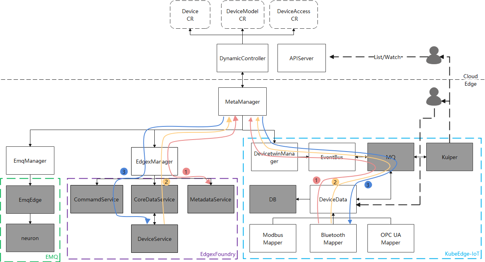
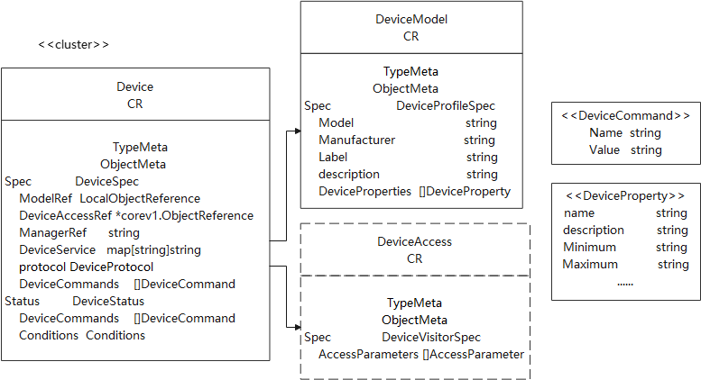

# A New Architecture of Edge IoT

## Motivation

In the Industry 4.0 era, IoT platforms need to support thousands of types of devices,  support AI analysis, and support automated control. To solve the above problems, many vendors or community teams have proposed their own solutions, for example EdgeX Foundry.  EdgeX Foundry is a highly flexible and scalable open source software framework that facilitates interoperability between devices and applications at the IoT Edge. Compared with KubeEdge, there are both similarities and differences.  The system capability comparison is as follows.

|                                       | KubeEdge                  | Edgex Foundry                                              |
| ------------------------------------- | ------------------------- | ---------------------------------------------------------- |
| Platform Requirements                 | CRI，K8s required         | 1G mem，3GB disk                                           |
| North API                             | MQTT                      | REST/MQTT                                                  |
| Data persistence*                     | -                         | redis/mongodb                                              |
| Control Command                       | -                         | supported                                                  |
| Data Export*                          | MQTT                      | REST/MQTT/cloud providers                                  |
| Rule Engine*                          | -                         | kuiper supported                                           |
| Timing scheduling                     | -                         | Data Clean supported                                       |
| Automatic device discovery*           | -                         | supported                                                  |
| Logging                               | supported                 | deployment/orchestration tools required                    |
| Alerts & Notifications                | -                         | supported                                                  |
| Secret Store                          | supported                 | supported                                                  |
| Collaboration between cloud and edge* | supported                 | -                                                          |
| Supported IoT protocols*              | Modbus, OPC-UA, Bluetooth | more than a dozen protocols such as Modbus, rest, snmp etc |

In a word, with the support of the IoT vendor such as Dell, hp, IBM etc and complete system capability,  EdgeX has more common application scenarios. In addition,  compared with EdgeX, KubeEdge lacks some important capability, but cloud-native management and collaboration between cloud and edge are unique advantages to it.  To improve the use of KubeEdge in the IoT scenario,  this design doc proposes a new architecture of Edge IoT to KubeEdge IoT sig.


## Goals

KubeEdge manages the device logic model uniformly, and is responsible for the status update of the device model and the addition and deletion of devices. On the one hand, we hope the edge gateway platform which has been built before can quickly access KubeEdge so that it is compatible with the existing ecosystem. On the other hand, KubeEdge-IoT can develop its own end-side device ecology, providing a lightweight and simple access method, and at the same time manage devices in a more cloud-native management mode, and enable device-edge-cloud collaboration.

1. Supports the access of multiple IoT gateways
2. KubeEdge provides data persistence, data query and forwarding, and supports rule engine


## Design

### Architecture

KubeEdge manages device by communicating  edge IoT gateway platform, which provides edge-side device data collection, data storage, device control and data query.



DynamicController: synchronize CR of the device to the edge side

MetaManager: synchronize CRs between edge and cloud and provide list/watch capabilities to the edge

EdgexManager/EmqManager: synchronize and transform the device between cloud and EdgeX/EMQ platform 

EdgeXFoundry

- CommandService: send device commands

- CoredataService: device data persistence and data query

- MetadataService: store device metadata and service data

EMQ

- EmqEdge: data aggregation, data caching, and edge data analysis

- neuron: support kinds of industrial equipment access, reverse control equipment

KubeEdge-IoT

- DeviceTwinManager: synchronize device CRs between cloud and edge by subscribing and publishing the topic of MQ
- DeviceData: support data storage, which  insert the data mapper reporting into the database before DeviceManager publish the data to the MQ; support device control, which control the device by the mapper; suppport data query, which can query the historical data of the device by calling api
- DB: recommend to use redisDB to persist device data
- MQ: recommend to use Comqtt or ZeroMQto persist device data
- Kuiper: export data from MQ  by formulating rules

### API

Currently, KubeEdge Device API has problems as following

- When the communication protocol is extended, the protocol parameters cannot be verified, and the user does not understand the definition of the new protocol. At present, DevicePropertyVisitor embeds the three protocol configurations of OpcUA, Modbus and Bluetooth. The extended protocol is an object. The system cannot verify the configuration parameters in advance, and the user cannot obtain the API information about the extended protocol from the system.

- Device CR status does not clearly describe the device status. The Twin structure definition does not conform to the API specification of kubernetes , and Device CR status lacks a device status description

- Device CR lacks information associated with mapper. At present, the device is strongly associated with the node. The mapper reads the connected device information from the Configmap on the node. The user do not know about the relationship between the mapper and the device.

To solve these problem, new device API, v1alpha3 version, is be proposed

#### Model



#### Example

DeviceModel

```yaml
apiVersion: devices.kubeedge.io/v1alpha3
kind: DeviceModel
metadata:
  name: devicemodel-sample
spec:
  # Add fields here
  properties:
  - name: EnableRandomization_Bool
    description: "used to decide whether to re-generate a random value"
    mutable: true
    type: "Bool"
    readWrite: "W"
    defaultValue: "true"
  - name: Bool
    description: "Generate random boolean value"
    mutable: true
    type: "Bool"
    readWrite: "RW"
    defaultValue: "true"
```

DeviceAccess

```yaml
apiVersion: devices.kubeedge.io/v1alpha3
kind: DeviceAccess
metadata:
  name: random-boolean-device-visitor
spec:
  parameters:
    - name:  EnableRandomization_Bool
      parameter:
        primaryTable: "COILS"
        startingAddress: "1"
    - name:  Bool
      parameter:
        primaryTable: "HOLDING_REGISTERS"
        startingAddress: "3"
```

Device

```yaml
apiVersion: devices.kubeedge.io/v1alpha3
kind: Device
metadata:
  name: random-boolean-device
  #  description: "Example of Device Virtual"
  labels:
    "edgex-0": device-virtual-example
spec:
  # Add fields here
  model: devicemodel-sample
  deviceAccessRef:
    apiVersion: devices.kubeedge.io/v1alpha3
    kind: DeviceAccess
    name: random-boolean-device-visitor
  service:
    deviceService: device-virtual
    metadata: edgex-core-metadata
    command: edgex-core-command
  protocol:
    name: other
    address: device-virtual-bool-01
    type: "300"
  commands:
    - name: Bool
      value: "true"
status:
  commands:
    - name: Bool
      value: "true"
  condition:
    - status: available
```

#### Changelog

- DeviceModel


| change | v1Alpha2 | v1Alpha3    | reason                              |
| ------ | -------- | ----------- | ----------------------------------- |
| Added  |          | manufacture | Describe the equipment manufacturer |
| Added  |          | description | Describe the device model           |

```yaml
----v1Alpha2-----
....
properties:
  - name: Switch
    description: "used to decide whether to re-generate a random value"
    type:
     bool:
      accessMode: ReadWrite
      defaultValue: "true"
  - name: FanSpeed
    description: enable data collection of temperature sensor
    type:
      int:
        accessMode: ReadWrite
        defaultValue: 0
....

----v1Alpha3-----
....
deviceResources:
  - name: Switch
    description: "used to decide whether to re-generate a random value"
    mutable: false
    type: "Bool"
    readWrite: "RW"
    defaultValue: "true"
  - name: FanSpeed
    description: "Generate random boolean value"
    mutable: true
    type: "Int32"
    readWrite: "RW"
    defaultValue: "0"
....
```

- Device


| 变化     | v1Alpha2         | v1Alpha3        | 原因                                                         |
| -------- | ---------------- | --------------- | ------------------------------------------------------------ |
| Modified | protocol         | protocol        | Modified Protocol modification and extract the same fields   |
| Added    |                  | deviceAccessRef | Describe how the device is accessed                          |
| Added    |                  | service         | Describe the service of the associated device                |
| Added    |                  | Condition       | Describe the current state of the device                     |
| Deleted  | PropertyVisitors |                 | Substituted by DeviceAccess                                  |
| Deleted  | Data             |                 | Substituted by Spec.DeviceProperties                         |
| Deleted  | NodeSelector     |                 | Decoupling devices and nodes                                 |
| Deleted  | Twin             |                 | Substituted byStatus.DeviceProperties. Twin data does not conform to the k8s Api specification. |

```yaml
----v1Alpha2-----
....
protocol:
    modbus:
      slaveID: 1
    common:
      com:
        serialPort: '/dev/ttyS0'
        baudRate: 9600
        dataBits: 8
        parity: even
        stopBits: 1
      customizedValues:
        serialType: "RS232"
....

----v1Alpha3-----
....
protocol:
    name: modbus-rtu
    address: /dev/ttyS0
    type: modbus-rtu
    Timeout: 5
    IdleTimeout: 5
    args:
      slaveID: 1
      baudRate: 9600
      dataBits: '8'
      stopBits: '1'
      parity: 'N'
      unitID: '1'
....
```

- Add DeviceAccess to describe the communication of device.


