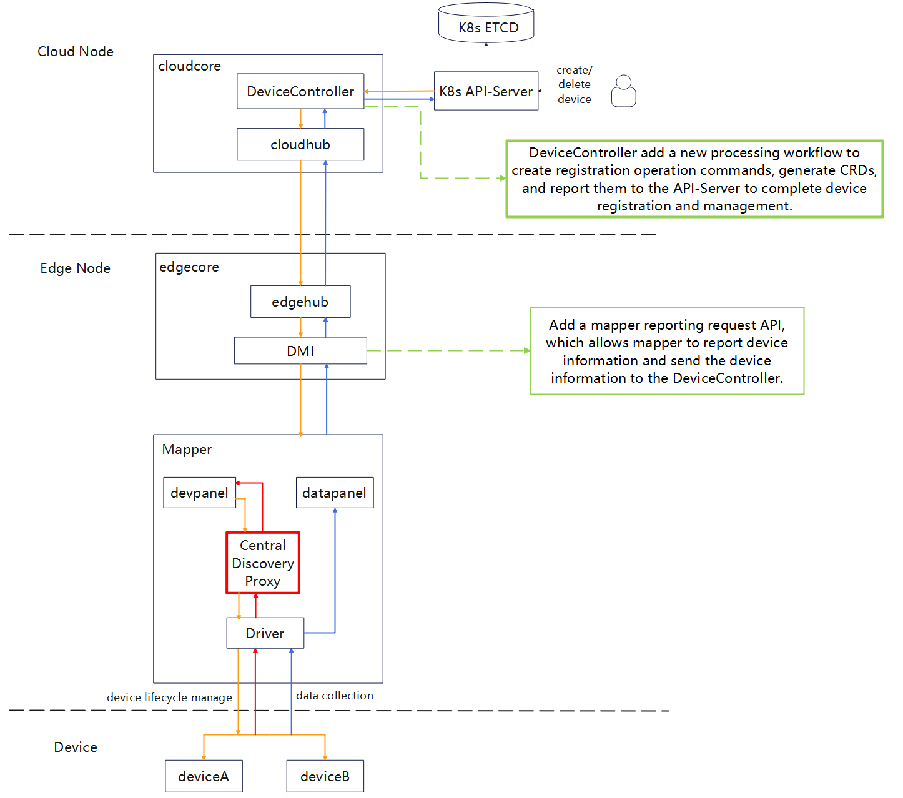

# Mapper Supports Device Discovery
## Introduction

Currently, KubeEdge uses the Mapper plugin to manage edge devices, allowing these devices to be incorporated into the KubeEdge cluster in the form of device twins and providing cloud-native lifecycle management for the edge devices. Currently, when Mapper manages edge devices, users need to implement and submit device CRD (Custom Resource Definition) files to the KubeEdge cluster. Mapper then connects to and manages the devices based on the definitions in the CRD files. However, in some cases, devices support automatic discovery, such as Onvif network camera devices. This project plans to provide a device discovery feature for the edge device management plugin Mapper, enabling Mapper to automatically scan for and discover devices, and then incorporate them into the KubeEdge cluster, thus simplifying the user operation process.


## Motivation
When there are many edge devices, users need to manually define all configuration files, which is undoubtedly a massive workload. Therefore, the system needs to automatically discover and add devices. For Mapper, this means adding a device discovery feature for automatic detection.

## Goals
* Simplify user operations

* Automatically discover devices


## Proposal
### Overall Design

- Mapper needs to support automatic device discovery capabilities, enabling it to detect and connect unmanaged edge devices on the edge node.
- DMI needs to add new APIs to allow the Mapper to report newly discovered device information and send this information to the cloud.
- Device Controller needs to add a process for handling the newly reported device information from DMI.

### Theoretical Basis

The Onvif protocol is based on the WS-Discovery (Web Services Dynamic Discovery) principle, which allows clients to dynamically discover available target services without knowing their addresses in advance, enabling service invocation. This process is known as device discovery. In WS-Discovery's Managed mode, or proxy mode, a central discovery proxy is established to maintain information on all available target services. Discovery messages containing filtering criteria are sent via multicast, and if there are target services that match the criteria, the client will receive the relevant target service information through the proxy.

### Architecture

The red parts and green parts are newly added:


### **Design Detail**

Based on the WS-Discovery principle, a central discovery proxy service needs to be established first. This service acts as an intermediary located between the devpanel and driver in the Mapper. It receives device filtering information from the devpanel and handles responses from devices.It sets an address as a multicast address, which allows both users and devices to complete device discovery and access operations by accessing just this one IP address.

Specifically, the design involves two types of message formats: one for discovery and one for responses. The devpanel sets relevant filtering criteria, including device type, name, attributes, etc., which are sent to the central discovery proxy. This information is included in the discovery message and multicast across the local area network to quickly locate devices. Discovery messages are sent every 30 seconds. When devices matching the criteria are found, they send a response message back to the central discovery proxy via unicast. This response includes device attributes, address, and other relevant data. The central discovery proxy then forwards the response message to the devpanel.

On the Mapper side, the newly added APIs in the DMI are implemented to consolidate the response messages into a device information list, which is then reported to the DMI. The DMI forwards this list to the Device Controller. The Device Controller adds a new processing flow to create registration operation commands, generate CRD configuration files, and submit them to the API Server to complete device registration and management.

The central discovery proxy service can be run as a process on each edge node, using multicast addresses and port numbers to communicate with the Mapper within the edge node, facilitating message exchange.

The newly added APIs are as follows:

```protobuf
//Report device information to Device twin and request device registration.
message MapperRegisterRequest{
	// The flag to show how device manager returns.
	// True means device manager should return the device list in the response.
	// False means device manager should just return nothing.
	bool withData = 1:
	// Mapper information to be registered to the device manager.
	MapperInfo mapper = 2;
	// A new field to indicate the properties of the discovered device
	// Device Information from device response.
	DeviceInfo devIn = 3;
}

//Device twin sends the registration information back to Mapper
message MapperRegisterResponse{
	// List of device models which the mapper maintains
	repeated DeviceModel modelList = 1;
	// List of devices which the mapper maintains.
	repeated Device deviceList = 2:
	// A new field to indicate the device registration completed by the automatic device discovery
	// function and forms CRDs
	// The flag to show if CRDs are made
	// True means CRDs are made
	// False means cRDs don't need be made
	// users register devices directly through CRDs.
	bool isCRD = 3
}

// Report the information to Device controller and request device registration
message DevTwinRegisterRequest {
	// Twin information to be registered to the cloudcore.
	TwinInfo ti = 2;
	// ModelProperty is the property list from DeviceInfo.
	ModelProperty mp = 3;
}

//Device controller sends the registration information back to Device Twin
message DevTwinRegisterResponse {
	// Registration information delivered by cloudcore
	string RegisterInfo = 1
	// same as MapperRegisterResponse.isCRD
	bool isCRD = 1
}

// Report the information to the API-Server and generate CRDs
message DevCtrRegisterRequest {
	// Device Controller information to be registered to the API-Server.
	CtrInfo ti = 2;
	// ModelProperty is the property list from DeviceInfo.
	ModelProperty mp = 3;
}

//The API-Server sends the registration information back to Device controller
message DevCtrRegisterResponse {
	// Registration information delivered by API-Server
	string RegisterInfo = 1
	// same as MapperRegisterResponse.isCRD
	bool isCRD = 1
}
```


