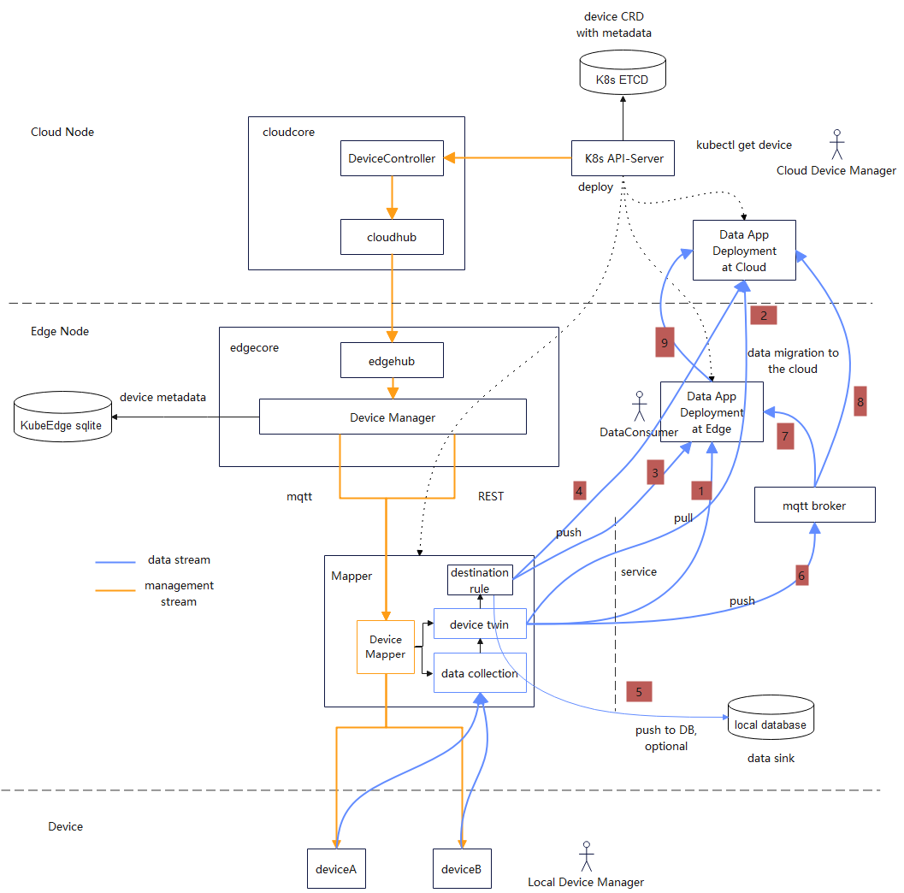
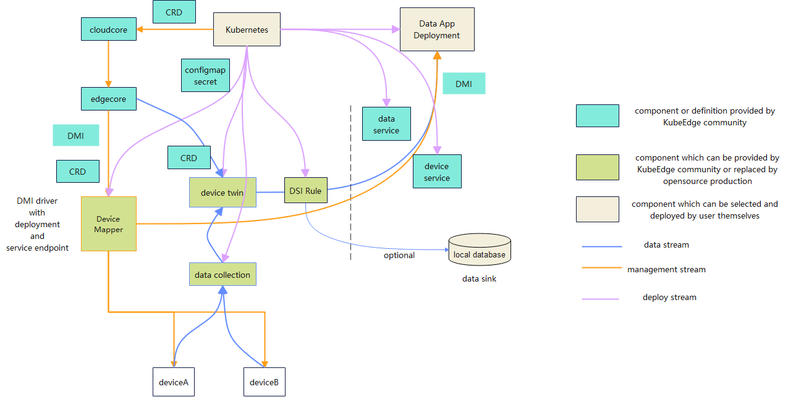
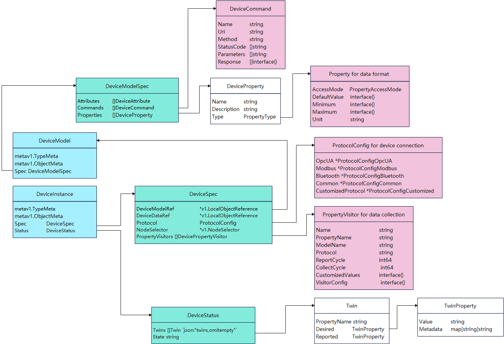

## KubeEdge Device Management Interface (DMI)

### Goal

This proposal provides the Device Management Interface(i.e. DMI) which integrates the device management interface and optimizes the device management capability of KubeEdge. It is the goal of KubeEdge DMI that builds a cloud native device twin management platform which covers device management, device operation and device data. 

Cloud Native: DMI makes device a virtualized digital twin as a resource of Kubernetes

Device Management: DMI helps users to manage device lifecycle like pod with simplifies operations

Device Operation: DMI provides the ability of device operation through Kubernetes API and  local command API by users and deployment

Device Data: DMI provides the ability that the data can be consumed by local deployment and migrated to cloud in special cases

### User Story by Scenario

#### 1. camera video at parking

1. the data application obtains the address of the camera video stream by device ID
2. the data application can subscribe to the changes of the camera address
3. the data application can analyse the video stream locally and upload the processing results, such as charging, emergency and facial recognition, to the cloud
4. the origin video can be uploaded to the cloud for model training iteration
5. the local application can recognize the license plate number and make the lever lifted automatically
6. video streams can be cached locally for backtracking

#### 2. photo by industrial camera

1. the data application subscribes to the data provided by industrial cameras
2. the photos taken by industrial cameras can be stored locally
3. the photos of the industrial camera can be preview and the angle and the definition can be adjusted
4. the policy of automatic photo shooting of the camera can be configured 
5. the industrial camera can be controlled to take photos manually
6. the data application can process the photos and upload the results to cloud or the 3rd-party application
7. the local application can handle the local device, such as industrial computer and alarm device, according to the processing results

#### 3. structured data, such as current and voltage, collected by sensors

1. the data application subscribes to the real-time data of current and voltage
2. the real-time data of current and voltage can be stored locally
3. the data application can analyse the historical data for predictive maintenance

### User Story by Role

#### 1. Device Manufacturer

1. provide Device Model CRD for every device version
3. the device features are provided in the form of DMI supported

#### 2. Device Manager

1. connect to devices
2. manage the meta-data of devices, supporting CRUD 
3. access to devices
4. upgrade devices
5. manage events of devices
6. operate devices

#### 3. Device Consumer

1. get device info actively especially in offline scenarios
2. subscribe to the change of device info
3. dispatch data locally
4. filter and clean data locally
5. analyse data by data application locally
6. data cache by locally database
7. deploy application to edge node by Kubernetes
8. the ability of uploading data to cloud without constructing uplink channel alone  
9. get unstructured data 
10. the device operation can be triggered through Kubernetes CRD by the 3rd-party application 
11. the device operation can be triggered through local way by the 3rd-party application

### Scheme

##### Architecture

1. Edge applications access device data through the REST service.
2. Cloud applications access device data through REST Service.
3. The mapper pushes data to edge applications by configuring the REST destination address.
4. Mapper pushes data to cloud applications by configuring the REST destination address.
5. The mapper pushes data to the edge database by configuring the destination address.
6. The mapper pushes data to the MQTT broker by configuring the destination address.
7. The edge application subscribes to device data through the MQTT broker topic.
8. The cloud application subscribes to device data through the MQTT broker topic.
9. The edge application processes the data and uploads the processing result to the cloud.

##### Component Function

* Device Manager: component for management of device information and data. It can synchronize device twin information to Kubernetes with upstream through edgehub and downstream through DMI. The DMI will be implemented by DMI mapper. 

* Device Mapper: core component for KubeEdge to interconnect devices. It is a logical component and can have multiple forms. For example, it can be a complete binary application deployed on edge nodes or consist of multiple independent binary applications which are independent  existing binary applications in the ecosystem. It can also be an open source product, possibly a third-party device management platform cooperating with DMI shim. If the device manager connects to the device mapper through MQTT, the related interfaces must be consistent with those of the existing KubeEdge  mapper. The device manager can be forward compatible with the mapper of earlier versions. If the device mapper is connected in REST mode, you can use grpc to implement the connection. The device mapper consists of multiple submodules, which are described as follows:
  * DeviceMapper: protocol interface conversion component, which is used to process interfaces for device management. It is also can be implemented by third-party systems.
  * Data collection: A device data collection component that implements data management-related interfaces and can be integrated into Device Mapper. It is also can be implemented by third-party systems.
  * DeviceTwin: A device data management component that implements data management interfaces, formats data based on the delivered data template, connects to the device data collection component, and provides data-related services for data consumers in the form of services or mqtt topic. It is also can be implemented by third-party systems.
  * Destination Rule: data rule engine component, which is used to configure the destination address of data pushed by the Mapper.
  * DMI shim: platform-specific protocol interface conversion component.

### Development Boundaries

##### KubeEdge Community

* provide the KubeEdge device management framework 
* provide the definition of DMI 
* develop the Device Management Module in edgecore as an implementation of DMI
* develop the mappers of popular protocols with DMI
* develop the DMI shim of popular device management platform with DMI

##### Device Manufacturer

* provide Device Model CRD including the protocol of device connection

##### Device Manager

* develop a mapper to access to KubeEdge if there is no existing platform

* develop a DMI shim to access to KubeEdge if there is no existing platform

* develop device CRD for specific devices

##### the 3rd-party Developer

* optimize Device Manager based on DMI
* make Device Manager interconnect with database or kuiper  
* develop the mappers of popular protocols with DMI
* develop the DMI shim of popular device management platform with DMI

##### Component scope

### DMI Interface 

#### 1. Device mapper

##### 1.1  mapper register

* url:  /v1/kubeedge/mapper/register

* method: POST

* direction: upstream

* request body: mapper info struct

##### 1.2 query mapper info

* url: /v1/kubeedge/mapper/{mapper_name}/info
* method: GET
* direction: downstream
* response: mapper info struct

##### 1.3 mapper health check

* url: /v1/kubeedge/mapper/{mapper_name}/healthcheck
* method: GET
* direction: downstream
* response: state of mapper health, string

#### 2. Device Info Management

##### 2.1 create device

* url:  /v1/kubeedge/device

* method: POST

* direction: downstream

* request body: device name or ID, device type or version

##### 2.2  delete device

* disconnect and delete the device info
* url: /v1/kubeedge/device/{device_name}
* method: DELETE
* direction: downstream
* request body: 

##### 2.3  query device info

* url:  /v1/kubeedge/device/{device_name}/info
* method: GET
* direction: downstream
* response: {device info}

##### 2.4  query device list

* url:  /v1/kubeedge/device/list

* method: GET

* direction: downstream

* response: [device list]

##### 2.5 update device twin from cloud to edge

* Note: update the device twin information (metadata or property) to the device mapper at edge via DMI, when the information in Kubernetes changes  
* url:  /v1/kubeedge/device/{device_name}
* method: PUT
* direction: downstream
* response: device name or ID, device twin info, timestamp for updating, version for updating

##### 2.6 upload device twin from edge to cloud

* Note: update the device twin information (metadata or property) to Kubernetes through the device mapper via DMI, when the information at edge changes  
* url:  /v1/kubeedge/device/{device_name}
* method: PUT
* direction: upstream
* request body: device name or ID, device twin info, timestamp for updating, version for updating

##### 2.7 register device automatically

* Note: when a new device connected to a mapper or a device management platform by scanning, report it via DMI and create the device CR in Kubernetes automatically
* url:  /v1/kubeedge/device/create
* method: POST
* direction: upstream
* request body: device name or ID, device type or version, connecting time, the ability provided，related Device CRD

#### 3. Device Updating Management

##### 3.1 query the ability of upgrading device

* url:  /v1/kubeedge/upgrade/device/{device_name}
* method: GET
* direction: downstream
* request body: 
* response: {"status":"OTA upgrade available",  "reason":"test", "version":"1.0", "upgrade-request":""}

##### 3.2 upgrade device

* url: /v1/kubeedge/upgrade/device/{device_name}
* method: POST
* direction: downstream
* request body: upgrade-request:{}
* response: 

#### 4. Device Event Management

##### 4.1 query the ability of event for device mapper

* url:   /v1/kubeedge/event/mapper/{mapper_name}/status 
* method: GET
* direction: downstream
* request body: 
* response: {"event-status":"available",  "reason":"test",  "storage-status":"available", "version":"1.0"}  {"event-status":"available",  "reason":"test",  "storage-status":"unavailable", "version":"1.0"}  

##### 4.2 list event list from device mapper

* url:  /v1/kubeedge/event/mapper/{mapper_name}/list?time=
* method: GET
* direction: downstream
* request body: 
* response: [events]

##### 4.3 query event from device mapper by event id

* url:  /v1/kubeedge/event/mapper/{mapper_name}/id/{id}
* method: GET
* direction: downstream
* request body: 
* response: event{}

##### 4.4 delete event from device mapper

* url:  /v1/kubeedge/event/mapper/{mapper_name}/id/{id}
* method: DELETE
* direction: downstream
* request body: 
* response: 

##### 4.5 query event from device mapper by device name

* url:  /v1/kubeedge/event/device/{device_name}/list
* method: GET
* direction: downstream
* request body: 
* response: event{}

##### 4.6 report event from device mapper to DMI

* store the events reported via DMI by device mapper
* url:   /v1/kubeedge/mapper/{mapper_name}/event
* method: POST
* direction: upstream
* request body: event{}
* response: 

#### 5. Device Command Management

##### 5.1 get list of device command

* url:  /v1/kubeedge/command/device/{device_name}/list
* method: GET
* direction: downstream
* request body: 
* response: [{"status":"available",  "reason":"test",  "name":"photo", "version":"1.0", "url":"", "type":"pic"}]

##### 5.2 query info of device command by command name

* url:  /v1/kubeedge/command/device/{device_name}/{command-name}
* method: GET
* direction: downstream
* request body: 
* response: {"status":"available",  "reason":"test",  "name":"photo", "version":"1.0", "url":"", "parameter":""}

##### 5.3 execute the device command 

* Note: the execution mode is to be determined. whether the mapper is directly accessed or forwarded by the Device Manager via DMI needs to be discussed
* Note: the entry for performing operations through Kubernetes is to be determined.
* url: /v1/kubeedge/command/device/{device_name}/exec/{command_name}
* method: GET
* direction: downstream
* request body: 
* response: [{"status":"available",  "reason":"test",  "name":"photo", "version":"1.0", "url":"", "parameter":""}]

#### 6. Device Data Management

Note: the way how data is transmitted through Device Management Module is to be discussed

##### 6.1 get the list of the access to data provided by device

* url:   /v1/kubeedge/data/device/{device_name}/list
* method: GET
* direction: downstream
* request body: 
* response: [{"status":"available",  "reason":"test",  "name":"photo", "version":"1.0", "url":"", "type":"pic"}]

##### 6.2 query the info of the data provided by device

* url:  /v1/kubeedge/data/device/{device_name}/{data-name}
* method: GET
* direction: downstream
* request body: 
* response: {"status":"available",  "reason":"test",  "name":"photo", "version":"1.0", "url":"", "type":"pic"}

### Designing of DMI CRD 

The current CRD definitions of Device and DeviceModel cannot meet the new resource attribute requirements of DMI. To meet the new requirements and be compatible with the original definitions, the CRD definitions of Device and DeviceModel are as follows.

The CRD design related to the DMI is as follows.

### Release Planning

* Architecture Design
* API Releasing
* Device Manager Development
  * basic ability of device access management
  * Device Mapper Management
* Release Alpha Version in Q2
  * demo for mapper with DMI
* Complete Function and Release Beta Version in Q3
  * fix bugs
  * demo for connecting to a 3rd-party platform with DMI
  * device operation management
  * device upgrading management
  * device data management
*  Release the GA Version
  * connecting to multi-platform
  * security
  * device event management