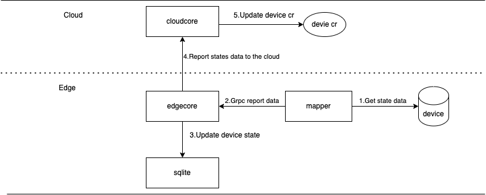

# Support device state message.

## Motivation
The device has its own states, such as online states, offline states, etc. It is very necessary to collect these stateses and report them to the cloud.
### Goals
- Mapper provides a common framework code to support collecting the states of the device itself.
- After Edgecore receives the device states message, it updates the cache database device states message and 
  send to cloud.
- After receiving the device states message, Cloudcore updates the device's cr states information.

### Non-goals
- Mapper only provides a general framework and does not provide detailed code for obtaining device states.

### Device state design


### Mapper design
- In the dmi module, add a grpc interface for ReportDeviceState.
```golang
service DeviceManagerService {
  // ReportDeviceStates reports the state of devices to device manager.
  rpc ReportDeviceStates(ReportDeviceStatesRequest) returns (ReportDeviceStatesResponse) {}
}
```
- Handle states based on goroutine in Mapper's dataHandler.
```golang
func dataHandler(ctx context.Context, dev *driver.CustomizedDev) {
    ...
    // handle states
    getStates := &DeviceStates{Client: dev.CustomizedClient, DeviceName: dev.Instance.Name,
    DeviceNamespace: dev.Instance.Namespace}
    go getStates.Run(ctx)
}
```
- GetStates regularly obtains the device states, and then sends it to edgecore through the ReportDeviceState 
  interface.


### Edgecore design
- In the dmiserver module, implement ReportDeviceStates and send the received device states information to TwinGroup through beehive.
- In TwinGroup, match the "state/update" topic, send it to the device moudle, and execute the action DeviceStateUpdate.
- In DeviceStateUpdate, update the device states information of the sqlite database and transmit it to the cloud.


### Cloudcore design    
- Add device states-related definitions to the crd definition of device.
```yaml
  lastOnline:
    description: 'Optional: The last time the device was online.'
    type: string
  state:
    description: 'Optional: The state of the device.'
    type: string
```
- Change the name of the original deviceStatusChan to deviceTwinsChan，add a deviceStatesChan in UpstreamController, 
specifically used to process device states reporting messages.
```Golang 
type UpstreamController struct {
    ...
    // deviceTwinsChan message channel
    deviceTwinsChan chan model.Message
    // deviceStates message channel
    deviceStatesChan chan model.Message
}
```
- After receiving the message in deviceStatesChan, update the device states information of cr.
