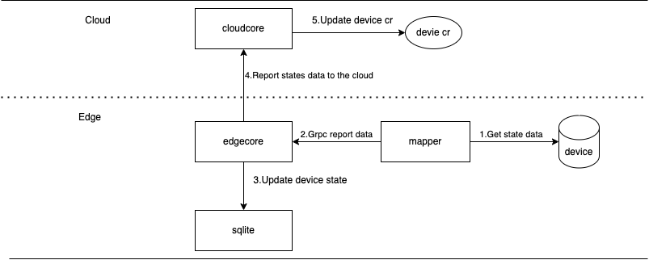

# Support device state message.

## Motivation
The device has its own states, such as online states, offline states, etc. It is very necessary to collect these stateses and report them to the cloud.
### Goals
- Mapper provides a common framework code to support collecting the states of the device itself.
- After Edgecore receives the device states message, it updates the cache database device states message and 
  send to cloud.
- After receiving the device states message, Cloudcore updates the device's cr states information.

### Non-goals
- Mapper only provides a general framework and does not provide device states collection code.

### Device state design


### Mapper design
- In the dmi module, add a grpc interface for ReportDeviceState.
- Call getDeviceStates based on goroutine in Mapper's DevStart.
- GetDeviceStates regularly obtains the device states, and then sends it to edgecore through the ReportDeviceState 
  interface.

```golang
func (gs *DeviceStates) Run() {
	states, error := gs.Client.GetDeviceStates()
	if error != nil {
		klog.Errorf("GetDeviceStates failed: %v", error)
		return
	}

	statesRequest := &dmiapi.ReportDeviceStatesRequest{
		DeviceName:      gs.DeviceName,
		State:           states,
		DeviceNamespace: gs.DeviceNamespace,
	}

	log.Printf("send statesRequest", statesRequest.DeviceName, statesRequest.State)
	if err := grpcclient.ReportDeviceStates(statesRequest); err != nil {
		klog.Errorf("fail to report device states of %s with err: %+v", gs.DeviceName, err)
	}
}
```

### Edgecore design
- In the dmiserver module, implement ReportDeviceStates and send the received device states information to TwinGroup through beehive.
- In TwinGroup, match the "/state/update" topic, send it to the device moudle, and execute the action DeviceStateUpdate.
- In DeviceStateUpdate, update the device states information of the sqlite database and transmit it to the cloud.

```golang
func dealDeviceStateUpdate(context *dtcontext.DTContext, resource string, msg interface{}) error {
	message, ok := msg.(*model.Message)
	if !ok {
		return errors.New("msg not Message type")
	}

	updatedDevice, err := dttype.UnmarshalDeviceUpdate(message.Content.([]byte))
	if err != nil {
		klog.Errorf("Unmarshal device info failed, err: %#v", err)
		return err
	}
	deviceID := resource
	defer context.Unlock(deviceID)
	context.Lock(deviceID)
	doc, docExist := context.DeviceList.Load(deviceID)
	if !docExist {
		return nil
	}
	device, ok := doc.(*dttype.Device)
	if !ok {
		return nil
	}

	// state refers to definition in mappers-go/pkg/common/const.go
	state := strings.ToLower(updatedDevice.State)
	switch state {
	case "online", "offline", "ok", "unknown", "disconnected":
	default:
		return nil
	}
	var lastOnline string
	if state == "online" || state == "ok" {
		lastOnline = time.Now().Format("2006-01-02 15:04:05")
	}
	for i := 1; i <= dtcommon.RetryTimes; i++ {
		err = dtclient.UpdateDeviceFields(
			device.ID,
			map[string]interface{}{
				"last_online": lastOnline,
				"state":       updatedDevice.State,
			})
		if err == nil {
			break
		}
		time.Sleep(dtcommon.RetryInterval)
	}
	if err != nil {
		return err
	}
	device.State = updatedDevice.State
	device.LastOnline = lastOnline
	payload, err := dttype.BuildDeviceState(dttype.BuildBaseMessage(), *device)
	if err != nil {
		return err
	}
	topic := dtcommon.DeviceETPrefix + device.ID + dtcommon.DeviceETStateUpdateResultSuffix
	context.Send(device.ID,
		dtcommon.SendToEdge,
		dtcommon.CommModule,
		context.BuildModelMessage(modules.BusGroup, "", topic, messagepkg.OperationPublish, payload))

	msgResource := "device/" + device.ID + dtcommon.DeviceETStateUpdateSuffix
	context.Send(deviceID,
		dtcommon.SendToCloud,
		dtcommon.CommModule,
		context.BuildModelMessage("resource", "", msgResource, model.UpdateOperation, string(payload)))
	return nil
}
```

### Cloudcore design    
- Add device states-related definitions to the crd definition of device.
```yaml
  last_online:
    description: 'Optional: The last time the device was online.'
    type: string
  state:
    description: 'Optional: The state of the device.'
    type: string
```
- Add a deviceStatesChan in UpstreamController, specifically used to process device states reporting messages.
```Golang 
type UpstreamController struct {
    crdClient    crdClientset.Interface
    messageLayer messagelayer.MessageLayer
    // devicestates message channel
    devicestatesChan chan model.Message
    // deviceStates message channel
    deviceStatesChan chan model.Message
    // downstream controller to update device states in cache
    dc *DownstreamController
}
```
- After receiving the message in deviceStatesChan, update the device states information of cr.
```golang
	case msg := <-uc.deviceStatesChan:
		klog.Infof("Message: %s, operation is: %s, and resource is: %s", msg.GetID(), msg.GetOperation(), msg.GetResource())
		msgState, err := uc.unmarshalDeviceStatesMessage(msg)
		if err != nil {
			klog.Warningf("Unmarshall failed due to error %v", err)
			continue
		}
		deviceID, err := messagelayer.GetDeviceID(msg.GetResource())
		if err != nil {
			klog.Warning("Failed to get device id")
			continue
		}
		device, ok := uc.dc.deviceManager.Device.Load(deviceID)
		if !ok {
			klog.Warningf("Device %s does not exist in upstream controller", deviceID)
			continue
		}
		cacheDevice, ok := device.(*v1beta1.Device)
		if !ok {
			klog.Warning("Failed to assert to CacheDevice type")
			continue
		}
		deviceStates := &Devicestates{states: cacheDevice.states}
		deviceStates.states.State = msgState.Device.State
		deviceStates.states.LastOnline = msgState.Device.LastOnline

		cacheDevice.states.State = msgState.Device.State
		cacheDevice.states.LastOnline = msgState.Device.LastOnline
		uc.dc.deviceManager.Device.Store(deviceID, cacheDevice)
		body, err := json.Marshal(deviceStates)
		if err != nil {
			klog.Errorf("Failed to marshal device states %v", deviceStates)
			continue
		}
		err = uc.crdClient.DevicesV1beta1().RESTClient().Patch(MergePatchType).Namespace(cacheDevice.Namespace).Resource(ResourceTypeDevices).Name(cacheDevice.Name).Body(body).Do(context.Background()).Error()
		if err != nil {
			klog.Errorf("Failed to patch device states %v of device %v in namespace %v, err: %v", cacheDevice,
				deviceID, cacheDevice.Namespace, err)
			continue
		}
		//send confirm message to edge twin
		resMsg := model.NewMessage(msg.GetID())
		nodeID, err := messagelayer.GetNodeID(msg)
		if err != nil {
			klog.Warningf("Message: %s process failure, get node id failed with error: %s", msg.GetID(), err)
			continue
		}
		resource, err := messagelayer.BuildResourceForDevice(nodeID, "twin", "")
		if err != nil {
			klog.Warningf("Message: %s process failure, build message resource failed with error: %s", msg.GetID(), err)
			continue
		}
		resMsg.BuildRouter(modules.DeviceControllerModuleName, constants.GroupTwin, resource, model.ResponseOperation)
		resMsg.Content = commonconst.MessageSuccessfulContent
		err = uc.messageLayer.Response(*resMsg)
		if err != nil {
			klog.Warningf("Message: %s process failure, response failed with error: %s", msg.GetID(), err)
			continue
		}
		klog.Infof("Message: %s process successfully", msg.GetID())
```