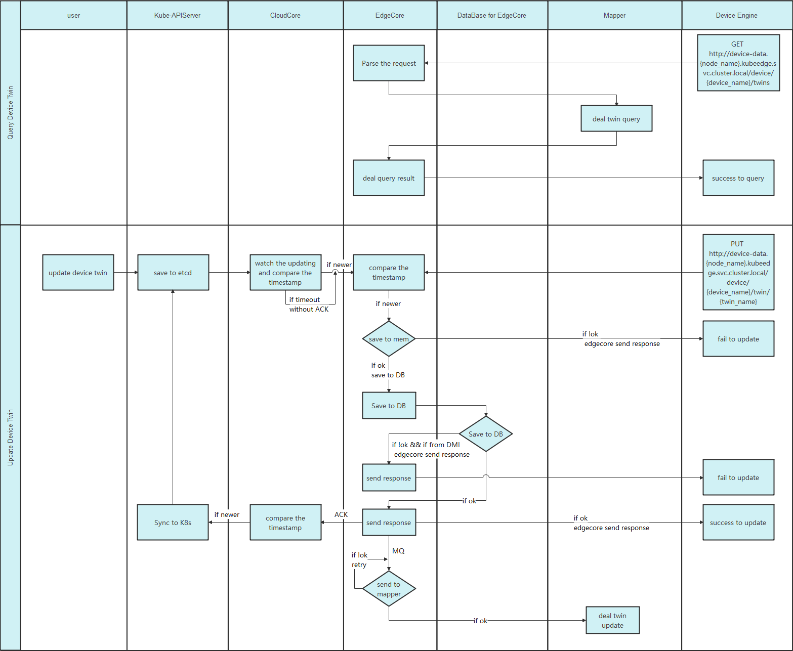

# Data Plane of DMI Design

- [Data Plane of DMI Design](#data-plane-of-dmi-design)
  - [Motivation](#motivation)
    - [Goals](#goals)
    - [Non-goals](#non-goals)
  - [Proposal](#proposal)
    - [User Scenarios](#user-scenarios)
    - [User Story by Roles](#user-story-by-roles)
        - [for platform developers](#for-platform-developers)
        - [for data consumer application developers](#for-data-consumer-application-developers)
  - [Design Details](#design-details)
    - [Pull Data](#pull-data)
      - [Structure](#structure)
      - [Flow](#flow)
      - [API Definition](#api-definition)
        - [Mapper Specification （can be queried from EdgeCore through DMI）](#mapper-specification-can-be-queried-from-edgecore-through-dmi)
          - [List Mapper Specification](#list-mapper-specification)
          - [Get Mapper Specification](#get-mapper-specification)
          - [Mapper Health Check](#mapper-health-check)
        - [Device Specification and Status](#device-specification-and-status)
          - [List Device Specification and Status](#list-device-specification-and-status)
          - [Get Device Specification and Status](#get-device-specification-and-status)
          - [Get Device Specification](#get-device-specification)
          - [Get Device State](#get-device-state)
        - [Device Twin](#device-twin)
          - [List Device Twin](#list-device-twin)
          - [Get Device Twin](#get-device-twin)
          - [Update Device Twin](#update-device-twin)
          - [Patch Device Twin](#patch-device-twin)
        - [Device Commands](#device-commands)
          - [List Device Commands](#list-device-commands)
          - [Get Device Command](#get-device-command)
          - [Execute Device Command](#execute-device-command)
      - [Device CRD Definition](#device-crd-definition)
        - [DeviceModel](#devicemodel)
        - [Device Command](#device-command)
    - [Security](#security)
      - [Access Security for Device Service](#access-security-for-device-service)
      - [Access Security for DMI of Data Plane](#access-security-for-dmi-of-data-plane)
      - [Device is not isolated based on namespace at edge node](#device-is-not-isolated-based-on-namespace-at-edge-node)


## Motivation

This proposal provides the Data Plane of Device Management Interface（DMI） which integrates the device management interface and optimizes the device management capability of KubeEdge. It is the goal of KubeEdge DMI that builds a cloud native device twin management platform which covers device management, device operation and device data and implements Device as a Service.

Cloud Native: DMI makes device a virtualized digital twin as a resource of Kubernetes

Device Management: DMI helps users to manage device lifecycle like pod with simplifies operations

Device Operation: DMI provides the ability of device operation through Kubernetes API and  local command API by users and deployment

Device Data: DMI provides the ability that the data can be consumed by local deployment and migrated to cloud in special cases

### Goals

* offer a solution for users' edge device data plane management based on KubeEdge
* propose the definition of the DMI API
* propose the implementation of DMI
* provide the development framework of DMI
* provide the demo of device management based on KubeEdge DMI
### Non-goals

* To provide persistent storage for all historical data by KubeEdge itself
## Proposal

### User Scenarios

* used for structured data access
* not suitable for unstructured data access
* device command for executing singly
* query the reported value and update the desired value of device twin by accessing REST API of DMI
* query the specification and state of device and mapper by accessing REST API of DMI
* push the read-only desired value of device twin which can also be called `data` to database or message broker middleware proactively
### User Story by Roles

##### for platform developers
* users can develop a Mapper by implementing DMI with driver of IoT protocol to connect to edge devices
* users can build the access of device data for consumers with DMI
##### for data consumer application developers
* develop the data consumer application based on the API of DMI
## Design Details

### Pull Data

#### Structure


Mapper

`Mapper` is the plugin which is used for connecting to device by implementing the device driver and interacting with EdgeCore by implementing DMI. One `Mapper` works for only one device protocol, which means, deploying a `Mapper` gives the node the ability to manage devices of the protocol. `Mapper` can be deployed to edge node in the form of a `Pod` managed by `DaemonSet` or `Deployment`.  It can also be executed in the form of a binary which is not quite recommended.

Device Engine

`Device Engine` is the plugin which is used for accessing the Data Plane of DMI. It is the engine and the backend to implement `Device as a Service`, also known as `DaaS`. One `Device Engine` works for only one edge node, which means, deploying a `Device Engine` gives the node the ability to provide the service of device data on it to `Data Consumer`. To maintain the consistency of device data at edge, `Device Engine` can only access to `EdgeCore` and cannot access to `Mapper` on the same node directly. All the message which update device twin can only be delivered to `EdgeCore` through DMI, which makes `EdgeCore` the only data processing center at edge.  `Device Engine` can be deployed to edge node in the form of a `Pod` managed by `Deployment` and one `Device Engine` works for only one edge node. It may also be deployed as `StatefulSet` which can be discussed in later version.

Data Service

`Data Service` is the service for accessing specification and status of device and `Mapper`. One `Data Service` works for only one edge node with one `Device Engine` as backend.  `Data Service` is distinguished by node name and it can be accessed by `Data Consumer` from all namespaces. If the administrator wants to enable the device data access capability of a certain node, `Device Engine` and `Data Service` should be deployed on this node. A shell script can be provided later to simplify the work. `Headless Service` may be discussed in later version.

#### Flow


In the scenario where the `Device Twin` supports simultaneous modification on cloud and edge, data consistency on cloud and edge must be ensured. Since commands can be executed only on the edge side, and each execution result needs to be reported in real time, only the consistency of `Device Twin` status on cloud and edge is considered in this proposal. The status updated through DMI is written on the edge side and then synchronized to the cloud. Each status information of the `Device Twin` contains a timestamp. When a merge operation is required, KubeEdge compares the timestamp, discards the outdated version, and selects a later version for merge. The `Device Twin` status changes asynchronously at edge. The status change is considered as successful as long as the data is successfully written into the database at edge. Later, the `DeviceTwin` module ensures that the status updating is successfully sent to the Mapper. Each time the `Mapper` is restarted, it reads the latest `Device Twin` status from `EdgeCore`.

#### API Definition

##### Mapper Specification （can be queried from EdgeCore through DMI）

###### List Mapper Specification

* Method: GET
* URL: [http://device-data](http://device-data).{node_name}.kubeedge.svc.cluster.local/mappers?procotol=modbus&namespace=default
* Response:

```plain
{
    "mappers": [
        {
            "grpc_server": {
                "socket_path": "/etc/kubeedge/modbus.sock"
            },
            "common": {
                "name": "modbus-dmi-mapper",
                "version": "v1.13.0",
                "api_version": "v1.0.0",
                "protocol": "modbus",
                "address": "127.0.0.1",
                "edgecore_sock": "/etc/kubeedge/dmi.sock"
            },
            "dev_init": {
                "mode": "register"
            }
        },
        {
            "grpc_server": {
                "socket_path": "/etc/kubeedge/bluetooth.sock"
            },
            "common": {
                "name": "bluetooth-dmi-mapper",
                "version": "v1.13.0",
                "api_version": "v1.0.0",
                "protocol": "bluetooth",
                "address": "127.0.0.1",
                "edgecore_sock": "/etc/kubeedge/dmi.sock"
            },
            "dev_init": {
                "mode": "register"
            }
        }
    ]
}
```
* Problems to be confirmed:
  * How to handle the relationship between mapper and namespace because the mapper does not need the property of namespace at edge while it does care on the cloud.
  * The health state of mapper cannot be queried via this request.

###### Get Mapper Specification
* Method: GET
* URL: [http://device-data](http://device-data).{node_name}.kubeedge.svc.cluster.local/mapper/{mapper_name}?namespace=default
* Response:

```plain
{
    "grpc_server": {
        "socket_path": "/etc/kubeedge/modbus.sock"
    },
    "common": {
        "name": "modbus-dmi-mapper",
        "version": "v1.13.0",
        "api_version": "v1.0.0",
        "protocol": "modbus",
        "address": "127.0.0.1",
        "edgecore_sock": "/etc/kubeedge/dmi.sock"
    },
    "dev_init": {
        "mode": "register"
    }
}
```
###### Mapper Health Check
* Method: GET
* URL: [http://device-data](http://device-data).{node_name}.kubeedge.svc.cluster.local/mapper/{mapper_name}/health?namespace=default
* Response:

```plain
{
    "state": "ok"
}
```
##### Device Specification and Status
###### List Device Specification and Status

* Method: GET
* URL: [http://device-data](http://device-data).{node_name}.kubeedge.svc.cluster.local/devices?namespace=default
* Response:

```plain
{
    "devices": [
        {
            "metadata": {
                "name": "sensor-tag-instance-01",
                "namespace": "user-namespace-01"
            },
            "spec": {
                ...
            },
            "status": {
                ...
            }
        },
        {
            "metadata": {
                "name": "sensor-tag-instance-01",
                "namespace": "user-namespace-02"
            },
            "spec": {
                ...
            },
            "status": {
                ...
            }
        }
    ]
}
```
###### Get Device Specification and Status
* Method: GET
* URL: [http://device-data](http://device-data).{node_name}.kubeedge.svc.cluster.local/device/{device_name}?namespace=default
* Response:

```plain
{
    "metadata": {
        "name": "sensor-tag-instance-01",
        "namespace": "user-namespace-01"
    },
    "spec": {
        ...
    },
    "status": {
        ...
    }
}
```
###### Get Device Specification
* Method: GET
* URL: [http://device-data](http://device-data).{node_name}.kubeedge.svc.cluster.local/device/{device_name}/spec?namespace=default
* Response:

```plain
{
    "metadata": {
        "name": "sensor-tag-instance-01",
        "namespace": "user-namespace-01"
    },
    "spec": {
        ...
    },
}
```
###### Get Device State
* Method: GET
* URL: [http://device-data](http://device-data).{node_name}.kubeedge.svc.cluster.local/device/{device_name}/state?namespace=default
* Response:

``` json
{
    "metadata": {
        "name": "sensor-tag-instance-01",
        "namespace": "user-namespace-01"
    },
    "status": {
        "state": "ok",
        "lastOnline": "2023-05-12T17:30:20Z"
    }
}
```
##### Device Twin
###### List Device Twin

* Method: GET
* URL: [http://device-data](http://device-data).{node_name}.kubeedge.svc.cluster.local/device/{device_name}/twins?namespace=default
* Response:

``` json
{
    "metadata": {
        "name": "sensor-tag-instance-01",
        "namespace": "user-namespace-01"
    },
    "status": {
        "twins": [
            {
                "propertyName": "temperature-enable",
                "uploadToCloud": true,
                "desired": {
                    "value": "OFF"
                },
                "reported": {
                    "value": "OFF"
                }
            },
            {
                "propertyName": "temperature",
                "uploadToCloud": true,
                "desired": {
                    "value": "10"
                },
                "reported": {
                    "value": "16"
                }
            }
        ]
    }
}
```
###### Get Device Twin
* Method: GET
* URL: [http://device-data](http://device-data).{node_name}.kubeedge.svc.cluster.local/device/{device_name}/twin/{twin_name}?namespace=default
* Response:

``` json

{
    "propertyName": "temperature-enable",
    "uploadToCloud": true,
    "desired": {
        "value": "OFF"
    },
    "reported": {
        "value": "OFF"
    }
}
```
###### Update Device Twin
* Method: PUT
* URL: [http://device-data](http://device-data).{node_name}.kubeedge.svc.cluster.local/device/{device_name}/twin/{twin_name}?namespace=default
* Body:

``` json
{
    "value": "123"
}
```
* Response:
``` json
{
    "message": "ok"
}
```
###### Patch Device Twin
* Method: PATCH
* URL: [http://device-data](http://device-data).{node_name}.kubeedge.svc.cluster.local/device/{device_name}/twin?namespace=default
* Body:

``` json
{
    "status": {
        "twins": [
            {
                "propertyName": "temperature-enable",
                "desired": {
                    "value": "OFF"
                }
            },
            {
                "propertyName": "temperature",
                "desired": {
                    "value": "16"
                }
            }
        ]
    }
}
```
* Response:
``` json
{
    "message": "ok"
}   
```
* Problems to be confirmed:
  * user can only update the desired value of the twin
  * adding twin to a device is not supported currently
  * changing the name of twin is not supported
    Command of Device

##### Device Commands
###### List Device Commands

* Method: GET
* URL: [http://device-data](http://device-data).{node_name}.kubeedge.svc.cluster.local/device/{device_name}/commands?namespace=default
* Response:

```json
{
  "commands": [
    {
      "name": "set_temperature",
      "description": "set_temperature can set the temperature",
      "version": "v1.0",
      "method": "POST",
      "annotation": {

      },
      "actions": {

      },
      "parameters": {

      }
    },
    {
      "name": "go_forward",
      "description": "go_forward makes the device go forward",
      "version": "v1.1",
      "method": "POST",
      "annotation": {

      },
      "actions": {

      },
      "parameters": {

      }
    }
  ]
}
```

* annotation: field used for extension
* actions: field used to describe how mapper operates the device to implement command execution. This field should be defined in Device CRD by device manager based on the device protocol.
* parameters: field used to describe the parameters which need to be transferred by users to execute the command. This field should be defined in Device CRD by device manager based on the device.

###### Get Device Command

* Method: GET
* URL: [http://device-data](http://device-data).{node_name}.kubeedge.svc.cluster.local/device/{device_name}/command/{command_name}?namespace=default
* Response:

``` json
{
    "name": "set_temperature",
    "description": "set_temperature can set the temperature",
    "version": "v1.0",
    "method": "PUT",
    "annotation": {
        
    },
    "actions": {
        
    },
    "parameters": {
        
    }
}
```
###### Execute Device Command
* Method: POST
* URL: [http://device-data](http://device-data).{node_name}.kubeedge.svc.cluster.local/device/{device_name}/command/{command_name}?namespace=default
  Body:

``` json
{
    "parameters": {
        
    }
}
```
* Response:
``` json
{
    "apiVersion": "v1.0",
    "statusCode": 200,
    "message": "ok",
    "response": {
        
    }
}
```
#### Device CRD Definition

##### DeviceModel

##### Device Command

```golang
// DeviceCommands describe a list of device commands
// +optional
DeviceCommands []DeviceCommand `json:"deviceCommands,omitempty"`

// DeviceCommand represents the specification of device command
type DeviceCommand struct {
  Name        string                 `json:"name,omitempty"`
  Description string                 `json:"description,omitempty"`
  Version     string                 `json:"version,omitempty"`
  Method      string                 `json:"method,omitempty"`
  Annotations map[string]string      `json:"annotations,omitempty"`
  Actions     map[string]interface{} `json:"actions,omitempty"`
  Parameters  map[string]interface{} `json:"parameters,omitempty"`
}
```

### Security

#### Access Security for Device Service

#### Access Security for DMI of Data Plane


#### Device is not isolated based on namespace at edge node


 
