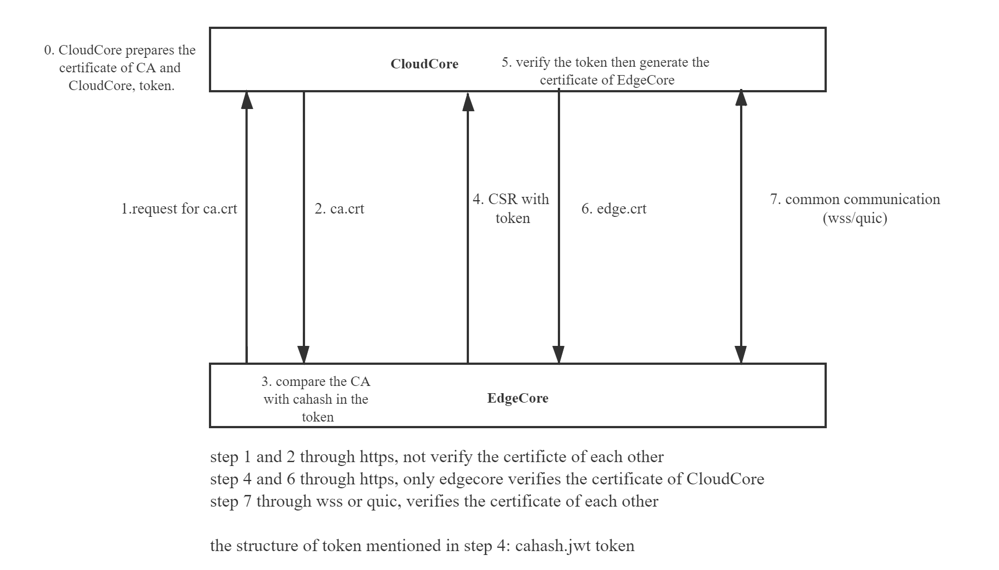
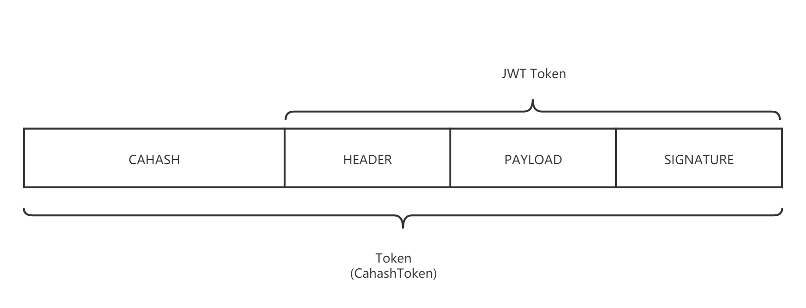

# Edge Authentication Design

## Motivation

The current connection between EdgeCore and CloudCore, that is, the authentication and authorization of the edge node to the cloud requires manual replication of the certificate, which has poor scalability and flexibility.

## Goal

- To implement that edge nodes automatically apply for a certificate when joining the cluster, and CloudCore approves the certificate, then they can establish WSS connection with CloudCore.
- The port for establishing the HTTPS connection of CloudCore and EdgeCore can be configured in cloudcore.yaml.
- It supports users to manually configure certificates, and also supports CloudCore to automatically generate certificates.
- Support cloudcore multi-instance.

## Design detail

#### Architecture



#### **Workflow**

**Step0:**

It contains several steps such as preparing certificates, generating token and starting the https service.

Prepare certificates:

The certificate can be manually configured by the user. When starting cloudcore, first load the CA certificate and key and the cloudcore certificate and key. The loading process is as follows: find whether there is a CA certificate and key from the local directory. If no certificate is found, find them from the secret. If not found, cacert and cakey are automatically generated and stored in secret whose namespace is kubeedge for persistence and then written into hubconfig. Then self-signed certificate of CloudCore will be generated using cacert .

Generate token:

The process of generating the token is as follows, set the token expiration time to 24h, and encrypt the token using cakey. Then splice caHash in front of the token, separated by dot. The token will be automatically refreshed before it expires. In other words, the token will never expire.Then token will be stored in secret.

Token structure:



Start https service:

A new https port is exposed in CloudHub. The purpose is only to encrypt the communication and protect the token transmission. (Note: The token is only responsible for the security of the request, but does not guarantee the security of the request transmission process.) This means that any client can send CSR with token to request the issuance of the certificate. But this process is safe. The token will not be hijacked during the network transmission.

**Step1:**

EdgeCore request for CA certificate from the CloudCore(this time they don't verify the certificate of each other).

**Step2:**

Return CA certificate directly to EdgeCore without verifying identity.

**Step3:**

Hash the CA certificate, and compare it with the cahash in the token to verify the validness of CA certificate.

**Step4:**

Generate a pair of key and store the private key locally. Submit the certificate signing request(CSR) to CloudCore with token in the http header(this time only EdgeCore varifies the certificate of CloudCore using cacert from step2).

**Step5&6:**

Parse and verify token, If successful, use the CA certificate to sign the CSR and return a certificate to EdgeCore.

**Step7:**

Then the CLoudCore and EdgeCore can establish mutual authentication TLS.


#### Configuration of kubeedge with https

1. Users edit cloudcore.yaml

```yaml
  cloudHub:
    https:
      address: 0.0.0.0
      enable: true        # enable https protocol
      port: 10002         # open port for https server
    tlsCAFile: /etc/kubeedge/ca/rootCA.crt
    tlsCAKeyFile: /etc/kubeedge/ca/rootCA.key
    tlsCertFile: /etc/kubeedge/certs/server.crt
    tlsPrivateKeyFile: /etc/kubeedge/certs/server.key
```

2. Users edit edge.yaml

```yaml
    tlsCaFile: /etc/kubeedge/ca/rootCA.crt
    tlsCertFile: /etc/kubeedge/certs/edge.crt
    tlsPrivateKeyFile: /etc/kubeedge/certs/edge.key
    token:
    httpServer: https://127.0.0.1:10002
```


3. Running the cloudhub, and start the https server.

4. Waiting for client access through https protocol.

#### Certificate rotation

Here we implement the certificate rotation for edge nodes. The rotation process is as follows:


**step 0:**

After getting the certificate, the EdgeCore will wait approximately 70%-90% of the total lifetime of the certificate before the next rotation.

With jitter, if a number of nodes are added to a cluster at approximately the same time (such as cluster creation time), they won't all try to rotate certificates at the same time for the rest of the life of the cluster.

**step 1:**

When the waiting deadline expires, the EdgeCore requests for a new certificate again by its old certificate.

**step 2:**

The CloudCore verifies the certificate of EdgeCore by CA certificate. If passed, it will issue the CSR.

**step 3:**

 The CloudCore return the new certificate to the EdgeCore.

**step 4:**

The old certificate is replaced by new certificate. The EdgeCore reconnects with CloudCore.

**step 5:**

Then the EdgeCore waits for the next rotation.


## Future development tasks
1. Ports integration.
2. Save the token to a file, delete the token file after the edge node is successfully registered.
