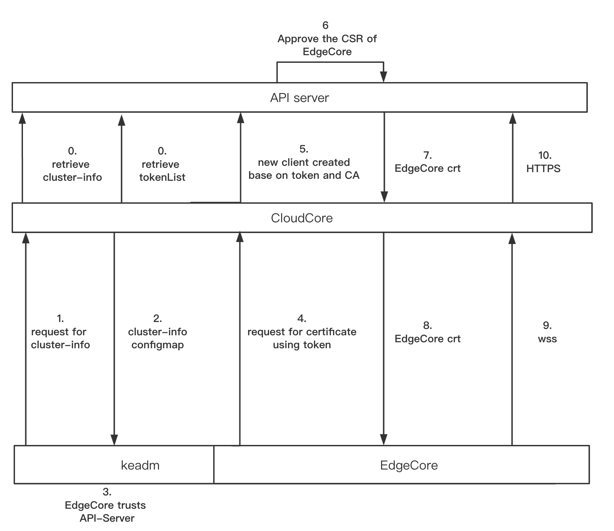

# Edge Authentication Design

## motivation

The current connection between EdgeCore and CloudCore, that is, the authentication and authorization of the edge node to the cloud requires manual replication of the certificate, which has poor scalability and flexibility. And this root certificate is not within the K8S native authentication and authorization system and requires additional maintenance.

## goal

To implement that edge nodes automatically apply for a certificate when joining the cluster, and k8s api server approves the certificate.

## design detail

Update the tool keadm to simplify the complexity of joining edge nodes to the cluster.

Firstly, Keadm establishes a TLS connection with Cloudcore. Then keadm sends a request of cluster-info to CLoudCore. Then the CloudCore will return the cluster-info containing  a public Key to keadm. Based on the discovery-token-ca-cert-hash flag, Keadm can validate the public key of the root certificate authority (CA) presented by the CloudCore. Then EdgeCore uses token to authenticate API Server,and CloudCore will forward token to the APIServer and forward a certificate to EdgeCore.If successful,EdgeCore and CloudCore will establish a wss connection.

#### cloudcore：

​	Cloudcore directly configures CA certificate and cloudcore certificate when accessing the api server. This cloudcore certificate is issued by a **same** CA with the edgecore certificate, so they can establish TLS.

#### keadm join

​	Authentication is split into discovery (having the Node trust the Kubernetes Master) and TLS bootstrap (having the Kubernetes Master trust the Node).

##### 	preflight checks

Check version of OS and install subsequently the required pre-requisites using supported steps. Currently we will support **ONLY** (Ubuntu & CentOS)

Check and install all the pre-requisites before executing edge-controller, which are

- Docker (currently 18.06.0ce3-0~ubuntu) and check is service is up.
- mosquitto (latest available in OS repos) and check if running.

##### 	discovery clustor-info

​	`keadm join` is invoked with `--discovery-token`, token discovery is used; in this case the node basically retrieves the cluster CA certificates from the  `cluster-info` ConfigMap in the `kube-public` namespace.

​	In order to prevent "man in the middle" attacks, several steps are taken:

+ First, the CA certificate is retrieved via **insecure connection** (note: this is possible because `kubeadm init` granted access to  `cluster-info` users for `system:unauthenticated` )

- Then the CA certificate goes through following validation steps:
  - "Basic validation", using the token ID against a JWT signature
  - "Pub key validation", using provided `--discovery-token-ca-cert-hash`. This value is available in the output of "keadm init" or can be calculated using standard tools (the hash is calculated over the bytes of the Subject Public Key Info (SPKI) object as in RFC7469). The `--discovery-token-ca-cert-hash flag` may be repeated multiple times to allow more than one public key.
  - as a additional validation, the CA certificate is retrieved via secure connection and then compared with the CA retrieved initially

##### TLS Bootstrap

​	Once the cluster info are known, the file `bootstrap-edge.conf` is written, allowing edgecore to do TLS Bootstrapping.

​	The TLS bootstrap mechanism uses the shared token to temporarily authenticate with the cloudcore to submit a certificate signing request (CSR) for a locally created key pair.

**And the request is forwarded to k8s api-server**. Next controller manager approves the request and the operation completes saving `ca.crt` file and `edge.conf` file to be used by edgecore for joining the cluster, while`bootstrap-edge.conf` is deleted.

Please note that:

- The temporary authentication is validated against the token
- The temporary authentication resolve to a user member of  `system:bootstrappers:kadm:default-node-token` group which was granted access to CSR api
