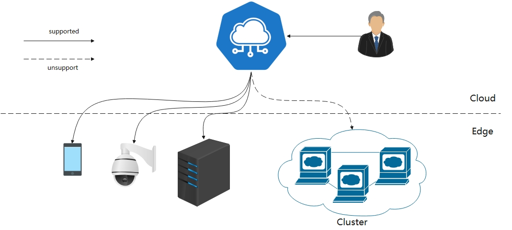

| title        | authors     | approvers                  | creation-date | last-updated | status    |
| ------------ | ----------- | -------------------------- | ------------- | ------------ | --------- |
| Edge Cluster | @WintonChan @liufen90 @MesaCrush | @kevin-wangzefeng @fisherxu | 2020-03-17    | 2020-04-14 | Implementing |

# Edge cluster

## Motivation

Under scenarios of edge computing, there are multiple Kubernetes clusters deployed at the edge. Administrators/users hope to manage edge clusters on the cloud centrally and take advantages of more cloud-native capability on the edge.
    
Currently, KubeEdge only supports management of edge nodes and does not support the management of edge clusters. In order to provide unified management and scheduling, and expand the cloud native capabilities of edge nodes, we plan to support edge cluster management.

This design doc is to enable users manage edge clusters on the cloud.

### Goals

- centralized management of edge kubernetes clusters

### Non-goals

- collaboration between edge clusters and edge nodes

## Proposal

### Usage scenarios

​    User has multiple kubernetes clusters on the edge, and each cluster is in an isolated network subnet. The user needs to access the subnet through different agents to manage the cluster. Users need to manage all edge clusters on the cloud in order to simplify operation and maintenance management.

### Use case

- Users access and manage edge K8s clusters on the cloud
  1. Users need to deploy proxy-agent application in edge cluster with the configuration of  the address of kube-apiserver and proxy server .
  2. In the external network, users can use kubectl or go-client to access  edge cluster  by adding proxy address to kubeconfig.

## Design Details

**Alpha**: Realize network intercommunication between edge and cloud

Referencing [apiserver-network-proxy](https://github.com/kubernetes-sigs/apiserver-network-proxy), we proposes a Layer 7 proxy solution for different network plane of cloud and edge cluster. The specific process is as follows:

- Cluster registration process
  1. Deploy proxy-agent application configured with  the access address of kube-apisever in edge k8s cluster. 
  2. Proxy-agent initiates a connection to the proxy server to register the cluster.

- Client access edge API cluster process
  1. Clients configure KUBECONFIG by adding proxy-url:  http://<proxy-server_ip>:<proxy-server_port>/
  2. When clients send a request,  flow is transmitted to proxy-server.
  3. After the proxy-server listens to the request, it forwards it to the corresponding proxy-agent according to the destination address of the request.
  4. The request obtained by the proxy-agent is directly forwarded to kube-apisever.

Note:  Clients accessing the cluster on the cloud need to support HTTP proxy.

### Future development tasks

- For the management and scheduling of multiple clusters, the plan references the official federal management scheme.
- Support Layer 4 .

### Discussion

1. Is kubeedge managing the lifecycle of edge cluster, or is cluster federation responsible for it? If kubeedge is responsible, there are two options:

   (1) Providing users with cluster deployment and update tools on the edge.

   (2) Issuing the command of cluster installation and upgrade on the  cloud.

3. What is the logical relationship between edge clusters and edge nodes?

4. Do the applications on the edge node need to communicate with the applications on the edge cluster? 

## Implementation plan
- Alpha: v1.7
- Beta: TBD
- GA: TBD
