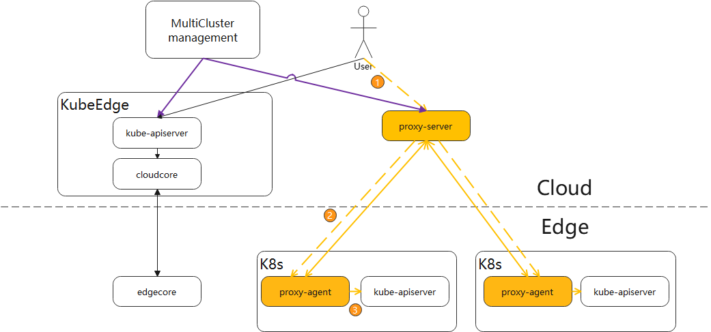

| title        | authors     | approvers                  | creation-date | last-updated | status    |
| ------------ | ----------- | -------------------------- | ------------- | ------------ | --------- |
| Edge Cluster | @WintonChan@liufen90 | @kevin-wangzefeng@fisherxu | 2020-03-17    | 2020-03-25   | Designing |

# Edge cluster

## Motivation

Under scenarios of edge computing, there are multiple Kubernetes clusters deployed at the edge. Administrators/users hope to manage edge clusters on the cloud centrally and take advantages of more cloud-native capability on the edge.
​    
​Currently, KubeEdge only supports management of edge nodes and does not support the management of edge clusters. In order to provide unified management and scheduling, and expand the cloud native capabilities of edge nodes, we plan to support edge cluster management.

This design doc is to enable customers manage edge clusters on the cloud.

### Goals

- centralized management of edge kubernetes clusters

### Non-goals

- collaboration between edge clusters and edge nodes

## Proposal

### Usage scenarios

​    User has multiple kubernetes clusters on the edge, and each cluster is in an isolated network subnet. The user needs to access the subnet through different agents to manage the cluster. Users need to manage all edge clusters on the cloud in order to simplify operation and maintenance management.

### Use case

​    User calls the native API of the edge K8s cluster on the cloud

1. User needs to deploy the Tunnel Agent application on the edge cluster
2. The user calls the API of the edge cluster through the control plane IP of the edge cluster

## Design Details

We implement a tunnel crossing cloud and edge to deliver the request to edge. 

the tunnel agent initiates a websocket to tunnel server.
1. User makes a request to the tunnel server
2. the request is sent to tunnel agent on edge
3. finally, the request is sent to apiserver on edge.

In the future, we will manage multi-cluster by karmada. Karmada is a project for management multi-cluster.

### Discussion

1. What is the logical relationship between edge clusters and edge nodes?

2. How do we manage edge clusters on the cloud? What other capabilities are needed in addition to supporting state synchronization?

3. Do the applications on the edge node need to communicate with the applications on the edge cluster?

## Implementation plan
- Alpha: 1.7 or 1.8

