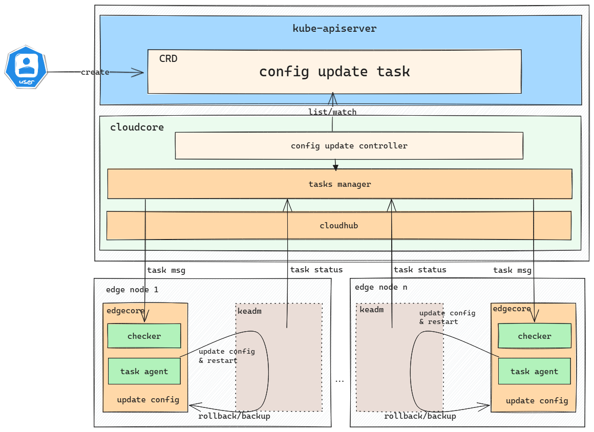

# Support update EdgeCore config

## Motivation 

In many scenarios, being able to update the EdgeCore configuration files for edge nodes directly from the cloud provides significant convenience compared to logging into each edge node for manual updates. This is especially beneficial for batch operations, where managing multiple nodes at once can greatly enhance efficiency and streamline the operational process.

### Goals

- Provide APIs for creating config update tasks from cloud.
- Support update edge config on multi edge nodes or nodegroup.
- Support full or partial field updates to the edge configuration.
- Support task rollback at edge. 

## Design Details

We propose using Kubernetes CRDs to describe ConfigUpdate metadata and a controller to synchronize task between edge and cloud.




### ConfigUpdateController

`configUpdateController` is responsible for dealing with `ConfigUpdateJob`

- Use List-Watch mechanism to monitor `ConfigUpdateJob` CRD resources, receiving events and store it in local cache using map.
- Use K8s informer to get node list according to NodeName or LabelSelector specified in CR, and filter out nodes that don't meet requirements (for example, edge node with NotReady status)
- Check whether the job is completed. 

### Tasks Manager

TaskManager starts several goroutine called `upstream` controller, `downstream` controller and other task controllers. Task manager will reuse the design from the node task, please refer to https://github.com/kubeedge/kubeedge/blob/master/docs/proposals/edge-node-tasks-design.md for more details.

### EdgeHub

- Check the received config-update task.  

### Keadm

Add n new subcommand for keadm, `keadm update-config`, to process this task. For each edgenode, keadm update-config will do: 

- use `/etc/kubeedge/idempotency_record` file to make sure only one task(config update or node upgrade) can be performed at a time  
- Back up `edgecore.db, edgecore.yaml` to backup path `/etc/kubeedge/backup/update-config` 
- Update the `edgecore.yaml` and restart edgecore.service 
- rollback: if update failed, keadm will do rollback operation to start edgecore with origin configuration.
- report update result to CloudHub which has provided an interface `/task/{taskID}/node/{nodeID}/status`

## CRD Design Details 

### CRD API Group and Version

`ConfigUpdateJob` CRD is cluster-scoped. The tables below summarize the group, kind and API version details for the CRD.

| Field      | Description            |
|------------|------------------------|
| Group      | operations.kubeedge.io |
| APIVersion | v1alpha1               | 
| Kind       | ConfigUpdateJob        |


```go
// ConfigUpdateJob is used to update edge configuration from cloud side.
// +k8s:openapi-gen=true
// +kubebuilder:subresource:status
// +kubebuilder:resource:scope=Cluster
type ConfigUpdateJob struct {
	metav1.TypeMeta   `json:",inline"`
	metav1.ObjectMeta `json:"metadata,omitempty"`

	// Specification of the desired behavior of ConfigUpdateJob.
	// +optional
	Spec ConfigUpdateJobSpec `json:"spec,omitempty"`
	// Most recently observed status of the ConfigUpdateJob.
	// +optional
	Status ConfigUpdateJobStatus `json:"status,omitempty"`
}

// +k8s:deepcopy-gen:interfaces=k8s.io/apimachinery/pkg/runtime.Object

// ConfigUpdateJobList is a list of ConfigUpdateJob.
type ConfigUpdateJobList struct {
	// Standard type metadata.
	metav1.TypeMeta `json:",inline"`

	// Standard list metadata.
	metav1.ListMeta `json:"metadata,omitempty"`

	// List of ConfigUpdateJobs.
	Items []ConfigUpdateJob `json:"items"`
}

// ConfigUpdateJobSpec is the specification of the desired behavior of the NodeUpgradeJob.
type ConfigUpdateJobSpec struct {
    // NodeNames is a request to select some specific nodes. If it is non-empty,
    // the update job simply select these edge nodes to do config update operation.
    // Please note that sets of NodeNames and LabelSelector are ORed.
    // Users must set one and can only set one.
    // +optional
    NodeNames []string `json:"nodeNames,omitempty"`
    // LabelSelector is a filter to select member clusters by labels.
    // It must match a node's labels for the ConfigUpdateJob to be operated on that node.
    // Please note that sets of NodeNames and LabelSelector are ORed.
    // Users must set one and can only set one.
    // +optional
    LabelSelector *metav1.LabelSelector `json:"labelSelector,omitempty"`
    // TimeoutSeconds limits the duration of the config update job.
    // Default to 300.
    // If set to 0, we'll use the default value 300.
    // +optional
    TimeoutSeconds *uint32 `json:"timeoutSeconds,omitempty"`
    // Concurrency specifies the max number of edge nodes that can do config update operation at the same time.
    // The default Concurrency value is 1.
    // +optional
    Concurrency int32 `json:"concurrency,omitempty"`
    // UpdateFields specify certain fields in EdgeCore configurations to update.
    // Please note that sets of UpdateFields and UpdateConfig are ORed.
    // Users must set one and can only set one.
    // +optional 
    UpdateFields map[string]string `json:"updateFields,omitempty"`
    // UpdateConfig is a JSON representation of the complete EdgeCore configuration, 
    // will completely replace the existing EdgeCore configuration.
    // Please note that sets of UpdateFields and UpdateConfig are ORed.
    // Users must set one and can only set one.
    // +optional 
    UpdateConfig string `json:"updateConfig,omitempty`
    // FailureTolerate specifies the task tolerance failure ratio.
    // The default FailureTolerate value is 0.1.
    // +optional
    FailureTolerate string `json:"failureTolerate,omitempty"`
}

// ConfigUpdateJobStatus stores the status of ConfigUpdateJob.
// contains multiple edge config update status.
// +kubebuilder:validation:Type=object
type ConfigUpdateJobStatus struct {
    // State represents for the state phase of the ConfigUpdateJob.
    // There are several possible state values: "", Init, InProgress, Completed and Failure.
    State JobState `json:"state,omitempty"`
    // Reason represents for the reason of the ConfigUpdateJob.
    Reason string `json:"reason,omitempty"`
    // Time represents for the running time of the ConfigUpdateJob.
    Time string `json:"time,omitempty"`
    // Status contains update status for each edge node.
    Status []TaskStatus `json:"nodeStatus,omitempty"`
}

// TaskStatus stores the status of config update for each edge node.
// +kubebuilder:validation:Type=object
type TaskStatus struct {
    // Action represents for the action of the ConfigUpdateJob.
    // There are three possible action values: Init, Check, BackUp, Update, RollBack.
    Action ConfigUpdateJobAction `json:"action,omitempty"`
	// BasicNodeTaskStatus defines basic fields of node task status
	BasicNodeTaskStatus `json:",inline"`
}

// JobState represents operation task(NodeUpgrade/ImagePrePull/ConfigUpdate) state
type JobState string 

const (
	JobStateInit       JobState = "Init"
	JobStateInProgress JobState = "InProgress"
	JobStateCompleted  JobState = "Completed"
	JobStateFailure    JobSate = "Failure"
)

// BasicNodeTaskStatus defines basic fields of node task status
// +kubebuilder:validation:Type=object
type BasicNodeTaskStatus struct {
	// NodeName is the name of edge node.
	NodeName string `json:"nodeName,omitempty"`
	// Reason represents for the reason of the configUpdateJob. 
	// +optional
	Reason string `json:"reason,omitempty"`
	// Time represents for the running time of the configUpdateJob.
	Time string `json:"time,omitempty"`
}
```

### ConfigUpdateJob Sample

```yaml
apiVersion: operations.kubeedge.io/v1alpha1
kind: ConfigUpdateJob
metadata:
  name: configupdate-example
  labels:
    description: update-label
spec:
  nodes:
    - node1
    - node2
  #labelSelector:
  #  matchLabels:
  #    "node-role.kubernetes.io/edge": ""
  #    node-role.kubernetes.io/agent: ""
  timeoutSeconds: 300
  concurrency: 2
  updateFields:
    edged.rootDirectory: /etc/test
    edgeStream.enable: true
  failureTolerate: "0.2"
```