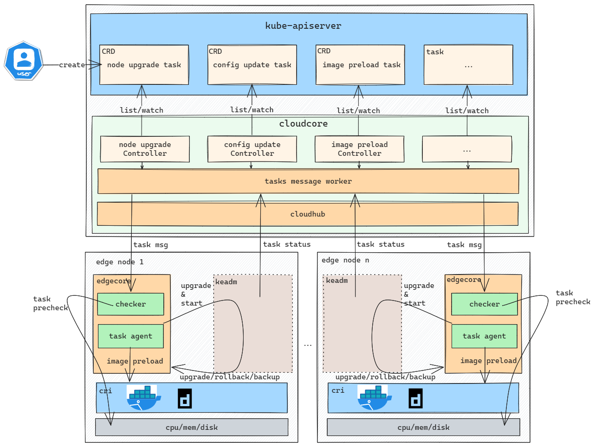
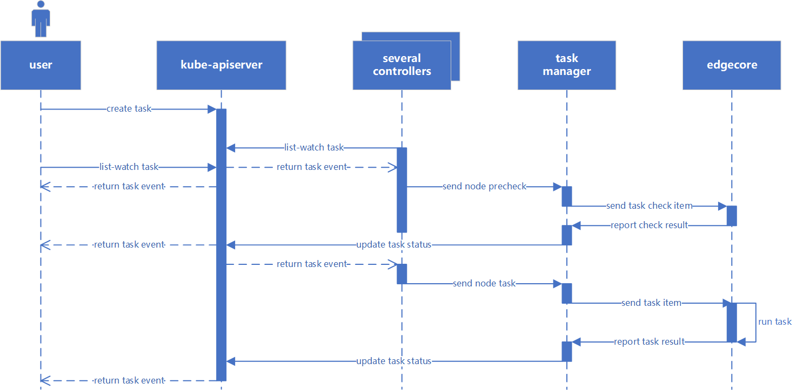

# Edge Node tasks

## Motivation
The edge node tasks feature is essential in edge computing because it enables remote cloud control of edge nodes.
This proposal seeks to address the issues of creating tasks, querying tasks in the cloud and sending them to the appropriate nodes, and synchronizing task status.

### Goals

Edge node tasks must:
* provide APIs for creating edge nodes tasks from the cloud.
* Tasks should be distributed according to the node list, and the results should be reported.
* Report status correctly. Allow cloud-core to resume executing tasks after restarting.
* Support task pre-checking
* Tolerate the failure of some nodes to complete tasks. The failure ratio is adjustable. When the number of failed nodes reaches the proportion, the upgrade is canceled.

## Proposal
We propose using Kubernetes [Custom Resource Definitions (CRDs)](https://kubernetes.io/docs/concepts/extend-kubernetes/api-extension/custom-resources/) to describe Upgrade metadata/status and a controller to synchronize task between edge and cloud.

### Use Cases

* Describe task properties.
    * Users can describe task properties and access mechanisms to interact with / control the task execute.
* Perform CRUD operations on task from cloud.
    * Users can create, update and delete task metadata from the cloud via the CRD APIs exposed by the Kubernetes API server.
* Task distribution for Node
    * Based on the node list, the task manager will allocate jobs to all nodes and record them in cr.
* Report tasks properties values.
  * Edge nodes can report tasks result status.
* Task pre-checking
  * Users can specify check items, and nodes that fail the check will stop the entire task.


## Tasks Manager Design


The Tasks Manager starts several separate goroutines called  `upstream` controller、 `downstream` controller and other task controllers.
The job of the downstream controller is to synchronize the task messages from the cloud to the edge node.
The upstream controller's job is to receive task results from the edge node and update the cr object of the task using the interface that each task controller has implemented.
Other task controllers' jobs are the cr of the task corresponding to the list-watch, and they distribute the relevant task requests to downstream on the task's status.

## FSM Design
The state machine will be used for task state transitions and node subtask item state transitions.
The current task will transition to the next state only when all node subtasks have reached the next step.
Each state machine individually implements its own update state function and current state function. This completes the "status query -> receiving events -> status update" procedure.

## Synchronizing NodeUpgradeJob

The below illustrations describe the flow of events that would occur when tasks property values are updated from the cloud/edge.

As an example, consider the task of node upgrade.

Users create the NodeUpgradeJob CRs to trigger upgrade edge node jobs directly using `kubectl`, NodeUpgrade Controller watch the resource with List-Watch, and then send upgrade message to edge node. edgecore of edge node will use `keadm` to do the upgrade operation. keadm will report upgrade result to cloud. And then cloud will record upgrade result to NodeUpgradeJob status. Users can check whether upgrade is successful or not by looking into status field.

NodeUpgrade Controller will do:
- Use List-Watch mechanism to monitor NodeUpgradeJob CRD resouces, after receiving events from K8s APIServer, then store it in local cache using map.

- Use K8s informer to get node list according to NodeNames or LabelSelector specified in CR, and
  filter out nodes that don't meet upgrade requirements(1. edge node already on the desired upgrade version. 2. not edge nod                                                                    e,
  without label `"node-role.kubernetes.io/edge": ""` 3. edge node is in Upgrading or NotReady state 4. remove duplicated nodes)

- Check whether the upgrade job is completed(all or partial node upgrade state is completed).
    If so, we don't need to send upgrade message to edge node again. And only when the upgrade is not completed, we'll send upgrade message to edge node. This operation is to prevent cloudcore from repeating sending upgrade message to edge nodes, such as under circumstance when cloudcore restart.

Tasks Manager will do:
- Through the channel, receive the task request message and node matching rules sent by each NodeUpgrade. The message is then routed to the appropriate node in accordance with the node matching rules.
- For each compliant edge nodes, send upgrade beehive message to each edge node. Call k8s api to mark edge node unschedulable to avoid continuing to deploy applications on upgrading edge nodes. And start a Goroutine to process timeout if we don't receive edge node upgrade response, if not, will update NodeUpgradeJob status to timeout state. This operation is to deal with no response circumstance.

CloudHub send upgrade request to EdgeHub of each edge node.

EdgeHub will do:
- Check the received tasks. For instance, whether the edgecore version should be upgraded and whether the task content is legal.

- The registered functions of various tasks, such as checkCPU, nodeUpgrade, and so on, can be called according to the task category.

- KeadmUpgrade will download the keadm of the specified version. EdgeCore will pull `kubeedge/installation-package`
  image, and copy the keadm binary from container to host path. And then start a daemon progress to run `keadm upgrade` related command to do upgrade operation, but not run `keadm` command directly, this is based on the consideration that keadm will kill edgecore progress in upgrading.

Keadm will do:
- use `/etc/kubeedge/idempotency_record` file to district only one upgrade can be performed at a time.

- preprocess: keadm will do some preprocess work before starting upgrading edge node. Back up `edgecore.db edgecore.yaml edgecore` to backup path `/etc/kubeedge/backup/{From_Version}`,
  and pull `kubeedge/installation-package` image and copy the edgecore binary from container to host upgrade path:
  `/etc/kubeedge/upgrade/{To_Version}`

- process: stop the edgecore, and copy the new version edgecore to `/usr/local/bin` directory and start new edgecore.

- rollback: if upgrade failed, keadm will do some rollback operations to start the origin edgecore progress.
  Stop the edgecore, rollback files, copy files of backup dir `/etc/kubeedge/backup/{From_Version}` to the origin path,
  and then start the origin edgecore.

- report upgrade result and failure reason(if failed) to CloudHub Http service regradless of the upgrade is successful or failed.

CloudHub will do: 
- CloudHub Http service will add an interface `/task/{taskID}/node/{nodeID}/status` to transform the upgrade response message to the Tasks Manager Upstream.

Tasks Manager Upstream will do:

- Receive the status of the task's completion as supplied by each node.
- Finish the state transition and reporting by invoking the NodeUpgrade controller's state machine.
- Call k8s api to record upgrade in Node
  annotation like `"nodeupgradejob.operations.kubeedge.io/history": "v1.10.0->v1.11.0"` if the upgrade is successful, to help users check node upgrade history much more easilier.





## CRD Design Details

### CRD API Group and Version
Here we take the `NodeUpgradeJob` CRD as an example:

All tasks CRD will be cluster-scoped.
The tables below summarize the group, kind and API version details for the CRDs.

* NodeUpgradeJob

| Field                 | Description             |
|-----------------------|-------------------------|
|Group                  | operations.kubeedge.io  |
|APIVersion             | v1alpha1                |
|Kind                   | NodeUpgradeJob          |


### NodeUpgradeJob CRD
A `NodeUpgradeJob` describes the Upgrade properties exposed by the NodeUpgradeJob.
A NodeUpgradeJob is like a reusable template using which edge nodes can be upgraded to the specific version, easily operated from cloud side.

### NodeUpgradeJob Type Definition
```go
// NodeUpgradeJob is used to upgrade edge node from cloud side.
// +k8s:openapi-gen=true
// +kubebuilder:subresource:status
// +kubebuilder:resource:scope=Cluster
type NodeUpgradeJob struct {
	metav1.TypeMeta   `json:",inline"`
	metav1.ObjectMeta `json:"metadata,omitempty"`

	// Specification of the desired behavior of NodeUpgradeJob.
	// +optional
	Spec NodeUpgradeJobSpec `json:"spec,omitempty"`
	// Most recently observed status of the NodeUpgradeJob.
	// +optional
	Status NodeUpgradeJobStatus `json:"status,omitempty"`
}

// +k8s:deepcopy-gen:interfaces=k8s.io/apimachinery/pkg/runtime.Object

// NodeUpgradeJobList is a list of NodeUpgradeJob.
type NodeUpgradeJobList struct {
	// Standard type metadata.
	metav1.TypeMeta `json:",inline"`

	// Standard list metadata.
	metav1.ListMeta `json:"metadata,omitempty"`

	// List of NodeUpgradeJobs.
	Items []NodeUpgradeJob `json:"items"`
}

``// NodeUpgradeJobSpec is the specification of the desired behavior of the NodeUpgradeJob.
// NodeUpgradeJobSpec is the specification of the desired behavior of the NodeUpgradeJob.
type NodeUpgradeJobSpec struct {
    // +Required: Version is the EdgeCore version to upgrade.
    Version string `json:"version,omitempty"`
    // TimeoutSeconds limits the duration of the node upgrade job.
    // Default to 300.
    // If set to 0, we'll use the default value 300.
    // +optional
    TimeoutSeconds *uint32 `json:"timeoutSeconds,omitempty"`
    // NodeNames is a request to select some specific nodes. If it is non-empty,
    // the upgrade job simply select these edge nodes to do upgrade operation.
    // Please note that sets of NodeNames and LabelSelector are ORed.
    // Users must set one and can only set one.
    // +optional
    NodeNames []string `json:"nodeNames,omitempty"`
    // LabelSelector is a filter to select member clusters by labels.
    // It must match a node's labels for the NodeUpgradeJob to be operated on that node.
    // Please note that sets of NodeNames and LabelSelector are ORed.
    // Users must set one and can only set one.
    // +optional
    LabelSelector *metav1.LabelSelector `json:"labelSelector,omitempty"`
    // Image specifies a container image name, the image contains: keadm and edgecore.
    // keadm is used as upgradetool, to install the new version of edgecore.
    // The image name consists of registry hostname and repository name,
    // if it includes the tag or digest, the tag or digest will be overwritten by Version field above.
    // If the registry hostname is empty, docker.io will be used as default.
    // The default image name is: kubeedge/installation-package.
    // +optional
    Image string `json:"image,omitempty"`
    // Concurrency specifies the max number of edge nodes that can be upgraded at the same time.
    // The default Concurrency value is 1.
    // +optional
    Concurrency int32 `json:"concurrency,omitempty"`
    
    // CheckItems specifies the items need to be checked before the task is executed.
    // The default CheckItems value is nil.
    // +optional
    CheckItems []string `json:"checkItems,omitempty"`
    
    // FailureTolerate specifies the task tolerance failure ratio.
    // The default FailureTolerate value is 0.1.
    // +optional
    FailureTolerate string `json:"failureTolerate,omitempty"`
}


// NodeUpgradeJobStatus stores the status of NodeUpgradeJob.
// contains multiple edge nodes upgrade status.
// +kubebuilder:validation:Type=object
type NodeUpgradeJobStatus struct {
    // State represents for the state phase of the NodeUpgradeJob.
    // There are several possible state values: "", Upgrading, BackingUp, RollingBack and Checking.
    State api.State `json:"state,omitempty"`
    
    // CurrentVersion represents for the current status of the EdgeCore.
    CurrentVersion string `json:"currentVersion,omitempty"`
    // HistoricVersion represents for the historic status of the EdgeCore.
    HistoricVersion string `json:"historicVersion,omitempty"`
    // Event represents for the event of the ImagePrePullJob.
    // There are six possible event values: Init, Check, BackUp, Upgrade, TimeOut, Rollback.
    Event string `json:"event,omitempty"`
    // Action represents for the action of the ImagePrePullJob.
    // There are two possible action values: Success, Failure.
    Action api.Action `json:"action,omitempty"`
    // Reason represents for the reason of the ImagePrePullJob.
    Reason string `json:"reason,omitempty"`
    // Time represents for the running time of the ImagePrePullJob.
    Time string `json:"time,omitempty"`
    // Status contains upgrade Status for each edge node.
    Status []TaskStatus `json:"nodeStatus,omitempty"`
}


// TaskStatus stores the status of Upgrade for each edge node.
// +kubebuilder:validation:Type=object
type TaskStatus struct {
    // NodeName is the name of edge node.
    NodeName string `json:"nodeName,omitempty"`
    // State represents for the upgrade state phase of the edge node.
    // There are several possible state values: "", Upgrading, BackingUp, RollingBack and Checking.
    State api.State `json:"state,omitempty"`
    // Event represents for the event of the ImagePrePullJob.
    // There are three possible event values: Init, Check, Pull.
    Event string `json:"event,omitempty"`
    // Action represents for the action of the ImagePrePullJob.
    // There are three possible action values: Success, Failure, TimeOut.
    Action api.Action `json:"action,omitempty"`
    // Reason represents for the reason of the ImagePrePullJob.
    Reason string `json:"reason,omitempty"`
    // Time represents for the running time of the ImagePrePullJob.
    Time string `json:"time,omitempty"`
}
```

### NodeUpgradeJob sample
```yaml
apiVersion: operations.kubeedge.io/v1alpha1
kind: NodeUpgradeJob
metadata:
  name: upgrade-example
  labels:
    description: upgrade-label
spec:
  version: "v1.16.0"
  checkItems:
    - "cpu"
    - "mem"
    - "disk"
  failureTolerate: "0.3"
  concurrency: 2
  timeoutSeconds: 180
  labelSelector:
    matchLabels:
      "node-role.kubernetes.io/edge": ""
      node-role.kubernetes.io/agent: ""
```
Shown above is an example NodeUpgradeJob for upgrading edge node. It has the below properties:
- `version`: this property describes which version that we want to upgrade to.
- `nodeNames`: nodeNames is a request to select some specific nodes. If it is non-empty, the upgrade job simply select
  these edge nodes to do upgrade operation. Please note that sets of NodeNames and LabelSelector are ORed.
  Users must set one and can only set one.
- `labelSelector`: labelSelector is a filter to select member clusters by labels. It must match a node's labels for the
  NodeUpgradeJob to be operated on that node. Please note that sets of NodeNames and LabelSelector are ORed.
  Users must set one and can only set one.
- `checkItems`: checkItems specifies the items that will be checked before the job is executed. The task will only be executed if all node checks pass.
- `failureTolerate`: failureTolerate limits the failing node tolerance ratio. The task (upgrade) will be aborted if the failure percentage exceeds the tolerance.
- `timeoutSeconds`: timeoutSeconds limits the duration of the node upgrade job.
  Default to 300. If users don't set it or set it to 0, we'll use the default value 300.
- `image`: Image specifies a container image name, the image contains: keadm and edgecore. keadm is used as upgradetool,
  to install the new version of edgecore. The image name consists of registry hostname and repository name,
  if it includes the tag or digest, the tag or digest will be overwritten by Version field above.
  If the registry hostname is empty, docker.io will be used as default. The default image name is: `kubeedge/installation-package`.


### Validation
[Open API v3 Schema based validation](https://kubernetes.io/docs/tasks/access-kubernetes-api/custom-resources/custom-resource-definitions/#validation) can be used to guard against bad requests.
Invalid values for fields ( example string value for a boolean field etc) can be validated using this.
In some cases , we also need custom validations (e.g create an Upgrade instance which not specify nodes ) .
[Validation admission web hooks](https://kubernetes.io/docs/reference/access-authn-authz/admission-controllers/#validatingadmissionwebhook) can be used to implement such custom validation rules.

Here is a list of validations we need to support :

#### Tasks Validations
- Don't allow tasks creation if any `Required` fields are missing ( like version etc.)
- nodeNames and labelSelector cannot be both empty. That means that we must specify at least one valid node. And users cannot set the two fields both either.
- Don't allow update CR spec fields once one task CR is created.
- If the task run failed, users need to debug why it failed by themselves through K8s task CR status fields. The user must resolve the issue and recreate the task CD.
- The task CR will not be emptied automatically in order to record the task's running results. It needs to be cleared manually.
- We also use webhook to do some validations, for example, check whether version format is right.

