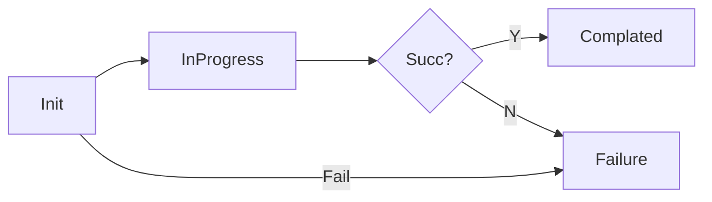
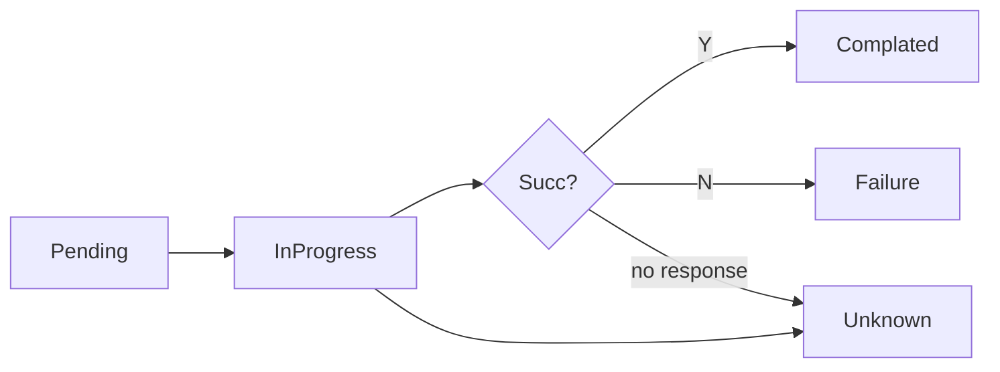
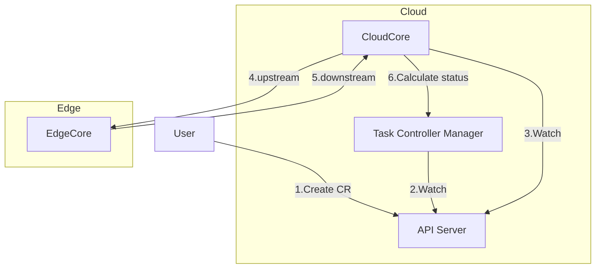
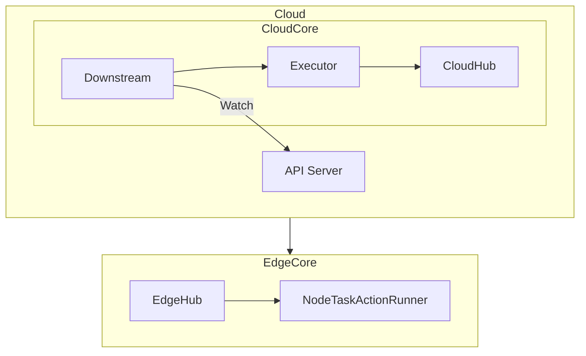
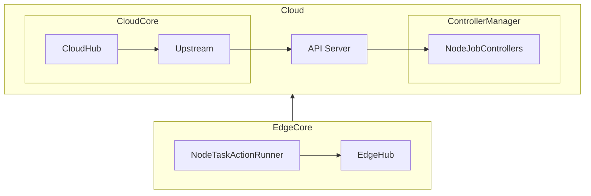

# Enhance The Status Structure Of Node Job
## Motivation

The current node job status consists of three elements: state, event, and action, which is too complicated. The node job status and node task status use the same type, these definitions make it look like the node job is waiting for all nodes to reach a stage before proceeding to the next stage.

In addition, there is another problem that some errors in the processing process will not be displayed to the status, especially errors in the previous process. This will result in no updates to the job status and it will appear as if it was not processed. The user has no way to know what happened except to look up the running logs of cloudcore and edgecore. This is not a very good user experience.

- More details refer to: [Issue #5999](https://github.com/kubeedge/kubeedge/issues/5999)
- Previous design refer to [Edge Node Tasks](edge-node-tasks-design.md)


### Goals

- Define a new node job status structure to make it easier for users and developers to understand.
- Track the error information of the whole process and write it to the status.
- Develop a more reasonable node task framework.


## Glossary

- Node Job: A CRD object, used to describe the task of a node.
- Node Task: Execute tasks in nodes according to the spec of node jobs and provide feedback on the execution results of tasks.


## Proposal
### Node Job Status

The node job status consists of phase and nodeStatus fields. The phase field is one of there values: Init, InProgress, Complated or Failure. 



- **Init** - After creating a node job CR, ControllerManager will initialize the matching node and set the node job phase to "Init".
- **InProgress** - The node job phase will be "InProgress" when any node starts processing the node task.
- **Complated** - All node tasks are already final status and the number of node tasks failures is not greater than the defined failure rate, then set the phase to "Complated".
- **Failure** - If the initialization of node tasks fails, or the number of failures for node tasks is greater than the defined failure rate, set the phase to "Failure".

When each node reports the execution results, the node job phase will be calculated and updated. 

The nodeStatus fields records the status of node task execution actions.


### Node Task status

The node task status consists of phase, action, and reason. The phase field is one of there values: Pending, InProgress, Successful, Failure and Unknown.

- **Pending** - After the node job is initialized, all matching nodes phase is set to "Pending".
- **InProgress** - When a edge node executes a task, the node task phase is set to "InProgress".
- **Successful** - When a edge node executes all atcions successfully, the node task phase is set to "Successful".
- **Failure** - When a edge node fails to execute the any action, the node task phase is set to "Failure". And the error message will be written to the reason field.
- **Unknown** - When a edge node does not report the execution results for a long time, the node task phase is set to "Unknown".

The action field is used to indicates the stage of node execution.
- The NodeUpgradeJob action flow is:
    ```mermaid
    graph LR
    A[Check] --> B{Need confirmation?}
    B --> |Y| C[Confirm]
    C --> D[WaitingConfirmation]
    D --> E[Backup]
    B --> |N| E
    E --> F[Upgrade]
    F -- Failure --> G[Rollback]
    ```
- The ImagePrePullJob action flow is:
    ```mermaid
    graph LR
    A[Check] --> B[Pull]
    ```

Each node has one or more image pull tasks, using the image name, status and reason fields to record the results of each image pull. Define the status field as metav1.ConditionStatus type to set whether the image pull is successful.


### Node Task Data Flow



CloudCore allows multiple instances to be deployed, which is likely to cause concurrent conflicts in node tasks updates. To avoid this, we need to put the matching node task initialization and node job status calculation in ControllerManager,because ControllerManager runs as a single instance.

1. User creates a CR for a node job.
1. ControllerManager watchs the created node job CRs and initializes the matching nodes to the state.
1. CloudCore watchs node job CRs and execute the initialized nodes.
1. CloudCore send the tasks to the edge nodes.
1. Edge nodes execute node tasks and report the results to CloudCore.
1. ControllerManager calculates the status of the node job.


## Design Details
### Node Job Definition

This enhancement will upgrade the CR version to v1alpha2, two versions (v1alpha1 and v1alpha2) will be defined in CRD, and storing v1alpah2, new CRDs will retain some fields for backward compatibility.

The go file names are redefined as:
```text
v1alpha2
├── types_common.go
├── types_imageprepull.go
└── types_nodeupgrade.go
```


#### types_common.go

Defines the common structures for node tasks.

```golang
type JobPhase string

// Constants for job phase
const (
    JobPhaseInit       JobPhase = "Init"
    JobPhaseInProgress JobPhase = "InProgress"
    JobPhaseComplated  JobPhase = "Complated"
    JobPhaseFailure    JobPhase = "Failure"
)

type NodeTaskPhase string

// Constants for node task status.
const (
    NodeTaskPhasePending    NodeTaskPhase = "Pending"
    NodeTaskPhaseInProgress NodeTaskPhase = "InProgress"
    NodeTaskPhaseSuccessful NodeTaskPhase = "Successful"
    NodeTaskPhaseFailure    NodeTaskPhase = "Failure"
    NodeTaskPhaseUnknown    NodeTaskPhase = "Unknown"
)

// BasicNodeTaskStatus defines basic fields of node execution status.
// +kubebuilder:validation:Type=object
type BasicNodeTaskStatus struct {
    // NodeName is the name of edge node.
    NodeName string `json:"nodeName,omitempty"`
    // Phase represents for the phase of the node task.
    Phase NodeTaskPhase `json:"phase,omitempty"`
    // Reason represents for the reason of the node task.
    // +optional
    Reason string `json:"reason,omitempty"`
    // Time represents for the running time of the node task.
    Time string `json:"time,omitempty"`
}
```


#### types_imageprepull.go

Defines the dedicated structures of ImagePrePullJob.

```golang
type ImagePrePullJobAction string

const (
    ImagePrePullJobActionCheck ImagePrePullJobAction = "Check"
    ImagePrePullJobActionPull  ImagePrePullJobAction = "Pull"
)

// ImagePrePullJobStatus stores the status of ImagePrePullJob.
// contains images prepull status on multiple edge nodes.
// +kubebuilder:validation:Type=object
type ImagePrePullJobStatus struct {
    // Phase represents for the phase of the NodeUpgradeJob
    Phase JobPhase `json:"phase"`
    // NodeStatus contains image prepull status for each edge node.
    NodeStatus []ImagePrePullNodeTaskStatus `json:"nodeStatus,omitempty"`
    // Some compatible fields ...
}

// ImagePrePullNodeTaskStatus stores image prepull status for each edge node.
// +kubebuilder:validation:Type=object
type ImagePrePullNodeTaskStatus struct {
    // Action represents for the action phase of the ImagePrePullJob
    Action ImagePrePullJobAction `json:"action,omitempty"`
    // ImageStatus represents the prepull status for each image
    ImageStatus []ImageStatus `json:"imageStatus,omitempty"`
    BasicNodeTaskStatus `json:",inline"`
}

// ImageStatus stores the prepull status for each image.
// +kubebuilder:validation:Type=object
type ImageStatus struct {
    // Image is the name of the image
    Image string `json:"image,omitempty"`
    // State represents for the state phase of this image pull on the edge node.
    State NodeExecutionState `json:"state,omitempty"`
    // Reason represents the fail reason if image pull failed
    // +optional
    Reason string `json:"reason,omitempty"`
}
```


#### types_nodeupgrade.go

Defines the dedicated structures of NodeUpgradeJob.

```golang
type NodeUpgradeJobAction string

const (
    NodeUpgradeJobActionCheck               NodeUpgradeJobAction = "Check"
    NodeUpgradeJobActionConfirm             NodeUpgradeJobAction = "Confirm"
    NodeUpgradeJobActionWaitingConfirmation NodeUpgradeJobAction = "WaitingConfirmation"
    NodeUpgradeJobActionBackUp              NodeUpgradeJobAction = "BackUp"
    NodeUpgradeJobActionUpgrade             NodeUpgradeJobAction = "Upgrade"
    NodeUpgradeJobActionRollBack            NodeUpgradeJobAction = "RollBack"
)

// NodeUpgradeJobStatus stores the status of NodeUpgradeJob.
// contains multiple edge nodes upgrade status.
// +kubebuilder:validation:Type=object
type NodeUpgradeJobStatus struct {
    // Phase represents for the phase of the NodeUpgradeJob
    Phase JobPhase `json:"phase"`
    // NodeStatus contains upgrade Status for each edge node.
    NodeStatus []NodeUpgradeJobNodeTaskStatus `json:"nodeStatus,omitempty"`
    // Some compatible fields ...
}

// NodeUpgradeJobNodeTaskStatus stores the status of Upgrade for each edge node.
// +kubebuilder:validation:Type=object
type NodeUpgradeJobNodeTaskStatus struct {
    // Action represents for the action phase of the NodeUpgradeJob
    Action NodeUpgradeJobAction `json:"action,omitempty"`
    // CurrentVersion represents for the current status of the EdgeCore.
    CurrentVersion string `json:"currentVersion,omitempty"`
    // HistoricVersion represents for the historic status of the EdgeCore.
    HistoricVersion string `json:"historicVersion,omitempty"`
    BasicNodeTaskStatus `json:",inline"`
    // Some compatible fields ...
}
```

### Action Flow

Use a tree structure to represent the flow of actions. All node job CRs need to define global variables of type Flow.

```golang
// Action defines the action of node task.
type Action struct {
    Name           string
    NextSuccessful *Action
    NextFailure    *Action
}

// Next returns the next action according to the success flag.
// success ? NextSuccessful : NextFailure.
func (a *Action) Next(success bool) *Action {}

// Final returns whether current action is the final action.
func (a *Action) Final() bool {}

// Flow defines the action flow of node task.
type Flow struct {
    First Action
}

// Find returns the found action by name.
// This method uses recursion to find successful or failure child action.
func (sf *Flow) Find(name string) *Action {}

var (
    FlowNodeUpgradeJob  = &Flow{...}
    FlowImagePrePullJob = &Flow{...}
    ...
)
```


### Compatibility

Redundant fields in the v1alpha2 of node job CRDs can achieve storage compatibility, but the node job CR group-version obtained from API Server are the same and cannot be distinguished. Therefore, each cloud component needs to support version switching through feature gates. EdgeCore can distinguish versions through message routing from the CloudCore.


### Controller Manager

#### Reconcile

Add a new node job controller for the each node job CRD. Implement the ReconcileHandler interface and call the RunReconcile(..) function. The RunReconcile(..) function abstracts the general logic of the node job controller Reconcile.
```golang
// NodeJobType uses to constrain paradigm type of node jobs.
type NodeJobType interface {
    NodeUpgradeJob | ImagePrePullJob
}

type ReconcileHandler[T operationsv1alpha2.NodeJobType] interface {
    // GetJob returns the node job found by controller-runtime Client.
    // If not found, returns nil.
    GetJob(ctx context.Context, req controllerruntime.Request) (*T, error)
    // NotInitialized returns whether the node job is not initialized
    NotInitialized(job *T) bool
    // IsFinalPhase returns whether the node job is final phase.
    IsFinalPhase(job *T) bool
    // InitNodesStatus initializes nodes status for the node job.
    InitNodesStatus(ctx context.Context, job *T)
    // CalculateStatus calculates the node job phase through the all node tasks phases.
    CalculateStatus(ctx context.Context, job *T) bool
    // UpdateJobStatus updates the node job status by controller-runtime Client.
    UpdateJobStatus(ctx context.Context, job *T) error
}

// RunReconcile runs the common reconcile logic for the node job.
func RunReconcile[T operationsv1alpha2.NodeJobType](
    ctx context.Context,
    req controllerruntime.Request,
    handler ReconcileHandler[T],
) error {
    job, err := handler.GetJob(ctx, req)
    if err != nil {
        return err
    }
    // The resource may no longer exist, in which case we stop processing.
    if job == nil {
        return nil
    }
    // The final phase does not need to be calculated.
    if handler.IsFinalPhase(job) {
        return nil
    }
    if handler.NotInitialized(job) {
        handler.InitNodesStatus(ctx, job)
        return handler.UpdateJobStatus(ctx, job)
    }
    // Retry update status error due to resourceVersion change.
    return retry.Do(
        func() error {
            job, err := handler.GetJob(ctx, req)
            if err != nil {
                return err
            }
            changed := handler.CalculateStatus(ctx, job)
            if changed {
                return handler.UpdateJobStatus(ctx, job)
            }
            return nil
        },
        retry.Delay(200*time.Millisecond),
        retry.Attempts(3),
        retry.DelayType(retry.FixedDelay))
}
```


#### Feature Gates

ControllerManager has no configuration file, adding a flag is a relatively simple solution at this stage. Add a feature-gates flag and convert it to kubernetes feature gate.
```golang
type ControllerManagerOptions struct {
    ...
    FeatureGates []string
}

func (o *ControllerManagerOptions) Flags() (fss cliflag.NamedFlagSets) {
    fs := fss.FlagSet("ControllerManager")
    ...
    fs.StringArrayVar(&o.FeatureGates, "feature-gates", o.FeatureGates, "Used to enable some features.")
}

func NewControllerManagerCommand(ctx context.Context) *cobra.Command {
    ...
    cmd := &cobra.Command{
        ...
        Run: func(cmd *cobra.Command, args []string) error {
            // Convert the feature gates flags to kubernetes feature gate.
            for _, fg := range opts.FeatureGates {
                if err := features.DefaultMutableFeatureGate.Set(fmt.Sprintf("%s=true", fg)); err != nil {
                    klog.Errorf("failed to set feature gate '%s', err: %v", fg, err)
                }
            }
        }
    }
}
```

By default, the node jobs of v1alpha2 will be used. When the function gate flag `disablenodeTaskV1alpha2` is set, the controller will not affect the node jobs of v1alpah1.
```golang
if !features.DefaultFeatureGate.Enabled(features.DisableNodeTaskV1alpha2) {
    // Setup node job controllers
}
```

Add args `--feature-gates=disablenodeTaskV1alpha2` in Deployment resource to support the feature of node task v1alpha2.
```yaml
spec:
  template:
    spec:
      containers:
      - name: controller-manager
        args:
        - --feature-gates=disablenodeTaskV1alpha2
        ...
```

####

After the node task status change, ControllerManager calculates the node job phase.
```golang
// CalculatePhaseWithCounts calculates the node job phase based on the statistics of
// the node task phase.
func CalculatePhaseWithCounts(total, proc, fail int64,
    failureTolerateSpec string,
) operationsv1alpha2.JobPhase {
    if total == 0 {
        klog.Error("node task status total is 0")
        return operationsv1alpha2.JobPhaseFailure
    }
    // As long as there are nodes being processed, the task status must be in-progress.
    if proc > 0 {
        return operationsv1alpha2.JobPhaseInProgress
    }
    // If failureTolerate is not specified, all node tasks must succeed.
    var failureTolerate float64 = 0
    if failureTolerateSpec != "" {
        parsed, err := strconv.ParseFloat(failureTolerateSpec, 64)
        if err != nil {
            klog.Errorf("failed to parse failureTolerate, use default value 1, err: %v", err)
        } else {
            failureTolerate = parsed
        }
    }
    // fail / total > failureTolerate
    if fail > 0 && decimal.NewFromInt(fail).
        Div(decimal.NewFromInt(total)).
        Round(2).
        Cmp(decimal.NewFromFloat(failureTolerate)) == 1 {
        return operationsv1alpha2.JobPhaseFailure
    }
    // succ == total || fail / total <= failureTolerate
    return operationsv1alpha2.JobPhaseComplated
}
```


### CloudCore

#### Feature Gates

By default, the node jobs of v1alpha2 will be used. 
Use feature gates to disable the v1alpha2 to use v1alpha1.

CloudCore supports setting feature gates in the configuration file:
```yaml
featureGates:
  nodeTaskV1alpha2: true
```

Add logic in the task manager module:
```golang
if !features.DefaultFeatureGate.Enabled(features.DisableNodeTaskV1alpha2) {
    // Init and start v1alpha2 node job downstream and upstream
} else {
     // Init and start v1alpha1 node job downstream and upstream
}
```


#### Job Wrap

The wrap.NodeJob interface is used to shield the differences in node job definitions and abstract node jobs for downstream and upstream. The node jobs needs to implement these interfaces.
```golang
type NodeJob interface {
    // Name returns the name of the node job.
    Name() string
    // ResourceType returns the resource type of the node job.
    ResourceType() string
    // Concurrency returns the concurrency in the node job spec.
    Concurrency() int
    // Spec returns the spec of the node job.
    Spec() any
    // Tasks returns the node tasks of the node job.
    Tasks() []NodeJobTask
    // GetObject returns the node job object.
    GetObject() any
}

type NodeJobTask interface {
    // NodeName returns the node name of the node task.
    NodeName() string
    // CanExecute returns whether the node job status can be executed.
    CanExecute() bool
    // Phase returns the phase of the node task.
    Phase() operationsv1alpha2.NodeTaskPhase
    // ToSuccessful sets the phase of the node task to successful.
    ToSuccessful()
    // ToInProgress sets the phase of the node task to in progress, and set the processing time.
    ToInProgress(t time.Time)
    // ToFailure sets the phase of the node task to failure, and set the failure reason.
    ToFailure(reason string)
    // Action returns the current action of the node task.
    Action() (*actionflow.Action, error)
    // SetAction sets the action of the node task.
    SetAction(action *actionflow.Action)
    // GetObject returns the node task object.
    GetObject() any
}
```


#### Downstream Message

Define a general function to build the downstream node task message, and generate message routes using a Resource structure, the message body is the spec of node job.

```golang
// BuildNodeTaskRouter builds the *model.Message of the node task
// and set the route and operation(action) in the message,
// which will be sent to the edge from the cloud.
func BuildNodeTaskRouter(r nodetaskmsg.Resource, opr string) *model.Message {
    return model.NewMessage("").
        SetRoute(modules.TaskManagerModuleName, modules.TaskManagerModuleGroup).
        SetResourceOperation(r.String(), opr)
}

// Resource defines the message resource of the node task.
type Resource struct {
    // APIVersion defines the group/version of the node task resource
    APIVersion string
    // ResourceType defines the node task resource of Kubernetes.(e.g., nodeupgradejob, imagepulljob, etc.)
    ResourceType string
    // TaskName defines the name of the node task resource.
    TaskName string
    // Node defines the name of the node.
    Node string
}

// Check checks the resource fields.
func (r Resource) Check() error {}

// String returns resource that satisfy the message resource format
// {apiversion}/{resource_type}/{task_name}/nodes/{node_name}.
// It is best to use Check method to verify fields first.
func (r Resource) String() string {}

// IsNodeTaskResource returns whether the resource is a node task resource.
func IsNodeTaskResource(r string) bool {}

// ParseResource parse the node task resource from the message resource.
// It is best to use IsResource function to judge first:
//
//  if IsNodeTaskResource(resstr) {
//      res := ParseResource(resstr)
//  }
func ParseResource(resource string) *Resource {}
```


#### Downstream



Downstream uses informer to watch resources changes of node job CRs. If the node job is in the executable phase, use the executor to sends the task to the edge, so that the edge node can complete the task.

The logic of node job downstream is basically the same, so we abstracted through the DownstreamHandler interface to handle differential operations. The node jobs needs to implement the DownstreamHandler interface to complate the downstream capabilities.
```golang
type DownstreamHandler interface {
    // Logger returns the downstream handler logger.
    Logger() logr.Logger
    // CanDownstreamPhase returns whether node tasks can be performed during the node job phase.
    CanDownstreamPhase(obj any, isInInitialList bool) bool
    // ExecutorChan returns the channel of the node job. The channel data is generated by NodeJobEventHandler
    ExecutorChan() chan wrap.NodeJob
    // InterruptExecutor interrupts downstream executor if it is running.
    InterruptExecutor(obj any)
    // UpdateNodeTaskStatus updates the status of the node task.
    UpdateNodeTaskStatus(ctx context.Context, job wrap.NodeJob, task wrap.NodeJobTask)
}
```

Define a common event handler for node jobs. Use channel to receive node jobs that can be sent downstream. 
```golang
type NodeJobEventHandler struct {
    downstream chan<- wrap.NodeJob
}

// OnAdd gets the watched node job addition event, and uses CanDownstreamPhase
// method to determine whether to send the node job wrap to downstream channel.
func (h *NodeJobEventHandler) OnAdd(obj any, isInInitialList bool) {
    // Get the downstream handler ...
    if downstreamHandler.CanDownstreamPhase(obj, isInInitialList) {
        job, err := wrap.WithEventObj(obj)
        if err != nil {
            // handle error ...
        }
        h.downstream <- job
    }
}

// OnUpdate gets the watched node job update event, and uses CanDownstreamPhase
// method to determine whether to send the node job wrap to downstream channel.
func (h *NodeJobEventHandler) OnUpdate(_oldObj, newObj any) {
    // Get the downstream handler ...
    if downstreamHandler.CanDownstreamPhase(obj, false) {
        job, err := wrap.WithEventObj(obj)
        if err != nil {
            // handle error ...
        }
        h.downstream <- job
    }
}

// OnDelete gets the watched node job deletion event, and uses InterruptExecutor
// method to interrupt the downstream executor.
func (h *NodeJobEventHandler) OnDelete(obj any) {
    // Get the downstream handler ...
    downstreamHandler.InterruptExecutor(obj)
}
```

The implementation of DownstreamHandler can uses NodeJobEventHandler to register node job CR event handler.
```golang
type DownstreamHandlerImpl struct {
    ...
    downstreamChan chan wrap.NodeJob
}

func NewDownstreamHandler() DownstreamHandlerImpl {
    ...
    informer.AddEventHandler(NewNodeJobEventHandler(handler.logger, handler.downstreamChan))
}

func (h *DownstreamHandlerImpl) ExecutorChan() chan wrap.NodeJob {
    return h.downstreamChan
}
```

In downstream, loop all NodeJobEventHandler implementers, listen to the channel data obtained by ExecutorChan() method, and then process it by the executor.
```golang
// Start starts the downstream handlers.
func Start(ctx context.Context) {
    for _, handler := range downstreamHandlers {
        go watchJobDownstream(ctx, handler)
    }
}

// watchJobDownstream watches the downstream channel and executes the node tasks.
func watchJobDownstream(ctx context.Context, handler DownstreamHandler) {
    logger := handler.Logger()
    for {
        select {
        case <-ctx.Done():
            return
        case obj := <-handler.ExecutorChan():
            exec, loaded, err := executor.NewNodeTaskExecutor(ctx, obj, handler.UpdateNodeTaskStatus)
            if err != nil {
                // handle error ...
            }
            if loaded { // The node task is already being executed
                continue
            }
            sm, err := cloudhub.GetSessionManager()
            if err != nil {
                // handle error ...
            }
            go exec.Execute(ctx, nodes.GetManagedEdgeNodes(&sm.NodeSessions))
        }
    }
}
```

Executor is used to control the number of edge node execute task at same time. It uses a pool to control the number of nodes in the processing status. If cloudcore has multiple instances, each instance makes independent judgments (Actual Concurrency = spec.concurrency * CloudCore instances). Each node job CR needs to create a new Executor to use for sending messages to edge nodes when OnAdd or OnUpdate is trigger.
```golang
// nodeTaskExecutors is the map of node task executors.
// The running executor will be in the map until it is
// removed from the map after execution is completed.
var nodeTaskExecutors sync.Map

// NewNodeTaskExecutor create an executor and add to nodeTaskExecutors.
// If one already exists in nodeTaskExecutors, use it.
func NewNodeTaskExecutor(ctx context.Context, job wrap.NodeJob) (*NodeTaskExecutor, bool, error) {}

// GetExecutor returns the found executors from the nodeTaskExecutors,
// found by resource type and job name.
func GetExecutor(resourceType, jobName string) (*NodeTaskExecutor, error) {}

// RemoveExecutor removes the executor from the nodeTaskExecutors,
// found by resource type and job name.
func RemoveExecutor(resourceType, jobName string) {}

type NodeTaskExecutor struct {
    // job is the node job to be executed.
    job wrap.NodeJob
    // pool is the pool of concurrent resources.
    pool *Pool
    // interrupted indicates whether the executor is interrupted.
    interrupted atomic.Bool
    // messageLayer defines the message layer used to send edge nodes.
    messageLayer messagelayer.MessageLayer
    // UpdateNodeTaskStatus defines a function to update the status of the node task.
    UpdateNodeTaskStatus UpdateNodeTaskStatus
    // logger is the logger for the executor.
    logger logr.Logger
}

type UpdateNodeTaskStatus func(ctx context.Context, job wrap.NodeJob, errTask wrap.NodeJobTask)

// Execute executes the node tasks. It uses a pool to control the number of concurrent executions of node tasks.
// The connectedNodes arg indicates the edge nodes that the current CloudCore is connected to. Only these nodes
// will execute tasks.
func (executor *NodeTaskExecutor) Execute(ctx context.Context, connectedNodes []string) {
    // All node tasks of the node job have been executed, delete the executor.
    defer RemoveExecutor(executor.job.ResourceType(), executor.job.Name())

    tasks := executor.job.Tasks()
    for i := range tasks {
        if executor.interrupted.Load() {
            return
        }
        task := tasks[i]
        // the node has no connection to the current cloudcore instance, skip it.
        if !slices.In(connectedNodes, task.NodeName()) {
            continue
        }
        // the node does not meet the execution conditions, skip it.
        if !task.CanExecute() {
            continue
        }
        executor.pool.Acquire()

        msgres := taskmsg.Resource{
            APIVersion:   operationsv1alpha2.SchemeGroupVersion.String(),
            ResourceType: executor.job.ResourceType(),
            JobName:      executor.job.Name(),
            NodeName:     task.NodeName(),
        }
        action, err := task.Action()
        if err != nil {
            task.ToFailure(fmt.Sprintf("failed to get node task action, err: %v", err))
            executor.UpdateNodeTaskStatus(ctx, executor.job, task)
            return
        }
        msg := messagelayer.BuildNodeTaskRouter(msgres, action).
            FillBody(executor.job.Spec())
        if err := executor.messageLayer.Send(*msg); err != nil {
            task.ToFailure(fmt.Sprintf("failed to send message to edge, err: %v", err))
            executor.UpdateNodeTaskStatus(ctx, executor.job, task)
            return
        }
    }
}

// ReleaseOne releases a concurrent resource
func (executor *NodeTaskExecutor) ReleaseOne() {
    executor.pool.Release()
}

// Interrupt interrupts the executor
func (executor *NodeTaskExecutor) Interrupt() {
    executor.interrupted.Store(true)
}
```

At the edge nodes, the [ActionRunner](#action-runner) will execute the node tasks.


#### Upstream



After the [ActionRunner](#action-runner) completes an action, whether it is successful or failure, it will report the result to the cloud.

Add upstream dispatcher rule for v1alpha2 node job in the CloudHub module.
```diff
// cloudhub/dispatcher/message_dispatcher.go#DispatchUpstream(..)
case message.GetOperation() == taskutil.TaskPrePull ||
    message.GetOperation() == taskutil.TaskUpgrade ||
+   message.GetOperation() == taskmsg.OperationUpdateNodeActionStatus:
    beehivecontext.SendToGroup(modules.TaskManagerModuleGroup, *message)
```

Add upstream dispatcher rule for v1alpha2 node job in the TaskManager module. Send messages to different versions of upstream handlers through two channels.
```golang
// taskmanager/task_manager.go#dispatchMessage(...)
msg, err := tm.msglayer.Receive()
if err != nil {
    klog.Warningf("failed to receive node task upstream message, err: %v", err)
    continue
}
if message.IsNodeJobResource(msg.GetResource()) {
    tm.upstreamV1alpha2Chan <- msg
} else {
    tm.upstreamV1alpha1Chan <- msg
}
```

After the CloudCore receives the message, The upstream will unify the logic of processing node task status reporting and abstract the UpstreamHandler interface to handle differential operations. Node jobs need to implement the UpstreamHandler interface to complete the upstream capabilities.
```golang
type UpstreamHandler interface {
    // Logger returns the upstream handler logger.
    Logger() logr.Logger
    // ConvToNodeTask converts the upstream message to node task.
    ConvToNodeTask(nodename string, upmsg *taskmsg.UpstreamMessage) (any, error)
    // IsFinalAction returns true if the node task is the final action.
    IsFinalAction(nodetask any) (bool, error)
    // ReleaseExecutorConcurrent releases the executor concurrent when the node task is the final action.
    ReleaseExecutorConcurrent(res taskmsg.Resource) error
    // UpdateNodeActionStatus updates the status of node action when obtaining upstream message.
    // Parameters idx and nodetask are obtained through FindNodeTaskStatus(..)
    UpdateNodeActionStatus(jobname string, nodetask any) error
}

// Start starts the upstream handler. 
// Call the Start(ctx, upstreamV1alpha2Chan) function in the TaskManager module.
func Start(ctx context.Context, statusChan <-chan model.Message) {
    go func() {
        for {
            select {
            case <-ctx.Done():
                return
            case msg, ok := <-statusChan:
                if !ok {
                    return
                }
                data, err := msg.GetContentData()
                if err != nil {
                    // handle error...
                }
                var upmsg taskmsg.UpstreamMessage
                if err := json.Unmarshal(data, &upmsg); err != nil {
                    // handle error...
                }
                res := taskmsg.ParseResource(msg.GetResource())
                handler, ok := upstreamHandlers[res.ResourceType]
                if !ok {
                    // handle error...
                }
                if err := updateNodeJobTaskStatus(res, upmsg, handler); err != nil {
                    // handle error...
                }
            }
        }
    }()
}

// updateNodeJobTaskStatus updates the status of node job task.
func updateNodeJobTaskStatus(res taskmsg.Resource,
    upmsg taskmsg.UpstreamMessage, handler UpstreamHandler,
) error {
    nodetask, err := handler.ConvToNodeTask(res.NodeName, &upmsg)
    if err != nil {
        // handle error...
    }
    final, err := handler.IsFinalAction(nodetask)
    if err != nil {
        // handle error...
    }
    if final {
        if err := handler.ReleaseExecutorConcurrent(res); err != nil {
            // handle error...
        }
    }
    if err := handler.UpdateNodeActionStatus(res.JobName, nodetask); err != nil {
        // handle error...
    }
    return nil
}
```

#### Update Node Task Status

Frequent updates of node job status will cause resourceVersion conflicts, so we use a serial method to update the node job status, and add retries to increase the probability of successful update.

```golang
const (
    RetryAttempts = 10
    RetryDelay    = 1 * time.Second
)

// TashStatus uses to constrain paradigm type
type TaskStatus interface {
    ImagePrePullNodeTaskStatus | NodeUpgradeJobNodeTaskStatus
}

// UpdateStatusOptions defines options for update status
type UpdateStatusOptions[T operationsv1alpha2.TaskStatus] struct {
    // JobName is the name of the node job.
    JobName string
    // NodeTaskStatus is the node task status object.
    NodeTaskStatus T
    // Callback is the callback function of UpdateStatus(..). It will report the result of updating the status.
    Callback func(err error)
}

// TryUpdateFun defines the function type for updateing the status.
type TryUpdateFun[T operationsv1alpha2.TaskStatus] func(ctx context.Context, 
    cli crdcliset.Interface, opts UpdateStatusOptions[T]) error

// StatusUpdater defines the updater of the node task status
type StatusUpdater[T operationsv1alpha2.TaskStatus] struct {
    ctx          context.Context
    crdcli       crdcliset.Interface
    updateCh     chan UpdateStatusOptions[T]
    tryUpdateFun TryUpdateFun[T]
}

// UpdateStatus sends the UpdateStatusOptions to the channel.
// Must call the WatchUpdateChannel() method before calling this method.
func (u *StatusUpdater[T]) UpdateStatus(opts UpdateStatusOptions[T]) {
    u.updateCh <- opts
}

// WatchUpdateChannel watches the update channel and updates the status of the node task.
// It will retry the update operation if the update fails.
func (u *StatusUpdater[T]) WatchUpdateChannel() {
    for {
        select {
        case <-u.ctx.Done():
            return
        case opts := <-u.updateCh:
            err := retry.Do(
                func() error {
                    return u.tryUpdateFun(u.ctx, u.crdcli, opts)
                },
                retry.Delay(RetryAttempts),
                retry.Attempts(RetryAttempts),
                retry.DelayType(retry.FixedDelay))
            if opts.Callback != nil {
                opts.Callback(err)
            }
        }
    }
}
```


### EdgeCore

#### Upstream message 

Define a function to build the upstream node task message and send message to Cloud (Refer to the message.ReportTaskResult(..) function in v1alpha1), the Resource structure used to generate message routes, the message body is the UpstreamMessage struct.
```golang
// ReportNodeTaskStatus reports the status of node tasks, used in v1alpha2 and later versions.
// The message will be send to the cloud from the edge.
func ReportNodeTaskStatus(res taskmsg.Resource, msgbody taskmsg.UpstreamMessage) {
    msg := model.NewMessage("").SetRoute(modules.EdgeHubModuleName, modules.HubGroup).
        SetResourceOperation(res.String(), taskmsg.OperationUpdateNodeActionStatus).
        FillBody(msgbody)
    beehiveContext.Send(modules.EdgeHubModuleName, *msg)
}

// UpstreamMessage defines the upstream message content of the node job.
type UpstreamMessage struct {
    // Action defines the action of the node job.
    Action string `json:"action"`
    // Succ defines whether the action is successful.
    Succ bool `json:"succ"`
    // Reason defines error message.
    Reason string `json:"reason"`
    // Extend uses to stored serializable string. Some node actions may do multiple things,
    // this field can store the Extend infos for cloud parsing.
    Extend string `json:"extend"`
}
```


#### Action Runner

In EdgeHub module, we add a new message handler to route the node job spec of v1alpha2 version, find the ActionRunner corresponding to the node job and run the action flow.
```golang
type messageHandler struct{}

func NewMessageHandler() msghandler.Handler {
    actions.Init()
    return &messageHandler{}
}

func (h *messageHandler) Filter(msg *model.Message) bool {
    if msg.GetGroup() != modules.TaskManagerModuleName {
        return false
    }
    return nodetaskmsg.IsNodeJobResource(msg.GetResource())
}

// Process handles the node job message.
// These errors are returned due to code logic problems and will not affect business processes.
func (h *messageHandler) Process(msg *model.Message, _ clients.Adapter) error {
    msgres := nodetaskmsg.ParseResource(msg.GetResource())
    runner := actions.GetRunner(msgres.ResourceType)
    if runner == nil {
        return fmt.Errorf("invalid resource type %s", msgres.ResourceType)
    }
    data, err := msg.GetContentData()
    if err != nil {
        return fmt.Errorf("failed to get node job message content data: %v", err)
    }
    runner.RunAction(context.Background(), msgres.JobName, msgres.NodeName, msg.GetOperation(), data)
    return nil
}
```

The action runner runs actions according to the definition of action flow.
```golang
// runners is a global map variables,
// used to cache the implementation of the job action runner.
var runners = map[string]*ActionRunner{}

// Init registers the node job action runner.
func Init() {
    RegisterRunner(...)
}

// registerRunner registers the implementation of the job action runner.
func RegisterRunner(name string, runner *ActionRunner) {
    runners[name] = runner
}

// GetRunner returns the implementation of the job action runner.
func GetRunner(name string) *ActionRunner {
    return runners[name]
}

type ActionResponse interface {
    // Error returns an error if the task run fails, otherwise return nil
    Error() error
    // DoNext returns whether the action should continue.
    // If false, the action flow will be interrupted.
    DoNext() bool
}

// ActionFun defines the function type of the job action handler.
// The first return value defines whether the action should continue.
// In some scenarios, we want the flow to be paused and continue it
// when triggered elsewhere.
type ActionFun = func(ctx context.Context, specser SpecSerializer) ActionResponse

// baseActionRunner defines the abstruct of the job action runner.
// The implementation of ActionRunner must compose this structure.
type ActionRunner struct {
    // actions defines the function implementation of each action.
    Actions map[string]ActionFun
    // flow defines the action flow of node job.
    Flow *actionflow.Flow
    // ReportActionStatus uses to report status of node action. If the err is not nil,
    // the failure status needs to be reported.
    ReportActionStatus func(jobname, nodename, action string, resp ActionResponse)
    // GetSpecSerializer returns serializer for parse the spec data.
    GetSpecSerializer func(specData []byte) (SpecSerializer, error)
    // Logger define a logger in the specified format to print information.
    Logger logr.Logger
}

// RunAction runs the job action.
func (r *ActionRunner) RunAction(ctx context.Context, jobname, nodename, action string, specData []byte) {
    ser, err := r.GetSpecSerializer(specData)
    if err != nil {
        // handle error...
    }
    for act := r.Flow.Find(action); act != nil; {
        actionFn, err := r.mustGetAction(act.Name)
        if err != nil {
            // handle error...
        }
        resp := actionFn(ctx, ser)
        r.ReportActionStatus(jobname, nodename, act.Name, resp)
        if err := resp.Error(); err != nil {
            act = act.Next(false)
            continue
        }
        if !resp.DoNext() {
            break
        }
        if act.IsFinal() {
            break
        }
        act = act.Next(true)
    }
}
```


### How to develop node tasks

1. Define the node job CRD and generate the CRD Client codes.
1. Define a new action flow of node job.
1. Create a controller for the node job in ControllerManager, implement the ReconcileHandler interface, and call RunReconcile(..) function in node job controller's Reconcile(..) function.
1. Implement the NodeJob and NodeJobTask interfaces in the wrap package.
1. Registration a status updater, and create a function that calls the client to update the node job status.
1. Implement the DownstreamHandler interface to complete the downstream capabilities.
1. Implement the UpstreamHandler interface to complete the upstream capabilities.
1. Create a node task related ActionRunner and set the corresponding fields.


## Drawbacks

1. The status of the left and right node tasks is recorded in a CR. The number of matching nodes needs to be limited, and it is recommended to be within 100. The main consideration is that the maximum storage capacity size of YAML is 1MB, and more nodes will generate a large number of status updates, leading to resourceversion conflicts. In the future, we can consider splitting the node task status into an independent CRD.
1. In theory, a in-progress node job cannot be modified until the node job phase is failures, then the node job spec can be modified and job task can be retried. A successfully completed node job should not be modified. This may require a ValidatingWebhook for verification, but Admission is not required, so this needs to be considered.