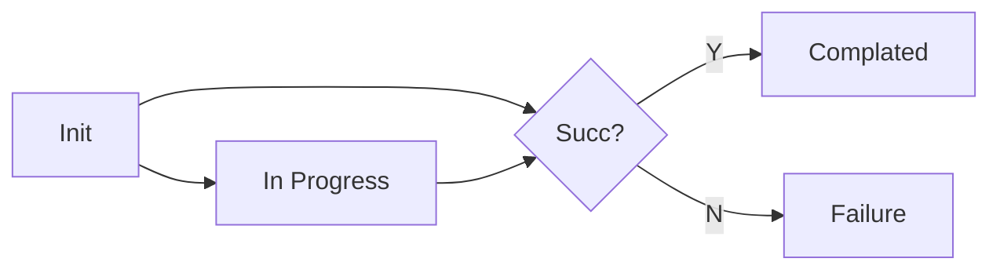
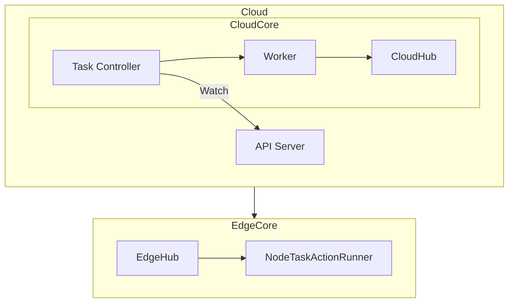
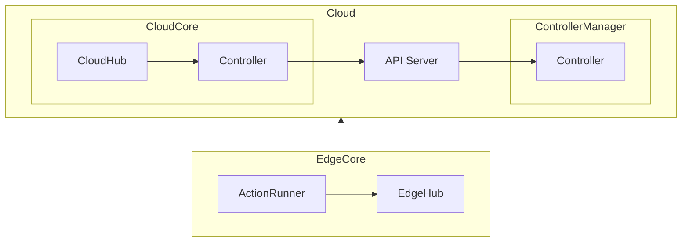

# Enhance The Status Structure Of Node Tasks
## Motivation

The current node task status consists of three elements: state, event, and action, which is too complicated. The job status and node execution status use the same type, these definitions make it look like the node task is waiting for all nodes to reach a stage before proceeding to the next stage.

In addition, there is another problem that some errors in the processing process will not be displayed to the status, especially errors in the previous process. This will result in the task not having any updates and appearing like it was not processed. The user has no way to know what happened except to look up the running logs of cloudcore and edgecore. This is not a very good user experience.

- More details refer to: [Issue #5999](https://github.com/kubeedge/kubeedge/issues/5999)
- Previous design refer to [Edge Node Tasks](edge-node-tasks-design.md)


### Goals

- Define a new state structure to make it easier for users and developers to understand.
- Track the error information of the whole process and write it to the status.


## Proposal

Separate the definitions of task status and node execution status.


### Task Status

The task state field is one of there values: Init, In Progress, Complated or Failure. Delete event and action fields, and keep the others basically unchanged.


```mermaid
graph LR
A[Init] --> B[In Progress]
A --> C{Succ?}
B --> C
C --> |Y| D[Complated]
C --> |N| E[Failure]
```

- When an error occurs during the initialization process, the state is set to failure directly, and write the error message to the reason field.
- When a node starts executing a task, the task state is set to in progress. 
- When the specified proportion of nodes fails, the task is interrupted and the state is set to failure.
- When all node executions are executed successfully or less than the specified proportion of nodes fails, the task state is set to complated. 

When each node reports the execution results, the task state is calculated and updated.


### Node Execution Status

The node execution status consists of action and state. The action is used to indicates the stage of node execution, the state is used to indicates the result of each stage. Delete event field, and keep the others basically unchanged.

The node execution state field is one of there values: In Progress, Successful or Failure. When the status is failure, the error message will be written to the reason field.

- The NodeUpgradeJob action flow is:
    ```mermaid
    graph LR
    A[Init] --> B[Check]
    B --> C{Need confirmation?}
    C --> |Y| D[Confirm]
    D --> E[WaitingConfirmation]
    E --> F[Backup]
    C --> |N| F
    F --> G[Upgrade]
    G -- Failure --> H[Rollback]
    ```

- The ImagePrePullJob action flow is:
    ```mermaid
    graph LR
    A[Init] --> B[Check]
    B --> C[Pull]
    ```
    Each node also has one or more image download tasks, which can reuse the node execution state.


## Design Details
### Structure Definition

This enhancement will upgrade the CR version to v1alpha2, two versions (v1alpha1 and v1alpha2) will be defined in CRD, and storing v1alpah2, CRDs will retain some fields for backward compatibility in the v1alpha2 version.

The go file names are redefined as:
```text
v1alpha2
├── types_common.go
├── types_imageprepull.go
└── types_nodeupgrade.go
```
#### types_common.go

Defines the common structures for node tasks.

```golang
type JobState string

const (
    JobStateInit       JobState = "Init"
    JobStateInProgress JobState = "InProgress"
    JobStateComplated  JobState = "Complated"
    JobStateFailure    JobState = "Failure"
)

type NodeExecutionState string

const (
    NodeExecutionStateInProgress NodeExecutionState = "InProgress"
    NodeExecutionStateSuccessful NodeExecutionState = "Successful"
    NodeExecutionStateFailure    NodeExecutionState = "Failure"
)

// BasicNodeTaskStatus defines basic fields of node execution status.
// +kubebuilder:validation:Type=object
type BasicNodeTaskStatus struct {
    // NodeName is the name of edge node.
    NodeName string `json:"nodeName,omitempty"`
    // Status represents for the status of the NodeTask.
    Status metav1.ConditionStatus `json:"status,omitempty"`
    // Reason represents for the reason of the NodeTask.
    // +optional
    Reason string `json:"reason,omitempty"`
    // Time represents for the running time of the NodeTask.
    Time string `json:"time,omitempty"`
}
```


#### types_imageprepull.go

Defines the dedicated structures of ImagePrePullJob.

```golang
type ImagePrePullJobAction string

const (
    ImagePrePullJobActionInit  ImagePrePullJobAction = "Init"
    ImagePrePullJobActionCheck ImagePrePullJobAction = "Check"
    ImagePrePullJobActionPull  ImagePrePullJobAction = "Pull"
)

// ImagePrePullJobStatus stores the status of ImagePrePullJob.
// contains images prepull status on multiple edge nodes.
// +kubebuilder:validation:Type=object
type ImagePrePullJobStatus struct {
    // State represents for the state phase of the ImagePrePullJob.
    State JobState `json:"state,omitempty"`

    // Reason represents for the reason of the ImagePrePullJob.
    // +optional
    Reason string `json:"reason,omitempty"`

    // Time represents for the running time of the ImagePrePullJob.
    Time string `json:"time,omitempty"`

    // NodeStatus contains image prepull status for each edge node.
    NodeStatus []ImagePrePullNodeTaskStatus `json:"nodeStatus,omitempty"`
}

// ImagePrePullNodeTaskStatus stores image prepull status for each edge node.
// +kubebuilder:validation:Type=object
type ImagePrePullNodeTaskStatus struct {
    // Action represents for the action phase of the ImagePrePullJob
    Action ImagePrePullJobAction `json:"action,omitempty"`

    // ImageStatus represents the prepull status for each image
    ImageStatus []ImageStatus `json:"imageStatus,omitempty"`

    BasicNodeTaskStatus `json:",inline"`
}

// ImageStatus stores the prepull status for each image.
// +kubebuilder:validation:Type=object
type ImageStatus struct {
    // Image is the name of the image
    Image string `json:"image,omitempty"`

    // State represents for the state phase of this image pull on the edge node.
    State NodeExecutionState `json:"state,omitempty"`

    // Reason represents the fail reason if image pull failed
    // +optional
    Reason string `json:"reason,omitempty"`
}
```


#### types_nodeupgrade.go

Defines the dedicated structures of NodeUpgradeJob.

```golang
type NodeUpgradeJobAction string

const (
    NodeUpgradeJobActionInit                NodeUpgradeJobAction = "Init"
    NodeUpgradeJobActionCheck               NodeUpgradeJobAction = "Check"
    NodeUpgradeJobActionConfirm             NodeUpgradeJobAction = "Confirm"
    NodeUpgradeJobActionWaitingConfirmation NodeUpgradeJobAction = "WaitingConfirmation"
    NodeUpgradeJobActionBackUp              NodeUpgradeJobAction = "BackUp"
    NodeUpgradeJobActionUpgrade             NodeUpgradeJobAction = "Upgrade"
    NodeUpgradeJobActionRollBack            NodeUpgradeJobAction = "RollBack"
)

// NodeUpgradeJobStatus stores the status of NodeUpgradeJob.
// contains multiple edge nodes upgrade status.
// +kubebuilder:validation:Type=object
type NodeUpgradeJobStatus struct {
    // State represents for the state phase of the NodeUpgradeJob.
    State JobState `json:"state,omitempty"`

    // CurrentVersion represents for the current status of the EdgeCore.
    CurrentVersion string `json:"currentVersion,omitempty"`

    // HistoricVersion represents for the historic status of the EdgeCore.
    HistoricVersion string `json:"historicVersion,omitempty"`

    // Reason represents for the reason of the ImagePrePullJob.
    // +optional
    Reason string `json:"reason,omitempty"`

    // Time represents for the running time of the ImagePrePullJob.
    Time string `json:"time,omitempty"`

    // NodeStatus contains upgrade Status for each edge node.
    NodeStatus []NodeUpgradeJobNodeTaskStatus `json:"nodeStatus,omitempty"`
}

// NodeUpgradeJobNodeTaskStatus stores the status of Upgrade for each edge node.
// +kubebuilder:validation:Type=object
type NodeUpgradeJobNodeTaskStatus struct {
    // Action represents for the action phase of the NodeUpgradeJob
    Action NodeUpgradeJobAction `json:"action,omitempty"`

    BasicNodeTaskStatus `json:",inline"`
}
```


### Action Flow

Use a tree structure to represent the flow of actions. All node tasks need to define global variables of type Flow.

```golang
// Action defines the action of node task.
type Action struct {
    Name           string
    NextSuccessful *Action
    NextFailure    *Action
}

// Next returns the next action according to the success flag.
// success ? NextSuccessful : NextFailure.
func (a *Action) Next(success bool) *Action {}

// Final returns whether current action is the final action.
func (a *Action) Final() bool {}

// Flow defines the action flow of node task.
type Flow struct {
    First Action
}

// Find returns the found action by name.
// This method uses recursion to find successful or failure child action.
func (sf *Flow) Find(name string) *Action {}

var (
    FlowNodeUpgradeJob  = &Flow{...}
    FlowImagePrePullJob = &Flow{...}
    ...
)
```


### Node Task Controller

The controller is not a traditional Kubernetes controller, it is used to process the resources upstream and downstream for cloud-edge collaboration. We create a new controller to watch the node tasks CRs of v1alpah2 version, which will not affect v1alpah1 version.

All node task types need to implement the Handler interface. The Manager framework calls these methods when processing upstream and downstream in the cloud/pkg/taskmanager/v1alpha2/controller/handlers package.

```golang
// Handler is the operation abstraction of the node task controller.
type Handler interface {
    // Name returns name of node task
    Name() string

    // Informer returns node task CR of informer for downstream.
    Informer() cache.SharedIndexInformer

    // UpdateNodeTaskStatus uses to update the status of node tasks when obtaining upstream message.
    UpdateNodeTaskStatus(ctx context.Context, msg model.Message) error

    // Handle notifications for events of node task CR, OnAdd, OnUpdate and OnDelete.
    cache.ResourceEventHandler
}
```


### Downstream


```mermaid
flowchart TB
  subgraph Cloud
    direction LR
    A[API Server]
    B[Task Controller] --Watch--> A
    subgraph CloudCore
      B --> C[Worker]
      C --> D[CloudHub]
    end
  end
  subgraph EdgeCore
    E[EdgeHub] --> F[NodeTaskActionRunner]
  end
  Cloud --> EdgeCore
```

Task Controller uses informer to watch resources changes of node task CRs. After the event is triggered, the implementation of the Handler uses the Worker to send the task to edge nodes. Non-final node tasks will also be resent to edge nodes.

Worker is used to control the number of edge node execute task at same time. It uses a pool to control the number of nodes in the processing status. If cloudcore has multiple instances, each instance makes independent judgments (Actual Concurrency = spec.concurrency * CloudCore instances). Each node task resource needs to create a new Worker to use for downstream when OnAdd or OnUpdate is trigger, sending messages to edge nodes is implemented in Worker.

We define a general function to build the downstream node task message, and use a Resource structure to generate routing  resources.

```golang
// BuildNodeTaskRouter builds the *model.Message of the node task
// and set the route and operation(action) in the message,
// which will be sent to the edge from the cloud.
func BuildNodeTaskRouter(r nodetaskmsg.Resource, opr string) *model.Message {
    return model.NewMessage("").
        SetRoute(modules.TaskManagerModuleName, modules.TaskManagerModuleGroup).
        SetResourceOperation(r.String(), opr)
}

// Resource defines the message resource of the node task.
type Resource struct {
    // APIVersion defines the group/version of the node task resource
    APIVersion string
    // ResourceType defines the node task resource of Kubernetes.(e.g., nodeupgradejob, imagepulljob, etc.)
    ResourceType string
    // TaskName defines the name of the node task resource.
    TaskName string
    // Node defines the name of the node.
    Node string
}

// Check checks the resource fields.
func (r Resource) Check() error {}

// String returns resource that satisfy the message resource format
// {apiversion}/{resource_type}/{task_name}/nodes/{node_name}.
// It is best to use Check method to verify fields first.
func (r Resource) String() string {}

// IsNodeTaskResource returns whether the resource is a node task resource.
func IsNodeTaskResource(r string) bool {}

// ParseResource parse the node task resource from the message resource.
// It is best to use IsResource function to judge first:
//
//  if IsNodeTaskResource(resstr) {
//      res := ParseResource(resstr)
//  }
func ParseResource(resource string) *Resource {}
```

The downstrem message content is:

```golang
type TaskDownstreamMessage struct {
    Name     string `json:"name"`
    NodeName string `json:"nodeName"`
    Spec     any    `json:"spec"`
}
```

In EdgeHub, we add a new message handler to route the node task resources of v1alpha2 version to the ActionRunner of node task. All node task types need to implement the ActionRunner interface, We provide a base implementation to define the paradigm.

```golang
// ActionRunner defines the interface of the task action runner.
type ActionRunner interface {
    RunAction(startupAction string, task *nodetaskmsg.TaskDownstreamMessage)
}

// ActionFun defines the function type of the task action handler.
// The first return value defines whether the action should continue.
// In some scenarios, we want the flow to be paused and continue it
// when triggered elsewhere.
type ActionFun = func(ctx context.Context, task *nodetaskmsg.TaskDownstreamMessage) (bool, error)

// baseActionRunner defines the abstruct of the task action runner.
// The implementation of ActionRunner must compose this structure.
type baseActionRunner struct {
    // actions defines the function implementation of each action.
    actions map[string]ActionFun
    // flow defines the action flow of node task.
    flow actionflow.Flow
    // reportFun uses to report status of node task. If the err is not nil,
    // the failure status needs to be reported.
    reportFun func(action, taskname, nodename string, err error)
}

func (b *baseActionRunner) RunAction(startupAction string, msg *nodetaskmsg.TaskDownstreamMessage) {
    ctx := context.Background()
    for action := b.flow.Find(startupAction); action != nil && !action.Final(); {
        actionFn, err := b.mustGetAction(action.Name)
        if err != nil {
            b.reportFun(action.Name, msg.Name, msg.NodeName, err)
            return
        }
        doNext, err := actionFn(ctx, msg)
        b.reportFun(action.Name, msg.Name, msg.NodeName, err)
        if err != nil {
            action = action.Next(false)
            continue
        }
        if !doNext {
            break
        }
        action = action.Next(true)
    }
}
```

The implementation of the node task runner only needs to set the fields of the baseActionRunner and focus on implementing each ActionFun.

### Upstream


```mermaid
flowchart BT
  subgraph EdgeCore
    direction LR
    A[ActionRunner] --> B[EdgeHub]
  end
  subgraph Cloud
    direction LR
    subgraph CloudCore
        C[CloudHub] --> D[Controller]
    end
    D --> E[API Server]
    subgraph ControllerManager
        F[Controller]
    end
    E --> F
  end
  EdgeCore --> Cloud
```

After the ActionRunner completes an action, whether it is successful or failure, it will report the result to the cloud.

The reportFun field of the baseActionRunner structure is used to report the node status. The message body needs to use the node task status structure defined by CRD (i.e., NodeUpgradeJobNodeTaskStatus and ImagePrePullNodeTaskStatus).

After the CloudCore task controller receives the message, it will call the UpdateNodeActionStatus() abstract method to update the action status for the node. If an error occurs during the processing of a node task in the cloud, also use the method to update the node status.

Considering that in the case of multiple CloudCore instances, node tasks will have concurrent conflicts, we put the task status updation into the ControllerManager, because ControllerManager always has only one instance. The task status is calculated based on the action status of each edge node and the failure rate value, then updated to CR.
